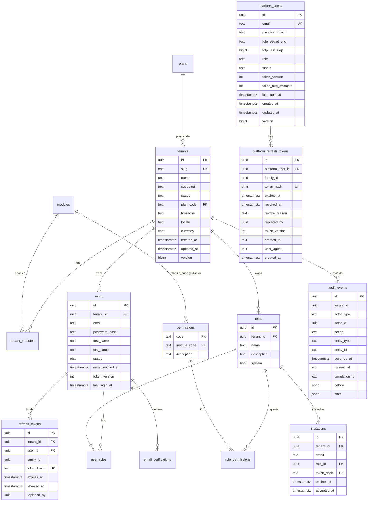
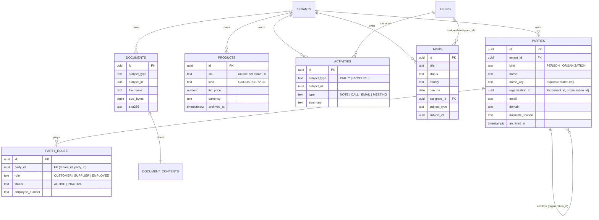

# ERD — Phases 1–4

Tables with RLS: every table that has `tenant_id`, except `tenants` itself, which is global and accessed only through services.

`platform_users` and `platform_refresh_tokens` are not tenant tables. They have FORCE RLS and are visible only while the
platform module has set `app.platform_access = 'on'` for the transaction (ADR-0007). The same flag also enables
`FOR SELECT` `platform_read` policies on `users`, `roles` and `user_roles`.

## Phase 4 — canonical data model

Activities, tasks and documents reference their subject without a foreign key (ADR-0008). Every table carries
`tenant_id` with FORCE RLS.
