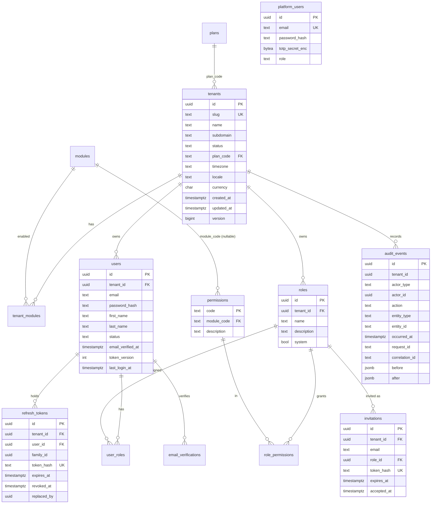

# ERD — Phases 1–3

```mermaid
erDiagram
  plans ||--o{ tenants : "plan_code"
  tenants ||--o{ tenant_modules : has
  modules ||--o{ tenant_modules : enabled
  tenants ||--o{ users : owns
  tenants ||--o{ roles : owns
  modules ||--o{ permissions : "module_code (nullable)"
  roles ||--o{ role_permissions : grants
  permissions ||--o{ role_permissions : in
  users ||--o{ user_roles : has
  roles ||--o{ user_roles : assigned
  users ||--o{ refresh_tokens : holds
  users ||--o{ email_verifications : verifies
  roles ||--o{ invitations : "invited as"
  tenants ||--o{ audit_events : records

  tenants { uuid id PK
    text slug UK
    text name
    text subdomain
    text status
    text plan_code FK
    text timezone
    text locale
    char currency
    timestamptz created_at
    timestamptz updated_at
    bigint version }
  users { uuid id PK
    uuid tenant_id FK
    text email
    text password_hash
    text first_name
    text last_name
    text status
    timestamptz email_verified_at
    int token_version
    timestamptz last_login_at }
  roles { uuid id PK
    uuid tenant_id FK
    text name
    text description
    bool system }
  permissions { text code PK
    text module_code FK
    text description }
  refresh_tokens { uuid id PK
    uuid tenant_id FK
    uuid user_id FK
    uuid family_id
    text token_hash UK
    timestamptz expires_at
    timestamptz revoked_at
    uuid replaced_by }
  invitations { uuid id PK
    uuid tenant_id FK
    text email
    uuid role_id FK
    text token_hash UK
    timestamptz expires_at
    timestamptz accepted_at }
  audit_events { uuid id PK
    uuid tenant_id
    text actor_type
    uuid actor_id
    text action
    text entity_type
    text entity_id
    timestamptz occurred_at
    text request_id
    text correlation_id
    jsonb before
    jsonb after }
  platform_users { uuid id PK
    text email UK
    text password_hash
    bytea totp_secret_enc
    text role }
```

Tables with RLS: every table that has `tenant_id`, except `tenants` itself, which is global and accessed only through services.
