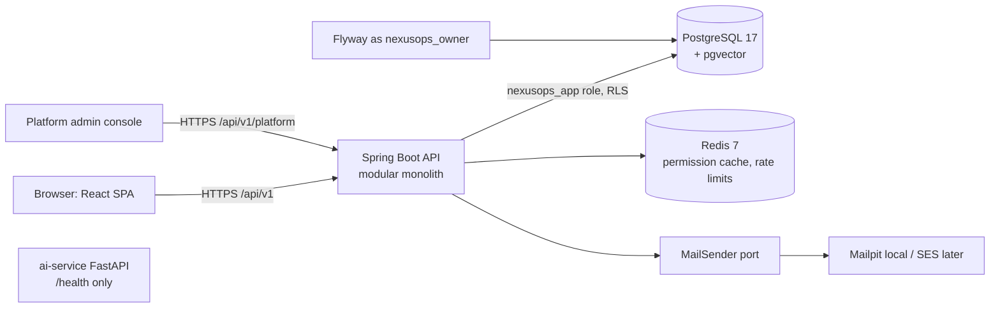

# Architecture Overview — Phases 1–3

## Request path
1. `RequestContextFilter` assigns the request_id and correlation_id and writes them to the MDC.
2. `RateLimitFilter` applies limits to public routes, keyed by IP or slug.
3. `JwtAuthenticationFilter` verifies the RS256 token and audience. It sets the `TenantContext` (tid, sub), checks token_version and tenant/user status, and loads permission authorities.
4. `RateLimitFilter` applies limits to authenticated routes, keyed by `tenant:{tid}:user:{uid}`.
5. The controller's `@PreAuthorize` checks the permission, then calls the application service.
6. Application service: `@Transactional` → `set_config('app.tenant_id')` → domain logic → repository (Hibernate `@TenantId`) → `AuditService.record` → commit.

See ADRs 0001–0005 in `docs/decisions/`, and the full design in `docs/superpowers/specs/2026-10-04-platform-foundation-design.md`.
