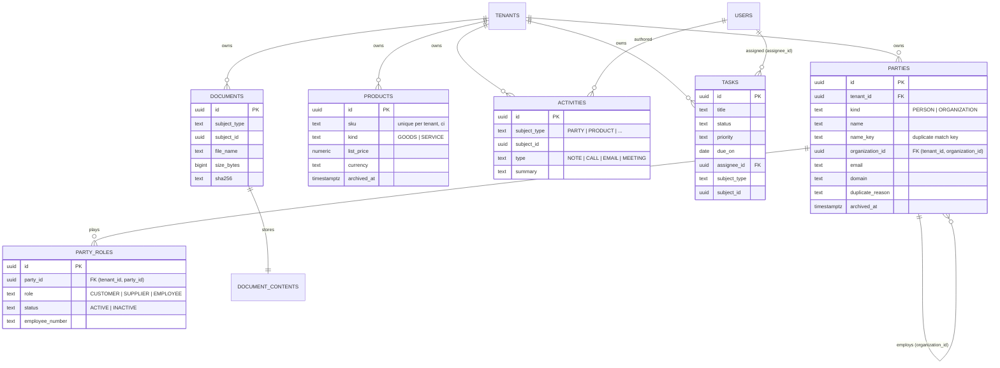

# Plan 6 — Canonical Data Model (Phase 4) Implementation Plan

> **For agentic workers:** REQUIRED SUB-SKILL: Use superpowers:subagent-driven-development (recommended) or superpowers:executing-plans to implement this plan task-by-task. Steps use checkbox (`- [ ]`) syntax for tracking.

**Goal:** Build the shared, tenant-isolated business record for every module: people, organizations, their customer/supplier/employee roles, products, and the activities, tasks and documents attached to them. It runs end to end, from Postgres RLS to UI.

**Architecture:** There are three new Spring Modulith modules:
- `directory`: parties and party roles;
- `catalog`: products;
- `collaboration`: activities, tasks and documents.

They are built on the existing kernel: `TenantOwnedEntity`, RLS per table, `AuditService`, `ApiProblem`, `Paging` and `TenantLocks`. Collaboration attaches records to "subjects" through a `SubjectResolver` SPI that `directory` and `catalog` implement, so later modules plug in without cycles. The React app gains Directory, Products and Tasks pages. The detail pages share Activity, Tasks and Documents panels.

**Tech Stack:**
- Backend: Java 25, Spring Boot 4.1.1, Spring Data JPA/Hibernate 7, Flyway, PostgreSQL 17 RLS, Spring Modulith 2.1, MockMvc + Testcontainers.
- Frontend: React 19, React Router 7, TanStack Query 5, RHF + Zod 4, shadcn base-nova, Vitest.
- E2E: Playwright.

**Spec:** `docs/superpowers/specs/2026-10-06-canonical-data-model-design.md`. Its conventions sit on top of `docs/superpowers/specs/2026-10-04-platform-foundation-design.md`.

## Global Constraints

- Every new table has `tenant_id uuid NOT NULL REFERENCES tenants (id) ON DELETE CASCADE`, `ENABLE` + `FORCE ROW LEVEL SECURITY`, and a `tenant_isolation` policy that uses the exact expression `tenant_id = nullif(current_setting('app.tenant_id', true), '')::uuid` in both `USING` and `WITH CHECK`, in the same migration as the table.
- New permission codes have `module_code` NULL. Each migration that adds codes calls `grant_to_system_roles(ARRAY[...])` (created in V9).
- Lookups by id are tenant-filtered: another tenant's id gets **404**, never 403 or 200.
- Error texts (verbatim):
  - not found: `Record not found.`;
  - archived: `This record is archived.`;
  - stale: `This record was changed by someone else. Reload and try again.`;
  - duplicate: `This looks like a record that already exists. Open it, or give a reason for keeping a separate one.`;
  - forbidden: `You do not have permission to perform this action.`
- Paging: `?page` (0-based) and `?size` (1–100, default 20) via `Paging.of`, returning `PageResponse {items, page, size, total}`.
- Every write calls `AuditService.record(...)` in the same transaction. Activity bodies and document contents are never put in audit rows.
- Edits are `PUT` with the `version` last read. A missing version is 400 field `version`; a mismatch is 409 stale.
- Commit messages are conventional (`feat(directory): …`). **Never add `Co-Authored-By` or any AI attribution trailer.**
- Backend tests: `cd backend && ./gradlew test --tests '<Class>'`. Frontend tests: `cd frontend && npm test -- <path>`. `npm run lint` and `npm run typecheck` must stay clean.
- Text limits:
  - person first and last name: 80;
  - organization and product name: 200;
  - job title: 100;
  - duplicate reason: 500;
  - SKU: 64;
  - unit: 20;
  - product description: 2000;
  - activity summary: 200;
  - activity body: 10000;
  - task title: 200;
  - task description: 5000;
  - file name: 255;
  - employee number: 40.

## Review Focus

1. **Spelling variants of one identity** must still be caught as duplicates:
   - `"ACME, Inc."` vs `"Acme"`;
   - `"https://WWW.Acme.com/about"` vs `"acme.com"`;
   - `"  ada   LOVELACE "` vs `"Ada Lovelace"`.

   Look-alikes that differ must not be: the same person name at a different organization. Pinned in Task 1 (unit) and Task 2 (API).
2. **Archived records:**
   - they are readable;
   - they are excluded from lists by default;
   - they can't be edited, linked to, or get new roles, activities, tasks or documents (409);
   - restore brings them back.

   Pinned in Tasks 3, 5, 6 and 7.
3. **Permission-split leaks.** The employee role must be invisible without `directory.employee.read`, in both the list and detail views. A subject's activities, documents and task labels must need that subject's read permission. Pinned in Tasks 3, 5, 6 and 7.
4. **Two people creating the same record at the same instant:** the advisory lock must let exactly one through without a reason. Pinned in Task 2.
5. **Hostile or odd uploads:**
   - more than 10 MB → 413;
   - path or control characters in the file name → sanitized;
   - an HTML content type → downloaded as an attachment with `nosniff`;
   - quota exceeded → 409.

   Pinned in Task 7. The nginx body limit is in Task 14.

## File structure

```
backend/src/main/java/com/nexusops/
  shared/Text.java                              (T1) trimmed/length-checked input
  shared/web/ApiProblem.java                    (T2) + problem extension properties
  shared/web/GlobalExceptionHandler.java        (T2/T7) properties; 413
  directory/                                    (T1–T3, T5)
    PartyKind, PartyRoleType, RoleStatus        enums (module API)
    DirectoryPermissions                        permission code constants
    PersonCommand, OrganizationCommand, PartyRoleCommand, PartyQuery
    PartyView, PartySummary, PartyRef, PartyRoleView, DuplicateCandidate
    PartyService                                all party use cases
    PartySubjects (T5)                          SubjectResolver for PARTY
    domain/Party, PartyRole, PersonDetails, OrganizationDetails, PartyNames, ContactDetails,
           PartyRepository, PartyRoleRepository
    web/PartyController, PersonController, OrganizationController, DirectoryDtos
  catalog/                                      (T4, T5)
    ProductKind, ProductCommand, ProductQuery, ProductView, ProductService, ProductSubjects (T5)
    domain/Product, ProductRepository
    web/ProductController, ProductRequest
  identity/Members.java                         (T5) public member lookup API
  collaboration/                                (T5–T7)
    SubjectResolver, SubjectRef, Subjects, CollaborationPermissions
    ActivityType, ActivityView, ActivityCommand, ActivityService
    TaskStatus, TaskPriority, TaskCommand, TaskQuery, TaskView, TaskService, AssigneeView
    DocumentView, DocumentService, DocumentStorage, DocumentContent, FileNames
    domain/Activity, ActivityRepository, Task, TaskRepository, Document, DocumentRepository
    infrastructure/DatabaseDocumentStorage
    web/ActivityController, TaskController, DocumentController, CollaborationDtos
  tenancy/PlanLimits.java, TenantDirectory.java, domain/TenantRepository.java   (T7) maxStorageMb
backend/src/main/resources/db/migration/
  V9__directory.sql  V10__catalog.sql  V11__activities.sql  V12__tasks.sql  V13__documents.sql
backend/src/test/java/com/nexusops/
  support/Api.java (T2)  directory/*  catalog/*  collaboration/*  shared/TextTest
  RlsCoverageIT, CrossTenantApiIT, OpenApiContractIT (extended)
frontend/src/
  lib/api/types.ts, client.ts                   (T9) record types; upload/download
  features/auth/permissions.tsx                 (T9) new codes
  features/shell/nav.ts, routes.tsx, OverviewPage.tsx
  features/settings/roles/PermissionMatrix.tsx  (T9) grouping by area
  features/records/                             shared record UI
    duplicates.ts, DuplicateNotice.tsx (T9), ArchiveButton.tsx (T10)
    ActivityPanel.tsx, DocumentsPanel.tsx (T11), SubjectTasksPanel.tsx (T12)
  features/directory/ DirectoryPage, PartyFormDialog, PartyDetailPage, PartyRolesCard, schemas  (T9–T10)
  features/tasks/ TasksPage, TaskDialog, MyTasksCard, TaskStatusSelect (T12)
  features/products/ ProductsPage, ProductFormDialog, ProductDetailPage (T13)
frontend/e2e/records.spec.ts (T14)   frontend/nginx.conf (T14)
docs/decisions/0008-canonical-business-identity.md, 0009-document-storage.md (T8)
```

## Interfaces shared across tasks

- `com.nexusops.shared.Text`:
  - `required(String raw, int max, String field)`;
  - `optional(String raw, int max, String field)`, where blank gives null;
  - `containsPattern(String raw)` (T1).
- `ApiProblem.withProperty(String, Object)`, `ApiProblem.properties()` (T2).
- `com.nexusops.directory.PartyService` (T2/T3):
  - `get`, `createPerson`, `createOrganization`, `updatePerson`, `updateOrganization`;
  - `list(PartyQuery, Integer, Integer)`, `archive`, `restore`;
  - `setRole(UUID, PartyRoleType, PartyRoleCommand)`.
- `PartyRepository` (T1), used by `PartySubjects` (T5).
- `com.nexusops.catalog.ProductService` (T4) and `ProductRepository` (T4), used by `ProductSubjects` (T5).
- `com.nexusops.collaboration.SubjectResolver` (T5):
  - `String type()`;
  - `String readPermission()`;
  - `Optional<SubjectRef> find(UUID id)`;
  - `Map<UUID, SubjectRef> findAll(Collection<UUID> ids)`.
- `SubjectRef(String type, UUID id, String label, boolean archived)` (T5).
- `com.nexusops.collaboration.Subjects` (T5):
  - `requireReadable(String type, UUID id)` returns `SubjectRef`;
  - `requireWritable(String type, UUID id)` returns `SubjectRef`;
  - `canRead(String type)` returns boolean;
  - `labels(String type, Collection<UUID> ids)` returns `Map<UUID, SubjectRef>`.
- `com.nexusops.identity.Members` (T5): `findActive(UUID)`, `findAll(Collection<UUID>)`, `searchActive(String q, int limit)`, and the record `Members.Member(UUID id, String name, String email, boolean active)`.
- Frontend `features/records/*` (T9/T11/T12): `<ActivityPanel subjectType subjectId archived />`, `<DocumentsPanel subjectType subjectId archived />`, `<SubjectTasksPanel subjectType subjectId label archived />`.

---

### Task 1: Directory schema, party domain and input normalization

**Files:**
- Create: `backend/src/main/resources/db/migration/V9__directory.sql`
- Create: `backend/src/main/java/com/nexusops/shared/Text.java`
- Create: `backend/src/main/java/com/nexusops/directory/{PartyKind,PartyRoleType,RoleStatus,DirectoryPermissions}.java`
- Create: `backend/src/main/java/com/nexusops/directory/package-info.java`
- Create: `backend/src/main/java/com/nexusops/directory/domain/{Party,PartyRole,PersonDetails,OrganizationDetails,PartyNames,ContactDetails,PartyRepository,PartyRoleRepository}.java`
- Modify: `backend/src/test/java/com/nexusops/RlsCoverageIT.java` (expected tables)
- Test: `backend/src/test/java/com/nexusops/shared/TextTest.java`, `backend/src/test/java/com/nexusops/directory/{PartyNamesTest,ContactDetailsTest,DirectoryPersistenceIT,PermissionGrantIT}.java`

**Interfaces:**
- Consumes: `TenantOwnedEntity`, `Emails.normalize`, `ApiProblem.badRequestField`, `TenantContext`, test `OwnerJdbc`, `TestTenants`, `RecordingMailSender`.
- Produces:
  - the enums `PartyKind {PERSON, ORGANIZATION}`, `PartyRoleType {CUSTOMER, SUPPLIER, EMPLOYEE}` and `RoleStatus {ACTIVE, INACTIVE}`;
  - the `Party` entity, built via `Party.person(UUID, PersonDetails)` and `Party.organization(UUID, OrganizationDetails)`, with methods `applyPerson`, `applyOrganization`, `recordDuplicateReason`, `archive(Instant)`, `restore()` and `isArchived()`;
  - the `PartyRole` entity, with `new PartyRole(UUID id, UUID partyId, PartyRoleType role)` and `update(RoleStatus, LocalDate, String)`;
  - the repositories listed below;
  - `PartyNames.personKey`, `organizationKey` and `fullName`;
  - `ContactDetails.email`, `phone`, `domain` and `website`;
  - `Text.required`, `optional` and `containsPattern`;
  - the SQL function `grant_to_system_roles(text[])`.

- [ ] **Step 1: Write the failing unit tests**

`backend/src/test/java/com/nexusops/shared/TextTest.java`:
```java
package com.nexusops.shared;

import static org.assertj.core.api.Assertions.assertThat;
import static org.assertj.core.api.Assertions.assertThatThrownBy;

import com.nexusops.shared.web.ApiProblem;
import org.junit.jupiter.api.Test;

class TextTest {

    @Test
    void requiredTrimsAndChecksLength() {
        assertThat(Text.required("  Ada ", 10, "firstName")).isEqualTo("Ada");
        assertThatThrownBy(() -> Text.required("   ", 10, "firstName")).isInstanceOf(ApiProblem.class)
                .satisfies(e -> assertThat(((ApiProblem) e).errors().getFirst().field()).isEqualTo("firstName"));
        assertThatThrownBy(() -> Text.required("x".repeat(11), 10, "firstName")).isInstanceOf(ApiProblem.class);
        assertThatThrownBy(() -> Text.required(null, 10, "firstName")).isInstanceOf(ApiProblem.class);
    }

    @Test
    void optionalTurnsBlankIntoNull() {
        assertThat(Text.optional(null, 10, "jobTitle")).isNull();
        assertThat(Text.optional("  ", 10, "jobTitle")).isNull();
        assertThat(Text.optional(" CTO ", 10, "jobTitle")).isEqualTo("CTO");
        assertThatThrownBy(() -> Text.optional("x".repeat(11), 10, "jobTitle")).isInstanceOf(ApiProblem.class)
                .hasMessage("Request validation failed.");
    }

    @Test
    void containsPatternEscapesLikeWildcards() {
        assertThat(Text.containsPattern(" 50%_Off\\ ")).isEqualTo("%50\\%\\_off\\\\%");
    }
}
```

`backend/src/test/java/com/nexusops/directory/PartyNamesTest.java`:
```java
package com.nexusops.directory;

import static org.assertj.core.api.Assertions.assertThat;

import com.nexusops.directory.domain.PartyNames;
import org.junit.jupiter.api.Test;

class PartyNamesTest {

    @Test
    void personKeyIgnoresCaseAndSpacing() {
        assertThat(PartyNames.personKey("  ada ", "  LOVELACE ")).isEqualTo(PartyNames.personKey("Ada", "Lovelace"));
        assertThat(PartyNames.personKey("Ada", null)).isEqualTo("ada");
        assertThat(PartyNames.personKey("Ada", "Lovelace")).isNotEqualTo(PartyNames.personKey("Ada", "Byron"));
    }

    @Test
    void fullNameJoinsOptionalLastName() {
        assertThat(PartyNames.fullName("Ada", "Lovelace")).isEqualTo("Ada Lovelace");
        assertThat(PartyNames.fullName("Plato", null)).isEqualTo("Plato");
    }

    @Test
    void organizationKeyIgnoresCasePunctuationAccentsAndLegalSuffixes() {
        String acme = PartyNames.organizationKey("Acme");
        assertThat(PartyNames.organizationKey("ACME, Inc.")).isEqualTo(acme);
        assertThat(PartyNames.organizationKey("A.C.M.E. Ltd")).isEqualTo(acme);
        assertThat(PartyNames.organizationKey("Acme GmbH & Co. KG")).isEqualTo(acme);
        assertThat(PartyNames.organizationKey("Ácme LLC")).isEqualTo(acme);
        assertThat(PartyNames.organizationKey("Acme Robotics")).isNotEqualTo(acme);
    }

    @Test
    void organizationKeyKeepsALoneSuffixWordAndFallsBackForSymbols() {
        assertThat(PartyNames.organizationKey("Company")).isEqualTo("company");
        assertThat(PartyNames.organizationKey("!!!")).isEqualTo("!!!");
    }
}
```

`backend/src/test/java/com/nexusops/directory/ContactDetailsTest.java`:
```java
package com.nexusops.directory;

import static org.assertj.core.api.Assertions.assertThat;
import static org.assertj.core.api.Assertions.assertThatThrownBy;

import com.nexusops.directory.domain.ContactDetails;
import com.nexusops.shared.web.ApiProblem;
import org.junit.jupiter.api.Test;

class ContactDetailsTest {

    @Test
    void blankValuesAreNull() {
        assertThat(ContactDetails.email(" ")).isNull();
        assertThat(ContactDetails.phone(null)).isNull();
        assertThat(ContactDetails.domain("")).isNull();
        assertThat(ContactDetails.website("  ")).isNull();
    }

    @Test
    void emailIsNormalized() {
        assertThat(ContactDetails.email("  Ada@Example.COM ")).isEqualTo("ada@example.com");
        assertThatThrownBy(() -> ContactDetails.email("nope")).isInstanceOf(ApiProblem.class);
    }

    @Test
    void domainStripsSchemeWwwPathPortAndCase() {
        assertThat(ContactDetails.domain("https://WWW.Acme.com/about?x=1")).isEqualTo("acme.com");
        assertThat(ContactDetails.domain("acme.co.uk.")).isEqualTo("acme.co.uk");
        assertThat(ContactDetails.domain("http://shop.acme.io:8080")).isEqualTo("shop.acme.io");
        assertThat(ContactDetails.domain("sales@acme.com")).isEqualTo("acme.com");
        assertThat(ContactDetails.domain("xn--80ak6aa92e.com")).isEqualTo("xn--80ak6aa92e.com");
    }

    @Test
    void invalidDomainIsAFieldError() {
        for (String bad : new String[] {"acme", "-acme.com", "acme..com", "acme.c", "ac me.com"}) {
            assertThatThrownBy(() -> ContactDetails.domain(bad)).as(bad).isInstanceOf(ApiProblem.class)
                    .satisfies(e -> assertThat(((ApiProblem) e).errors().getFirst().field()).isEqualTo("domain"));
        }
    }

    @Test
    void websiteGetsHttpsWhenSchemeless() {
        assertThat(ContactDetails.website("acme.com/team")).isEqualTo("https://acme.com/team");
        assertThat(ContactDetails.website("http://acme.com")).isEqualTo("http://acme.com");
    }

    @Test
    void websiteRejectsOtherSchemesAndJunk() {
        for (String bad : new String[] {"javascript:alert(1)", "ftp://acme.com", "https://", "x".repeat(260) + ".com"}) {
            assertThatThrownBy(() -> ContactDetails.website(bad)).as(bad).isInstanceOf(ApiProblem.class)
                    .satisfies(e -> assertThat(((ApiProblem) e).errors().getFirst().field()).isEqualTo("website"));
        }
    }

    @Test
    void phoneAllowsCommonPunctuationOnly() {
        assertThat(ContactDetails.phone(" +44 (20)  7946-0958 ")).isEqualTo("+44 (20) 7946-0958");
        for (String bad : new String[] {"12", "call me", "+1 555 0100 ext. 4"}) {
            assertThatThrownBy(() -> ContactDetails.phone(bad)).as(bad).isInstanceOf(ApiProblem.class)
                    .satisfies(e -> assertThat(((ApiProblem) e).errors().getFirst().field()).isEqualTo("phone"));
        }
    }
}
```

- [ ] **Step 2: Run them to verify they fail**

Run: `cd backend && ./gradlew test --tests 'com.nexusops.shared.TextTest' --tests 'com.nexusops.directory.PartyNamesTest' --tests 'com.nexusops.directory.ContactDetailsTest'`
Expected: FAIL — compilation errors (`Text`, `PartyNames`, `ContactDetails` do not exist).

- [ ] **Step 3: Implement `Text`, `PartyNames`, `ContactDetails`**

`backend/src/main/java/com/nexusops/shared/Text.java`:
```java
package com.nexusops.shared;

import com.nexusops.shared.web.ApiProblem;
import java.util.Locale;

/** Trims and length-checks free-text input. Failures are 400 field errors. */
public final class Text {

    private Text() {}

    public static String required(String raw, int max, String field) {
        String value = raw == null ? "" : raw.strip();
        if (value.isEmpty() || value.length() > max) {
            throw ApiProblem.badRequestField(field, "Enter between 1 and " + max + " characters.");
        }
        return value;
    }

    /** Blank input becomes null. */
    public static String optional(String raw, int max, String field) {
        String value = raw == null ? "" : raw.strip();
        if (value.isEmpty()) {
            return null;
        }
        if (value.length() > max) {
            throw ApiProblem.badRequestField(field, "Enter at most " + max + " characters.");
        }
        return value;
    }

    /** A lower-case LIKE pattern for "contains raw", with \ % _ escaped (use '\' as the escape character). */
    public static String containsPattern(String raw) {
        String escaped = raw.strip().toLowerCase(Locale.ROOT)
                .replace("\\", "\\\\").replace("%", "\\%").replace("_", "\\_");
        return "%" + escaped + "%";
    }
}
```

`backend/src/main/java/com/nexusops/directory/domain/PartyNames.java`:
```java
package com.nexusops.directory.domain;

import java.text.Normalizer;
import java.util.ArrayList;
import java.util.Arrays;
import java.util.List;
import java.util.Locale;
import java.util.Set;
import java.util.regex.Pattern;

/** Display names and the match keys that duplicate detection compares (ADR-0008). */
public final class PartyNames {

    private static final int MAX_KEY = 200;
    private static final Pattern WHITESPACE = Pattern.compile("\\s+");
    private static final Pattern NON_ALPHANUMERIC = Pattern.compile("[^\\p{L}\\p{N}]+");
    private static final Pattern MARKS = Pattern.compile("\\p{M}+");
    private static final Set<String> LEGAL_SUFFIXES = Set.of("ab", "ag", "as", "bv", "co", "company", "corp",
            "corporation", "gmbh", "inc", "incorporated", "kg", "limited", "llc", "llp", "lp", "ltd", "nv", "oy", "plc",
            "pte", "pty", "pvt", "sa", "sarl", "sas", "spa", "srl");

    private PartyNames() {}

    public static String fullName(String firstName, String lastName) {
        return lastName == null ? firstName : firstName + " " + lastName;
    }

    /** Case- and spacing-insensitive: "Ada  LOVELACE" and "ada lovelace" share a key. */
    public static String personKey(String firstName, String lastName) {
        return limit(WHITESPACE.matcher(fullName(firstName, lastName).strip()).replaceAll(" ").toLowerCase(Locale.ROOT));
    }

    /** Ignores case, accents, punctuation, spacing and trailing legal suffixes: "ACME, Inc." and "Acme" share a key. */
    public static String organizationKey(String name) {
        String folded = MARKS.matcher(Normalizer.normalize(name, Normalizer.Form.NFKD)).replaceAll("")
                .toLowerCase(Locale.ROOT);
        List<String> tokens = new ArrayList<>(Arrays.stream(NON_ALPHANUMERIC.split(folded)).filter(t -> !t.isEmpty()).toList());
        while (tokens.size() > 1 && LEGAL_SUFFIXES.contains(tokens.getLast())) {
            tokens.removeLast();
        }
        String key = String.join("", tokens);
        return key.isEmpty() ? personKey(name, null) : limit(key);
    }

    private static String limit(String key) {
        return key.length() > MAX_KEY ? key.substring(0, MAX_KEY) : key;
    }
}
```

`backend/src/main/java/com/nexusops/directory/domain/ContactDetails.java`:
```java
package com.nexusops.directory.domain;

import com.nexusops.shared.Emails;
import com.nexusops.shared.web.ApiProblem;
import java.net.URI;
import java.net.URISyntaxException;
import java.util.Locale;
import java.util.regex.Pattern;

/** Normalizes optional contact fields. Blank becomes null; invalid input is a 400 field error. */
public final class ContactDetails {

    private static final Pattern PHONE = Pattern.compile("^\\+?[0-9 ().\\-/]{3,40}$");
    private static final Pattern DOMAIN = Pattern.compile(
            "^(?=.{3,253}$)([a-z0-9]([a-z0-9-]{0,61}[a-z0-9])?\\.)+[a-z][a-z0-9-]{0,61}[a-z0-9]$");
    private static final Pattern SCHEME = Pattern.compile("^[a-z][a-z0-9+.-]*://");

    private ContactDetails() {}

    public static String email(String raw) {
        return raw == null || raw.isBlank() ? null : Emails.normalize(raw);
    }

    public static String phone(String raw) {
        if (raw == null || raw.isBlank()) {
            return null;
        }
        String value = raw.strip().replaceAll("\\s+", " ");
        long digits = value.chars().filter(c -> c >= '0' && c <= '9').count();
        if (!PHONE.matcher(value).matches() || digits < 3) {
            throw ApiProblem.badRequestField("phone", "Enter a phone number using digits, spaces and + ( ) - . /");
        }
        return value;
    }

    /** "https://WWW.Acme.com/about" becomes "acme.com". */
    public static String domain(String raw) {
        if (raw == null || raw.isBlank()) {
            return null;
        }
        String value = SCHEME.matcher(raw.strip().toLowerCase(Locale.ROOT)).replaceFirst("");
        for (char stop : new char[] {'/', '?', '#'}) {
            int index = value.indexOf(stop);
            if (index >= 0) {
                value = value.substring(0, index);
            }
        }
        value = value.substring(value.lastIndexOf('@') + 1);
        int colon = value.indexOf(':');
        if (colon >= 0) {
            value = value.substring(0, colon);
        }
        if (value.startsWith("www.")) {
            value = value.substring(4);
        }
        if (value.endsWith(".")) {
            value = value.substring(0, value.length() - 1);
        }
        if (!DOMAIN.matcher(value).matches()) {
            throw ApiProblem.badRequestField("domain", "Enter a domain like example.com.");
        }
        return value;
    }

    /** An http(s) address; "acme.com" becomes "https://acme.com". */
    public static String website(String raw) {
        if (raw == null || raw.isBlank()) {
            return null;
        }
        String value = raw.strip();
        if (!SCHEME.matcher(value.toLowerCase(Locale.ROOT)).find()) {
            value = "https://" + value;
        }
        try {
            URI uri = new URI(value);
            String scheme = uri.getScheme() == null ? "" : uri.getScheme().toLowerCase(Locale.ROOT);
            if ((scheme.equals("http") || scheme.equals("https")) && uri.getHost() != null && value.length() <= 255) {
                return value;
            }
        } catch (URISyntaxException invalid) {
            // falls through to the field error
        }
        throw ApiProblem.badRequestField("website", "Enter a web address like https://example.com.");
    }
}
```

- [ ] **Step 4: Run the unit tests to verify they pass**

Run: the Step 2 command.
Expected: PASS (all three classes green).

- [ ] **Step 5: Write the failing persistence and grant tests**

Edit `backend/src/test/java/com/nexusops/RlsCoverageIT.java` so `EXPECTED_TENANT_TABLES` reads:
```java
    static final Set<String> EXPECTED_TENANT_TABLES = Set.of(
            "tenant_modules", "users", "refresh_tokens", "email_verifications",
            "roles", "role_permissions", "user_roles", "audit_events", "invitations",
            "parties", "party_roles");
```

`backend/src/test/java/com/nexusops/directory/DirectoryPersistenceIT.java`:
```java
package com.nexusops.directory;

import static org.assertj.core.api.Assertions.assertThat;
import static org.assertj.core.api.Assertions.assertThatThrownBy;

import com.nexusops.directory.domain.OrganizationDetails;
import com.nexusops.directory.domain.Party;
import com.nexusops.directory.domain.PartyRepository;
import com.nexusops.directory.domain.PartyRole;
import com.nexusops.directory.domain.PartyRoleRepository;
import com.nexusops.directory.domain.PersonDetails;
import com.nexusops.shared.Ids;
import com.nexusops.shared.TenantContext;
import com.nexusops.support.IntegrationTestSupport;
import com.nexusops.support.OwnerJdbc;
import com.nexusops.support.RecordingMailSender;
import com.nexusops.support.TestTenants;
import java.sql.Timestamp;
import java.time.Instant;
import java.time.LocalDate;
import java.util.UUID;
import org.junit.jupiter.api.BeforeEach;
import org.junit.jupiter.api.Test;
import org.springframework.beans.factory.annotation.Autowired;
import org.springframework.boot.webmvc.test.autoconfigure.AutoConfigureMockMvc;
import org.springframework.dao.DataIntegrityViolationException;
import org.springframework.test.web.servlet.MockMvc;
import org.springframework.transaction.support.TransactionTemplate;

@AutoConfigureMockMvc
class DirectoryPersistenceIT extends IntegrationTestSupport {

    @Autowired MockMvc mvc;
    @Autowired RecordingMailSender mail;
    @Autowired PartyRepository parties;
    @Autowired PartyRoleRepository roles;
    @Autowired TransactionTemplate tx;

    UUID tenantA;
    UUID tenantB;

    @BeforeEach
    void tenants() throws Exception {
        tenantA = TestTenants.signupAndVerify(mvc, mail, TestTenants.uniqueSlug("dira")).tenantId();
        tenantB = TestTenants.signupAndVerify(mvc, mail, TestTenants.uniqueSlug("dirb")).tenantId();
    }

    private UUID saveOrganization(UUID tenant, String name) {
        UUID id = Ids.newId();
        TenantContext.runAs(tenant, () -> tx.executeWithoutResult(s -> parties.save(
                Party.organization(id, new OrganizationDetails(name, "acme.com", null, null, null)))));
        return id;
    }

    @Test
    void personAndOrganizationRoundTripWithTenantStampedAndKeysComputed() {
        UUID org = saveOrganization(tenantA, "ACME, Inc.");
        UUID person = Ids.newId();
        TenantContext.runAs(tenantA, () -> tx.executeWithoutResult(s -> {
            parties.save(Party.person(person, new PersonDetails("Ada", "Lovelace", "CTO", org, "ada@acme.com", null)));
            roles.save(new PartyRole(Ids.newId(), person, PartyRoleType.CUSTOMER));
        }));
        TenantContext.runAs(tenantA, () -> tx.executeWithoutResult(s -> {
            Party loaded = parties.findById(person).orElseThrow();
            assertThat(loaded.getTenantId()).isEqualTo(tenantA);
            assertThat(loaded.getKind()).isEqualTo(PartyKind.PERSON);
            assertThat(loaded.getName()).isEqualTo("Ada Lovelace");
            assertThat(loaded.getNameKey()).isEqualTo("ada lovelace");
            assertThat(loaded.getOrganizationId()).isEqualTo(org);
            assertThat(parties.findById(org).orElseThrow().getNameKey()).isEqualTo("acme");
            assertThat(parties.findByKindAndEmail(PartyKind.PERSON, "ada@acme.com")).hasSize(1);
            assertThat(parties.findByKindAndDomain(PartyKind.ORGANIZATION, "acme.com")).hasSize(1);
            assertThat(roles.findByPartyIdOrderByRoleAsc(person)).extracting(PartyRole::getRole)
                    .containsExactly(PartyRoleType.CUSTOMER);
        }));
        TenantContext.runAs(tenantB, () -> tx.executeWithoutResult(s ->
                assertThat(parties.findById(person)).isEmpty()));
    }

    @Test
    void rawAppConnectionSeesOnlyItsOwnTenantsParties() {
        UUID orgB = saveOrganization(tenantB, "Beta");
        var appAsA = OwnerJdbc.tenantScoped("nexusops_app", APP_PASSWORD, tenantA.toString());
        var appNoTenant = OwnerJdbc.tenantScoped("nexusops_app", APP_PASSWORD, "");
        assertThat(appAsA.queryForObject("select count(*) from parties where id = ?", Long.class, orgB)).isZero();
        assertThat(appNoTenant.queryForObject("select count(*) from parties", Long.class)).isZero();
        assertThat(appNoTenant.queryForObject("select count(*) from party_roles", Long.class)).isZero();
    }

    @Test
    void aPersonCannotReferenceAnotherTenantsOrganization() {
        UUID orgB = saveOrganization(tenantB, "Beta");
        Timestamp now = Timestamp.from(Instant.now());
        assertThatThrownBy(() -> OwnerJdbc.ownerAs(tenantA).update("""
                insert into parties (id, tenant_id, kind, name, name_key, first_name, organization_id, created_at, updated_at)
                values (?, ?, 'PERSON', 'Eve', 'eve', 'Eve', ?, ?, ?)""", Ids.newId(), tenantA, orgB, now, now))
                .isInstanceOf(DataIntegrityViolationException.class);
    }

    @Test
    void kindSpecificColumnsAreEnforcedByTheDatabase() {
        Timestamp now = Timestamp.from(Instant.now());
        assertThatThrownBy(() -> OwnerJdbc.ownerAs(tenantA).update("""
                insert into parties (id, tenant_id, kind, name, name_key, first_name, created_at, updated_at)
                values (?, ?, 'ORGANIZATION', 'Acme', 'acme', 'Ada', ?, ?)""", Ids.newId(), tenantA, now, now))
                .isInstanceOf(DataIntegrityViolationException.class);
        assertThatThrownBy(() -> OwnerJdbc.ownerAs(tenantA).update("""
                insert into parties (id, tenant_id, kind, name, name_key, domain, first_name, created_at, updated_at)
                values (?, ?, 'PERSON', 'Ada', 'ada', 'acme.com', 'Ada', ?, ?)""", Ids.newId(), tenantA, now, now))
                .isInstanceOf(DataIntegrityViolationException.class);
    }

    @Test
    void onlyEmployeeRolesCarryANumber() {
        UUID org = saveOrganization(tenantA, "Acme");
        Timestamp now = Timestamp.from(Instant.now());
        String insert = """
                insert into party_roles (id, tenant_id, party_id, role, status, since, employee_number, created_at, updated_at)
                values (?, ?, ?, ?, 'ACTIVE', ?, ?, ?, ?)""";
        assertThatThrownBy(() -> OwnerJdbc.ownerAs(tenantA).update(insert, Ids.newId(), tenantA, org, "CUSTOMER",
                java.sql.Date.valueOf(LocalDate.now()), "E-1", now, now))
                .isInstanceOf(DataIntegrityViolationException.class);
    }
}
```

`backend/src/test/java/com/nexusops/directory/PermissionGrantIT.java`:
```java
package com.nexusops.directory;

import static org.assertj.core.api.Assertions.assertThat;
import static org.assertj.core.api.Assertions.assertThatThrownBy;

import com.nexusops.support.IntegrationTestSupport;
import com.nexusops.support.OwnerJdbc;
import com.nexusops.support.RecordingMailSender;
import com.nexusops.support.TestRoles;
import com.nexusops.support.TestTenants;
import java.util.List;
import java.util.UUID;
import org.junit.jupiter.api.Test;
import org.springframework.beans.factory.annotation.Autowired;
import org.springframework.boot.webmvc.test.autoconfigure.AutoConfigureMockMvc;
import org.springframework.dao.DataAccessException;
import org.springframework.test.web.servlet.MockMvc;

/** V9's grant_to_system_roles: how migrations hand new permissions to existing workspaces' system roles. */
@AutoConfigureMockMvc
class PermissionGrantIT extends IntegrationTestSupport {

    static final List<String> DIRECTORY = List.of("directory.party.read", "directory.party.manage",
            "directory.employee.read", "directory.employee.manage");

    @Autowired MockMvc mvc;
    @Autowired RecordingMailSender mail;

    private List<String> permissionsOf(UUID tenant, UUID role) {
        return OwnerJdbc.ownerAs(tenant).queryForList(
                "select permission_code from role_permissions where role_id = ?", String.class, role);
    }

    @Test
    void newWorkspacesSystemRolesHoldTheDirectoryPermissions() throws Exception {
        UUID tenant = TestTenants.signupAndVerify(mvc, mail, TestTenants.uniqueSlug("grant")).tenantId();
        assertThat(permissionsOf(tenant, TestRoles.system(tenant, "TENANT_OWNER"))).containsAll(DIRECTORY);
        assertThat(permissionsOf(tenant, TestRoles.system(tenant, "TENANT_ADMIN"))).containsAll(DIRECTORY);
    }

    @Test
    void theGrantFunctionRestoresCodesToEverySystemRoleOfEveryTenantOnly() throws Exception {
        UUID one = TestTenants.signupAndVerify(mvc, mail, TestTenants.uniqueSlug("grant")).tenantId();
        UUID two = TestTenants.signupAndVerify(mvc, mail, TestTenants.uniqueSlug("grant")).tenantId();
        UUID custom = UUID.randomUUID();
        OwnerJdbc.ownerAs(one).update("insert into roles (id, tenant_id, name, system, created_at, updated_at) "
                + "values (?, ?, 'Custom', false, now(), now())", custom, one);
        for (UUID tenant : List.of(one, two)) {
            OwnerJdbc.ownerAs(tenant).update(
                    "delete from role_permissions where permission_code = 'directory.party.read'");
        }

        OwnerJdbc.jdbc().queryForList("select grant_to_system_roles(array['directory.party.read'])");

        for (UUID tenant : List.of(one, two)) {
            assertThat(permissionsOf(tenant, TestRoles.system(tenant, "TENANT_OWNER"))).contains("directory.party.read");
            assertThat(permissionsOf(tenant, TestRoles.system(tenant, "TENANT_ADMIN"))).contains("directory.party.read");
        }
        assertThat(permissionsOf(one, custom)).doesNotContain("directory.party.read");
    }

    @Test
    void theRuntimeRoleCannotCallTheGrantFunction() {
        assertThatThrownBy(() -> OwnerJdbc.rawApp().queryForList(
                "select grant_to_system_roles(array['directory.party.read'])"))
                .isInstanceOf(DataAccessException.class).hasMessageContaining("permission denied");
    }
}
```


- [ ] **Step 6: Run them to verify they fail**

Run: `cd backend && ./gradlew test --tests 'com.nexusops.directory.*' --tests 'com.nexusops.RlsCoverageIT'`
Expected: FAIL. The entities and repositories don't compile, and once they do, there's no `parties` table.

- [ ] **Step 7: Write the migration**

`backend/src/main/resources/db/migration/V9__directory.sql`:
```sql
-- Canonical parties (ADR-0008): one row per person or organization; the business roles a party plays live in
-- party_roles. Person- and organization-only columns are enforced by CHECKs.
CREATE TABLE parties (
    id                uuid PRIMARY KEY,
    tenant_id         uuid NOT NULL REFERENCES tenants (id) ON DELETE CASCADE,
    kind              text NOT NULL CHECK (kind IN ('PERSON', 'ORGANIZATION')),
    name              text NOT NULL CHECK (length(btrim(name)) BETWEEN 1 AND 200),
    name_key          text NOT NULL CHECK (length(name_key) BETWEEN 1 AND 200),
    first_name        text CHECK (first_name IS NULL OR length(btrim(first_name)) BETWEEN 1 AND 80),
    last_name         text CHECK (last_name IS NULL OR length(btrim(last_name)) BETWEEN 1 AND 80),
    job_title         text CHECK (job_title IS NULL OR length(btrim(job_title)) BETWEEN 1 AND 100),
    organization_id   uuid,
    email             text CHECK (email IS NULL OR (email = lower(btrim(email)) AND length(email) BETWEEN 3 AND 254)),
    phone             text CHECK (phone IS NULL OR length(phone) BETWEEN 3 AND 40),
    domain            text CHECK (domain IS NULL OR (domain = lower(domain) AND length(domain) BETWEEN 3 AND 253)),
    website           text CHECK (website IS NULL OR length(website) <= 255),
    duplicate_reason  text CHECK (duplicate_reason IS NULL OR length(btrim(duplicate_reason)) BETWEEN 1 AND 500),
    archived_at       timestamptz,
    created_at        timestamptz NOT NULL,
    updated_at        timestamptz NOT NULL,
    version           bigint NOT NULL DEFAULT 0,
    UNIQUE (tenant_id, id),
    -- composite: a person can only belong to an organization of the same tenant (FK checks ignore RLS)
    FOREIGN KEY (tenant_id, organization_id) REFERENCES parties (tenant_id, id),
    CHECK (organization_id IS NULL OR organization_id <> id),
    CHECK (kind = 'PERSON'
           OR (first_name IS NULL AND last_name IS NULL AND job_title IS NULL AND organization_id IS NULL)),
    CHECK (kind = 'ORGANIZATION' OR (first_name IS NOT NULL AND domain IS NULL AND website IS NULL))
);
CREATE INDEX parties_tenant_name_idx ON parties (tenant_id, lower(name));
CREATE INDEX parties_tenant_key_idx ON parties (tenant_id, kind, name_key);
CREATE INDEX parties_tenant_email_idx ON parties (tenant_id, email) WHERE email IS NOT NULL;
CREATE INDEX parties_tenant_domain_idx ON parties (tenant_id, domain) WHERE domain IS NOT NULL;
CREATE INDEX parties_tenant_org_idx ON parties (tenant_id, organization_id) WHERE organization_id IS NOT NULL;

ALTER TABLE parties ENABLE ROW LEVEL SECURITY;
ALTER TABLE parties FORCE ROW LEVEL SECURITY;
CREATE POLICY tenant_isolation ON parties
    USING (tenant_id = nullif(current_setting('app.tenant_id', true), '')::uuid)
    WITH CHECK (tenant_id = nullif(current_setting('app.tenant_id', true), '')::uuid);

CREATE TABLE party_roles (
    id               uuid PRIMARY KEY,
    tenant_id        uuid NOT NULL REFERENCES tenants (id) ON DELETE CASCADE,
    party_id         uuid NOT NULL,
    role             text NOT NULL CHECK (role IN ('CUSTOMER', 'SUPPLIER', 'EMPLOYEE')),
    status           text NOT NULL CHECK (status IN ('ACTIVE', 'INACTIVE')),
    since            date,
    employee_number  text CHECK (employee_number IS NULL OR length(btrim(employee_number)) BETWEEN 1 AND 40),
    created_at       timestamptz NOT NULL,
    updated_at       timestamptz NOT NULL,
    version          bigint NOT NULL DEFAULT 0,
    FOREIGN KEY (tenant_id, party_id) REFERENCES parties (tenant_id, id) ON DELETE CASCADE,
    UNIQUE (tenant_id, party_id, role),
    CHECK (role = 'EMPLOYEE' OR employee_number IS NULL)
);
CREATE UNIQUE INDEX party_roles_employee_number_uq ON party_roles (tenant_id, lower(employee_number))
    WHERE employee_number IS NOT NULL;
CREATE INDEX party_roles_tenant_role_idx ON party_roles (tenant_id, role, status);

ALTER TABLE party_roles ENABLE ROW LEVEL SECURITY;
ALTER TABLE party_roles FORCE ROW LEVEL SECURITY;
CREATE POLICY tenant_isolation ON party_roles
    USING (tenant_id = nullif(current_setting('app.tenant_id', true), '')::uuid)
    WITH CHECK (tenant_id = nullif(current_setting('app.tenant_id', true), '')::uuid);

-- Grants permission codes to every workspace's system roles (TENANT_OWNER, TENANT_ADMIN). FORCE RLS applies to the
-- owner too, so it visits one tenant at a time with app.tenant_id set transaction-locally, honouring the policies.
-- Not executable by the runtime role (V0_2 revokes EXECUTE on new functions from PUBLIC).
CREATE FUNCTION grant_to_system_roles(codes text[]) RETURNS void LANGUAGE plpgsql AS $$
DECLARE
    t uuid;
BEGIN
    FOR t IN SELECT id FROM tenants LOOP
        PERFORM set_config('app.tenant_id', t::text, true);
        INSERT INTO role_permissions (role_id, permission_code)
        SELECT r.id, c FROM roles r CROSS JOIN unnest(codes) AS c
        WHERE r.system
        ON CONFLICT DO NOTHING;
    END LOOP;
    PERFORM set_config('app.tenant_id', '', true);
END
$$;

INSERT INTO permissions (code, module_code, description) VALUES
    ('directory.party.read',      NULL, 'View people and organizations'),
    ('directory.party.manage',    NULL, 'Create, edit and archive people and organizations; mark customers and suppliers'),
    ('directory.employee.read',   NULL, 'View employee records'),
    ('directory.employee.manage', NULL, 'Manage employee records');
SELECT grant_to_system_roles(ARRAY['directory.party.read', 'directory.party.manage',
                                   'directory.employee.read', 'directory.employee.manage']);
```

- [ ] **Step 8: Write the enums, constants, value records and entities**

`backend/src/main/java/com/nexusops/directory/package-info.java`:
```java
/**
 * Canonical business identity (ADR-0008): people and organizations (parties) and the roles they play — customer,
 * supplier, employee. Other modules reference parties by id; they are archived, never deleted.
 */
package com.nexusops.directory;
```

`backend/src/main/java/com/nexusops/directory/PartyKind.java`:
```java
package com.nexusops.directory;

public enum PartyKind {
    PERSON,
    ORGANIZATION
}
```

`backend/src/main/java/com/nexusops/directory/PartyRoleType.java`:
```java
package com.nexusops.directory;

/** A business role a party plays. EMPLOYEE is for people only and needs the employee permissions. */
public enum PartyRoleType {
    CUSTOMER,
    SUPPLIER,
    EMPLOYEE
}
```

`backend/src/main/java/com/nexusops/directory/RoleStatus.java`:
```java
package com.nexusops.directory;

public enum RoleStatus {
    ACTIVE,
    INACTIVE
}
```

`backend/src/main/java/com/nexusops/directory/DirectoryPermissions.java`:
```java
package com.nexusops.directory;

/** Permission codes of the directory module (V9). */
public final class DirectoryPermissions {

    public static final String PARTY_READ = "directory.party.read";
    public static final String PARTY_MANAGE = "directory.party.manage";
    public static final String EMPLOYEE_READ = "directory.employee.read";
    public static final String EMPLOYEE_MANAGE = "directory.employee.manage";

    private DirectoryPermissions() {}
}
```

`backend/src/main/java/com/nexusops/directory/domain/PersonDetails.java`:
```java
package com.nexusops.directory.domain;

import java.util.UUID;

/** Validated, normalized person fields (PartyService builds these). */
public record PersonDetails(String firstName, String lastName, String jobTitle, UUID organizationId, String email,
        String phone) {}
```

`backend/src/main/java/com/nexusops/directory/domain/OrganizationDetails.java`:
```java
package com.nexusops.directory.domain;

/** Validated, normalized organization fields (PartyService builds these). */
public record OrganizationDetails(String name, String domain, String website, String email, String phone) {}
```

`backend/src/main/java/com/nexusops/directory/domain/Party.java`:
```java
package com.nexusops.directory.domain;

import com.nexusops.directory.PartyKind;
import com.nexusops.shared.db.TenantOwnedEntity;
import jakarta.persistence.Column;
import jakarta.persistence.Entity;
import jakarta.persistence.EnumType;
import jakarta.persistence.Enumerated;
import jakarta.persistence.Table;
import jakarta.persistence.Version;
import java.time.Instant;
import java.util.UUID;

/** A person or an organization: the one canonical identity every module references (ADR-0008). */
@Entity
@Table(name = "parties")
public class Party extends TenantOwnedEntity {

    @Enumerated(EnumType.STRING)
    @Column(nullable = false, updatable = false)
    private PartyKind kind;

    @Column(nullable = false)
    private String name;

    @Column(name = "name_key", nullable = false)
    private String nameKey;

    @Column(name = "first_name")
    private String firstName;

    @Column(name = "last_name")
    private String lastName;

    @Column(name = "job_title")
    private String jobTitle;

    @Column(name = "organization_id")
    private UUID organizationId;

    private String email;

    private String phone;

    private String domain;

    private String website;

    @Column(name = "duplicate_reason")
    private String duplicateReason;

    @Column(name = "archived_at")
    private Instant archivedAt;

    @Column(name = "created_at", nullable = false, updatable = false)
    private Instant createdAt;

    @Column(name = "updated_at", nullable = false)
    private Instant updatedAt;

    @Version
    private long version;

    protected Party() {}

    private Party(UUID id, PartyKind kind) {
        super(id);
        this.kind = kind;
        this.createdAt = Instant.now();
        this.updatedAt = this.createdAt;
    }

    public static Party person(UUID id, PersonDetails details) {
        Party party = new Party(id, PartyKind.PERSON);
        party.applyPerson(details);
        return party;
    }

    public static Party organization(UUID id, OrganizationDetails details) {
        Party party = new Party(id, PartyKind.ORGANIZATION);
        party.applyOrganization(details);
        return party;
    }

    public void applyPerson(PersonDetails details) {
        requireKind(PartyKind.PERSON);
        this.firstName = details.firstName();
        this.lastName = details.lastName();
        this.name = PartyNames.fullName(details.firstName(), details.lastName());
        this.nameKey = PartyNames.personKey(details.firstName(), details.lastName());
        this.jobTitle = details.jobTitle();
        this.organizationId = details.organizationId();
        this.email = details.email();
        this.phone = details.phone();
        this.updatedAt = Instant.now();
    }

    public void applyOrganization(OrganizationDetails details) {
        requireKind(PartyKind.ORGANIZATION);
        this.name = details.name();
        this.nameKey = PartyNames.organizationKey(details.name());
        this.domain = details.domain();
        this.website = details.website();
        this.email = details.email();
        this.phone = details.phone();
        this.updatedAt = Instant.now();
    }

    /** Why this record was kept although it matched existing ones (D4). */
    public void recordDuplicateReason(String reason) {
        this.duplicateReason = reason;
    }

    public void archive(Instant now) {
        this.archivedAt = now;
        this.updatedAt = now;
    }

    public void restore() {
        this.archivedAt = null;
        this.updatedAt = Instant.now();
    }

    public boolean isArchived() {
        return archivedAt != null;
    }

    private void requireKind(PartyKind expected) {
        if (kind != expected) {
            throw new IllegalStateException("Party " + getId() + " is a " + kind + ", not a " + expected);
        }
    }

    public PartyKind getKind() {
        return kind;
    }

    public String getName() {
        return name;
    }

    public String getNameKey() {
        return nameKey;
    }

    public String getFirstName() {
        return firstName;
    }

    public String getLastName() {
        return lastName;
    }

    public String getJobTitle() {
        return jobTitle;
    }

    public UUID getOrganizationId() {
        return organizationId;
    }

    public String getEmail() {
        return email;
    }

    public String getPhone() {
        return phone;
    }

    public String getDomain() {
        return domain;
    }

    public String getWebsite() {
        return website;
    }

    public String getDuplicateReason() {
        return duplicateReason;
    }

    public Instant getArchivedAt() {
        return archivedAt;
    }

    public Instant getCreatedAt() {
        return createdAt;
    }

    public Instant getUpdatedAt() {
        return updatedAt;
    }

    public long getVersion() {
        return version;
    }
}
```

`backend/src/main/java/com/nexusops/directory/domain/PartyRole.java`:
```java
package com.nexusops.directory.domain;

import com.nexusops.directory.PartyRoleType;
import com.nexusops.directory.RoleStatus;
import com.nexusops.shared.db.TenantOwnedEntity;
import jakarta.persistence.Column;
import jakarta.persistence.Entity;
import jakarta.persistence.EnumType;
import jakarta.persistence.Enumerated;
import jakarta.persistence.Table;
import jakarta.persistence.Version;
import java.time.Instant;
import java.time.LocalDate;
import java.util.UUID;

/** One business role of one party. Never deleted: ending a role makes it INACTIVE. */
@Entity
@Table(name = "party_roles")
public class PartyRole extends TenantOwnedEntity {

    @Column(name = "party_id", nullable = false, updatable = false)
    private UUID partyId;

    @Enumerated(EnumType.STRING)
    @Column(nullable = false, updatable = false)
    private PartyRoleType role;

    @Enumerated(EnumType.STRING)
    @Column(nullable = false)
    private RoleStatus status;

    private LocalDate since;

    @Column(name = "employee_number")
    private String employeeNumber;

    @Column(name = "created_at", nullable = false, updatable = false)
    private Instant createdAt;

    @Column(name = "updated_at", nullable = false)
    private Instant updatedAt;

    @Version
    private long version;

    protected PartyRole() {}

    public PartyRole(UUID id, UUID partyId, PartyRoleType role) {
        super(id);
        this.partyId = partyId;
        this.role = role;
        this.status = RoleStatus.ACTIVE;
        this.createdAt = Instant.now();
        this.updatedAt = this.createdAt;
    }

    public void update(RoleStatus newStatus, LocalDate newSince, String newEmployeeNumber) {
        this.status = newStatus;
        this.since = newSince;
        this.employeeNumber = newEmployeeNumber;
        this.updatedAt = Instant.now();
    }

    public UUID getPartyId() {
        return partyId;
    }

    public PartyRoleType getRole() {
        return role;
    }

    public RoleStatus getStatus() {
        return status;
    }

    public LocalDate getSince() {
        return since;
    }

    public String getEmployeeNumber() {
        return employeeNumber;
    }
}
```

`backend/src/main/java/com/nexusops/directory/domain/PartyRepository.java`:
```java
package com.nexusops.directory.domain;

import com.nexusops.directory.PartyKind;
import java.util.List;
import java.util.UUID;
import org.springframework.data.jpa.repository.JpaRepository;
import org.springframework.data.jpa.repository.JpaSpecificationExecutor;

public interface PartyRepository extends JpaRepository<Party, UUID>, JpaSpecificationExecutor<Party> {

    /** Callers pass a normalized (lower-case) email. */
    List<Party> findByKindAndEmail(PartyKind kind, String email);

    List<Party> findByKindAndNameKey(PartyKind kind, String nameKey);

    /** Callers pass a normalized domain. */
    List<Party> findByKindAndDomain(PartyKind kind, String domain);
}
```

`backend/src/main/java/com/nexusops/directory/domain/PartyRoleRepository.java`:
```java
package com.nexusops.directory.domain;

import com.nexusops.directory.PartyRoleType;
import java.util.Collection;
import java.util.List;
import java.util.Optional;
import java.util.UUID;
import org.springframework.data.jpa.repository.JpaRepository;
import org.springframework.data.jpa.repository.Query;
import org.springframework.data.repository.query.Param;

public interface PartyRoleRepository extends JpaRepository<PartyRole, UUID> {

    List<PartyRole> findByPartyIdOrderByRoleAsc(UUID partyId);

    List<PartyRole> findByPartyIdIn(Collection<UUID> partyIds);

    Optional<PartyRole> findByPartyIdAndRole(UUID partyId, PartyRoleType role);

    @Query("select count(r) > 0 from PartyRole r where lower(r.employeeNumber) = lower(:number) and r.partyId <> :partyId")
    boolean employeeNumberTaken(@Param("number") String number, @Param("partyId") UUID partyId);
}
```

- [ ] **Step 9: Run the task's tests and the architecture tests**

Run: `cd backend && ./gradlew test --tests 'com.nexusops.directory.*' --tests 'com.nexusops.shared.TextTest' --tests 'com.nexusops.RlsCoverageIT' --tests 'com.nexusops.ModularityTest'`
Expected: PASS. If `ModularityTest` reports `directory` as an unused module, that's fine; it only fails on dependency violations.

- [ ] **Step 10: Run the full backend suite**

Run: `cd backend && ./gradlew test`
Expected: PASS (all previously green tests plus the new ones).

- [ ] **Step 11: Commit**

```bash
git add backend/src/main/resources/db/migration/V9__directory.sql backend/src/main/java/com/nexusops/shared/Text.java \
  backend/src/main/java/com/nexusops/directory backend/src/test/java/com/nexusops/directory \
  backend/src/test/java/com/nexusops/shared/TextTest.java backend/src/test/java/com/nexusops/RlsCoverageIT.java
git commit -m "feat(directory): party schema with RLS, normalization and system-role permission grants"
```

---

### Task 2: Create, read and edit people and organizations, with duplicate detection

**Files:**
- Modify: `backend/src/main/java/com/nexusops/shared/web/ApiProblem.java`, `backend/src/main/java/com/nexusops/shared/web/GlobalExceptionHandler.java`
- Create: `backend/src/main/java/com/nexusops/directory/{PersonCommand,OrganizationCommand,PartyView,PartyRef,PartyRoleView,DuplicateCandidate,PartyService}.java`
- Create: `backend/src/main/java/com/nexusops/directory/web/{PartyController,PersonController,OrganizationController,DirectoryDtos}.java`
- Create: `backend/src/test/java/com/nexusops/support/Api.java`
- Test: `backend/src/test/java/com/nexusops/shared/web/GlobalExceptionHandlerTest.java` (new case), `backend/src/test/java/com/nexusops/directory/PartyApiIT.java`

**Interfaces:**
- Consumes (Task 1):
  - the `Party` and `PartyRole` entities and their repositories;
  - `PartyNames` and `ContactDetails`;
  - `Text`;
  - the enums;
  - `DirectoryPermissions`.
- Produces:
  - `ApiProblem.withProperty(String, Object)` and `ApiProblem.properties()`;
  - `PartyService`, with:
    - `get(UUID)`;
    - `createPerson(PersonCommand)` and `createOrganization(OrganizationCommand)`;
    - `updatePerson(UUID, PersonCommand, Long version)` and `updateOrganization(UUID, OrganizationCommand, Long version)`;
    - package-private helpers `find(UUID)` and `view(Party)`, used again by Task 3;
  - the records:
    - `PartyView(UUID id, PartyKind kind, String name, String firstName, String lastName, String jobTitle, PartyRef organization, String email, String phone, String domain, String website, List<PartyRoleView> roles, String duplicateReason, Instant archivedAt, Instant createdAt, Instant updatedAt, long version)`;
    - `PartyRef(UUID id, String name)`;
    - `PartyRoleView(PartyRoleType role, RoleStatus status, LocalDate since, String employeeNumber)`;
    - `DuplicateCandidate(UUID id, PartyKind kind, String name, String email, String domain, boolean archived)`;
  - the routes `GET /api/v1/parties/{id}`, `POST`/`PUT /api/v1/persons[/{id}]` and `POST`/`PUT /api/v1/organizations[/{id}]`;
  - the test helper `support.Api`.

- [ ] **Step 1: Write the failing problem-properties test**

In `GlobalExceptionHandlerTest.ThrowingController` add:
```java
        @GetMapping("/duplicate")
        String duplicate() {
            throw com.nexusops.shared.web.ApiProblem.conflict("Looks like a duplicate.")
                    .withProperty("duplicates", java.util.List.of(java.util.Map.of("id", "p-1", "name", "Acme")));
        }
```
and the test:
```java
    @Test
    void apiProblemPropertiesBecomeProblemMembers() throws Exception {
        mvc.perform(get("/duplicate"))
                .andExpect(status().isConflict())
                .andExpect(jsonPath("$.detail").value("Looks like a duplicate."))
                .andExpect(jsonPath("$.duplicates[0].id").value("p-1"))
                .andExpect(jsonPath("$.duplicates[0].name").value("Acme"))
                .andExpect(jsonPath("$.requestId").exists());
    }
```

- [ ] **Step 2: Run it to verify it fails**

Run: `cd backend && ./gradlew test --tests 'com.nexusops.shared.web.GlobalExceptionHandlerTest'`
Expected: FAIL. Compilation fails because `withProperty` is undefined.

- [ ] **Step 3: Add properties to `ApiProblem` and render them**

In `ApiProblem.java`, add `import java.util.LinkedHashMap;` and `import java.util.Map;`. Add the field `private final Map<String, Object> properties;`. Replace the protected constructor with these two:
```java
    protected ApiProblem(HttpStatus status, String detail, List<FieldError> errors) {
        this(status, detail, errors, Map.of());
    }

    private ApiProblem(HttpStatus status, String detail, List<FieldError> errors, Map<String, Object> properties) {
        super(detail);
        this.status = status;
        this.errors = List.copyOf(errors);
        this.properties = Map.copyOf(properties);
    }

    /** Extra RFC 9457 members (e.g. duplicate candidates). */
    public Map<String, Object> properties() {
        return properties;
    }

    /** A copy carrying one more problem member. Subclass-specific behaviour (e.g. Retry-After) is not kept. */
    public ApiProblem withProperty(String name, Object value) {
        Map<String, Object> merged = new LinkedHashMap<>(properties);
        merged.put(name, value);
        return new ApiProblem(status, getMessage(), errors, merged);
    }
```
In `GlobalExceptionHandler.handleApiProblem`, add this right after the `errors` block:
```java
        ex.properties().forEach(problem::setProperty);
```

- [ ] **Step 4: Run it to verify it passes**

Run: the Step 2 command.
Expected: PASS.

- [ ] **Step 5: Add the API test helper**

`backend/src/test/java/com/nexusops/support/Api.java`:
```java
package com.nexusops.support;

import com.jayway.jsonpath.JsonPath;
import java.util.UUID;
import org.springframework.http.MediaType;
import org.springframework.test.web.servlet.MockMvc;
import org.springframework.test.web.servlet.ResultActions;
import org.springframework.test.web.servlet.request.MockHttpServletRequestBuilder;
import org.springframework.test.web.servlet.request.MockMvcRequestBuilders;

/** Compact authenticated MockMvc calls for API tests. */
public record Api(MockMvc mvc, TestTenants.Session session) {

    public static Api login(MockMvc mvc, TestTenants.Workspace workspace) throws Exception {
        return new Api(mvc, TestTenants.login(mvc, workspace));
    }

    public ResultActions perform(MockHttpServletRequestBuilder request) throws Exception {
        return mvc.perform(request.header("Authorization", "Bearer " + session.accessToken()));
    }

    public ResultActions get(String path) throws Exception {
        return perform(MockMvcRequestBuilders.get(path));
    }

    public ResultActions post(String path, String json) throws Exception {
        return perform(MockMvcRequestBuilders.post(path).contentType(MediaType.APPLICATION_JSON).content(json));
    }

    public ResultActions put(String path, String json) throws Exception {
        return perform(MockMvcRequestBuilders.put(path).contentType(MediaType.APPLICATION_JSON).content(json));
    }

    public ResultActions delete(String path) throws Exception {
        return perform(MockMvcRequestBuilders.delete(path));
    }

    public static String body(ResultActions result) throws Exception {
        return result.andReturn().getResponse().getContentAsString();
    }

    public static <T> T read(ResultActions result, String jsonPath) throws Exception {
        return JsonPath.read(body(result), jsonPath);
    }

    public static UUID id(ResultActions result) throws Exception {
        return UUID.fromString(read(result, "$.id"));
    }
}
```

- [ ] **Step 6: Write the failing API test**

`backend/src/test/java/com/nexusops/directory/PartyApiIT.java`:
```java
package com.nexusops.directory;

import static org.assertj.core.api.Assertions.assertThat;
import static org.springframework.test.web.servlet.result.MockMvcResultMatchers.jsonPath;
import static org.springframework.test.web.servlet.result.MockMvcResultMatchers.status;

import com.nexusops.support.Api;
import com.nexusops.support.IntegrationTestSupport;
import com.nexusops.support.OwnerJdbc;
import com.nexusops.support.RecordingMailSender;
import com.nexusops.support.TestMembers;
import com.nexusops.support.TestRoles;
import com.nexusops.support.TestTenants;
import com.nexusops.support.TestTenants.Workspace;
import java.util.ArrayList;
import java.util.List;
import java.util.Set;
import java.util.UUID;
import java.util.concurrent.CountDownLatch;
import java.util.concurrent.Executors;
import java.util.concurrent.Future;
import java.util.concurrent.TimeUnit;
import org.hamcrest.Matchers;
import org.junit.jupiter.api.BeforeEach;
import org.junit.jupiter.api.Test;
import org.springframework.beans.factory.annotation.Autowired;
import org.springframework.boot.webmvc.test.autoconfigure.AutoConfigureMockMvc;
import org.springframework.test.web.servlet.MockMvc;

@AutoConfigureMockMvc
class PartyApiIT extends IntegrationTestSupport {

    static final String DUPLICATE =
            "This looks like a record that already exists. Open it, or give a reason for keeping a separate one.";
    static final String STALE = "This record was changed by someone else. Reload and try again.";

    @Autowired MockMvc mvc;
    @Autowired RecordingMailSender mail;
    @Autowired TestMembers members;

    Workspace ws;
    Api owner;

    @BeforeEach
    void workspace() throws Exception {
        ws = TestTenants.signupAndVerify(mvc, mail, TestTenants.uniqueSlug("party"));
        owner = Api.login(mvc, ws);
    }

    private UUID organization(String json) throws Exception {
        return Api.id(owner.post("/api/v1/organizations", json).andExpect(status().isCreated()));
    }

    private UUID person(String json) throws Exception {
        return Api.id(owner.post("/api/v1/persons", json).andExpect(status().isCreated()));
    }

    @Test
    void createsAnOrganizationWithNormalizedContactDetails() throws Exception {
        owner.post("/api/v1/organizations", """
                {"name":"  Acme, Inc. ","domain":"https://WWW.Acme.com/about","website":"acme.com",
                 "email":"Sales@Acme.com","phone":" +1 (555) 0100 "}""")
                .andExpect(status().isCreated())
                .andExpect(jsonPath("$.kind").value("ORGANIZATION"))
                .andExpect(jsonPath("$.name").value("Acme, Inc."))
                .andExpect(jsonPath("$.domain").value("acme.com"))
                .andExpect(jsonPath("$.website").value("https://acme.com"))
                .andExpect(jsonPath("$.email").value("sales@acme.com"))
                .andExpect(jsonPath("$.phone").value("+1 (555) 0100"))
                .andExpect(jsonPath("$.roles", Matchers.empty()))
                .andExpect(jsonPath("$.archivedAt").doesNotExist())
                .andExpect(jsonPath("$.version").value(0));
    }

    @Test
    void createsAPersonLinkedToAnOrganizationAndReadsItBack() throws Exception {
        UUID acme = organization("{\"name\":\"Acme\"}");
        UUID ada = person("""
                {"firstName":"Ada","lastName":"Lovelace","jobTitle":"CTO","organizationId":"%s","email":"ada@acme.com"}"""
                .formatted(acme));
        owner.get("/api/v1/parties/" + ada).andExpect(status().isOk())
                .andExpect(jsonPath("$.kind").value("PERSON"))
                .andExpect(jsonPath("$.name").value("Ada Lovelace"))
                .andExpect(jsonPath("$.firstName").value("Ada"))
                .andExpect(jsonPath("$.lastName").value("Lovelace"))
                .andExpect(jsonPath("$.jobTitle").value("CTO"))
                .andExpect(jsonPath("$.organization.id").value(acme.toString()))
                .andExpect(jsonPath("$.organization.name").value("Acme"));
        Long audited = OwnerJdbc.ownerAs(ws.tenantId()).queryForObject(
                "select count(*) from audit_events where action = 'PersonCreated' and entity_id = ?", Long.class,
                ada.toString());
        assertThat(audited).isEqualTo(1);
    }

    @Test
    void invalidInputIsAFieldError() throws Exception {
        owner.post("/api/v1/persons", "{\"firstName\":\"  \"}").andExpect(status().isBadRequest())
                .andExpect(jsonPath("$.errors[0].field").value("firstName"));
        owner.post("/api/v1/persons", "{\"firstName\":\"Ada\",\"email\":\"nope\"}").andExpect(status().isBadRequest())
                .andExpect(jsonPath("$.errors[0].field").value("email"));
        owner.post("/api/v1/organizations", "{\"name\":\"Acme\",\"domain\":\"not a domain\"}")
                .andExpect(status().isBadRequest()).andExpect(jsonPath("$.errors[0].field").value("domain"));
        owner.post("/api/v1/organizations", "{\"name\":\"Acme\",\"website\":\"javascript:alert(1)\"}")
                .andExpect(status().isBadRequest()).andExpect(jsonPath("$.errors[0].field").value("website"));
    }

    @Test
    void aPersonMustBelongToAnOrganizationOfThisWorkspace() throws Exception {
        UUID ada = person("{\"firstName\":\"Ada\"}");
        owner.post("/api/v1/persons", "{\"firstName\":\"Bob\",\"organizationId\":\"%s\"}".formatted(ada))
                .andExpect(status().isBadRequest()).andExpect(jsonPath("$.errors[0].field").value("organizationId"));
        owner.post("/api/v1/persons", "{\"firstName\":\"Bob\",\"organizationId\":\"%s\"}".formatted(UUID.randomUUID()))
                .andExpect(status().isBadRequest()).andExpect(jsonPath("$.errors[0].field").value("organizationId"));
    }

    @Test
    void aPersonWithTheSameEmailIsAProbableDuplicate() throws Exception {
        UUID first = person("{\"firstName\":\"Ada\",\"lastName\":\"Lovelace\",\"email\":\"ada@acme.com\"}");
        owner.post("/api/v1/persons", "{\"firstName\":\"Augusta\",\"email\":\"ADA@acme.com\"}")
                .andExpect(status().isConflict())
                .andExpect(jsonPath("$.detail").value(DUPLICATE))
                .andExpect(jsonPath("$.duplicates[0].id").value(first.toString()))
                .andExpect(jsonPath("$.duplicates[0].kind").value("PERSON"))
                .andExpect(jsonPath("$.duplicates[0].name").value("Ada Lovelace"))
                .andExpect(jsonPath("$.duplicates[0].archived").value(false));
    }

    @Test
    void aReasonKeepsASeparateRecordAndIsStoredAndAudited() throws Exception {
        UUID first = person("{\"firstName\":\"Ada\",\"email\":\"ada@acme.com\"}");
        UUID second = Api.id(owner.post("/api/v1/persons",
                        "{\"firstName\":\"Ada\",\"email\":\"ada@acme.com\",\"duplicateReason\":\" Shared inbox \"}")
                .andExpect(status().isCreated())
                .andExpect(jsonPath("$.duplicateReason").value("Shared inbox")));
        String metadata = OwnerJdbc.ownerAs(ws.tenantId()).queryForObject(
                "select metadata::text from audit_events where action = 'PersonCreated' and entity_id = ?", String.class,
                second.toString());
        assertThat(metadata).contains(first.toString()).contains("Shared inbox");
    }

    @Test
    void theSameNameIsADuplicateOnlyWithinTheSameOrganization() throws Exception {
        UUID acme = organization("{\"name\":\"Acme\"}");
        UUID globex = organization("{\"name\":\"Globex\"}");
        person("{\"firstName\":\"John\",\"lastName\":\"Smith\",\"organizationId\":\"%s\"}".formatted(acme));
        owner.post("/api/v1/persons", "{\"firstName\":\" john \",\"lastName\":\"SMITH\",\"organizationId\":\"%s\"}"
                .formatted(acme)).andExpect(status().isConflict());
        owner.post("/api/v1/persons", "{\"firstName\":\"John\",\"lastName\":\"Smith\",\"organizationId\":\"%s\"}"
                .formatted(globex)).andExpect(status().isCreated());
    }

    @Test
    void organizationsMatchOnNameVariantsAndDomain() throws Exception {
        UUID acme = organization("{\"name\":\"Acme\",\"domain\":\"acme.com\"}");
        owner.post("/api/v1/organizations", "{\"name\":\"ACME, Inc.\"}").andExpect(status().isConflict())
                .andExpect(jsonPath("$.duplicates[0].id").value(acme.toString()))
                .andExpect(jsonPath("$.duplicates[0].domain").value("acme.com"));
        owner.post("/api/v1/organizations", "{\"name\":\"Acme Europe\",\"domain\":\"https://www.acme.com\"}")
                .andExpect(status().isConflict());
        owner.post("/api/v1/organizations", "{\"name\":\"Acme Robotics\",\"domain\":\"acme-robotics.com\"}")
                .andExpect(status().isCreated());
    }

    @Test
    void concurrentIdenticalCreatesLetExactlyOneThrough() throws Exception {
        int threads = 4;
        CountDownLatch start = new CountDownLatch(1);
        var pool = Executors.newFixedThreadPool(threads);
        try {
            List<Future<Integer>> results = new ArrayList<>();
            for (int i = 0; i < threads; i++) {
                results.add(pool.submit(() -> {
                    start.await();
                    return owner.post("/api/v1/persons", "{\"firstName\":\"Race\",\"email\":\"race@acme.com\"}")
                            .andReturn().getResponse().getStatus();
                }));
            }
            start.countDown();
            List<Integer> statuses = new ArrayList<>();
            for (Future<Integer> result : results) {
                statuses.add(result.get(30, TimeUnit.SECONDS));
            }
            assertThat(statuses).containsOnly(201, 409).filteredOn(s -> s == 201).hasSize(1);
        } finally {
            pool.shutdownNow();
        }
    }

    @Test
    void updatesReplaceFieldsAndBumpTheVersion() throws Exception {
        UUID acme = organization("{\"name\":\"Acme\"}");
        UUID ada = person("{\"firstName\":\"Ada\",\"email\":\"ada@acme.com\",\"jobTitle\":\"CTO\"}");
        owner.put("/api/v1/persons/" + ada, """
                {"firstName":"Ada","lastName":"King","organizationId":"%s","version":0}""".formatted(acme))
                .andExpect(status().isOk())
                .andExpect(jsonPath("$.name").value("Ada King"))
                .andExpect(jsonPath("$.email").doesNotExist())
                .andExpect(jsonPath("$.jobTitle").doesNotExist())
                .andExpect(jsonPath("$.organization.name").value("Acme"))
                .andExpect(jsonPath("$.version").value(1));
        owner.put("/api/v1/organizations/" + acme, "{\"name\":\"Acme Corp\",\"domain\":\"acme.com\",\"version\":0}")
                .andExpect(status().isOk()).andExpect(jsonPath("$.domain").value("acme.com"));
    }

    @Test
    void aStaleOrMissingVersionIsRefused() throws Exception {
        UUID ada = person("{\"firstName\":\"Ada\"}");
        owner.put("/api/v1/persons/" + ada, "{\"firstName\":\"Ada\",\"version\":0}").andExpect(status().isOk());
        owner.put("/api/v1/persons/" + ada, "{\"firstName\":\"Augusta\",\"version\":0}")
                .andExpect(status().isConflict()).andExpect(jsonPath("$.detail").value(STALE));
        owner.put("/api/v1/persons/" + ada, "{\"firstName\":\"Augusta\"}")
                .andExpect(status().isBadRequest()).andExpect(jsonPath("$.errors[0].field").value("version"));
    }

    @Test
    void renamingIntoAnExistingIdentityNeedsAReasonButUnrelatedEditsDoNot() throws Exception {
        person("{\"firstName\":\"Ada\",\"email\":\"ada@acme.com\"}");
        UUID kept = Api.id(owner.post("/api/v1/persons",
                "{\"firstName\":\"Ada\",\"email\":\"ada@acme.com\",\"duplicateReason\":\"Shared inbox\"}"));
        // keeping the same identity: no duplicate check, so no reason needed again
        owner.put("/api/v1/persons/" + kept, "{\"firstName\":\"Ada\",\"email\":\"ada@acme.com\",\"phone\":\"555 0100\",\"version\":0}")
                .andExpect(status().isOk());
        UUID bob = person("{\"firstName\":\"Bob\",\"email\":\"bob@acme.com\"}");
        owner.put("/api/v1/persons/" + bob, "{\"firstName\":\"Bob\",\"email\":\"ada@acme.com\",\"version\":0}")
                .andExpect(status().isConflict()).andExpect(jsonPath("$.duplicates", Matchers.hasSize(2)));
    }

    @Test
    void wrongKindOrUnknownIdIs404() throws Exception {
        UUID acme = organization("{\"name\":\"Acme\"}");
        UUID ada = person("{\"firstName\":\"Ada\"}");
        owner.put("/api/v1/persons/" + acme, "{\"firstName\":\"Ada\",\"version\":0}").andExpect(status().isNotFound());
        owner.put("/api/v1/organizations/" + ada, "{\"name\":\"Ada\",\"version\":0}").andExpect(status().isNotFound());
        owner.get("/api/v1/parties/" + UUID.randomUUID()).andExpect(status().isNotFound())
                .andExpect(jsonPath("$.detail").value("Record not found."));
    }

    @Test
    void readersCannotWrite() throws Exception {
        UUID role = TestRoles.create(mvc, owner.session(), "Reader", "directory.party.read");
        Api reader = Api.login(mvc, members.create(ws.tenantId(), Set.of(role)));
        UUID ada = person("{\"firstName\":\"Ada\"}");
        reader.get("/api/v1/parties/" + ada).andExpect(status().isOk());
        reader.post("/api/v1/persons", "{\"firstName\":\"Bob\"}").andExpect(status().isForbidden());
        reader.put("/api/v1/persons/" + ada, "{\"firstName\":\"Bob\",\"version\":0}").andExpect(status().isForbidden());
        reader.post("/api/v1/organizations", "{\"name\":\"Globex\"}").andExpect(status().isForbidden());
    }
}
```

- [ ] **Step 7: Run it to verify it fails**

Run: `cd backend && ./gradlew test --tests 'com.nexusops.directory.PartyApiIT'`
Expected: FAIL. `PartyService` and the controllers don't exist, so compilation fails.

- [ ] **Step 8: Implement the API records and `PartyService`**

`backend/src/main/java/com/nexusops/directory/PersonCommand.java`:
```java
package com.nexusops.directory;

import java.util.UUID;

/** Raw input; PartyService validates and normalizes it. */
public record PersonCommand(String firstName, String lastName, String jobTitle, UUID organizationId, String email,
        String phone, String duplicateReason) {}
```

`backend/src/main/java/com/nexusops/directory/OrganizationCommand.java`:
```java
package com.nexusops.directory;

/** Raw input; PartyService validates and normalizes it. */
public record OrganizationCommand(String name, String domain, String website, String email, String phone,
        String duplicateReason) {}
```

`backend/src/main/java/com/nexusops/directory/PartyRef.java`:
```java
package com.nexusops.directory;

import java.util.UUID;

public record PartyRef(UUID id, String name) {}
```

`backend/src/main/java/com/nexusops/directory/PartyRoleView.java`:
```java
package com.nexusops.directory;

import java.time.LocalDate;

public record PartyRoleView(PartyRoleType role, RoleStatus status, LocalDate since, String employeeNumber) {}
```

`backend/src/main/java/com/nexusops/directory/DuplicateCandidate.java`:
```java
package com.nexusops.directory;

import java.util.UUID;

/** An existing record that a create or edit would duplicate (409 problem member `duplicates`). */
public record DuplicateCandidate(UUID id, PartyKind kind, String name, String email, String domain, boolean archived) {}
```

`backend/src/main/java/com/nexusops/directory/PartyView.java`:
```java
package com.nexusops.directory;

import java.time.Instant;
import java.util.List;
import java.util.UUID;

/** A party with its roles. EMPLOYEE roles appear only to callers with directory.employee.read. */
public record PartyView(UUID id, PartyKind kind, String name, String firstName, String lastName, String jobTitle,
        PartyRef organization, String email, String phone, String domain, String website, List<PartyRoleView> roles,
        String duplicateReason, Instant archivedAt, Instant createdAt, Instant updatedAt, long version) {}
```

`backend/src/main/java/com/nexusops/directory/PartyService.java`:
```java
package com.nexusops.directory;

import com.nexusops.audit.AuditEntry;
import com.nexusops.audit.AuditService;
import com.nexusops.directory.domain.ContactDetails;
import com.nexusops.directory.domain.OrganizationDetails;
import com.nexusops.directory.domain.Party;
import com.nexusops.directory.domain.PartyNames;
import com.nexusops.directory.domain.PartyRepository;
import com.nexusops.directory.domain.PartyRoleRepository;
import com.nexusops.directory.domain.PersonDetails;
import com.nexusops.shared.Ids;
import com.nexusops.shared.TenantContext;
import com.nexusops.shared.Text;
import com.nexusops.shared.db.TenantLocks;
import com.nexusops.shared.security.CurrentAuthorities;
import com.nexusops.shared.web.ApiProblem;
import java.util.LinkedHashMap;
import java.util.List;
import java.util.Map;
import java.util.Objects;
import java.util.UUID;
import org.springframework.stereotype.Service;
import org.springframework.transaction.annotation.Transactional;

/**
 * People and organizations (ADR-0008). Creating, or editing into, a probable duplicate is refused with the candidates
 * unless the caller gives a reason; checks are serialized per tenant so concurrent creates can't both slip through.
 */
@Service
public class PartyService {

    static final String NOT_FOUND = "Record not found.";
    static final String ARCHIVED = "This record is archived.";
    static final String STALE = "This record was changed by someone else. Reload and try again.";
    static final String DUPLICATE =
            "This looks like a record that already exists. Open it, or give a reason for keeping a separate one.";
    static final String FORBIDDEN = "You do not have permission to perform this action.";
    private static final String IDENTITY_LOCK = "party-identity";

    private final PartyRepository parties;
    private final PartyRoleRepository roles;
    private final TenantLocks locks;
    private final AuditService audit;

    PartyService(PartyRepository parties, PartyRoleRepository roles, TenantLocks locks, AuditService audit) {
        this.parties = parties;
        this.roles = roles;
        this.locks = locks;
        this.audit = audit;
    }

    @Transactional(readOnly = true)
    public PartyView get(UUID id) {
        return view(find(id));
    }

    @Transactional
    public PartyView createPerson(PersonCommand command) {
        TenantContext.requireTenantId();
        PersonDetails details = person(command, null);
        String reason = duplicateReason(command.duplicateReason());
        locks.lock(IDENTITY_LOCK);
        List<Party> duplicates = personDuplicates(details, null);
        requireUnique(duplicates, reason);
        return created(Party.person(Ids.newId(), details), "PersonCreated", duplicates, reason);
    }

    @Transactional
    public PartyView createOrganization(OrganizationCommand command) {
        TenantContext.requireTenantId();
        OrganizationDetails details = organization(command);
        String reason = duplicateReason(command.duplicateReason());
        locks.lock(IDENTITY_LOCK);
        List<Party> duplicates = organizationDuplicates(details, null);
        requireUnique(duplicates, reason);
        return created(Party.organization(Ids.newId(), details), "OrganizationCreated", duplicates, reason);
    }

    @Transactional
    public PartyView updatePerson(UUID id, PersonCommand command, Long version) {
        Party party = editable(id, PartyKind.PERSON, version);
        PersonDetails details = person(command, party.getOrganizationId());
        String reason = duplicateReason(command.duplicateReason());
        boolean identityChanged = !Objects.equals(details.email(), party.getEmail())
                || !PartyNames.personKey(details.firstName(), details.lastName()).equals(party.getNameKey())
                || !Objects.equals(details.organizationId(), party.getOrganizationId());
        List<Party> duplicates = List.of();
        if (identityChanged) {
            locks.lock(IDENTITY_LOCK);
            duplicates = personDuplicates(details, id);
            requireUnique(duplicates, reason);
        }
        Map<String, Object> before = snapshot(party);
        party.applyPerson(details);
        return updated(party, before, duplicates, reason);
    }

    @Transactional
    public PartyView updateOrganization(UUID id, OrganizationCommand command, Long version) {
        Party party = editable(id, PartyKind.ORGANIZATION, version);
        OrganizationDetails details = organization(command);
        String reason = duplicateReason(command.duplicateReason());
        boolean identityChanged = !Objects.equals(details.domain(), party.getDomain())
                || !PartyNames.organizationKey(details.name()).equals(party.getNameKey());
        List<Party> duplicates = List.of();
        if (identityChanged) {
            locks.lock(IDENTITY_LOCK);
            duplicates = organizationDuplicates(details, id);
            requireUnique(duplicates, reason);
        }
        Map<String, Object> before = snapshot(party);
        party.applyOrganization(details);
        return updated(party, before, duplicates, reason);
    }

    Party find(UUID id) {
        TenantContext.requireTenantId();
        return parties.findById(id).orElseThrow(() -> ApiProblem.notFound(NOT_FOUND));
    }

    PartyView view(Party party) {
        PartyRef organization = party.getOrganizationId() == null ? null : parties.findById(party.getOrganizationId())
                .map(o -> new PartyRef(o.getId(), o.getName())).orElse(null);
        boolean employees = CurrentAuthorities.has(DirectoryPermissions.EMPLOYEE_READ);
        List<PartyRoleView> roleViews = roles.findByPartyIdOrderByRoleAsc(party.getId()).stream()
                .filter(r -> employees || r.getRole() != PartyRoleType.EMPLOYEE)
                .map(r -> new PartyRoleView(r.getRole(), r.getStatus(), r.getSince(), r.getEmployeeNumber()))
                .toList();
        return new PartyView(party.getId(), party.getKind(), party.getName(), party.getFirstName(), party.getLastName(),
                party.getJobTitle(), organization, party.getEmail(), party.getPhone(), party.getDomain(),
                party.getWebsite(), roleViews, party.getDuplicateReason(), party.getArchivedAt(), party.getCreatedAt(),
                party.getUpdatedAt(), party.getVersion());
    }

    private Party editable(UUID id, PartyKind kind, Long version) {
        Party party = find(id);
        if (party.getKind() != kind) {
            throw ApiProblem.notFound(NOT_FOUND);
        }
        if (version == null) {
            throw ApiProblem.badRequestField("version", "Reload the record and try again.");
        }
        if (party.getVersion() != version) {
            throw ApiProblem.conflict(STALE);
        }
        if (party.isArchived()) {
            throw ApiProblem.conflict(ARCHIVED);
        }
        return party;
    }

    private PersonDetails person(PersonCommand command, UUID currentOrganizationId) {
        String firstName = Text.required(command.firstName(), 80, "firstName");
        String lastName = Text.optional(command.lastName(), 80, "lastName");
        String jobTitle = Text.optional(command.jobTitle(), 100, "jobTitle");
        String email = ContactDetails.email(command.email());
        String phone = ContactDetails.phone(command.phone());
        UUID organizationId = command.organizationId();
        if (organizationId != null && !organizationId.equals(currentOrganizationId)) {
            Party target = parties.findById(organizationId).filter(p -> p.getKind() == PartyKind.ORGANIZATION)
                    .orElseThrow(() -> ApiProblem.badRequestField("organizationId",
                            "Choose an organization in this workspace."));
            if (target.isArchived()) {
                throw ApiProblem.badRequestField("organizationId", "This organization is archived.");
            }
        }
        return new PersonDetails(firstName, lastName, jobTitle, organizationId, email, phone);
    }

    private static OrganizationDetails organization(OrganizationCommand command) {
        return new OrganizationDetails(Text.required(command.name(), 200, "name"),
                ContactDetails.domain(command.domain()), ContactDetails.website(command.website()),
                ContactDetails.email(command.email()), ContactDetails.phone(command.phone()));
    }

    private static String duplicateReason(String raw) {
        return Text.optional(raw, 500, "duplicateReason");
    }

    /** Same email, or the same name in the same organization (both without one counts as the same). */
    private List<Party> personDuplicates(PersonDetails details, UUID self) {
        Map<UUID, Party> found = new LinkedHashMap<>();
        if (details.email() != null) {
            parties.findByKindAndEmail(PartyKind.PERSON, details.email()).forEach(p -> found.put(p.getId(), p));
        }
        parties.findByKindAndNameKey(PartyKind.PERSON, PartyNames.personKey(details.firstName(), details.lastName()))
                .stream().filter(p -> Objects.equals(p.getOrganizationId(), details.organizationId()))
                .forEach(p -> found.put(p.getId(), p));
        if (self != null) {
            found.remove(self);
        }
        return List.copyOf(found.values());
    }

    /** Same domain, or the same name ignoring case, punctuation and legal suffixes. */
    private List<Party> organizationDuplicates(OrganizationDetails details, UUID self) {
        Map<UUID, Party> found = new LinkedHashMap<>();
        if (details.domain() != null) {
            parties.findByKindAndDomain(PartyKind.ORGANIZATION, details.domain()).forEach(p -> found.put(p.getId(), p));
        }
        parties.findByKindAndNameKey(PartyKind.ORGANIZATION, PartyNames.organizationKey(details.name()))
                .forEach(p -> found.put(p.getId(), p));
        if (self != null) {
            found.remove(self);
        }
        return List.copyOf(found.values());
    }

    private static void requireUnique(List<Party> duplicates, String reason) {
        if (!duplicates.isEmpty() && reason == null) {
            throw ApiProblem.conflict(DUPLICATE).withProperty("duplicates", duplicates.stream()
                    .map(p -> new DuplicateCandidate(p.getId(), p.getKind(), p.getName(), p.getEmail(), p.getDomain(),
                            p.isArchived()))
                    .toList());
        }
    }

    private PartyView created(Party party, String action, List<Party> duplicates, String reason) {
        if (!duplicates.isEmpty()) {
            party.recordDuplicateReason(reason);
        }
        parties.saveAndFlush(party);
        audit.record(AuditEntry.of(action, "Party", party.getId()).withAfter(snapshot(party))
                .withMetadata(duplicateMetadata(duplicates, reason)));
        return view(party);
    }

    private PartyView updated(Party party, Map<String, Object> before, List<Party> duplicates, String reason) {
        if (!duplicates.isEmpty()) {
            party.recordDuplicateReason(reason);
        }
        parties.flush();
        audit.record(AuditEntry.of("PartyUpdated", "Party", party.getId()).withBefore(before)
                .withAfter(snapshot(party)).withMetadata(duplicateMetadata(duplicates, reason)));
        return view(party);
    }

    private static Map<String, Object> duplicateMetadata(List<Party> duplicates, String reason) {
        if (duplicates.isEmpty()) {
            return null;
        }
        return Map.of("duplicateOf", duplicates.stream().map(p -> p.getId().toString()).toList(), "reason", reason);
    }

    static Map<String, Object> snapshot(Party party) {
        Map<String, Object> values = new LinkedHashMap<>();
        values.put("kind", party.getKind().name());
        values.put("name", party.getName());
        putIfPresent(values, "jobTitle", party.getJobTitle());
        putIfPresent(values, "organizationId", party.getOrganizationId());
        putIfPresent(values, "email", party.getEmail());
        putIfPresent(values, "phone", party.getPhone());
        putIfPresent(values, "domain", party.getDomain());
        putIfPresent(values, "website", party.getWebsite());
        return values;
    }

    private static void putIfPresent(Map<String, Object> values, String key, Object value) {
        if (value != null) {
            values.put(key, value.toString());
        }
    }
}
```

- [ ] **Step 9: Implement the controllers**

`backend/src/main/java/com/nexusops/directory/web/DirectoryDtos.java`:
```java
package com.nexusops.directory.web;

import com.nexusops.directory.OrganizationCommand;
import com.nexusops.directory.PersonCommand;
import java.util.UUID;

/** Request bodies. Field rules live in PartyService so API and service report identical messages. */
final class DirectoryDtos {

    private DirectoryDtos() {}

    record PersonRequest(String firstName, String lastName, String jobTitle, UUID organizationId, String email,
            String phone, String duplicateReason, Long version) {
        PersonCommand command() {
            return new PersonCommand(firstName, lastName, jobTitle, organizationId, email, phone, duplicateReason);
        }
    }

    record OrganizationRequest(String name, String domain, String website, String email, String phone,
            String duplicateReason, Long version) {
        OrganizationCommand command() {
            return new OrganizationCommand(name, domain, website, email, phone, duplicateReason);
        }
    }
}
```

`backend/src/main/java/com/nexusops/directory/web/PartyController.java`:
```java
package com.nexusops.directory.web;

import com.nexusops.directory.PartyService;
import com.nexusops.directory.PartyView;
import java.util.UUID;
import org.springframework.security.access.prepost.PreAuthorize;
import org.springframework.web.bind.annotation.GetMapping;
import org.springframework.web.bind.annotation.PathVariable;
import org.springframework.web.bind.annotation.RequestMapping;
import org.springframework.web.bind.annotation.RestController;

@RestController
@RequestMapping("/api/v1/parties")
class PartyController {

    private final PartyService parties;

    PartyController(PartyService parties) {
        this.parties = parties;
    }

    @GetMapping("/{id}")
    @PreAuthorize("hasAuthority('directory.party.read')")
    PartyView get(@PathVariable UUID id) {
        return parties.get(id);
    }
}
```

`backend/src/main/java/com/nexusops/directory/web/PersonController.java`:
```java
package com.nexusops.directory.web;

import com.nexusops.directory.PartyService;
import com.nexusops.directory.PartyView;
import com.nexusops.directory.web.DirectoryDtos.PersonRequest;
import java.util.UUID;
import org.springframework.http.HttpStatus;
import org.springframework.security.access.prepost.PreAuthorize;
import org.springframework.web.bind.annotation.PathVariable;
import org.springframework.web.bind.annotation.PostMapping;
import org.springframework.web.bind.annotation.PutMapping;
import org.springframework.web.bind.annotation.RequestBody;
import org.springframework.web.bind.annotation.RequestMapping;
import org.springframework.web.bind.annotation.ResponseStatus;
import org.springframework.web.bind.annotation.RestController;

@RestController
@RequestMapping("/api/v1/persons")
class PersonController {

    private final PartyService parties;

    PersonController(PartyService parties) {
        this.parties = parties;
    }

    @PostMapping
    @ResponseStatus(HttpStatus.CREATED)
    @PreAuthorize("hasAuthority('directory.party.manage')")
    PartyView create(@RequestBody PersonRequest request) {
        return parties.createPerson(request.command());
    }

    @PutMapping("/{id}")
    @PreAuthorize("hasAuthority('directory.party.manage')")
    PartyView update(@PathVariable UUID id, @RequestBody PersonRequest request) {
        return parties.updatePerson(id, request.command(), request.version());
    }
}
```

`backend/src/main/java/com/nexusops/directory/web/OrganizationController.java`:
```java
package com.nexusops.directory.web;

import com.nexusops.directory.PartyService;
import com.nexusops.directory.PartyView;
import com.nexusops.directory.web.DirectoryDtos.OrganizationRequest;
import java.util.UUID;
import org.springframework.http.HttpStatus;
import org.springframework.security.access.prepost.PreAuthorize;
import org.springframework.web.bind.annotation.PathVariable;
import org.springframework.web.bind.annotation.PostMapping;
import org.springframework.web.bind.annotation.PutMapping;
import org.springframework.web.bind.annotation.RequestBody;
import org.springframework.web.bind.annotation.RequestMapping;
import org.springframework.web.bind.annotation.ResponseStatus;
import org.springframework.web.bind.annotation.RestController;

@RestController
@RequestMapping("/api/v1/organizations")
class OrganizationController {

    private final PartyService parties;

    OrganizationController(PartyService parties) {
        this.parties = parties;
    }

    @PostMapping
    @ResponseStatus(HttpStatus.CREATED)
    @PreAuthorize("hasAuthority('directory.party.manage')")
    PartyView create(@RequestBody OrganizationRequest request) {
        return parties.createOrganization(request.command());
    }

    @PutMapping("/{id}")
    @PreAuthorize("hasAuthority('directory.party.manage')")
    PartyView update(@PathVariable UUID id, @RequestBody OrganizationRequest request) {
        return parties.updateOrganization(id, request.command(), request.version());
    }
}
```

- [ ] **Step 10: Run the task tests, the architecture tests and the full suite**

Run: `cd backend && ./gradlew test --tests 'com.nexusops.directory.*' --tests 'com.nexusops.shared.web.GlobalExceptionHandlerTest' --tests 'com.nexusops.ModularityTest' --tests 'com.nexusops.EndpointAuthorizationCoverageTest'`
Expected: PASS.
Then run `cd backend && ./gradlew test`.
Expected: PASS.

- [ ] **Step 11: Commit**

```bash
git add backend/src/main/java/com/nexusops/shared/web backend/src/main/java/com/nexusops/directory \
  backend/src/test/java/com/nexusops/support/Api.java backend/src/test/java/com/nexusops/directory \
  backend/src/test/java/com/nexusops/shared/web/GlobalExceptionHandlerTest.java
git commit -m "feat(directory): people and organizations API with duplicate detection"
```

---

### Task 3: Directory list and search, archive and restore, customer/supplier/employee roles

**Files:**
- Create: `backend/src/main/java/com/nexusops/directory/{PartyQuery,PartySummary,PartyRoleCommand}.java`
- Modify: `backend/src/main/java/com/nexusops/directory/PartyService.java` (list, archive, restore, setRole)
- Modify: `backend/src/main/java/com/nexusops/directory/web/PartyController.java` (list, archive, restore, roles), `backend/src/main/java/com/nexusops/directory/web/DirectoryDtos.java` (`PartyRoleRequest`)
- Test: `backend/src/test/java/com/nexusops/directory/{PartyListIT,PartyRolesIT}.java`

**Interfaces:**
- Consumes (Task 2): `PartyService.find`, `view`, `snapshot`, its constants, and `support.Api`.
- Produces:
  - `PartyService.list(PartyQuery, Integer page, Integer size)` returns `PageResponse<PartySummary>`;
  - `archive(UUID)` and `restore(UUID)` return `PartyView`;
  - `setRole(UUID, PartyRoleType, PartyRoleCommand)` returns `PartyView`;
  - `PartyQuery(String q, PartyKind kind, PartyRoleType role, UUID organizationId, boolean archived)`;
  - `PartySummary(UUID id, PartyKind kind, String name, String email, String phone, String domain, PartyRef organization, List<PartyRoleType> roles, boolean archived)`, where `roles` holds the ACTIVE roles, sorted, with EMPLOYEE hidden without `directory.employee.read`;
  - `PartyRoleCommand(RoleStatus status, LocalDate since, String employeeNumber)`;
  - the routes:
    - `GET /api/v1/parties`;
    - `POST /api/v1/parties/{id}/archive` and `POST /api/v1/parties/{id}/restore`;
    - `PUT /api/v1/parties/{id}/roles/{role}`.

- [ ] **Step 1: Write the failing list/archive test**

`backend/src/test/java/com/nexusops/directory/PartyListIT.java`:
```java
package com.nexusops.directory;

import static org.springframework.test.web.servlet.result.MockMvcResultMatchers.jsonPath;
import static org.springframework.test.web.servlet.result.MockMvcResultMatchers.status;

import com.nexusops.support.Api;
import com.nexusops.support.IntegrationTestSupport;
import com.nexusops.support.RecordingMailSender;
import com.nexusops.support.TestTenants;
import com.nexusops.support.TestTenants.Workspace;
import java.util.UUID;
import org.hamcrest.Matchers;
import org.junit.jupiter.api.BeforeEach;
import org.junit.jupiter.api.Test;
import org.springframework.beans.factory.annotation.Autowired;
import org.springframework.boot.webmvc.test.autoconfigure.AutoConfigureMockMvc;
import org.springframework.test.web.servlet.MockMvc;

@AutoConfigureMockMvc
class PartyListIT extends IntegrationTestSupport {

    @Autowired MockMvc mvc;
    @Autowired RecordingMailSender mail;

    Api owner;
    UUID acme;
    UUID globex;
    UUID ada;
    UUID bob;

    @BeforeEach
    void directory() throws Exception {
        Workspace ws = TestTenants.signupAndVerify(mvc, mail, TestTenants.uniqueSlug("plist"));
        owner = Api.login(mvc, ws);
        acme = Api.id(owner.post("/api/v1/organizations", "{\"name\":\"Acme\",\"domain\":\"acme.com\"}"));
        globex = Api.id(owner.post("/api/v1/organizations", "{\"name\":\"Globex 50%_Off\"}"));
        ada = Api.id(owner.post("/api/v1/persons",
                "{\"firstName\":\"Ada\",\"lastName\":\"Lovelace\",\"email\":\"ada@acme.com\",\"organizationId\":\"%s\"}"
                        .formatted(acme)));
        bob = Api.id(owner.post("/api/v1/persons", "{\"firstName\":\"Bob\"}"));
    }

    @Test
    void listsActivePartiesByNameWithTheirOrganization() throws Exception {
        owner.get("/api/v1/parties").andExpect(status().isOk())
                .andExpect(jsonPath("$.total").value(4))
                .andExpect(jsonPath("$.items[*].name", Matchers.contains("Acme", "Ada Lovelace", "Bob", "Globex 50%_Off")))
                .andExpect(jsonPath("$.items[1].organization.name").value("Acme"))
                .andExpect(jsonPath("$.items[1].email").value("ada@acme.com"))
                .andExpect(jsonPath("$.items[1].archived").value(false))
                .andExpect(jsonPath("$.items[1].roles", Matchers.empty()));
    }

    @Test
    void filtersByKindOrganizationAndSearchText() throws Exception {
        owner.get("/api/v1/parties?kind=ORGANIZATION")
                .andExpect(jsonPath("$.items[*].name", Matchers.contains("Acme", "Globex 50%_Off")));
        owner.get("/api/v1/parties?organizationId=" + acme)
                .andExpect(jsonPath("$.items[*].id", Matchers.contains(ada.toString())));
        owner.get("/api/v1/parties?q=ACME.COM")
                .andExpect(jsonPath("$.items[*].name", Matchers.contains("Acme", "Ada Lovelace")));
        owner.get("/api/v1/parties?q=lovel").andExpect(jsonPath("$.items[*].id", Matchers.contains(ada.toString())));
        // LIKE wildcards are literal
        owner.get("/api/v1/parties?q=%25_").andExpect(jsonPath("$.items[*].id", Matchers.contains(globex.toString())));
        owner.get("/api/v1/parties?kind=ROBOT").andExpect(status().isBadRequest())
                .andExpect(jsonPath("$.errors[0].field").value("kind"));
    }

    @Test
    void pagesThroughResults() throws Exception {
        owner.get("/api/v1/parties?size=2&page=1")
                .andExpect(jsonPath("$.items[*].name", Matchers.contains("Bob", "Globex 50%_Off")))
                .andExpect(jsonPath("$.page").value(1)).andExpect(jsonPath("$.size").value(2))
                .andExpect(jsonPath("$.total").value(4));
    }

    @Test
    void archivingHidesFromListsKeepsItReadableAndBlocksEdits() throws Exception {
        owner.post("/api/v1/parties/" + bob + "/archive", "").andExpect(status().isOk())
                .andExpect(jsonPath("$.archivedAt").exists());
        owner.get("/api/v1/parties").andExpect(jsonPath("$.items[*].id", Matchers.not(Matchers.hasItem(bob.toString()))));
        owner.get("/api/v1/parties?archived=true")
                .andExpect(jsonPath("$.items[*].id", Matchers.contains(bob.toString())))
                .andExpect(jsonPath("$.items[0].archived").value(true));
        owner.get("/api/v1/parties/" + bob).andExpect(status().isOk());
        owner.put("/api/v1/persons/" + bob, "{\"firstName\":\"Robert\",\"version\":1}")
                .andExpect(status().isConflict()).andExpect(jsonPath("$.detail").value("This record is archived."));
        // archiving again is a no-op
        owner.post("/api/v1/parties/" + bob + "/archive", "").andExpect(status().isOk())
                .andExpect(jsonPath("$.version").value(1));
    }

    @Test
    void anArchivedOrganizationCannotBeLinkedButStillCountsAsADuplicate() throws Exception {
        owner.post("/api/v1/parties/" + acme + "/archive", "").andExpect(status().isOk());
        owner.post("/api/v1/persons", "{\"firstName\":\"Cy\",\"organizationId\":\"%s\"}".formatted(acme))
                .andExpect(status().isBadRequest())
                .andExpect(jsonPath("$.errors[0].message").value("This organization is archived."));
        owner.post("/api/v1/organizations", "{\"name\":\"ACME Ltd\"}").andExpect(status().isConflict())
                .andExpect(jsonPath("$.duplicates[0].id").value(acme.toString()))
                .andExpect(jsonPath("$.duplicates[0].archived").value(true));
        // the person already linked to it keeps the link through an edit
        owner.put("/api/v1/persons/" + ada, """
                {"firstName":"Ada","lastName":"Lovelace","email":"ada@acme.com","organizationId":"%s","version":0}"""
                .formatted(acme)).andExpect(status().isOk());
    }

    @Test
    void restoringBringsItBack() throws Exception {
        owner.post("/api/v1/parties/" + bob + "/archive", "");
        owner.post("/api/v1/parties/" + bob + "/restore", "").andExpect(status().isOk())
                .andExpect(jsonPath("$.archivedAt").doesNotExist());
        owner.get("/api/v1/parties").andExpect(jsonPath("$.items[*].id", Matchers.hasItem(bob.toString())));
        owner.post("/api/v1/parties/" + UUID.randomUUID() + "/restore", "").andExpect(status().isNotFound());
    }
}
```

- [ ] **Step 2: Write the failing roles test**

`backend/src/test/java/com/nexusops/directory/PartyRolesIT.java`:
```java
package com.nexusops.directory;

import static org.assertj.core.api.Assertions.assertThat;
import static org.springframework.test.web.servlet.result.MockMvcResultMatchers.jsonPath;
import static org.springframework.test.web.servlet.result.MockMvcResultMatchers.status;

import com.nexusops.support.Api;
import com.nexusops.support.IntegrationTestSupport;
import com.nexusops.support.OwnerJdbc;
import com.nexusops.support.RecordingMailSender;
import com.nexusops.support.TestMembers;
import com.nexusops.support.TestRoles;
import com.nexusops.support.TestTenants;
import com.nexusops.support.TestTenants.Workspace;
import java.util.Set;
import java.util.UUID;
import org.hamcrest.Matchers;
import org.junit.jupiter.api.BeforeEach;
import org.junit.jupiter.api.Test;
import org.springframework.beans.factory.annotation.Autowired;
import org.springframework.boot.webmvc.test.autoconfigure.AutoConfigureMockMvc;
import org.springframework.test.web.servlet.MockMvc;

@AutoConfigureMockMvc
class PartyRolesIT extends IntegrationTestSupport {

    static final String FORBIDDEN = "You do not have permission to perform this action.";

    @Autowired MockMvc mvc;
    @Autowired RecordingMailSender mail;
    @Autowired TestMembers members;

    Workspace ws;
    Api owner;
    UUID acme;
    UUID ada;

    @BeforeEach
    void directory() throws Exception {
        ws = TestTenants.signupAndVerify(mvc, mail, TestTenants.uniqueSlug("proles"));
        owner = Api.login(mvc, ws);
        acme = Api.id(owner.post("/api/v1/organizations", "{\"name\":\"Acme\"}"));
        ada = Api.id(owner.post("/api/v1/persons", "{\"firstName\":\"Ada\"}"));
    }

    private Api memberWith(String... permissions) throws Exception {
        UUID role = TestRoles.create(mvc, owner.session(), "R" + UUID.randomUUID().toString().substring(0, 6), permissions);
        return Api.login(mvc, members.create(ws.tenantId(), Set.of(role)));
    }

    @Test
    void oneOrganizationCanBeBothCustomerAndSupplier() throws Exception {
        owner.put("/api/v1/parties/" + acme + "/roles/CUSTOMER", "{\"since\":\"2026-01-15\"}").andExpect(status().isOk())
                .andExpect(jsonPath("$.roles[0].role").value("CUSTOMER"))
                .andExpect(jsonPath("$.roles[0].status").value("ACTIVE"))
                .andExpect(jsonPath("$.roles[0].since").value("2026-01-15"));
        owner.put("/api/v1/parties/" + acme + "/roles/SUPPLIER", "{}").andExpect(status().isOk())
                .andExpect(jsonPath("$.roles[*].role", Matchers.contains("CUSTOMER", "SUPPLIER")));
        owner.get("/api/v1/parties?role=CUSTOMER").andExpect(jsonPath("$.items[*].id", Matchers.contains(acme.toString())))
                .andExpect(jsonPath("$.items[0].roles", Matchers.contains("CUSTOMER", "SUPPLIER")));
        Long count = OwnerJdbc.ownerAs(ws.tenantId()).queryForObject(
                "select count(*) from parties where kind = 'ORGANIZATION'", Long.class);
        assertThat(count).isEqualTo(1);
    }

    @Test
    void endingARoleKeepsItAsInactiveAndDropsItFromRoleFilters() throws Exception {
        owner.put("/api/v1/parties/" + acme + "/roles/CUSTOMER", "{}");
        owner.put("/api/v1/parties/" + acme + "/roles/CUSTOMER", "{\"status\":\"INACTIVE\"}").andExpect(status().isOk())
                .andExpect(jsonPath("$.roles[0].status").value("INACTIVE"));
        owner.get("/api/v1/parties?role=CUSTOMER").andExpect(jsonPath("$.total").value(0));
        Long audited = OwnerJdbc.ownerAs(ws.tenantId()).queryForObject(
                "select count(*) from audit_events where action = 'PartyRoleChanged' and entity_id = ?", Long.class,
                acme.toString());
        assertThat(audited).isEqualTo(2);
    }

    @Test
    void onlyPeopleCanBeEmployeesAndEmployeeNumbersAreUnique() throws Exception {
        owner.put("/api/v1/parties/" + acme + "/roles/EMPLOYEE", "{}").andExpect(status().isBadRequest())
                .andExpect(jsonPath("$.errors[0].field").value("role"));
        owner.put("/api/v1/parties/" + ada + "/roles/EMPLOYEE", "{\"employeeNumber\":\"E-1\",\"since\":\"2025-03-01\"}")
                .andExpect(status().isOk()).andExpect(jsonPath("$.roles[0].employeeNumber").value("E-1"));
        UUID bob = Api.id(owner.post("/api/v1/persons", "{\"firstName\":\"Bob\"}"));
        owner.put("/api/v1/parties/" + bob + "/roles/EMPLOYEE", "{\"employeeNumber\":\"e-1\"}")
                .andExpect(status().isConflict()).andExpect(jsonPath("$.errors[0].field").value("employeeNumber"));
        owner.put("/api/v1/parties/" + bob + "/roles/CUSTOMER", "{\"employeeNumber\":\"E-2\"}")
                .andExpect(status().isBadRequest()).andExpect(jsonPath("$.errors[0].field").value("employeeNumber"));
        // re-saving your own number is fine
        owner.put("/api/v1/parties/" + ada + "/roles/EMPLOYEE", "{\"employeeNumber\":\"E-1\",\"status\":\"INACTIVE\"}")
                .andExpect(status().isOk());
    }

    @Test
    void employeeRecordsNeedTheEmployeePermissions() throws Exception {
        owner.put("/api/v1/parties/" + ada + "/roles/EMPLOYEE", "{}").andExpect(status().isOk());
        owner.put("/api/v1/parties/" + ada + "/roles/CUSTOMER", "{}").andExpect(status().isOk());

        Api directoryOnly = memberWith("directory.party.read", "directory.party.manage");
        directoryOnly.get("/api/v1/parties/" + ada)
                .andExpect(jsonPath("$.roles[*].role", Matchers.contains("CUSTOMER")));
        directoryOnly.get("/api/v1/parties").andExpect(jsonPath("$.items[?(@.name == 'Ada')].roles[*]",
                Matchers.contains("CUSTOMER")));
        directoryOnly.get("/api/v1/parties?role=EMPLOYEE").andExpect(status().isForbidden());
        directoryOnly.put("/api/v1/parties/" + ada + "/roles/EMPLOYEE", "{}").andExpect(status().isForbidden())
                .andExpect(jsonPath("$.detail").value(FORBIDDEN));
        directoryOnly.put("/api/v1/parties/" + acme + "/roles/SUPPLIER", "{}").andExpect(status().isOk());

        Api hr = memberWith("directory.party.read", "directory.employee.read", "directory.employee.manage");
        hr.get("/api/v1/parties?role=EMPLOYEE").andExpect(jsonPath("$.items[*].id", Matchers.contains(ada.toString())));
        hr.put("/api/v1/parties/" + ada + "/roles/EMPLOYEE", "{\"employeeNumber\":\"E-9\"}").andExpect(status().isOk());
        hr.put("/api/v1/parties/" + ada + "/roles/CUSTOMER", "{\"status\":\"INACTIVE\"}").andExpect(status().isForbidden());
    }

    @Test
    void archivedPartiesTakeNoRoleChangesAndUnknownRolesAre404() throws Exception {
        owner.post("/api/v1/parties/" + acme + "/archive", "");
        owner.put("/api/v1/parties/" + acme + "/roles/CUSTOMER", "{}").andExpect(status().isConflict())
                .andExpect(jsonPath("$.detail").value("This record is archived."));
        owner.put("/api/v1/parties/" + ada + "/roles/PARTNER", "{}").andExpect(status().isNotFound());
        owner.put("/api/v1/parties/" + UUID.randomUUID() + "/roles/CUSTOMER", "{}").andExpect(status().isNotFound());
    }
}
```

- [ ] **Step 3: Run them to verify they fail**

Run: `cd backend && ./gradlew test --tests 'com.nexusops.directory.PartyListIT' --tests 'com.nexusops.directory.PartyRolesIT'`
Expected: FAIL. The list, archive and roles routes return 404/405, or compilation fails on the missing types.

- [ ] **Step 4: Implement the records and service methods**

`backend/src/main/java/com/nexusops/directory/PartyQuery.java`:
```java
package com.nexusops.directory;

import java.util.UUID;

/** Directory list filters. {@code archived=true} lists only archived parties. */
public record PartyQuery(String q, PartyKind kind, PartyRoleType role, UUID organizationId, boolean archived) {}
```

`backend/src/main/java/com/nexusops/directory/PartySummary.java`:
```java
package com.nexusops.directory;

import java.util.List;
import java.util.UUID;

/** A directory list row; {@code roles} are the ACTIVE roles the caller may see. */
public record PartySummary(UUID id, PartyKind kind, String name, String email, String phone, String domain,
        PartyRef organization, List<PartyRoleType> roles, boolean archived) {}
```

`backend/src/main/java/com/nexusops/directory/PartyRoleCommand.java`:
```java
package com.nexusops.directory;

import java.time.LocalDate;

/** Status defaults to ACTIVE; employeeNumber is for EMPLOYEE only. */
public record PartyRoleCommand(RoleStatus status, LocalDate since, String employeeNumber) {}
```

Add to `PartyService`:
- the imports `com.nexusops.directory.domain.PartyRole`, `com.nexusops.shared.web.PageResponse`, `com.nexusops.shared.web.Paging`, `jakarta.persistence.criteria.Root`, `jakarta.persistence.criteria.Subquery`, `java.time.Instant`, `java.util.Comparator`, `java.util.Set`, `java.util.function.Function`, `java.util.stream.Collectors`, `org.springframework.data.domain.Page`, `org.springframework.data.domain.Sort` and `org.springframework.data.jpa.domain.Specification`;
- the constants `static final String EMPLOYEE_NUMBER_TAKEN = "Another employee already has this number.";` and `private static final String ROLES_LOCK = "party-roles";`;
- these methods:
```java
    @Transactional(readOnly = true)
    public PageResponse<PartySummary> list(PartyQuery query, Integer page, Integer size) {
        TenantContext.requireTenantId();
        boolean employees = CurrentAuthorities.has(DirectoryPermissions.EMPLOYEE_READ);
        if (query.role() == PartyRoleType.EMPLOYEE && !employees) {
            throw ApiProblem.forbidden(FORBIDDEN);
        }
        String q = Text.optional(query.q(), 100, "q");
        Specification<Party> spec = (root, cq, cb) -> query.archived()
                ? cb.isNotNull(root.get("archivedAt")) : cb.isNull(root.get("archivedAt"));
        if (query.kind() != null) {
            spec = spec.and((root, cq, cb) -> cb.equal(root.get("kind"), query.kind()));
        }
        if (query.organizationId() != null) {
            spec = spec.and((root, cq, cb) -> cb.equal(root.get("organizationId"), query.organizationId()));
        }
        if (q != null) {
            String like = Text.containsPattern(q);
            spec = spec.and((root, cq, cb) -> cb.or(cb.like(cb.lower(root.get("name")), like, '\\'),
                    cb.like(root.get("email"), like, '\\'), cb.like(root.get("domain"), like, '\\')));
        }
        if (query.role() != null) {
            spec = spec.and((root, cq, cb) -> {
                Subquery<UUID> holders = cq.subquery(UUID.class);
                Root<PartyRole> role = holders.from(PartyRole.class);
                holders.select(role.get("partyId")).where(cb.equal(role.get("partyId"), root.get("id")),
                        cb.equal(role.get("role"), query.role()), cb.equal(role.get("status"), RoleStatus.ACTIVE));
                return cb.exists(holders);
            });
        }
        Page<Party> result = parties.findAll(spec, Paging.of(page, size, Sort.by("name", "id")));
        List<UUID> ids = result.getContent().stream().map(Party::getId).toList();
        Map<UUID, List<PartyRoleType>> activeRoles = roles.findByPartyIdIn(ids).stream()
                .filter(r -> r.getStatus() == RoleStatus.ACTIVE && (employees || r.getRole() != PartyRoleType.EMPLOYEE))
                .sorted(Comparator.comparing(PartyRole::getRole))
                .collect(Collectors.groupingBy(PartyRole::getPartyId,
                        Collectors.mapping(PartyRole::getRole, Collectors.toList())));
        Set<UUID> organizationIds = result.getContent().stream().map(Party::getOrganizationId)
                .filter(Objects::nonNull).collect(Collectors.toSet());
        Map<UUID, String> organizationNames = parties.findAllById(organizationIds).stream()
                .collect(Collectors.toMap(Party::getId, Party::getName));
        return PageResponse.from(result, p -> new PartySummary(p.getId(), p.getKind(), p.getName(), p.getEmail(),
                p.getPhone(), p.getDomain(),
                p.getOrganizationId() == null ? null
                        : new PartyRef(p.getOrganizationId(), organizationNames.get(p.getOrganizationId())),
                activeRoles.getOrDefault(p.getId(), List.of()), p.isArchived()));
    }

    /** Idempotent: archiving an archived party changes nothing. */
    @Transactional
    public PartyView archive(UUID id) {
        Party party = find(id);
        if (!party.isArchived()) {
            party.archive(Instant.now());
            parties.flush();
            audit.record(AuditEntry.of("PartyArchived", "Party", id).withBefore(snapshot(party)));
        }
        return view(party);
    }

    @Transactional
    public PartyView restore(UUID id) {
        Party party = find(id);
        if (party.isArchived()) {
            party.restore();
            parties.flush();
            audit.record(AuditEntry.of("PartyRestored", "Party", id).withAfter(snapshot(party)));
        }
        return view(party);
    }

    /** Creates or updates one role of a party. EMPLOYEE needs directory.employee.manage; others directory.party.manage. */
    @Transactional
    public PartyView setRole(UUID id, PartyRoleType role, PartyRoleCommand command) {
        Party party = find(id);
        String needed = role == PartyRoleType.EMPLOYEE
                ? DirectoryPermissions.EMPLOYEE_MANAGE : DirectoryPermissions.PARTY_MANAGE;
        if (!CurrentAuthorities.has(needed)) {
            throw ApiProblem.forbidden(FORBIDDEN);
        }
        if (party.isArchived()) {
            throw ApiProblem.conflict(ARCHIVED);
        }
        if (role == PartyRoleType.EMPLOYEE && party.getKind() != PartyKind.PERSON) {
            throw ApiProblem.badRequestField("role", "Only a person can be an employee.");
        }
        RoleStatus status = command.status() == null ? RoleStatus.ACTIVE : command.status();
        String number = Text.optional(command.employeeNumber(), 40, "employeeNumber");
        if (number != null && role != PartyRoleType.EMPLOYEE) {
            throw ApiProblem.badRequestField("employeeNumber", "Only employees have an employee number.");
        }
        locks.lock(ROLES_LOCK);
        if (number != null && roles.employeeNumberTaken(number, id)) {
            throw ApiProblem.conflictField("employeeNumber", EMPLOYEE_NUMBER_TAKEN);
        }
        PartyRole row = roles.findByPartyIdAndRole(id, role).orElse(null);
        Map<String, Object> before = row == null ? null : roleSnapshot(row);
        if (row == null) {
            row = new PartyRole(Ids.newId(), id, role);
        }
        row.update(status, command.since(), number);
        roles.saveAndFlush(row);
        audit.record(AuditEntry.of("PartyRoleChanged", "Party", id).withBefore(before).withAfter(roleSnapshot(row)));
        return view(party);
    }

    private static Map<String, Object> roleSnapshot(PartyRole row) {
        Map<String, Object> values = new LinkedHashMap<>();
        values.put("role", row.getRole().name());
        values.put("status", row.getStatus().name());
        putIfPresent(values, "since", row.getSince());
        putIfPresent(values, "employeeNumber", row.getEmployeeNumber());
        return values;
    }
```
`archive` updates `updated_at`, so `@Version` bumps 0 → 1. The test expects `version` 1 after archiving a party that was never edited.

- [ ] **Step 5: Add the routes**

In `DirectoryDtos` add:
```java
    record PartyRoleRequest(com.nexusops.directory.RoleStatus status, java.time.LocalDate since, String employeeNumber) {
        com.nexusops.directory.PartyRoleCommand command() {
            return new com.nexusops.directory.PartyRoleCommand(status, since, employeeNumber);
        }
    }
```
Replace `PartyController` with:
```java
package com.nexusops.directory.web;

import com.nexusops.directory.PartyKind;
import com.nexusops.directory.PartyQuery;
import com.nexusops.directory.PartyRoleType;
import com.nexusops.directory.PartyService;
import com.nexusops.directory.PartySummary;
import com.nexusops.directory.PartyView;
import com.nexusops.directory.web.DirectoryDtos.PartyRoleRequest;
import com.nexusops.shared.web.PageResponse;
import java.util.UUID;
import org.springframework.security.access.prepost.PreAuthorize;
import org.springframework.web.bind.annotation.GetMapping;
import org.springframework.web.bind.annotation.PathVariable;
import org.springframework.web.bind.annotation.PostMapping;
import org.springframework.web.bind.annotation.PutMapping;
import org.springframework.web.bind.annotation.RequestBody;
import org.springframework.web.bind.annotation.RequestMapping;
import org.springframework.web.bind.annotation.RequestParam;
import org.springframework.web.bind.annotation.RestController;

@RestController
@RequestMapping("/api/v1/parties")
class PartyController {

    private final PartyService parties;

    PartyController(PartyService parties) {
        this.parties = parties;
    }

    @GetMapping
    @PreAuthorize("hasAuthority('directory.party.read')")
    PageResponse<PartySummary> list(@RequestParam(required = false) String q,
            @RequestParam(required = false) PartyKind kind, @RequestParam(required = false) PartyRoleType role,
            @RequestParam(required = false) UUID organizationId,
            @RequestParam(defaultValue = "false") boolean archived, @RequestParam(required = false) Integer page,
            @RequestParam(required = false) Integer size) {
        return parties.list(new PartyQuery(q, kind, role, organizationId, archived), page, size);
    }

    @GetMapping("/{id}")
    @PreAuthorize("hasAuthority('directory.party.read')")
    PartyView get(@PathVariable UUID id) {
        return parties.get(id);
    }

    @PostMapping("/{id}/archive")
    @PreAuthorize("hasAuthority('directory.party.manage')")
    PartyView archive(@PathVariable UUID id) {
        return parties.archive(id);
    }

    @PostMapping("/{id}/restore")
    @PreAuthorize("hasAuthority('directory.party.manage')")
    PartyView restore(@PathVariable UUID id) {
        return parties.restore(id);
    }

    /** Either manage permission passes here; PartyService requires the specific one for the role (403). */
    @PutMapping("/{id}/roles/{role}")
    @PreAuthorize("hasAnyAuthority('directory.party.manage', 'directory.employee.manage')")
    PartyView setRole(@PathVariable UUID id, @PathVariable PartyRoleType role, @RequestBody PartyRoleRequest request) {
        return parties.setRole(id, role, request.command());
    }
}
```

- [ ] **Step 6: Run the task tests and the full suite**

Run: `cd backend && ./gradlew test --tests 'com.nexusops.directory.*'`
Expected: PASS.
Then run `cd backend && ./gradlew test`.
Expected: PASS.

- [ ] **Step 7: Commit**

```bash
git add backend/src/main/java/com/nexusops/directory backend/src/test/java/com/nexusops/directory
git commit -m "feat(directory): list and search, archive and restore, customer/supplier/employee roles"
```

---

### Task 4: Product catalog

**Files:**
- Create: `backend/src/main/resources/db/migration/V10__catalog.sql`
- Create: `backend/src/main/java/com/nexusops/catalog/{package-info,ProductKind,CatalogPermissions,ProductCommand,ProductQuery,ProductView,ProductService}.java`
- Create: `backend/src/main/java/com/nexusops/catalog/domain/{Product,ProductDetails,ProductRepository}.java`
- Create: `backend/src/main/java/com/nexusops/catalog/web/{ProductController,ProductRequest}.java`
- Modify: `backend/src/test/java/com/nexusops/RlsCoverageIT.java` (add `"products"`)
- Test: `backend/src/test/java/com/nexusops/catalog/ProductApiIT.java`

**Interfaces:**
- Consumes:
  - `Text` and `grant_to_system_roles` (Task 1);
  - `ApiProblem` and `support.Api` (Task 2);
  - `TenantDirectory.currentSettings().currency()`, `TenantLocks` and `AuditService`.
- Produces:
  - `ProductKind {GOODS, SERVICE}`;
  - `CatalogPermissions.PRODUCT_READ` and `PRODUCT_MANAGE`;
  - `ProductRepository`, which extends `JpaRepository<Product, UUID>` and `JpaSpecificationExecutor<Product>`. Task 5 uses it;
  - `Product`, with getters `getSku()`, `getName()` and `isArchived()`;
  - the routes:
    - `GET` and `POST /api/v1/products`;
    - `GET` and `PUT /api/v1/products/{id}`;
    - `POST /api/v1/products/{id}/archive` and `POST /api/v1/products/{id}/restore`.

- [ ] **Step 1: Write the failing API test**

Add `"products"` to `RlsCoverageIT.EXPECTED_TENANT_TABLES`.

`backend/src/test/java/com/nexusops/catalog/ProductApiIT.java`:
```java
package com.nexusops.catalog;

import static org.springframework.test.web.servlet.result.MockMvcResultMatchers.jsonPath;
import static org.springframework.test.web.servlet.result.MockMvcResultMatchers.status;

import com.nexusops.support.Api;
import com.nexusops.support.IntegrationTestSupport;
import com.nexusops.support.OwnerJdbc;
import com.nexusops.support.RecordingMailSender;
import com.nexusops.support.TestMembers;
import com.nexusops.support.TestRoles;
import com.nexusops.support.TestTenants;
import com.nexusops.support.TestTenants.Workspace;
import java.util.Set;
import java.util.UUID;
import org.hamcrest.Matchers;
import org.junit.jupiter.api.BeforeEach;
import org.junit.jupiter.api.Test;
import org.springframework.beans.factory.annotation.Autowired;
import org.springframework.boot.webmvc.test.autoconfigure.AutoConfigureMockMvc;
import org.springframework.test.web.servlet.MockMvc;

@AutoConfigureMockMvc
class ProductApiIT extends IntegrationTestSupport {

    @Autowired MockMvc mvc;
    @Autowired RecordingMailSender mail;
    @Autowired TestMembers members;

    Workspace ws;
    Api owner;

    @BeforeEach
    void workspace() throws Exception {
        ws = TestTenants.signupAndVerify(mvc, mail, TestTenants.uniqueSlug("prod"));
        owner = Api.login(mvc, ws);
    }

    private UUID product(String json) throws Exception {
        return Api.id(owner.post("/api/v1/products", json).andExpect(status().isCreated()));
    }

    @Test
    void createsAProductWithDefaults() throws Exception {
        owner.post("/api/v1/products", "{\"sku\":\" WID-1 \",\"name\":\"Widget\"}").andExpect(status().isCreated())
                .andExpect(jsonPath("$.sku").value("WID-1"))
                .andExpect(jsonPath("$.name").value("Widget"))
                .andExpect(jsonPath("$.kind").value("GOODS"))
                .andExpect(jsonPath("$.unit").value("each"))
                .andExpect(jsonPath("$.listPrice").doesNotExist())
                .andExpect(jsonPath("$.currency").doesNotExist())
                .andExpect(jsonPath("$.version").value(0));
    }

    @Test
    void aPriceTakesTheWorkspaceCurrencyUnlessOneIsGiven() throws Exception {
        UUID widget = product("{\"sku\":\"W-1\",\"name\":\"Widget\",\"listPrice\":12.5}");
        owner.get("/api/v1/products/" + widget).andExpect(jsonPath("$.listPrice").value(12.5))
                .andExpect(jsonPath("$.currency").value("USD"));
        owner.post("/api/v1/products", "{\"sku\":\"S-1\",\"name\":\"Setup\",\"kind\":\"SERVICE\",\"unit\":\"hour\","
                        + "\"listPrice\":90,\"currency\":\"eur\"}").andExpect(status().isCreated())
                .andExpect(jsonPath("$.kind").value("SERVICE")).andExpect(jsonPath("$.unit").value("hour"))
                .andExpect(jsonPath("$.currency").value("EUR"));
        // a currency without a price is ignored
        owner.post("/api/v1/products", "{\"sku\":\"S-2\",\"name\":\"Free\",\"currency\":\"EUR\"}")
                .andExpect(status().isCreated()).andExpect(jsonPath("$.currency").doesNotExist());
    }

    @Test
    void invalidInputIsAFieldError() throws Exception {
        String[][] cases = {
                {"{\"sku\":\"has space\",\"name\":\"X\"}", "sku"},
                {"{\"sku\":\"\",\"name\":\"X\"}", "sku"},
                {"{\"sku\":\"A1\",\"name\":\" \"}", "name"},
                {"{\"sku\":\"A1\",\"name\":\"X\",\"listPrice\":-1}", "listPrice"},
                {"{\"sku\":\"A1\",\"name\":\"X\",\"listPrice\":1.23456}", "listPrice"},
                {"{\"sku\":\"A1\",\"name\":\"X\",\"listPrice\":1000000000000000}", "listPrice"},
                {"{\"sku\":\"A1\",\"name\":\"X\",\"listPrice\":1,\"currency\":\"EURO\"}", "currency"},
                {"{\"sku\":\"A1\",\"name\":\"X\",\"unit\":\"" + "u".repeat(21) + "\"}", "unit"},
        };
        for (String[] c : cases) {
            owner.post("/api/v1/products", c[0]).andExpect(status().isBadRequest())
                    .andExpect(jsonPath("$.errors[0].field").value(c[1]));
        }
    }

    @Test
    void skusAreUniqueIgnoringCaseIncludingArchivedProducts() throws Exception {
        UUID widget = product("{\"sku\":\"WID-1\",\"name\":\"Widget\"}");
        owner.post("/api/v1/products", "{\"sku\":\"wid-1\",\"name\":\"Other\"}").andExpect(status().isConflict())
                .andExpect(jsonPath("$.errors[0].field").value("sku"))
                .andExpect(jsonPath("$.errors[0].message").value("Another product already uses this SKU."));
        owner.post("/api/v1/products/" + widget + "/archive", "").andExpect(status().isOk());
        owner.post("/api/v1/products", "{\"sku\":\"WID-1\",\"name\":\"Other\"}").andExpect(status().isConflict());
    }

    @Test
    void updatesCheckVersionSkuAndArchive() throws Exception {
        UUID widget = product("{\"sku\":\"W-1\",\"name\":\"Widget\"}");
        product("{\"sku\":\"G-1\",\"name\":\"Gadget\"}");
        owner.put("/api/v1/products/" + widget, "{\"sku\":\"w-1\",\"name\":\"Widget XL\",\"listPrice\":5,\"version\":0}")
                .andExpect(status().isOk()).andExpect(jsonPath("$.sku").value("w-1"))
                .andExpect(jsonPath("$.name").value("Widget XL")).andExpect(jsonPath("$.version").value(1));
        owner.put("/api/v1/products/" + widget, "{\"sku\":\"W-1\",\"name\":\"Old\",\"version\":0}")
                .andExpect(status().isConflict())
                .andExpect(jsonPath("$.detail").value("This record was changed by someone else. Reload and try again."));
        owner.put("/api/v1/products/" + widget, "{\"sku\":\"G-1\",\"name\":\"Clash\",\"version\":1}")
                .andExpect(status().isConflict()).andExpect(jsonPath("$.errors[0].field").value("sku"));
        owner.put("/api/v1/products/" + widget, "{\"sku\":\"W-1\",\"name\":\"X\"}")
                .andExpect(status().isBadRequest()).andExpect(jsonPath("$.errors[0].field").value("version"));
        owner.post("/api/v1/products/" + widget + "/archive", "").andExpect(jsonPath("$.archivedAt").exists());
        owner.put("/api/v1/products/" + widget, "{\"sku\":\"W-1\",\"name\":\"X\",\"version\":2}")
                .andExpect(status().isConflict()).andExpect(jsonPath("$.detail").value("This record is archived."));
        owner.post("/api/v1/products/" + widget + "/restore", "").andExpect(jsonPath("$.archivedAt").doesNotExist());
        Long audited = OwnerJdbc.ownerAs(ws.tenantId()).queryForObject(
                "select count(*) from audit_events where entity_id = ? and action in "
                        + "('ProductCreated','ProductUpdated','ProductArchived','ProductRestored')", Long.class,
                widget.toString());
        org.assertj.core.api.Assertions.assertThat(audited).isEqualTo(4);
    }

    @Test
    void listsFiltersAndSearches() throws Exception {
        product("{\"sku\":\"W-1\",\"name\":\"Widget\"}");
        product("{\"sku\":\"S-1\",\"name\":\"Setup\",\"kind\":\"SERVICE\"}");
        UUID old = product("{\"sku\":\"O-1\",\"name\":\"Old widget\"}");
        owner.post("/api/v1/products/" + old + "/archive", "");
        owner.get("/api/v1/products").andExpect(jsonPath("$.total").value(2))
                .andExpect(jsonPath("$.items[*].name", Matchers.contains("Setup", "Widget")));
        owner.get("/api/v1/products?kind=SERVICE").andExpect(jsonPath("$.items[*].sku", Matchers.contains("S-1")));
        owner.get("/api/v1/products?q=w-").andExpect(jsonPath("$.items[*].sku", Matchers.contains("W-1")));
        owner.get("/api/v1/products?q=widget&archived=true")
                .andExpect(jsonPath("$.items[*].sku", Matchers.contains("O-1")));
    }

    @Test
    void readersCannotWriteAndUnknownIdsAre404() throws Exception {
        UUID widget = product("{\"sku\":\"W-1\",\"name\":\"Widget\"}");
        UUID role = TestRoles.create(mvc, owner.session(), "Catalog reader", "catalog.product.read");
        Api reader = Api.login(mvc, members.create(ws.tenantId(), Set.of(role)));
        reader.get("/api/v1/products/" + widget).andExpect(status().isOk());
        reader.get("/api/v1/products").andExpect(status().isOk());
        reader.post("/api/v1/products", "{\"sku\":\"X\",\"name\":\"X\"}").andExpect(status().isForbidden());
        reader.post("/api/v1/products/" + widget + "/archive", "").andExpect(status().isForbidden());
        owner.get("/api/v1/products/" + UUID.randomUUID()).andExpect(status().isNotFound());
    }
}
```

- [ ] **Step 2: Run it to verify it fails**

Run: `cd backend && ./gradlew test --tests 'com.nexusops.catalog.ProductApiIT'`
Expected: FAIL. Compilation fails because there's no catalog package.

- [ ] **Step 3: Write the migration**

`backend/src/main/resources/db/migration/V10__catalog.sql`:
```sql
-- Canonical products (Phase 4). SKUs are identifiers: unique per tenant ignoring case, never reused (archived
-- products keep theirs).
CREATE TABLE products (
    id           uuid PRIMARY KEY,
    tenant_id    uuid NOT NULL REFERENCES tenants (id) ON DELETE CASCADE,
    sku          text NOT NULL CHECK (sku = btrim(sku) AND length(sku) BETWEEN 1 AND 64),
    name         text NOT NULL CHECK (length(btrim(name)) BETWEEN 1 AND 200),
    description  text CHECK (description IS NULL OR length(description) <= 2000),
    kind         text NOT NULL CHECK (kind IN ('GOODS', 'SERVICE')),
    unit         text NOT NULL CHECK (length(btrim(unit)) BETWEEN 1 AND 20),
    list_price   numeric(19, 4) CHECK (list_price IS NULL OR list_price >= 0),
    currency     text CHECK (currency IS NULL OR currency ~ '^[A-Z]{3}$'),
    archived_at  timestamptz,
    created_at   timestamptz NOT NULL,
    updated_at   timestamptz NOT NULL,
    version      bigint NOT NULL DEFAULT 0,
    CHECK ((list_price IS NULL) = (currency IS NULL))
);
CREATE UNIQUE INDEX products_tenant_sku_uq ON products (tenant_id, lower(sku));
CREATE INDEX products_tenant_name_idx ON products (tenant_id, lower(name));

ALTER TABLE products ENABLE ROW LEVEL SECURITY;
ALTER TABLE products FORCE ROW LEVEL SECURITY;
CREATE POLICY tenant_isolation ON products
    USING (tenant_id = nullif(current_setting('app.tenant_id', true), '')::uuid)
    WITH CHECK (tenant_id = nullif(current_setting('app.tenant_id', true), '')::uuid);

INSERT INTO permissions (code, module_code, description) VALUES
    ('catalog.product.read',   NULL, 'View products'),
    ('catalog.product.manage', NULL, 'Create, edit and archive products');
SELECT grant_to_system_roles(ARRAY['catalog.product.read', 'catalog.product.manage']);
```

- [ ] **Step 4: Implement the module**

`backend/src/main/java/com/nexusops/catalog/package-info.java`:
```java
/** Canonical products and services (Phase 4). Archived, never deleted: other modules reference them by id. */
package com.nexusops.catalog;
```

`backend/src/main/java/com/nexusops/catalog/ProductKind.java`:
```java
package com.nexusops.catalog;

/** GOODS are stocked (Inventory, Phase 6); SERVICES are not. */
public enum ProductKind {
    GOODS,
    SERVICE
}
```

`backend/src/main/java/com/nexusops/catalog/CatalogPermissions.java`:
```java
package com.nexusops.catalog;

/** Permission codes of the catalog module (V10). */
public final class CatalogPermissions {

    public static final String PRODUCT_READ = "catalog.product.read";
    public static final String PRODUCT_MANAGE = "catalog.product.manage";

    private CatalogPermissions() {}
}
```

`backend/src/main/java/com/nexusops/catalog/ProductCommand.java`:
```java
package com.nexusops.catalog;

import java.math.BigDecimal;

/** Raw input; ProductService validates it. Kind defaults to GOODS and unit to "each". */
public record ProductCommand(String sku, String name, String description, ProductKind kind, String unit,
        BigDecimal listPrice, String currency) {}
```

`backend/src/main/java/com/nexusops/catalog/ProductQuery.java`:
```java
package com.nexusops.catalog;

public record ProductQuery(String q, ProductKind kind, boolean archived) {}
```

`backend/src/main/java/com/nexusops/catalog/ProductView.java`:
```java
package com.nexusops.catalog;

import java.math.BigDecimal;
import java.time.Instant;
import java.util.UUID;

public record ProductView(UUID id, String sku, String name, String description, ProductKind kind, String unit,
        BigDecimal listPrice, String currency, Instant archivedAt, Instant createdAt, Instant updatedAt, long version) {}
```

`backend/src/main/java/com/nexusops/catalog/domain/ProductDetails.java`:
```java
package com.nexusops.catalog.domain;

import com.nexusops.catalog.ProductKind;
import java.math.BigDecimal;

/** Validated product fields (ProductService builds these). */
public record ProductDetails(String sku, String name, String description, ProductKind kind, String unit,
        BigDecimal listPrice, String currency) {}
```

`backend/src/main/java/com/nexusops/catalog/domain/Product.java`:
```java
package com.nexusops.catalog.domain;

import com.nexusops.catalog.ProductKind;
import com.nexusops.shared.db.TenantOwnedEntity;
import jakarta.persistence.Column;
import jakarta.persistence.Entity;
import jakarta.persistence.EnumType;
import jakarta.persistence.Enumerated;
import jakarta.persistence.Table;
import jakarta.persistence.Version;
import java.math.BigDecimal;
import java.time.Instant;
import java.util.UUID;

@Entity
@Table(name = "products")
public class Product extends TenantOwnedEntity {

    @Column(nullable = false)
    private String sku;

    @Column(nullable = false)
    private String name;

    private String description;

    @Enumerated(EnumType.STRING)
    @Column(nullable = false)
    private ProductKind kind;

    @Column(nullable = false)
    private String unit;

    @Column(name = "list_price", precision = 19, scale = 4)
    private BigDecimal listPrice;

    private String currency;

    @Column(name = "archived_at")
    private Instant archivedAt;

    @Column(name = "created_at", nullable = false, updatable = false)
    private Instant createdAt;

    @Column(name = "updated_at", nullable = false)
    private Instant updatedAt;

    @Version
    private long version;

    protected Product() {}

    public Product(UUID id, ProductDetails details) {
        super(id);
        this.createdAt = Instant.now();
        apply(details);
    }

    public void apply(ProductDetails details) {
        this.sku = details.sku();
        this.name = details.name();
        this.description = details.description();
        this.kind = details.kind();
        this.unit = details.unit();
        this.listPrice = details.listPrice();
        this.currency = details.currency();
        this.updatedAt = Instant.now();
    }

    public void archive(Instant now) {
        this.archivedAt = now;
        this.updatedAt = now;
    }

    public void restore() {
        this.archivedAt = null;
        this.updatedAt = Instant.now();
    }

    public boolean isArchived() {
        return archivedAt != null;
    }

    public String getSku() {
        return sku;
    }

    public String getName() {
        return name;
    }

    public String getDescription() {
        return description;
    }

    public ProductKind getKind() {
        return kind;
    }

    public String getUnit() {
        return unit;
    }

    public BigDecimal getListPrice() {
        return listPrice;
    }

    public String getCurrency() {
        return currency;
    }

    public Instant getArchivedAt() {
        return archivedAt;
    }

    public Instant getCreatedAt() {
        return createdAt;
    }

    public Instant getUpdatedAt() {
        return updatedAt;
    }

    public long getVersion() {
        return version;
    }
}
```

`backend/src/main/java/com/nexusops/catalog/domain/ProductRepository.java`:
```java
package com.nexusops.catalog.domain;

import java.util.UUID;
import org.springframework.data.jpa.repository.JpaRepository;
import org.springframework.data.jpa.repository.JpaSpecificationExecutor;

public interface ProductRepository extends JpaRepository<Product, UUID>, JpaSpecificationExecutor<Product> {

    boolean existsBySkuIgnoreCase(String sku);

    boolean existsBySkuIgnoreCaseAndIdNot(String sku, UUID id);
}
```

`backend/src/main/java/com/nexusops/catalog/ProductService.java`:
```java
package com.nexusops.catalog;

import com.nexusops.audit.AuditEntry;
import com.nexusops.audit.AuditService;
import com.nexusops.catalog.domain.Product;
import com.nexusops.catalog.domain.ProductDetails;
import com.nexusops.catalog.domain.ProductRepository;
import com.nexusops.shared.Ids;
import com.nexusops.shared.TenantContext;
import com.nexusops.shared.Text;
import com.nexusops.shared.db.TenantLocks;
import com.nexusops.shared.web.ApiProblem;
import com.nexusops.shared.web.PageResponse;
import com.nexusops.shared.web.Paging;
import com.nexusops.tenancy.TenantDirectory;
import java.math.BigDecimal;
import java.time.Instant;
import java.util.Currency;
import java.util.LinkedHashMap;
import java.util.Locale;
import java.util.Map;
import java.util.UUID;
import java.util.regex.Pattern;
import org.springframework.dao.DataIntegrityViolationException;
import org.springframework.data.domain.Sort;
import org.springframework.data.jpa.domain.Specification;
import org.springframework.stereotype.Service;
import org.springframework.transaction.annotation.Transactional;

/** Products and services. SKUs are unique per tenant ignoring case and are never reused. */
@Service
public class ProductService {

    static final String NOT_FOUND = "Record not found.";
    static final String ARCHIVED = "This record is archived.";
    static final String STALE = "This record was changed by someone else. Reload and try again.";
    static final String SKU_TAKEN = "Another product already uses this SKU.";
    private static final Pattern SKU = Pattern.compile("^[A-Za-z0-9][A-Za-z0-9._/-]*$");
    private static final int MAX_INTEGER_DIGITS = 15;

    private final ProductRepository products;
    private final TenantDirectory tenants;
    private final TenantLocks locks;
    private final AuditService audit;

    ProductService(ProductRepository products, TenantDirectory tenants, TenantLocks locks, AuditService audit) {
        this.products = products;
        this.tenants = tenants;
        this.locks = locks;
        this.audit = audit;
    }

    @Transactional(readOnly = true)
    public ProductView get(UUID id) {
        return view(find(id));
    }

    @Transactional(readOnly = true)
    public PageResponse<ProductView> list(ProductQuery query, Integer page, Integer size) {
        TenantContext.requireTenantId();
        String q = Text.optional(query.q(), 100, "q");
        Specification<Product> spec = (root, cq, cb) -> query.archived()
                ? cb.isNotNull(root.get("archivedAt")) : cb.isNull(root.get("archivedAt"));
        if (query.kind() != null) {
            spec = spec.and((root, cq, cb) -> cb.equal(root.get("kind"), query.kind()));
        }
        if (q != null) {
            String like = Text.containsPattern(q);
            spec = spec.and((root, cq, cb) -> cb.or(cb.like(cb.lower(root.get("sku")), like, '\\'),
                    cb.like(cb.lower(root.get("name")), like, '\\')));
        }
        return PageResponse.from(products.findAll(spec, Paging.of(page, size, Sort.by("name", "id"))),
                ProductService::view);
    }

    @Transactional
    public ProductView create(ProductCommand command) {
        TenantContext.requireTenantId();
        ProductDetails details = validate(command);
        locks.lock("product-sku");
        if (products.existsBySkuIgnoreCase(details.sku())) {
            throw ApiProblem.conflictField("sku", SKU_TAKEN);
        }
        Product product = new Product(Ids.newId(), details);
        save(product);
        audit.record(AuditEntry.of("ProductCreated", "Product", product.getId()).withAfter(snapshot(product)));
        return view(product);
    }

    @Transactional
    public ProductView update(UUID id, ProductCommand command, Long version) {
        Product product = find(id);
        if (version == null) {
            throw ApiProblem.badRequestField("version", "Reload the record and try again.");
        }
        if (product.getVersion() != version) {
            throw ApiProblem.conflict(STALE);
        }
        if (product.isArchived()) {
            throw ApiProblem.conflict(ARCHIVED);
        }
        ProductDetails details = validate(command);
        if (!details.sku().equalsIgnoreCase(product.getSku())) {
            locks.lock("product-sku");
            if (products.existsBySkuIgnoreCaseAndIdNot(details.sku(), id)) {
                throw ApiProblem.conflictField("sku", SKU_TAKEN);
            }
        }
        Map<String, Object> before = snapshot(product);
        product.apply(details);
        save(product);
        audit.record(AuditEntry.of("ProductUpdated", "Product", id).withBefore(before).withAfter(snapshot(product)));
        return view(product);
    }

    @Transactional
    public ProductView archive(UUID id) {
        Product product = find(id);
        if (!product.isArchived()) {
            product.archive(Instant.now());
            products.flush();
            audit.record(AuditEntry.of("ProductArchived", "Product", id).withBefore(snapshot(product)));
        }
        return view(product);
    }

    @Transactional
    public ProductView restore(UUID id) {
        Product product = find(id);
        if (product.isArchived()) {
            product.restore();
            products.flush();
            audit.record(AuditEntry.of("ProductRestored", "Product", id).withAfter(snapshot(product)));
        }
        return view(product);
    }

    private Product find(UUID id) {
        TenantContext.requireTenantId();
        return products.findById(id).orElseThrow(() -> ApiProblem.notFound(NOT_FOUND));
    }

    private void save(Product product) {
        try {
            products.saveAndFlush(product);
        } catch (DataIntegrityViolationException race) {
            throw ApiProblem.conflictField("sku", SKU_TAKEN);
        }
    }

    private ProductDetails validate(ProductCommand command) {
        String sku = Text.required(command.sku(), 64, "sku");
        if (!SKU.matcher(sku).matches()) {
            throw ApiProblem.badRequestField("sku", "Use letters, digits and . _ / - only, starting with a letter or digit.");
        }
        String name = Text.required(command.name(), 200, "name");
        String description = Text.optional(command.description(), 2000, "description");
        ProductKind kind = command.kind() == null ? ProductKind.GOODS : command.kind();
        String unit = Text.optional(command.unit(), 20, "unit");
        BigDecimal price = command.listPrice();
        String currency = null;
        if (price != null) {
            if (price.signum() < 0) {
                throw ApiProblem.badRequestField("listPrice", "Enter a price of 0 or more.");
            }
            if (price.stripTrailingZeros().scale() > 4) {
                throw ApiProblem.badRequestField("listPrice", "Use at most 4 decimal places.");
            }
            if (price.precision() - price.scale() > MAX_INTEGER_DIGITS) {
                throw ApiProblem.badRequestField("listPrice", "Enter a smaller price.");
            }
            currency = currency(command.currency());
        }
        return new ProductDetails(sku, name, description, kind, unit == null ? "each" : unit, price, currency);
    }

    private String currency(String raw) {
        if (raw == null || raw.isBlank()) {
            return tenants.currentSettings().currency();
        }
        String code = raw.strip().toUpperCase(Locale.ROOT);
        try {
            if (code.length() == 3 && Currency.getInstance(code) != null) {
                return code;
            }
        } catch (IllegalArgumentException unknown) {
            // falls through to the field error
        }
        throw ApiProblem.badRequestField("currency", "Use a 3-letter currency code like USD.");
    }

    private static Map<String, Object> snapshot(Product product) {
        Map<String, Object> values = new LinkedHashMap<>();
        values.put("sku", product.getSku());
        values.put("name", product.getName());
        values.put("kind", product.getKind().name());
        values.put("unit", product.getUnit());
        if (product.getListPrice() != null) {
            values.put("listPrice", product.getListPrice().toPlainString());
            values.put("currency", product.getCurrency());
        }
        return values;
    }

    private static ProductView view(Product p) {
        return new ProductView(p.getId(), p.getSku(), p.getName(), p.getDescription(), p.getKind(), p.getUnit(),
                p.getListPrice(), p.getCurrency(), p.getArchivedAt(), p.getCreatedAt(), p.getUpdatedAt(), p.getVersion());
    }
}
```

`backend/src/main/java/com/nexusops/catalog/web/ProductRequest.java`:
```java
package com.nexusops.catalog.web;

import com.nexusops.catalog.ProductCommand;
import com.nexusops.catalog.ProductKind;
import java.math.BigDecimal;

record ProductRequest(String sku, String name, String description, ProductKind kind, String unit, BigDecimal listPrice,
        String currency, Long version) {

    ProductCommand command() {
        return new ProductCommand(sku, name, description, kind, unit, listPrice, currency);
    }
}
```

`backend/src/main/java/com/nexusops/catalog/web/ProductController.java`:
```java
package com.nexusops.catalog.web;

import com.nexusops.catalog.ProductKind;
import com.nexusops.catalog.ProductQuery;
import com.nexusops.catalog.ProductService;
import com.nexusops.catalog.ProductView;
import com.nexusops.shared.web.PageResponse;
import java.util.UUID;
import org.springframework.http.HttpStatus;
import org.springframework.security.access.prepost.PreAuthorize;
import org.springframework.web.bind.annotation.GetMapping;
import org.springframework.web.bind.annotation.PathVariable;
import org.springframework.web.bind.annotation.PostMapping;
import org.springframework.web.bind.annotation.PutMapping;
import org.springframework.web.bind.annotation.RequestBody;
import org.springframework.web.bind.annotation.RequestMapping;
import org.springframework.web.bind.annotation.RequestParam;
import org.springframework.web.bind.annotation.ResponseStatus;
import org.springframework.web.bind.annotation.RestController;

@RestController
@RequestMapping("/api/v1/products")
class ProductController {

    private final ProductService products;

    ProductController(ProductService products) {
        this.products = products;
    }

    @GetMapping
    @PreAuthorize("hasAuthority('catalog.product.read')")
    PageResponse<ProductView> list(@RequestParam(required = false) String q,
            @RequestParam(required = false) ProductKind kind, @RequestParam(defaultValue = "false") boolean archived,
            @RequestParam(required = false) Integer page, @RequestParam(required = false) Integer size) {
        return products.list(new ProductQuery(q, kind, archived), page, size);
    }

    @GetMapping("/{id}")
    @PreAuthorize("hasAuthority('catalog.product.read')")
    ProductView get(@PathVariable UUID id) {
        return products.get(id);
    }

    @PostMapping
    @ResponseStatus(HttpStatus.CREATED)
    @PreAuthorize("hasAuthority('catalog.product.manage')")
    ProductView create(@RequestBody ProductRequest request) {
        return products.create(request.command());
    }

    @PutMapping("/{id}")
    @PreAuthorize("hasAuthority('catalog.product.manage')")
    ProductView update(@PathVariable UUID id, @RequestBody ProductRequest request) {
        return products.update(id, request.command(), request.version());
    }

    @PostMapping("/{id}/archive")
    @PreAuthorize("hasAuthority('catalog.product.manage')")
    ProductView archive(@PathVariable UUID id) {
        return products.archive(id);
    }

    @PostMapping("/{id}/restore")
    @PreAuthorize("hasAuthority('catalog.product.manage')")
    ProductView restore(@PathVariable UUID id) {
        return products.restore(id);
    }
}
```

- [ ] **Step 5: Run the task tests and the full suite**

Run: `cd backend && ./gradlew test --tests 'com.nexusops.catalog.*' --tests 'com.nexusops.RlsCoverageIT' --tests 'com.nexusops.ModularityTest' --tests 'com.nexusops.EndpointAuthorizationCoverageTest'`
Expected: PASS.
Then run `cd backend && ./gradlew test`.
Expected: PASS.

- [ ] **Step 6: Commit**

```bash
git add backend/src/main/resources/db/migration/V10__catalog.sql backend/src/main/java/com/nexusops/catalog \
  backend/src/test/java/com/nexusops/catalog backend/src/test/java/com/nexusops/RlsCoverageIT.java
git commit -m "feat(catalog): products with unique SKUs, prices, archive and search"
```

---

### Task 5: Members API, record subjects, and the activity timeline

**Files:**
- Create: `backend/src/main/java/com/nexusops/identity/Members.java`
- Create: `backend/src/main/java/com/nexusops/collaboration/{package-info,SubjectResolver,SubjectRef,Subjects,CollaborationPermissions,MemberRef,ActivityType,ActivityCommand,ActivityView,ActivityService}.java`
- Create: `backend/src/main/java/com/nexusops/collaboration/domain/{Activity,ActivityRepository}.java`
- Create: `backend/src/main/java/com/nexusops/collaboration/web/{ActivityController,CollaborationDtos}.java`
- Create: `backend/src/main/java/com/nexusops/directory/PartySubjects.java`, `backend/src/main/java/com/nexusops/catalog/ProductSubjects.java`
- Create: `backend/src/main/resources/db/migration/V11__activities.sql`
- Modify: `backend/src/test/java/com/nexusops/RlsCoverageIT.java` (add `"activities"`)
- Test: `backend/src/test/java/com/nexusops/identity/MembersIT.java`, `backend/src/test/java/com/nexusops/collaboration/ActivityApiIT.java`

**Interfaces:**
- Consumes:
  - `PartyRepository` (Task 1) and `ProductRepository` (Task 4);
  - `DirectoryPermissions.PARTY_READ` and `CatalogPermissions.PRODUCT_READ`;
  - `UserRepository`, `User` and `UserStatus` (identity, internal);
  - `Text`;
  - `support.Api`.
- Produces:
  - `Members` (public identity API), with:
    - `findActive(UUID)` returning `Optional<Member>`;
    - `findAll(Collection<UUID>)` returning `Map<UUID, Member>`;
    - `searchActive(String q, int limit)` returning `List<Member>`;
    - the record `Members.Member(UUID id, String name, String email, boolean active)`;
  - `SubjectResolver` and `SubjectRef(String type, UUID id, String label, boolean archived)`;
  - `Subjects`, with `requireReadable`, `requireWritable`, `canRead` and `labels`;
  - `MemberRef(UUID id, String name)`;
  - `CollaborationPermissions`, with `ACTIVITY_CREATE`, `TASK_READ`, `TASK_MANAGE`, `DOCUMENT_READ` and `DOCUMENT_MANAGE`;
  - the subject types `"PARTY"` (`PartySubjects.TYPE`) and `"PRODUCT"` (`ProductSubjects.TYPE`);
  - the routes `GET /api/v1/activities` and `POST /api/v1/activities`.

- [ ] **Step 1: Write the failing tests**

Add `"activities"` to `RlsCoverageIT.EXPECTED_TENANT_TABLES`.

`backend/src/test/java/com/nexusops/identity/MembersIT.java`:
```java
package com.nexusops.identity;

import static org.assertj.core.api.Assertions.assertThat;

import com.nexusops.shared.TenantContext;
import com.nexusops.support.IntegrationTestSupport;
import com.nexusops.support.OwnerJdbc;
import com.nexusops.support.RecordingMailSender;
import com.nexusops.support.TestMembers;
import com.nexusops.support.TestTenants;
import com.nexusops.support.TestTenants.Workspace;
import java.util.List;
import java.util.Set;
import java.util.UUID;
import org.junit.jupiter.api.Test;
import org.springframework.beans.factory.annotation.Autowired;
import org.springframework.boot.webmvc.test.autoconfigure.AutoConfigureMockMvc;
import org.springframework.test.web.servlet.MockMvc;

@AutoConfigureMockMvc
class MembersIT extends IntegrationTestSupport {

    @Autowired MockMvc mvc;
    @Autowired RecordingMailSender mail;
    @Autowired TestMembers testMembers;
    @Autowired Members members;

    private static UUID userId(UUID tenant, String email) {
        return OwnerJdbc.ownerAs(tenant).queryForObject("select id from users where email = ?", UUID.class, email);
    }

    @Test
    void findsActiveMembersOfTheCurrentTenantOnly() throws Exception {
        Workspace a = TestTenants.signupAndVerify(mvc, mail, TestTenants.uniqueSlug("mem"));
        Workspace b = TestTenants.signupAndVerify(mvc, mail, TestTenants.uniqueSlug("mem"));
        UUID owner = userId(a.tenantId(), a.email());
        UUID disabled = userId(a.tenantId(), testMembers.create(a.tenantId(), Set.of()).email());
        OwnerJdbc.ownerAs(a.tenantId()).update("update users set status = 'DISABLED' where id = ?", disabled);
        UUID other = userId(b.tenantId(), b.email());

        TenantContext.runAs(a.tenantId(), () -> {
            assertThat(members.findActive(owner)).get().satisfies(m -> {
                assertThat(m.name()).isEqualTo("Ada Owner");
                assertThat(m.email()).isEqualTo(a.email());
                assertThat(m.active()).isTrue();
            });
            assertThat(members.findActive(disabled)).isEmpty();
            assertThat(members.findActive(other)).isEmpty();
            assertThat(members.findAll(List.of(owner, disabled, other))).containsOnlyKeys(owner, disabled);
            assertThat(members.findAll(List.of(disabled)).get(disabled).active()).isFalse();
            assertThat(members.searchActive(null, 20)).extracting(Members.Member::id).containsExactly(owner);
            assertThat(members.searchActive("OWNER", 20)).extracting(Members.Member::id).containsExactly(owner);
            assertThat(members.searchActive("nobody", 20)).isEmpty();
        });
    }
}
```

`backend/src/test/java/com/nexusops/collaboration/ActivityApiIT.java`:
```java
package com.nexusops.collaboration;

import static org.assertj.core.api.Assertions.assertThat;
import static org.assertj.core.api.Assertions.assertThatThrownBy;
import static org.springframework.test.web.servlet.result.MockMvcResultMatchers.jsonPath;
import static org.springframework.test.web.servlet.result.MockMvcResultMatchers.status;

import com.nexusops.support.Api;
import com.nexusops.support.IntegrationTestSupport;
import com.nexusops.support.OwnerJdbc;
import com.nexusops.support.RecordingMailSender;
import com.nexusops.support.TestMembers;
import com.nexusops.support.TestRoles;
import com.nexusops.support.TestTenants;
import com.nexusops.support.TestTenants.Workspace;
import java.time.Instant;
import java.time.temporal.ChronoUnit;
import java.util.Set;
import java.util.UUID;
import org.hamcrest.Matchers;
import org.junit.jupiter.api.BeforeEach;
import org.junit.jupiter.api.Test;
import org.springframework.beans.factory.annotation.Autowired;
import org.springframework.boot.webmvc.test.autoconfigure.AutoConfigureMockMvc;
import org.springframework.dao.DataAccessException;
import org.springframework.test.web.servlet.MockMvc;

@AutoConfigureMockMvc
class ActivityApiIT extends IntegrationTestSupport {

    @Autowired MockMvc mvc;
    @Autowired RecordingMailSender mail;
    @Autowired TestMembers members;

    Workspace ws;
    Api owner;
    UUID acme;
    UUID widget;

    @BeforeEach
    void records() throws Exception {
        ws = TestTenants.signupAndVerify(mvc, mail, TestTenants.uniqueSlug("act"));
        owner = Api.login(mvc, ws);
        acme = Api.id(owner.post("/api/v1/organizations", "{\"name\":\"Acme\"}"));
        widget = Api.id(owner.post("/api/v1/products", "{\"sku\":\"W-1\",\"name\":\"Widget\"}"));
    }

    private String note(String type, UUID subject, String summary) {
        return "{\"subjectType\":\"%s\",\"subjectId\":\"%s\",\"type\":\"NOTE\",\"summary\":\"%s\",\"body\":\"Details\"}"
                .formatted(type, subject, summary);
    }

    private Api memberWith(String... permissions) throws Exception {
        UUID role = TestRoles.create(mvc, owner.session(), "R" + UUID.randomUUID().toString().substring(0, 6), permissions);
        return Api.login(mvc, members.create(ws.tenantId(), Set.of(role)));
    }

    @Test
    void logsANoteOnAnOrganizationWithTheAuthor() throws Exception {
        owner.post("/api/v1/activities", note("PARTY", acme, "Kick-off call booked")).andExpect(status().isCreated())
                .andExpect(jsonPath("$.subjectType").value("PARTY"))
                .andExpect(jsonPath("$.subjectId").value(acme.toString()))
                .andExpect(jsonPath("$.type").value("NOTE"))
                .andExpect(jsonPath("$.summary").value("Kick-off call booked"))
                .andExpect(jsonPath("$.body").value("Details"))
                .andExpect(jsonPath("$.author.name").value("Ada Owner"))
                .andExpect(jsonPath("$.occurredAt").exists());
    }

    @Test
    void listsTheTimelineNewestFirstPerSubject() throws Exception {
        String yesterday = Instant.now().minus(1, ChronoUnit.DAYS).toString();
        owner.post("/api/v1/activities", """
                {"subjectType":"PARTY","subjectId":"%s","type":"CALL","summary":"Older","occurredAt":"%s"}"""
                .formatted(acme, yesterday)).andExpect(status().isCreated());
        owner.post("/api/v1/activities", note("PARTY", acme, "Newer")).andExpect(status().isCreated());
        owner.post("/api/v1/activities", note("PRODUCT", widget, "About the widget")).andExpect(status().isCreated());
        owner.get("/api/v1/activities?subjectType=PARTY&subjectId=" + acme).andExpect(status().isOk())
                .andExpect(jsonPath("$.total").value(2))
                .andExpect(jsonPath("$.items[*].summary", Matchers.contains("Newer", "Older")));
        owner.get("/api/v1/activities?subjectType=PRODUCT&subjectId=" + widget)
                .andExpect(jsonPath("$.items[*].summary", Matchers.contains("About the widget")));
    }

    @Test
    void subjectChecksRunInOrder() throws Exception {
        owner.post("/api/v1/activities", note("ROBOT", acme, "x")).andExpect(status().isBadRequest())
                .andExpect(jsonPath("$.errors[0].field").value("subjectType"));
        owner.post("/api/v1/activities", "{\"subjectType\":\"PARTY\",\"type\":\"NOTE\",\"summary\":\"x\"}")
                .andExpect(status().isBadRequest()).andExpect(jsonPath("$.errors[0].field").value("subjectId"));
        owner.post("/api/v1/activities", note("PARTY", UUID.randomUUID(), "x")).andExpect(status().isNotFound());
        owner.get("/api/v1/activities?subjectType=PARTY&subjectId=" + UUID.randomUUID()).andExpect(status().isNotFound());
        owner.post("/api/v1/parties/" + acme + "/archive", "");
        owner.post("/api/v1/activities", note("PARTY", acme, "x")).andExpect(status().isConflict())
                .andExpect(jsonPath("$.detail").value("This record is archived."));
        owner.get("/api/v1/activities?subjectType=PARTY&subjectId=" + acme).andExpect(status().isOk());
    }

    @Test
    void invalidActivitiesAreFieldErrors() throws Exception {
        String future = Instant.now().plus(1, ChronoUnit.HOURS).toString();
        owner.post("/api/v1/activities", """
                {"subjectType":"PARTY","subjectId":"%s","type":"NOTE","summary":"x","occurredAt":"%s"}"""
                .formatted(acme, future)).andExpect(status().isBadRequest())
                .andExpect(jsonPath("$.errors[0].field").value("occurredAt"));
        owner.post("/api/v1/activities", "{\"subjectType\":\"PARTY\",\"subjectId\":\"%s\",\"summary\":\"x\"}"
                .formatted(acme)).andExpect(status().isBadRequest()).andExpect(jsonPath("$.errors[0].field").value("type"));
        owner.post("/api/v1/activities", note("PARTY", acme, " ")).andExpect(status().isBadRequest())
                .andExpect(jsonPath("$.errors[0].field").value("summary"));
        owner.post("/api/v1/activities", """
                {"subjectType":"PARTY","subjectId":"%s","type":"NOTE","summary":"x","body":"%s"}"""
                .formatted(acme, "b".repeat(10_001))).andExpect(status().isBadRequest())
                .andExpect(jsonPath("$.errors[0].field").value("body"));
    }

    @Test
    void theSubjectsReadPermissionIsRequiredOnTopOfTheActivityPermission() throws Exception {
        Api productsOnly = memberWith("catalog.product.read", "collaboration.activity.create");
        productsOnly.get("/api/v1/activities?subjectType=PARTY&subjectId=" + acme).andExpect(status().isForbidden());
        productsOnly.post("/api/v1/activities", note("PARTY", acme, "x")).andExpect(status().isForbidden());
        productsOnly.post("/api/v1/activities", note("PRODUCT", widget, "ok")).andExpect(status().isCreated());

        Api partyReader = memberWith("directory.party.read");
        partyReader.get("/api/v1/activities?subjectType=PARTY&subjectId=" + acme).andExpect(status().isOk());
        partyReader.post("/api/v1/activities", note("PARTY", acme, "x")).andExpect(status().isForbidden());
    }

    @Test
    void theTimelineIsAppendOnlyAndBodiesStayOutOfTheAuditLog() throws Exception {
        UUID id = Api.id(owner.post("/api/v1/activities", """
                {"subjectType":"PARTY","subjectId":"%s","type":"NOTE","summary":"Pricing","body":"secret margin 42%%"}"""
                .formatted(acme)));
        var app = OwnerJdbc.tenantScoped("nexusops_app", APP_PASSWORD, ws.tenantId().toString());
        assertThatThrownBy(() -> app.update("update activities set summary = 'x' where id = ?", id))
                .isInstanceOf(DataAccessException.class).hasMessageContaining("permission denied");
        assertThatThrownBy(() -> app.update("delete from activities where id = ?", id))
                .isInstanceOf(DataAccessException.class).hasMessageContaining("permission denied");
        String audit = OwnerJdbc.ownerAs(ws.tenantId()).queryForObject(
                "select coalesce(before::text,'') || coalesce(after::text,'') || coalesce(metadata::text,'') "
                        + "from audit_events where action = 'ActivityLogged' and entity_id = ?", String.class, id.toString());
        assertThat(audit).contains("PARTY").doesNotContain("secret margin");
    }
}
```

- [ ] **Step 2: Run them to verify they fail**

Run: `cd backend && ./gradlew test --tests 'com.nexusops.identity.MembersIT' --tests 'com.nexusops.collaboration.ActivityApiIT'`
Expected: FAIL. `Members` and the collaboration package don't exist, so compilation fails.

- [ ] **Step 3: Implement `Members`**

`backend/src/main/java/com/nexusops/identity/Members.java`:
```java
package com.nexusops.identity;

import com.nexusops.identity.domain.User;
import com.nexusops.identity.domain.UserRepository;
import com.nexusops.identity.domain.UserStatus;
import com.nexusops.shared.TenantContext;
import com.nexusops.shared.Text;
import java.util.Collection;
import java.util.List;
import java.util.Map;
import java.util.Optional;
import java.util.Set;
import java.util.UUID;
import java.util.stream.Collectors;
import org.springframework.data.domain.PageRequest;
import org.springframework.data.domain.Sort;
import org.springframework.data.jpa.domain.Specification;
import org.springframework.stereotype.Service;
import org.springframework.transaction.annotation.Transactional;

/** Public identity API: members of the current workspace, for other modules (task assignees, authors). */
@Service
public class Members {

    public record Member(UUID id, String name, String email, boolean active) {}

    private final UserRepository users;

    Members(UserRepository users) {
        this.users = users;
    }

    @Transactional(readOnly = true)
    public Optional<Member> findActive(UUID id) {
        TenantContext.requireTenantId();
        return users.findById(id).filter(u -> u.getStatus() == UserStatus.ACTIVE).map(Members::member);
    }

    /** Any status, for display names; unknown ids (or other tenants') are simply absent. */
    @Transactional(readOnly = true)
    public Map<UUID, Member> findAll(Collection<UUID> ids) {
        TenantContext.requireTenantId();
        if (ids.isEmpty()) {
            return Map.of();
        }
        return users.findAllById(Set.copyOf(ids)).stream().collect(Collectors.toMap(User::getId, Members::member));
    }

    @Transactional(readOnly = true)
    public List<Member> searchActive(String q, int limit) {
        TenantContext.requireTenantId();
        Specification<User> spec = (root, query, cb) -> cb.equal(root.get("status"), UserStatus.ACTIVE);
        String text = Text.optional(q, 100, "q");
        if (text != null) {
            String like = Text.containsPattern(text);
            spec = spec.and((root, query, cb) -> cb.or(cb.like(cb.lower(root.get("firstName")), like, '\\'),
                    cb.like(cb.lower(root.get("lastName")), like, '\\'), cb.like(root.get("email"), like, '\\')));
        }
        return users.findAll(spec, PageRequest.of(0, limit, Sort.by("firstName", "lastName", "id")))
                .map(Members::member).getContent();
    }

    private static Member member(User user) {
        return new Member(user.getId(), (user.getFirstName() + " " + user.getLastName()).strip(), user.getEmail(),
                user.getStatus() == UserStatus.ACTIVE);
    }
}
```

- [ ] **Step 4: Implement the subject SPI**

`backend/src/main/java/com/nexusops/collaboration/package-info.java`:
```java
/**
 * Work attached to canonical records: the activity timeline, tasks and documents. Records are "subjects" resolved
 * through {@link com.nexusops.collaboration.SubjectResolver}, implemented by the module that owns each record type,
 * so this module depends on none of them.
 */
package com.nexusops.collaboration;
```

`backend/src/main/java/com/nexusops/collaboration/SubjectRef.java`:
```java
package com.nexusops.collaboration;

import java.util.UUID;

/** A record that activities, tasks and documents attach to. {@code label} is null when the caller can't read it. */
public record SubjectRef(String type, UUID id, String label, boolean archived) {}
```

`backend/src/main/java/com/nexusops/collaboration/SubjectResolver.java`:
```java
package com.nexusops.collaboration;

import java.util.Collection;
import java.util.Map;
import java.util.Optional;
import java.util.UUID;

/** Implemented by each module that owns a record type (PARTY: directory, PRODUCT: catalog, …). Tenant-scoped. */
public interface SubjectResolver {

    /** Upper-case code stored in subject_type columns, e.g. "PARTY". */
    String type();

    /** Permission needed to see this type's records and anything attached to them. */
    String readPermission();

    Optional<SubjectRef> find(UUID id);

    Map<UUID, SubjectRef> findAll(Collection<UUID> ids);
}
```

`backend/src/main/java/com/nexusops/collaboration/Subjects.java`:
```java
package com.nexusops.collaboration;

import com.nexusops.shared.security.CurrentAuthorities;
import com.nexusops.shared.web.ApiProblem;
import java.util.Collection;
import java.util.List;
import java.util.Map;
import java.util.UUID;
import java.util.function.Function;
import java.util.stream.Collectors;
import org.springframework.stereotype.Service;

/** Resolves and authorizes subjects: unknown type 400 → no read permission 403 → not found 404 → archived 409. */
@Service
public class Subjects {

    static final String FORBIDDEN = "You do not have permission to perform this action.";

    private final Map<String, SubjectResolver> resolvers;

    Subjects(List<SubjectResolver> resolvers) {
        this.resolvers = resolvers.stream().collect(Collectors.toMap(SubjectResolver::type, Function.identity()));
    }

    public boolean canRead(String type) {
        SubjectResolver resolver = type == null ? null : resolvers.get(type);
        return resolver != null && CurrentAuthorities.has(resolver.readPermission());
    }

    public SubjectRef requireReadable(String type, UUID id) {
        SubjectResolver resolver = type == null ? null : resolvers.get(type);
        if (resolver == null) {
            throw ApiProblem.badRequestField("subjectType", "Unknown record type.");
        }
        if (!CurrentAuthorities.has(resolver.readPermission())) {
            throw ApiProblem.forbidden(FORBIDDEN);
        }
        if (id == null) {
            throw ApiProblem.badRequestField("subjectId", "Choose a record.");
        }
        return resolver.find(id).orElseThrow(() -> ApiProblem.notFound("Record not found."));
    }

    /** Readable and not archived: archived records take no new activities, tasks or documents. */
    public SubjectRef requireWritable(String type, UUID id) {
        SubjectRef subject = requireReadable(type, id);
        if (subject.archived()) {
            throw ApiProblem.conflict("This record is archived.");
        }
        return subject;
    }

    /** Subjects of one type the caller may read; empty when they may not (labels stay hidden). */
    public Map<UUID, SubjectRef> labels(String type, Collection<UUID> ids) {
        SubjectResolver resolver = resolvers.get(type);
        if (resolver == null || ids.isEmpty() || !CurrentAuthorities.has(resolver.readPermission())) {
            return Map.of();
        }
        return resolver.findAll(ids);
    }

    /** 400 for an unknown type (list filters). */
    public void requireKnownType(String type) {
        if (type == null || !resolvers.containsKey(type)) {
            throw ApiProblem.badRequestField("subjectType", "Unknown record type.");
        }
    }
}
```

`backend/src/main/java/com/nexusops/directory/PartySubjects.java`:
```java
package com.nexusops.directory;

import com.nexusops.collaboration.SubjectRef;
import com.nexusops.collaboration.SubjectResolver;
import com.nexusops.directory.domain.Party;
import com.nexusops.directory.domain.PartyRepository;
import java.util.Collection;
import java.util.Map;
import java.util.Optional;
import java.util.UUID;
import java.util.stream.Collectors;
import org.springframework.stereotype.Component;

/** People and organizations as collaboration subjects (type PARTY). */
@Component
class PartySubjects implements SubjectResolver {

    static final String TYPE = "PARTY";

    private final PartyRepository parties;

    PartySubjects(PartyRepository parties) {
        this.parties = parties;
    }

    @Override
    public String type() {
        return TYPE;
    }

    @Override
    public String readPermission() {
        return DirectoryPermissions.PARTY_READ;
    }

    @Override
    public Optional<SubjectRef> find(UUID id) {
        return parties.findById(id).map(PartySubjects::ref);
    }

    @Override
    public Map<UUID, SubjectRef> findAll(Collection<UUID> ids) {
        return parties.findAllById(ids).stream().collect(Collectors.toMap(Party::getId, PartySubjects::ref));
    }

    private static SubjectRef ref(Party party) {
        return new SubjectRef(TYPE, party.getId(), party.getName(), party.isArchived());
    }
}
```

`backend/src/main/java/com/nexusops/catalog/ProductSubjects.java`:
```java
package com.nexusops.catalog;

import com.nexusops.catalog.domain.Product;
import com.nexusops.catalog.domain.ProductRepository;
import com.nexusops.collaboration.SubjectRef;
import com.nexusops.collaboration.SubjectResolver;
import java.util.Collection;
import java.util.Map;
import java.util.Optional;
import java.util.UUID;
import java.util.stream.Collectors;
import org.springframework.stereotype.Component;

/** Products as collaboration subjects (type PRODUCT). */
@Component
class ProductSubjects implements SubjectResolver {

    static final String TYPE = "PRODUCT";

    private final ProductRepository products;

    ProductSubjects(ProductRepository products) {
        this.products = products;
    }

    @Override
    public String type() {
        return TYPE;
    }

    @Override
    public String readPermission() {
        return CatalogPermissions.PRODUCT_READ;
    }

    @Override
    public Optional<SubjectRef> find(UUID id) {
        return products.findById(id).map(ProductSubjects::ref);
    }

    @Override
    public Map<UUID, SubjectRef> findAll(Collection<UUID> ids) {
        return products.findAllById(ids).stream().collect(Collectors.toMap(Product::getId, ProductSubjects::ref));
    }

    private static SubjectRef ref(Product product) {
        return new SubjectRef(TYPE, product.getId(), product.getName() + " (" + product.getSku() + ")",
                product.isArchived());
    }
}
```

- [ ] **Step 5: Write the migration and the activity code**

`backend/src/main/resources/db/migration/V11__activities.sql`:
```sql
-- The activity timeline (D8): notes, calls, emails and meetings logged against a subject record. Append-only:
-- corrections are new entries, so the runtime role may not UPDATE or DELETE.
CREATE TABLE activities (
    id            uuid PRIMARY KEY,
    tenant_id     uuid NOT NULL REFERENCES tenants (id) ON DELETE CASCADE,
    subject_type  text NOT NULL CHECK (subject_type ~ '^[A-Z][A-Z_]{1,29}$'),
    subject_id    uuid NOT NULL,
    type          text NOT NULL CHECK (type IN ('NOTE', 'CALL', 'EMAIL', 'MEETING')),
    summary       text NOT NULL CHECK (length(btrim(summary)) BETWEEN 1 AND 200),
    body          text CHECK (body IS NULL OR length(body) <= 10000),
    occurred_at   timestamptz NOT NULL,
    author_id     uuid REFERENCES users (id) ON DELETE SET NULL,
    created_at    timestamptz NOT NULL
);
CREATE INDEX activities_subject_idx ON activities (tenant_id, subject_type, subject_id, occurred_at DESC);

ALTER TABLE activities ENABLE ROW LEVEL SECURITY;
ALTER TABLE activities FORCE ROW LEVEL SECURITY;
CREATE POLICY tenant_isolation ON activities
    USING (tenant_id = nullif(current_setting('app.tenant_id', true), '')::uuid)
    WITH CHECK (tenant_id = nullif(current_setting('app.tenant_id', true), '')::uuid);
REVOKE UPDATE, DELETE ON activities FROM nexusops_app;

INSERT INTO permissions (code, module_code, description) VALUES
    ('collaboration.activity.create', NULL, 'Log notes, calls, emails and meetings');
SELECT grant_to_system_roles(ARRAY['collaboration.activity.create']);
```

`backend/src/main/java/com/nexusops/collaboration/CollaborationPermissions.java`:
```java
package com.nexusops.collaboration;

/** Permission codes of the collaboration module (V11–V13). */
public final class CollaborationPermissions {

    public static final String ACTIVITY_CREATE = "collaboration.activity.create";
    public static final String TASK_READ = "collaboration.task.read";
    public static final String TASK_MANAGE = "collaboration.task.manage";
    public static final String DOCUMENT_READ = "collaboration.document.read";
    public static final String DOCUMENT_MANAGE = "collaboration.document.manage";

    private CollaborationPermissions() {}
}
```

`backend/src/main/java/com/nexusops/collaboration/MemberRef.java`:
```java
package com.nexusops.collaboration;

import java.util.UUID;

public record MemberRef(UUID id, String name) {}
```

`backend/src/main/java/com/nexusops/collaboration/ActivityType.java`:
```java
package com.nexusops.collaboration;

public enum ActivityType {
    NOTE,
    CALL,
    EMAIL,
    MEETING
}
```

`backend/src/main/java/com/nexusops/collaboration/ActivityCommand.java`:
```java
package com.nexusops.collaboration;

import java.time.Instant;
import java.util.UUID;

/** occurredAt defaults to now. */
public record ActivityCommand(String subjectType, UUID subjectId, ActivityType type, String summary, String body,
        Instant occurredAt) {}
```

`backend/src/main/java/com/nexusops/collaboration/ActivityView.java`:
```java
package com.nexusops.collaboration;

import java.time.Instant;
import java.util.UUID;

public record ActivityView(UUID id, String subjectType, UUID subjectId, ActivityType type, String summary, String body,
        Instant occurredAt, MemberRef author, Instant createdAt) {}
```

`backend/src/main/java/com/nexusops/collaboration/domain/Activity.java`:
```java
package com.nexusops.collaboration.domain;

import com.nexusops.collaboration.ActivityType;
import com.nexusops.shared.db.TenantOwnedEntity;
import jakarta.persistence.Column;
import jakarta.persistence.Entity;
import jakarta.persistence.EnumType;
import jakarta.persistence.Enumerated;
import jakarta.persistence.Table;
import java.time.Instant;
import java.util.UUID;
import org.hibernate.annotations.Immutable;

/** One timeline entry. Immutable once logged (the database refuses UPDATE/DELETE from the app role). */
@Entity
@Immutable
@Table(name = "activities")
public class Activity extends TenantOwnedEntity {

    @Column(name = "subject_type", nullable = false)
    private String subjectType;

    @Column(name = "subject_id", nullable = false)
    private UUID subjectId;

    @Enumerated(EnumType.STRING)
    @Column(nullable = false)
    private ActivityType type;

    @Column(nullable = false)
    private String summary;

    private String body;

    @Column(name = "occurred_at", nullable = false)
    private Instant occurredAt;

    @Column(name = "author_id")
    private UUID authorId;

    @Column(name = "created_at", nullable = false)
    private Instant createdAt;

    protected Activity() {}

    public Activity(UUID id, String subjectType, UUID subjectId, ActivityType type, String summary, String body,
            Instant occurredAt, UUID authorId) {
        super(id);
        this.subjectType = subjectType;
        this.subjectId = subjectId;
        this.type = type;
        this.summary = summary;
        this.body = body;
        this.occurredAt = occurredAt;
        this.authorId = authorId;
        this.createdAt = Instant.now();
    }

    public String getSubjectType() {
        return subjectType;
    }

    public UUID getSubjectId() {
        return subjectId;
    }

    public ActivityType getType() {
        return type;
    }

    public String getSummary() {
        return summary;
    }

    public String getBody() {
        return body;
    }

    public Instant getOccurredAt() {
        return occurredAt;
    }

    public UUID getAuthorId() {
        return authorId;
    }

    public Instant getCreatedAt() {
        return createdAt;
    }
}
```

`backend/src/main/java/com/nexusops/collaboration/domain/ActivityRepository.java`:
```java
package com.nexusops.collaboration.domain;

import java.util.UUID;
import org.springframework.data.domain.Page;
import org.springframework.data.domain.Pageable;
import org.springframework.data.jpa.repository.JpaRepository;

public interface ActivityRepository extends JpaRepository<Activity, UUID> {

    Page<Activity> findBySubjectTypeAndSubjectId(String subjectType, UUID subjectId, Pageable pageable);
}
```

`backend/src/main/java/com/nexusops/collaboration/ActivityService.java`:
```java
package com.nexusops.collaboration;

import com.nexusops.audit.AuditEntry;
import com.nexusops.audit.AuditService;
import com.nexusops.collaboration.domain.Activity;
import com.nexusops.collaboration.domain.ActivityRepository;
import com.nexusops.identity.Members;
import com.nexusops.shared.Ids;
import com.nexusops.shared.TenantContext;
import com.nexusops.shared.Text;
import com.nexusops.shared.web.ApiProblem;
import com.nexusops.shared.web.PageResponse;
import com.nexusops.shared.web.Paging;
import java.time.Duration;
import java.time.Instant;
import java.util.List;
import java.util.Map;
import java.util.Objects;
import java.util.UUID;
import org.springframework.data.domain.Page;
import org.springframework.data.domain.Sort;
import org.springframework.stereotype.Service;
import org.springframework.transaction.annotation.Transactional;

/** The activity timeline of a subject. Reading needs the subject's read permission; logging also needs ACTIVITY_CREATE. */
@Service
public class ActivityService {

    private static final Duration CLOCK_SKEW = Duration.ofMinutes(5);

    private final ActivityRepository activities;
    private final Subjects subjects;
    private final Members members;
    private final AuditService audit;

    ActivityService(ActivityRepository activities, Subjects subjects, Members members, AuditService audit) {
        this.activities = activities;
        this.subjects = subjects;
        this.members = members;
        this.audit = audit;
    }

    @Transactional(readOnly = true)
    public PageResponse<ActivityView> list(String subjectType, UUID subjectId, Integer page, Integer size) {
        SubjectRef subject = subjects.requireReadable(subjectType, subjectId);
        Page<Activity> result = activities.findBySubjectTypeAndSubjectId(subject.type(), subject.id(),
                Paging.of(page, size, Sort.by(Sort.Direction.DESC, "occurredAt", "id")));
        Map<UUID, Members.Member> authors = members.findAll(
                result.getContent().stream().map(Activity::getAuthorId).filter(Objects::nonNull).toList());
        return PageResponse.from(result, a -> view(a, authors));
    }

    @Transactional
    public ActivityView log(ActivityCommand command) {
        SubjectRef subject = subjects.requireWritable(command.subjectType(), command.subjectId());
        if (command.type() == null) {
            throw ApiProblem.badRequestField("type", "Choose a type.");
        }
        String summary = Text.required(command.summary(), 200, "summary");
        String body = Text.optional(command.body(), 10_000, "body");
        Instant now = Instant.now();
        Instant occurredAt = command.occurredAt() == null ? now : command.occurredAt();
        if (occurredAt.isAfter(now.plus(CLOCK_SKEW))) {
            throw ApiProblem.badRequestField("occurredAt", "An activity can't be in the future.");
        }
        UUID author = TenantContext.userId().orElseThrow(() -> new IllegalStateException("No user bound"));
        Activity activity = new Activity(Ids.newId(), subject.type(), subject.id(), command.type(), summary, body,
                occurredAt, author);
        activities.saveAndFlush(activity);
        audit.record(AuditEntry.of("ActivityLogged", "Activity", activity.getId()).withMetadata(Map.of(
                "subjectType", subject.type(), "subjectId", subject.id().toString(), "type", command.type().name())));
        return view(activity, members.findAll(List.of(author)));
    }

    private static ActivityView view(Activity a, Map<UUID, Members.Member> authors) {
        Members.Member author = a.getAuthorId() == null ? null : authors.get(a.getAuthorId());
        return new ActivityView(a.getId(), a.getSubjectType(), a.getSubjectId(), a.getType(), a.getSummary(),
                a.getBody(), a.getOccurredAt(), author == null ? null : new MemberRef(author.id(), author.name()),
                a.getCreatedAt());
    }
}
```

`backend/src/main/java/com/nexusops/collaboration/web/CollaborationDtos.java`:
```java
package com.nexusops.collaboration.web;

import com.nexusops.collaboration.ActivityCommand;
import com.nexusops.collaboration.ActivityType;
import java.time.Instant;
import java.util.UUID;

final class CollaborationDtos {

    private CollaborationDtos() {}

    record ActivityRequest(String subjectType, UUID subjectId, ActivityType type, String summary, String body,
            Instant occurredAt) {
        ActivityCommand command() {
            return new ActivityCommand(subjectType, subjectId, type, summary, body, occurredAt);
        }
    }
}
```

`backend/src/main/java/com/nexusops/collaboration/web/ActivityController.java`:
```java
package com.nexusops.collaboration.web;

import com.nexusops.collaboration.ActivityService;
import com.nexusops.collaboration.ActivityView;
import com.nexusops.collaboration.web.CollaborationDtos.ActivityRequest;
import com.nexusops.shared.web.PageResponse;
import java.util.UUID;
import org.springframework.http.HttpStatus;
import org.springframework.security.access.prepost.PreAuthorize;
import org.springframework.web.bind.annotation.GetMapping;
import org.springframework.web.bind.annotation.PostMapping;
import org.springframework.web.bind.annotation.RequestBody;
import org.springframework.web.bind.annotation.RequestMapping;
import org.springframework.web.bind.annotation.RequestParam;
import org.springframework.web.bind.annotation.ResponseStatus;
import org.springframework.web.bind.annotation.RestController;

@RestController
@RequestMapping("/api/v1/activities")
class ActivityController {

    private final ActivityService activities;

    ActivityController(ActivityService activities) {
        this.activities = activities;
    }

    /** Authorization is the subject's read permission, checked by Subjects (403). */
    @GetMapping
    @PreAuthorize("isAuthenticated()")
    PageResponse<ActivityView> list(@RequestParam(required = false) String subjectType,
            @RequestParam(required = false) UUID subjectId, @RequestParam(required = false) Integer page,
            @RequestParam(required = false) Integer size) {
        return activities.list(subjectType, subjectId, page, size);
    }

    @PostMapping
    @ResponseStatus(HttpStatus.CREATED)
    @PreAuthorize("hasAuthority('collaboration.activity.create')")
    ActivityView log(@RequestBody ActivityRequest request) {
        return activities.log(request.command());
    }
}
```

- [ ] **Step 6: Run the task tests, the architecture tests and the full suite**

Run: `cd backend && ./gradlew test --tests 'com.nexusops.identity.MembersIT' --tests 'com.nexusops.collaboration.*' --tests 'com.nexusops.RlsCoverageIT' --tests 'com.nexusops.ModularityTest' --tests 'com.nexusops.EndpointAuthorizationCoverageTest'`
Expected: PASS. `ModularityTest` must be green: `directory` and `catalog` depend on `collaboration`'s API, `collaboration` depends on `identity`'s, and there's no cycle.
Then run `cd backend && ./gradlew test`.
Expected: PASS.

- [ ] **Step 7: Commit**

```bash
git add backend/src/main/resources/db/migration/V11__activities.sql backend/src/main/java/com/nexusops/identity/Members.java \
  backend/src/main/java/com/nexusops/collaboration backend/src/main/java/com/nexusops/directory/PartySubjects.java \
  backend/src/main/java/com/nexusops/catalog/ProductSubjects.java backend/src/test/java/com/nexusops/identity/MembersIT.java \
  backend/src/test/java/com/nexusops/collaboration backend/src/test/java/com/nexusops/RlsCoverageIT.java
git commit -m "feat(collaboration): record subjects, members API and the append-only activity timeline"
```

---

### Task 6: Tasks with assignment emails

**Files:**
- Create: `backend/src/main/resources/db/migration/V12__tasks.sql`
- Create: `backend/src/main/java/com/nexusops/collaboration/{TaskStatus,TaskPriority,TaskCommand,TaskQuery,TaskView,AssigneeView,TaskService}.java`
- Create: `backend/src/main/java/com/nexusops/collaboration/domain/{Task,TaskDetails,TaskRepository}.java`
- Create: `backend/src/main/java/com/nexusops/collaboration/web/TaskController.java`
- Modify: `backend/src/main/java/com/nexusops/collaboration/web/CollaborationDtos.java` (`TaskRequest`, `TaskStatusRequest`)
- Modify: `backend/src/test/java/com/nexusops/RlsCoverageIT.java` (add `"tasks"`)
- Test: `backend/src/test/java/com/nexusops/collaboration/TaskApiIT.java`

**Interfaces:**
- Consumes (Task 5): `Subjects`, `SubjectRef`, `Members`, `MemberRef` and `CollaborationPermissions`. Also `TenantDirectory.current().name()` and `MailRequested`/`OutgoingMail`.
- Produces:
  - the enums `TaskStatus {OPEN, IN_PROGRESS, DONE, CANCELLED}` and `TaskPriority {LOW, NORMAL, HIGH, URGENT}`;
  - `TaskView(UUID id, String title, String description, TaskStatus status, TaskPriority priority, LocalDate dueOn, MemberRef assignee, SubjectRef subject, MemberRef createdBy, Instant completedAt, Instant createdAt, Instant updatedAt, long version)`;
  - `AssigneeView(UUID id, String name, String email)`;
  - the routes:
    - `GET` and `POST /api/v1/tasks`;
    - `GET /api/v1/tasks/assignees`;
    - `GET` and `PUT /api/v1/tasks/{id}`;
    - `POST /api/v1/tasks/{id}/status`.

- [ ] **Step 1: Write the failing test**

Add `"tasks"` to `RlsCoverageIT.EXPECTED_TENANT_TABLES`.

`backend/src/test/java/com/nexusops/collaboration/TaskApiIT.java`:
```java
package com.nexusops.collaboration;

import static org.assertj.core.api.Assertions.assertThat;
import static org.springframework.test.web.servlet.result.MockMvcResultMatchers.jsonPath;
import static org.springframework.test.web.servlet.result.MockMvcResultMatchers.status;

import com.nexusops.support.Api;
import com.nexusops.support.IntegrationTestSupport;
import com.nexusops.support.OwnerJdbc;
import com.nexusops.support.RecordingMailSender;
import com.nexusops.support.TestMembers;
import com.nexusops.support.TestRoles;
import com.nexusops.support.TestTenants;
import com.nexusops.support.TestTenants.Workspace;
import java.time.LocalDate;
import java.util.Set;
import java.util.UUID;
import org.hamcrest.Matchers;
import org.junit.jupiter.api.BeforeEach;
import org.junit.jupiter.api.Test;
import org.springframework.beans.factory.annotation.Autowired;
import org.springframework.boot.webmvc.test.autoconfigure.AutoConfigureMockMvc;
import org.springframework.test.web.servlet.MockMvc;

@AutoConfigureMockMvc
class TaskApiIT extends IntegrationTestSupport {

    @Autowired MockMvc mvc;
    @Autowired RecordingMailSender mail;
    @Autowired TestMembers members;

    Workspace ws;
    Api owner;
    UUID ownerId;
    UUID acme;

    @BeforeEach
    void workspace() throws Exception {
        ws = TestTenants.signupAndVerify(mvc, mail, TestTenants.uniqueSlug("task"));
        owner = Api.login(mvc, ws);
        ownerId = userId(ws.email());
        acme = Api.id(owner.post("/api/v1/organizations", "{\"name\":\"Acme\"}"));
    }

    private UUID userId(String email) {
        return OwnerJdbc.ownerAs(ws.tenantId()).queryForObject("select id from users where email = ?", UUID.class, email);
    }

    private record Member(Api api, UUID id, String email) {}

    private Member memberWith(String... permissions) throws Exception {
        UUID role = TestRoles.create(mvc, owner.session(), "R" + UUID.randomUUID().toString().substring(0, 6), permissions);
        Workspace member = members.create(ws.tenantId(), Set.of(role));
        return new Member(Api.login(mvc, member), userId(member.email()), member.email());
    }

    private UUID task(String json) throws Exception {
        return Api.id(owner.post("/api/v1/tasks", json).andExpect(status().isCreated()));
    }

    @Test
    void createsAnUnassignedTaskWithDefaults() throws Exception {
        owner.post("/api/v1/tasks", "{\"title\":\"  Call   back \"}").andExpect(status().isCreated())
                .andExpect(jsonPath("$.title").value("Call back"))
                .andExpect(jsonPath("$.status").value("OPEN"))
                .andExpect(jsonPath("$.priority").value("NORMAL"))
                .andExpect(jsonPath("$.assignee").doesNotExist())
                .andExpect(jsonPath("$.subject").doesNotExist())
                .andExpect(jsonPath("$.createdBy.name").value("Ada Owner"))
                .andExpect(jsonPath("$.completedAt").doesNotExist());
    }

    @Test
    void assigningSomeoneElseEmailsThemButAssigningYourselfDoesNot() throws Exception {
        Member grace = memberWith("collaboration.task.read");
        owner.post("/api/v1/tasks", """
                {"title":"Send quote","priority":"HIGH","dueOn":"2026-12-01","assigneeId":"%s",
                 "subjectType":"PARTY","subjectId":"%s"}""".formatted(grace.id(), acme))
                .andExpect(status().isCreated())
                .andExpect(jsonPath("$.assignee.id").value(grace.id().toString()))
                .andExpect(jsonPath("$.subject.type").value("PARTY"))
                .andExpect(jsonPath("$.subject.label").value("Acme"))
                .andExpect(jsonPath("$.dueOn").value("2026-12-01"));
        var sent = mail.sentTo(grace.email());
        assertThat(sent).hasSize(1);
        assertThat(sent.getFirst().subject()).isEqualTo("You've been assigned: Send quote");
        assertThat(sent.getFirst().textBody()).contains("Ada Owner").contains("/app/tasks").contains("2026-12-01");

        task("{\"title\":\"Mine\",\"assigneeId\":\"%s\"}".formatted(ownerId));
        assertThat(mail.sentTo(ws.email()).stream().filter(m -> m.subject().startsWith("You've been assigned"))).isEmpty();
    }

    @Test
    void assigneesMustBeActiveMembersAndSubjectsMustBeWritable() throws Exception {
        Workspace other = TestTenants.signupAndVerify(mvc, mail, TestTenants.uniqueSlug("task"));
        UUID stranger = OwnerJdbc.ownerAs(other.tenantId())
                .queryForObject("select id from users where email = ?", UUID.class, other.email());
        owner.post("/api/v1/tasks", "{\"title\":\"x\",\"assigneeId\":\"%s\"}".formatted(stranger))
                .andExpect(status().isBadRequest()).andExpect(jsonPath("$.errors[0].field").value("assigneeId"));
        Member gone = memberWith("collaboration.task.read");
        OwnerJdbc.ownerAs(ws.tenantId()).update("update users set status = 'DISABLED' where id = ?", gone.id());
        owner.post("/api/v1/tasks", "{\"title\":\"x\",\"assigneeId\":\"%s\"}".formatted(gone.id()))
                .andExpect(status().isBadRequest());
        owner.post("/api/v1/tasks", "{\"title\":\"x\",\"subjectType\":\"PARTY\"}")
                .andExpect(status().isBadRequest()).andExpect(jsonPath("$.errors[0].field").value("subjectId"));
        owner.post("/api/v1/parties/" + acme + "/archive", "");
        owner.post("/api/v1/tasks", "{\"title\":\"x\",\"subjectType\":\"PARTY\",\"subjectId\":\"%s\"}".formatted(acme))
                .andExpect(status().isConflict());
        owner.post("/api/v1/tasks", "{\"title\":\" \"}").andExpect(status().isBadRequest())
                .andExpect(jsonPath("$.errors[0].field").value("title"));
    }

    @Test
    void listsFilterByAssigneeStatusSubjectAndTitleAndSortByDueDate() throws Exception {
        Member grace = memberWith("collaboration.task.read");
        task("{\"title\":\"Later\",\"dueOn\":\"2026-12-20\",\"assigneeId\":\"%s\"}".formatted(ownerId));
        task("{\"title\":\"Sooner\",\"dueOn\":\"2026-12-01\",\"assigneeId\":\"%s\"}".formatted(ownerId));
        UUID undated = task("{\"title\":\"Someday\",\"assigneeId\":\"%s\"}".formatted(ownerId));
        task("{\"title\":\"Grace's\",\"assigneeId\":\"%s\",\"subjectType\":\"PARTY\",\"subjectId\":\"%s\"}"
                .formatted(grace.id(), acme));
        task("{\"title\":\"Nobody's\"}");
        owner.post("/api/v1/tasks/" + undated + "/status", "{\"status\":\"DONE\"}").andExpect(status().isOk());

        owner.get("/api/v1/tasks?assignee=me")
                .andExpect(jsonPath("$.items[*].title", Matchers.contains("Sooner", "Later", "Someday")));
        owner.get("/api/v1/tasks?assignee=me&status=OPEN,IN_PROGRESS")
                .andExpect(jsonPath("$.items[*].title", Matchers.contains("Sooner", "Later")));
        owner.get("/api/v1/tasks?assignee=unassigned").andExpect(jsonPath("$.items[*].title", Matchers.contains("Nobody's")));
        owner.get("/api/v1/tasks?assignee=" + grace.id()).andExpect(jsonPath("$.items[*].title", Matchers.contains("Grace's")));
        owner.get("/api/v1/tasks?subjectType=PARTY&subjectId=" + acme)
                .andExpect(jsonPath("$.items[*].title", Matchers.contains("Grace's")));
        owner.get("/api/v1/tasks?q=SOON").andExpect(jsonPath("$.items[*].title", Matchers.contains("Sooner")));
        owner.get("/api/v1/tasks?status=WAITING").andExpect(status().isBadRequest())
                .andExpect(jsonPath("$.errors[0].field").value("status"));
        owner.get("/api/v1/tasks?assignee=someone").andExpect(status().isBadRequest())
                .andExpect(jsonPath("$.errors[0].field").value("assignee"));
    }

    @Test
    void editingChecksTheVersionAndReassignmentEmailsTheNewAssignee() throws Exception {
        Member grace = memberWith("collaboration.task.read");
        UUID id = task("{\"title\":\"Draft\"}");
        owner.put("/api/v1/tasks/" + id, "{\"title\":\"Final\",\"priority\":\"URGENT\",\"assigneeId\":\"%s\",\"version\":0}"
                .formatted(grace.id())).andExpect(status().isOk())
                .andExpect(jsonPath("$.title").value("Final")).andExpect(jsonPath("$.priority").value("URGENT"))
                .andExpect(jsonPath("$.version").value(1));
        assertThat(mail.sentTo(grace.email())).hasSize(1);
        owner.put("/api/v1/tasks/" + id, "{\"title\":\"Stale\",\"version\":0}").andExpect(status().isConflict());
        owner.put("/api/v1/tasks/" + id, "{\"title\":\"No version\"}").andExpect(status().isBadRequest())
                .andExpect(jsonPath("$.errors[0].field").value("version"));
        // saving again without changing the assignee sends nothing new
        owner.put("/api/v1/tasks/" + id, "{\"title\":\"Final!\",\"assigneeId\":\"%s\",\"version\":1}"
                .formatted(grace.id())).andExpect(status().isOk());
        assertThat(mail.sentTo(grace.email())).hasSize(1);
    }

    @Test
    void doneSetsCompletedAtAndReopeningClearsIt() throws Exception {
        UUID id = task("{\"title\":\"Ship\"}");
        owner.post("/api/v1/tasks/" + id + "/status", "{\"status\":\"DONE\"}").andExpect(status().isOk())
                .andExpect(jsonPath("$.status").value("DONE")).andExpect(jsonPath("$.completedAt").exists());
        owner.post("/api/v1/tasks/" + id + "/status", "{\"status\":\"OPEN\"}").andExpect(status().isOk())
                .andExpect(jsonPath("$.completedAt").doesNotExist());
        owner.post("/api/v1/tasks/" + id + "/status", "{}").andExpect(status().isBadRequest())
                .andExpect(jsonPath("$.errors[0].field").value("status"));
    }

    @Test
    void anAssigneeWithReadOnlyAccessCanMoveTheirOwnTaskButNothingElse() throws Exception {
        Member grace = memberWith("collaboration.task.read");
        UUID hers = task("{\"title\":\"Hers\",\"assigneeId\":\"%s\"}".formatted(grace.id()));
        UUID notHers = task("{\"title\":\"Not hers\"}");
        grace.api().post("/api/v1/tasks/" + hers + "/status", "{\"status\":\"IN_PROGRESS\"}").andExpect(status().isOk());
        grace.api().post("/api/v1/tasks/" + notHers + "/status", "{\"status\":\"DONE\"}").andExpect(status().isForbidden());
        grace.api().put("/api/v1/tasks/" + hers, "{\"title\":\"Mine now\",\"version\":1}").andExpect(status().isForbidden());
        grace.api().post("/api/v1/tasks", "{\"title\":\"New\"}").andExpect(status().isForbidden());
        grace.api().get("/api/v1/tasks/assignees").andExpect(status().isForbidden());
        // grace can't read parties: subject labels stay hidden from her
        UUID onAcme = task("{\"title\":\"On Acme\",\"assigneeId\":\"%s\",\"subjectType\":\"PARTY\",\"subjectId\":\"%s\"}"
                .formatted(grace.id(), acme));
        grace.api().get("/api/v1/tasks/" + onAcme).andExpect(jsonPath("$.subject.id").value(acme.toString()))
                .andExpect(jsonPath("$.subject.label").doesNotExist());
    }

    @Test
    void assigneesListsActiveMembersForManagers() throws Exception {
        Member grace = memberWith("collaboration.task.read");
        owner.get("/api/v1/tasks/assignees").andExpect(status().isOk())
                .andExpect(jsonPath("$[*].id", Matchers.containsInAnyOrder(ownerId.toString(), grace.id().toString())));
        owner.get("/api/v1/tasks/assignees?q=owner").andExpect(jsonPath("$[*].name", Matchers.contains("Ada Owner")));
        owner.get("/api/v1/tasks/" + UUID.randomUUID()).andExpect(status().isNotFound());
    }

    @Test
    void auditsEveryChange() throws Exception {
        UUID id = task("{\"title\":\"Audit me\"}");
        owner.put("/api/v1/tasks/" + id, "{\"title\":\"Audited\",\"version\":0}");
        owner.post("/api/v1/tasks/" + id + "/status", "{\"status\":\"DONE\"}");
        assertThat(OwnerJdbc.ownerAs(ws.tenantId()).queryForList(
                "select action from audit_events where entity_id = ? order by occurred_at", String.class, id.toString()))
                .containsExactly("TaskCreated", "TaskUpdated", "TaskStatusChanged");
    }

    @Test
    void dueDatesAreCalendarDates() throws Exception {
        owner.post("/api/v1/tasks", "{\"title\":\"x\",\"dueOn\":\"" + LocalDate.of(2027, 2, 28) + "\"}")
                .andExpect(jsonPath("$.dueOn").value("2027-02-28"));
    }
}
```

- [ ] **Step 2: Run it to verify it fails**

Run: `cd backend && ./gradlew test --tests 'com.nexusops.collaboration.TaskApiIT'`
Expected: FAIL (compilation: task types missing).

- [ ] **Step 3: Write the migration**

`backend/src/main/resources/db/migration/V12__tasks.sql`:
```sql
-- Tasks (D9), optionally attached to a subject record. completed_at is set exactly when status is DONE.
CREATE TABLE tasks (
    id            uuid PRIMARY KEY,
    tenant_id     uuid NOT NULL REFERENCES tenants (id) ON DELETE CASCADE,
    title         text NOT NULL CHECK (length(btrim(title)) BETWEEN 1 AND 200),
    description   text CHECK (description IS NULL OR length(description) <= 5000),
    status        text NOT NULL CHECK (status IN ('OPEN', 'IN_PROGRESS', 'DONE', 'CANCELLED')),
    priority      text NOT NULL CHECK (priority IN ('LOW', 'NORMAL', 'HIGH', 'URGENT')),
    due_on        date,
    assignee_id   uuid REFERENCES users (id) ON DELETE SET NULL,
    subject_type  text CHECK (subject_type IS NULL OR subject_type ~ '^[A-Z][A-Z_]{1,29}$'),
    subject_id    uuid,
    created_by    uuid REFERENCES users (id) ON DELETE SET NULL,
    completed_at  timestamptz,
    created_at    timestamptz NOT NULL,
    updated_at    timestamptz NOT NULL,
    version       bigint NOT NULL DEFAULT 0,
    CHECK ((subject_type IS NULL) = (subject_id IS NULL)),
    CHECK ((status = 'DONE') = (completed_at IS NOT NULL))
);
CREATE INDEX tasks_assignee_idx ON tasks (tenant_id, assignee_id, status);
CREATE INDEX tasks_subject_idx ON tasks (tenant_id, subject_type, subject_id);
CREATE INDEX tasks_due_idx ON tasks (tenant_id, due_on);

ALTER TABLE tasks ENABLE ROW LEVEL SECURITY;
ALTER TABLE tasks FORCE ROW LEVEL SECURITY;
CREATE POLICY tenant_isolation ON tasks
    USING (tenant_id = nullif(current_setting('app.tenant_id', true), '')::uuid)
    WITH CHECK (tenant_id = nullif(current_setting('app.tenant_id', true), '')::uuid);

INSERT INTO permissions (code, module_code, description) VALUES
    ('collaboration.task.read',   NULL, 'View tasks'),
    ('collaboration.task.manage', NULL, 'Create, assign and edit any task');
SELECT grant_to_system_roles(ARRAY['collaboration.task.read', 'collaboration.task.manage']);
```

- [ ] **Step 4: Implement the types and the entity**

`backend/src/main/java/com/nexusops/collaboration/TaskStatus.java`:
```java
package com.nexusops.collaboration;

public enum TaskStatus {
    OPEN,
    IN_PROGRESS,
    DONE,
    CANCELLED
}
```

`backend/src/main/java/com/nexusops/collaboration/TaskPriority.java`:
```java
package com.nexusops.collaboration;

public enum TaskPriority {
    LOW,
    NORMAL,
    HIGH,
    URGENT
}
```

`backend/src/main/java/com/nexusops/collaboration/TaskCommand.java`:
```java
package com.nexusops.collaboration;

import java.time.LocalDate;
import java.util.UUID;

/** Raw input. Priority defaults to NORMAL; subjectType and subjectId go together. */
public record TaskCommand(String title, String description, TaskPriority priority, LocalDate dueOn, UUID assigneeId,
        String subjectType, UUID subjectId) {}
```

`backend/src/main/java/com/nexusops/collaboration/TaskQuery.java`:
```java
package com.nexusops.collaboration;

import java.util.UUID;

/** assignee: "me", "unassigned" or a user id; status: comma-separated TaskStatus names. */
public record TaskQuery(String assignee, String status, String subjectType, UUID subjectId, String q) {}
```

`backend/src/main/java/com/nexusops/collaboration/TaskView.java`:
```java
package com.nexusops.collaboration;

import java.time.Instant;
import java.time.LocalDate;
import java.util.UUID;

public record TaskView(UUID id, String title, String description, TaskStatus status, TaskPriority priority,
        LocalDate dueOn, MemberRef assignee, SubjectRef subject, MemberRef createdBy, Instant completedAt,
        Instant createdAt, Instant updatedAt, long version) {}
```

`backend/src/main/java/com/nexusops/collaboration/AssigneeView.java`:
```java
package com.nexusops.collaboration;

import java.util.UUID;

public record AssigneeView(UUID id, String name, String email) {}
```

`backend/src/main/java/com/nexusops/collaboration/domain/TaskDetails.java`:
```java
package com.nexusops.collaboration.domain;

import com.nexusops.collaboration.TaskPriority;
import java.time.LocalDate;
import java.util.UUID;

/** Validated task fields (TaskService builds these). */
public record TaskDetails(String title, String description, TaskPriority priority, LocalDate dueOn, UUID assigneeId,
        String subjectType, UUID subjectId) {}
```

`backend/src/main/java/com/nexusops/collaboration/domain/Task.java`:
```java
package com.nexusops.collaboration.domain;

import com.nexusops.collaboration.TaskPriority;
import com.nexusops.collaboration.TaskStatus;
import com.nexusops.shared.db.TenantOwnedEntity;
import jakarta.persistence.Column;
import jakarta.persistence.Entity;
import jakarta.persistence.EnumType;
import jakarta.persistence.Enumerated;
import jakarta.persistence.Table;
import jakarta.persistence.Version;
import java.time.Instant;
import java.time.LocalDate;
import java.util.UUID;

@Entity
@Table(name = "tasks")
public class Task extends TenantOwnedEntity {

    @Column(nullable = false)
    private String title;

    private String description;

    @Enumerated(EnumType.STRING)
    @Column(nullable = false)
    private TaskStatus status;

    @Enumerated(EnumType.STRING)
    @Column(nullable = false)
    private TaskPriority priority;

    @Column(name = "due_on")
    private LocalDate dueOn;

    @Column(name = "assignee_id")
    private UUID assigneeId;

    @Column(name = "subject_type")
    private String subjectType;

    @Column(name = "subject_id")
    private UUID subjectId;

    @Column(name = "created_by", updatable = false)
    private UUID createdBy;

    @Column(name = "completed_at")
    private Instant completedAt;

    @Column(name = "created_at", nullable = false, updatable = false)
    private Instant createdAt;

    @Column(name = "updated_at", nullable = false)
    private Instant updatedAt;

    @Version
    private long version;

    protected Task() {}

    public Task(UUID id, TaskDetails details, UUID createdBy) {
        super(id);
        this.status = TaskStatus.OPEN;
        this.createdBy = createdBy;
        this.createdAt = Instant.now();
        apply(details);
    }

    public void apply(TaskDetails details) {
        this.title = details.title();
        this.description = details.description();
        this.priority = details.priority();
        this.dueOn = details.dueOn();
        this.assigneeId = details.assigneeId();
        this.subjectType = details.subjectType();
        this.subjectId = details.subjectId();
        this.updatedAt = Instant.now();
    }

    /** DONE stamps completedAt; any other status clears it. */
    public void changeStatus(TaskStatus newStatus, Instant now) {
        this.status = newStatus;
        this.completedAt = newStatus == TaskStatus.DONE ? now : null;
        this.updatedAt = now;
    }

    public String getTitle() {
        return title;
    }

    public String getDescription() {
        return description;
    }

    public TaskStatus getStatus() {
        return status;
    }

    public TaskPriority getPriority() {
        return priority;
    }

    public LocalDate getDueOn() {
        return dueOn;
    }

    public UUID getAssigneeId() {
        return assigneeId;
    }

    public String getSubjectType() {
        return subjectType;
    }

    public UUID getSubjectId() {
        return subjectId;
    }

    public UUID getCreatedBy() {
        return createdBy;
    }

    public Instant getCompletedAt() {
        return completedAt;
    }

    public Instant getCreatedAt() {
        return createdAt;
    }

    public Instant getUpdatedAt() {
        return updatedAt;
    }

    public long getVersion() {
        return version;
    }
}
```

`backend/src/main/java/com/nexusops/collaboration/domain/TaskRepository.java`:
```java
package com.nexusops.collaboration.domain;

import java.util.UUID;
import org.springframework.data.jpa.repository.JpaRepository;
import org.springframework.data.jpa.repository.JpaSpecificationExecutor;

public interface TaskRepository extends JpaRepository<Task, UUID>, JpaSpecificationExecutor<Task> {}
```

- [ ] **Step 5: Implement `TaskService`**

`backend/src/main/java/com/nexusops/collaboration/TaskService.java`:
```java
package com.nexusops.collaboration;

import com.nexusops.audit.AuditEntry;
import com.nexusops.audit.AuditService;
import com.nexusops.collaboration.domain.Task;
import com.nexusops.collaboration.domain.TaskDetails;
import com.nexusops.collaboration.domain.TaskRepository;
import com.nexusops.identity.Members;
import com.nexusops.notifications.MailRequested;
import com.nexusops.notifications.OutgoingMail;
import com.nexusops.shared.Ids;
import com.nexusops.shared.TenantContext;
import com.nexusops.shared.Text;
import com.nexusops.shared.security.CurrentAuthorities;
import com.nexusops.shared.web.ApiProblem;
import com.nexusops.shared.web.PageResponse;
import com.nexusops.shared.web.Paging;
import com.nexusops.tenancy.TenantDirectory;
import java.time.Instant;
import java.util.Arrays;
import java.util.HashMap;
import java.util.LinkedHashMap;
import java.util.List;
import java.util.Locale;
import java.util.Map;
import java.util.Objects;
import java.util.Set;
import java.util.UUID;
import java.util.stream.Collectors;
import java.util.stream.Stream;
import org.springframework.beans.factory.annotation.Value;
import org.springframework.context.ApplicationEventPublisher;
import org.springframework.data.domain.Page;
import org.springframework.data.domain.Sort;
import org.springframework.data.jpa.domain.Specification;
import org.springframework.stereotype.Service;
import org.springframework.transaction.annotation.Transactional;

/**
 * Tasks. Managers (TASK_MANAGE) create and edit any task; an assignee may change the status of their own task with
 * TASK_READ alone. Assigning someone other than yourself emails them after commit.
 */
@Service
public class TaskService {

    static final String NOT_FOUND = "Record not found.";
    static final String STALE = "This record was changed by someone else. Reload and try again.";
    static final String FORBIDDEN = "You do not have permission to perform this action.";
    static final String NOT_A_MEMBER = "Choose an active member of this workspace.";

    private final TaskRepository tasks;
    private final Subjects subjects;
    private final Members members;
    private final TenantDirectory tenants;
    private final AuditService audit;
    private final ApplicationEventPublisher events;
    private final String appBaseUrl;

    TaskService(TaskRepository tasks, Subjects subjects, Members members, TenantDirectory tenants, AuditService audit,
            ApplicationEventPublisher events, @Value("${nexusops.app.base-url}") String appBaseUrl) {
        this.tasks = tasks;
        this.subjects = subjects;
        this.members = members;
        this.tenants = tenants;
        this.audit = audit;
        this.events = events;
        this.appBaseUrl = appBaseUrl;
    }

    @Transactional(readOnly = true)
    public TaskView get(UUID id) {
        return views(List.of(find(id))).getFirst();
    }

    @Transactional(readOnly = true)
    public PageResponse<TaskView> list(TaskQuery query, Integer page, Integer size) {
        TenantContext.requireTenantId();
        Specification<Task> spec = (root, cq, cb) -> cb.conjunction();
        String assignee = query.assignee() == null ? "" : query.assignee().strip();
        if (assignee.equals("me")) {
            UUID me = currentUser();
            spec = spec.and((root, cq, cb) -> cb.equal(root.get("assigneeId"), me));
        } else if (assignee.equals("unassigned")) {
            spec = spec.and((root, cq, cb) -> cb.isNull(root.get("assigneeId")));
        } else if (!assignee.isEmpty()) {
            UUID id = parseUuid(assignee, "assignee");
            spec = spec.and((root, cq, cb) -> cb.equal(root.get("assigneeId"), id));
        }
        Set<TaskStatus> statuses = parseStatuses(query.status());
        if (!statuses.isEmpty()) {
            spec = spec.and((root, cq, cb) -> root.get("status").in(statuses));
        }
        if (query.subjectType() != null || query.subjectId() != null) {
            subjects.requireKnownType(query.subjectType());
            if (query.subjectId() == null) {
                throw ApiProblem.badRequestField("subjectId", "Choose a record.");
            }
            spec = spec.and((root, cq, cb) -> cb.and(cb.equal(root.get("subjectType"), query.subjectType()),
                    cb.equal(root.get("subjectId"), query.subjectId())));
        }
        String q = Text.optional(query.q(), 100, "q");
        if (q != null) {
            String like = Text.containsPattern(q);
            spec = spec.and((root, cq, cb) -> cb.like(cb.lower(root.get("title")), like, '\\'));
        }
        Sort sort = Sort.by(Sort.Order.asc("dueOn").nullsLast(), Sort.Order.desc("createdAt"), Sort.Order.asc("id"));
        Page<Task> result = tasks.findAll(spec, Paging.of(page, size, sort));
        List<TaskView> views = views(result.getContent());
        return new PageResponse<>(views, result.getNumber(), result.getSize(), result.getTotalElements());
    }

    @Transactional
    public TaskView create(TaskCommand command) {
        TenantContext.requireTenantId();
        TaskDetails details = validate(command, null);
        Task task = new Task(Ids.newId(), details, currentUser());
        tasks.saveAndFlush(task);
        audit.record(AuditEntry.of("TaskCreated", "Task", task.getId()).withAfter(snapshot(task)));
        notifyAssignee(task, null);
        return get(task.getId());
    }

    @Transactional
    public TaskView update(UUID id, TaskCommand command, Long version) {
        Task task = find(id);
        if (version == null) {
            throw ApiProblem.badRequestField("version", "Reload the record and try again.");
        }
        if (task.getVersion() != version) {
            throw ApiProblem.conflict(STALE);
        }
        TaskDetails details = validate(command, task);
        UUID previousAssignee = task.getAssigneeId();
        Map<String, Object> before = snapshot(task);
        task.apply(details);
        tasks.flush();
        audit.record(AuditEntry.of("TaskUpdated", "Task", id).withBefore(before).withAfter(snapshot(task)));
        notifyAssignee(task, previousAssignee);
        return get(id);
    }

    @Transactional
    public TaskView changeStatus(UUID id, TaskStatus status) {
        Task task = find(id);
        boolean manager = CurrentAuthorities.has(CollaborationPermissions.TASK_MANAGE);
        boolean assignee = currentUser().equals(task.getAssigneeId());
        if (!manager && !assignee) {
            throw ApiProblem.forbidden(FORBIDDEN);
        }
        if (status == null) {
            throw ApiProblem.badRequestField("status", "Choose a status.");
        }
        if (task.getStatus() != status) {
            TaskStatus before = task.getStatus();
            task.changeStatus(status, Instant.now());
            tasks.flush();
            audit.record(AuditEntry.of("TaskStatusChanged", "Task", id).withBefore(Map.of("status", before.name()))
                    .withAfter(Map.of("status", status.name())));
        }
        return get(id);
    }

    @Transactional(readOnly = true)
    public List<AssigneeView> assignees(String q) {
        return members.searchActive(q, 20).stream().map(m -> new AssigneeView(m.id(), m.name(), m.email())).toList();
    }

    private Task find(UUID id) {
        TenantContext.requireTenantId();
        return tasks.findById(id).orElseThrow(() -> ApiProblem.notFound(NOT_FOUND));
    }

    /** {@code current} is null on create. Unchanged assignees and subjects aren't re-checked (they may since be
     * disabled or archived, which mustn't block editing the rest of the task). */
    private TaskDetails validate(TaskCommand command, Task current) {
        String title = Text.required(command.title(), 200, "title").replaceAll("\\s+", " ");
        String description = Text.optional(command.description(), 5000, "description");
        TaskPriority priority = command.priority() == null ? TaskPriority.NORMAL : command.priority();
        UUID assigneeId = command.assigneeId();
        if (assigneeId != null && (current == null || !assigneeId.equals(current.getAssigneeId()))
                && members.findActive(assigneeId).isEmpty()) {
            throw ApiProblem.badRequestField("assigneeId", NOT_A_MEMBER);
        }
        String subjectType = command.subjectType() == null || command.subjectType().isBlank() ? null
                : command.subjectType().strip();
        UUID subjectId = command.subjectId();
        if (subjectType != null || subjectId != null) {
            boolean unchanged = current != null && Objects.equals(subjectType, current.getSubjectType())
                    && Objects.equals(subjectId, current.getSubjectId());
            if (!unchanged) {
                SubjectRef subject = subjects.requireWritable(subjectType, subjectId);
                subjectType = subject.type();
            }
        }
        return new TaskDetails(title, description, priority, command.dueOn(), assigneeId, subjectType, subjectId);
    }

    private List<TaskView> views(List<Task> page) {
        Map<UUID, Members.Member> people = members.findAll(page.stream()
                .flatMap(t -> Stream.of(t.getAssigneeId(), t.getCreatedBy())).filter(Objects::nonNull)
                .collect(Collectors.toSet()));
        Map<String, Map<UUID, SubjectRef>> labels = new HashMap<>();
        page.stream().filter(t -> t.getSubjectType() != null)
                .collect(Collectors.groupingBy(Task::getSubjectType,
                        Collectors.mapping(Task::getSubjectId, Collectors.toSet())))
                .forEach((type, ids) -> labels.put(type, subjects.labels(type, ids)));
        return page.stream().map(t -> {
            SubjectRef subject = null;
            if (t.getSubjectType() != null) {
                subject = labels.getOrDefault(t.getSubjectType(), Map.of()).getOrDefault(t.getSubjectId(),
                        new SubjectRef(t.getSubjectType(), t.getSubjectId(), null, false));
            }
            return new TaskView(t.getId(), t.getTitle(), t.getDescription(), t.getStatus(), t.getPriority(),
                    t.getDueOn(), ref(people, t.getAssigneeId()), subject, ref(people, t.getCreatedBy()),
                    t.getCompletedAt(), t.getCreatedAt(), t.getUpdatedAt(), t.getVersion());
        }).toList();
    }

    private static MemberRef ref(Map<UUID, Members.Member> people, UUID id) {
        Members.Member member = id == null ? null : people.get(id);
        return member == null ? null : new MemberRef(member.id(), member.name());
    }

    private void notifyAssignee(Task task, UUID previousAssignee) {
        UUID assignee = task.getAssigneeId();
        if (assignee == null || assignee.equals(previousAssignee) || assignee.equals(currentUser())) {
            return;
        }
        Map<UUID, Members.Member> people = members.findAll(List.of(assignee, currentUser()));
        Members.Member to = people.get(assignee);
        Members.Member actor = people.get(currentUser());
        String workspace = tenants.current().name();
        events.publishEvent(new MailRequested(new OutgoingMail(to.email(), "You've been assigned: " + task.getTitle(), """
                Hello %s,

                %s assigned you a task in %s:

                  %s
                  Due: %s

                See your tasks: %s/app/tasks
                """.formatted(to.name(), actor == null ? "A teammate" : actor.name(), workspace, task.getTitle(),
                task.getDueOn() == null ? "no due date" : task.getDueOn().toString(), appBaseUrl))));
    }

    private static Map<String, Object> snapshot(Task task) {
        Map<String, Object> values = new LinkedHashMap<>();
        values.put("title", task.getTitle());
        values.put("status", task.getStatus().name());
        values.put("priority", task.getPriority().name());
        if (task.getDueOn() != null) values.put("dueOn", task.getDueOn().toString());
        if (task.getAssigneeId() != null) values.put("assigneeId", task.getAssigneeId().toString());
        if (task.getSubjectType() != null) {
            values.put("subjectType", task.getSubjectType());
            values.put("subjectId", task.getSubjectId().toString());
        }
        return values;
    }

    private static UUID currentUser() {
        return TenantContext.userId().orElseThrow(() -> new IllegalStateException("No user bound"));
    }

    private static UUID parseUuid(String raw, String field) {
        try {
            return UUID.fromString(raw);
        } catch (IllegalArgumentException invalid) {
            throw ApiProblem.badRequestField(field, "Use me, unassigned or a member id.");
        }
    }

    private static Set<TaskStatus> parseStatuses(String raw) {
        if (raw == null || raw.isBlank()) {
            return Set.of();
        }
        try {
            return Arrays.stream(raw.split(",")).map(s -> TaskStatus.valueOf(s.strip().toUpperCase(Locale.ROOT)))
                    .collect(Collectors.toSet());
        } catch (IllegalArgumentException invalid) {
            throw ApiProblem.badRequestField("status", "Use OPEN, IN_PROGRESS, DONE or CANCELLED.");
        }
    }
}
```

- [ ] **Step 6: Add the routes**

In `CollaborationDtos` add the imports `com.nexusops.collaboration.TaskCommand`, `com.nexusops.collaboration.TaskPriority`, `com.nexusops.collaboration.TaskStatus` and `java.time.LocalDate`, plus these records:
```java
    record TaskRequest(String title, String description, TaskPriority priority, LocalDate dueOn, UUID assigneeId,
            String subjectType, UUID subjectId, Long version) {
        TaskCommand command() {
            return new TaskCommand(title, description, priority, dueOn, assigneeId, subjectType, subjectId);
        }
    }

    record TaskStatusRequest(TaskStatus status) {}
```

`backend/src/main/java/com/nexusops/collaboration/web/TaskController.java`:
```java
package com.nexusops.collaboration.web;

import com.nexusops.collaboration.AssigneeView;
import com.nexusops.collaboration.TaskQuery;
import com.nexusops.collaboration.TaskService;
import com.nexusops.collaboration.TaskView;
import com.nexusops.collaboration.web.CollaborationDtos.TaskRequest;
import com.nexusops.collaboration.web.CollaborationDtos.TaskStatusRequest;
import com.nexusops.shared.web.PageResponse;
import java.util.List;
import java.util.UUID;
import org.springframework.http.HttpStatus;
import org.springframework.security.access.prepost.PreAuthorize;
import org.springframework.web.bind.annotation.GetMapping;
import org.springframework.web.bind.annotation.PathVariable;
import org.springframework.web.bind.annotation.PostMapping;
import org.springframework.web.bind.annotation.PutMapping;
import org.springframework.web.bind.annotation.RequestBody;
import org.springframework.web.bind.annotation.RequestMapping;
import org.springframework.web.bind.annotation.RequestParam;
import org.springframework.web.bind.annotation.ResponseStatus;
import org.springframework.web.bind.annotation.RestController;

@RestController
@RequestMapping("/api/v1/tasks")
class TaskController {

    private final TaskService tasks;

    TaskController(TaskService tasks) {
        this.tasks = tasks;
    }

    @GetMapping
    @PreAuthorize("hasAuthority('collaboration.task.read')")
    PageResponse<TaskView> list(@RequestParam(required = false) String assignee,
            @RequestParam(required = false) String status, @RequestParam(required = false) String subjectType,
            @RequestParam(required = false) UUID subjectId, @RequestParam(required = false) String q,
            @RequestParam(required = false) Integer page, @RequestParam(required = false) Integer size) {
        return tasks.list(new TaskQuery(assignee, status, subjectType, subjectId, q), page, size);
    }

    @GetMapping("/assignees")
    @PreAuthorize("hasAuthority('collaboration.task.manage')")
    List<AssigneeView> assignees(@RequestParam(required = false) String q) {
        return tasks.assignees(q);
    }

    @GetMapping("/{id}")
    @PreAuthorize("hasAuthority('collaboration.task.read')")
    TaskView get(@PathVariable UUID id) {
        return tasks.get(id);
    }

    @PostMapping
    @ResponseStatus(HttpStatus.CREATED)
    @PreAuthorize("hasAuthority('collaboration.task.manage')")
    TaskView create(@RequestBody TaskRequest request) {
        return tasks.create(request.command());
    }

    @PutMapping("/{id}")
    @PreAuthorize("hasAuthority('collaboration.task.manage')")
    TaskView update(@PathVariable UUID id, @RequestBody TaskRequest request) {
        return tasks.update(id, request.command(), request.version());
    }

    /** Managers, or the assignee with read access (checked in TaskService, 403). */
    @PostMapping("/{id}/status")
    @PreAuthorize("hasAnyAuthority('collaboration.task.read', 'collaboration.task.manage')")
    TaskView changeStatus(@PathVariable UUID id, @RequestBody TaskStatusRequest request) {
        return tasks.changeStatus(id, request.status());
    }
}
```

- [ ] **Step 7: Run the task tests and the full suite**

Run: `cd backend && ./gradlew test --tests 'com.nexusops.collaboration.*' --tests 'com.nexusops.RlsCoverageIT' --tests 'com.nexusops.ModularityTest' --tests 'com.nexusops.EndpointAuthorizationCoverageTest'`
Expected: PASS.
Then run `cd backend && ./gradlew test`.
Expected: PASS.

- [ ] **Step 8: Commit**

```bash
git add backend/src/main/resources/db/migration/V12__tasks.sql backend/src/main/java/com/nexusops/collaboration \
  backend/src/test/java/com/nexusops/collaboration/TaskApiIT.java backend/src/test/java/com/nexusops/RlsCoverageIT.java
git commit -m "feat(collaboration): tasks with assignee status rule and assignment emails"
```

---

### Task 7: Documents with storage quota and safe downloads

**Files:**
- Create: `backend/src/main/resources/db/migration/V13__documents.sql`
- Create: `backend/src/main/java/com/nexusops/collaboration/{DocumentStorage,DocumentContent,DocumentView,DocumentService,FileNames}.java`
- Create: `backend/src/main/java/com/nexusops/collaboration/domain/{Document,DocumentRepository}.java`
- Create: `backend/src/main/java/com/nexusops/collaboration/infrastructure/DatabaseDocumentStorage.java`
- Create: `backend/src/main/java/com/nexusops/collaboration/web/DocumentController.java`
- Modify:
  - `backend/src/main/java/com/nexusops/tenancy/PlanLimits.java`, `backend/src/main/java/com/nexusops/tenancy/TenantDirectory.java` and `backend/src/main/java/com/nexusops/tenancy/domain/TenantRepository.java` (`maxStorageMb`);
  - `backend/src/main/java/com/nexusops/shared/web/ApiProblem.java` (`payloadTooLarge`);
  - `backend/src/main/java/com/nexusops/shared/web/GlobalExceptionHandler.java` (413 message);
  - `backend/src/main/resources/application.yml` (multipart limits);
  - `backend/src/test/java/com/nexusops/RlsCoverageIT.java` (add `"documents"` and `"document_contents"`).
- Test:
  - `backend/src/test/java/com/nexusops/collaboration/{FileNamesTest,DocumentApiIT}.java`;
  - `backend/src/test/java/com/nexusops/shared/web/GlobalExceptionHandlerTest.java` (413 case).

**Interfaces:**
- Consumes (Task 5): `Subjects`, `Members`, `MemberRef` and `CollaborationPermissions`. Also `TenantLocks` and `TenantDirectory.currentLimits()`.
- Produces:
  - `PlanLimits(Integer maxUsers, Integer maxModules, Integer maxStorageMb)`;
  - `ApiProblem.payloadTooLarge(String)`;
  - the `DocumentStorage` port: `store(UUID documentId, byte[] content)`, `load(UUID documentId)` returning `Optional<byte[]>`, and `delete(UUID documentId)`;
  - `DocumentView(UUID id, String subjectType, UUID subjectId, String fileName, String contentType, long sizeBytes, String sha256, MemberRef uploadedBy, Instant createdAt)`;
  - the routes:
    - `GET /api/v1/documents`;
    - `POST /api/v1/documents` (multipart);
    - `GET /api/v1/documents/{id}/content`;
    - `DELETE /api/v1/documents/{id}`.

- [ ] **Step 1: Write the failing tests**

Add `"documents"` and `"document_contents"` to `RlsCoverageIT.EXPECTED_TENANT_TABLES`.

In `GlobalExceptionHandlerTest.ThrowingController` add:
```java
        @GetMapping("/too-large")
        String tooLarge() {
            throw new org.springframework.web.multipart.MaxUploadSizeExceededException(10);
        }
```
and the test:
```java
    @Test
    void oversizedUploadsAre413WithAPlainMessage() throws Exception {
        mvc.perform(get("/too-large"))
                .andExpect(status().isPayloadTooLarge())
                .andExpect(jsonPath("$.detail").value("The file is larger than 10 MB."))
                .andExpect(jsonPath("$.requestId").exists());
    }
```

`backend/src/test/java/com/nexusops/collaboration/FileNamesTest.java`:
```java
package com.nexusops.collaboration;

import static org.assertj.core.api.Assertions.assertThat;

import org.junit.jupiter.api.Test;

class FileNamesTest {

    @Test
    void keepsOnlyTheLastPathSegmentWithoutControlCharacters() {
        assertThat(FileNames.sanitize("../../etc/pass\nwd.txt")).isEqualTo("passwd.txt");
        assertThat(FileNames.sanitize("C:\\Users\\ada\\report \"final\".pdf")).isEqualTo("report final.pdf");
        assertThat(FileNames.sanitize("  notes.txt  ")).isEqualTo("notes.txt");
    }

    @Test
    void emptyOrDotNamesBecomeFile() {
        assertThat(FileNames.sanitize(null)).isEqualTo("file");
        assertThat(FileNames.sanitize("..")).isEqualTo("file");
        assertThat(FileNames.sanitize("dir/")).isEqualTo("file");
    }

    @Test
    void longNamesAreCutKeepingTheExtension() {
        String name = FileNames.sanitize("a".repeat(300) + ".pdf");
        assertThat(name).hasSize(255).endsWith(".pdf");
    }

    @Test
    void contentTypesAreValidatedAndStrippedOfParameters() {
        assertThat(FileNames.contentType("text/html; charset=utf-8")).isEqualTo("text/html");
        assertThat(FileNames.contentType("Application/PDF")).isEqualTo("application/pdf");
        assertThat(FileNames.contentType("not a type")).isEqualTo("application/octet-stream");
        assertThat(FileNames.contentType(null)).isEqualTo("application/octet-stream");
    }
}
```

`backend/src/test/java/com/nexusops/collaboration/DocumentApiIT.java`:
```java
package com.nexusops.collaboration;

import static org.assertj.core.api.Assertions.assertThat;
import static org.springframework.test.web.servlet.request.MockMvcRequestBuilders.multipart;
import static org.springframework.test.web.servlet.result.MockMvcResultMatchers.content;
import static org.springframework.test.web.servlet.result.MockMvcResultMatchers.header;
import static org.springframework.test.web.servlet.result.MockMvcResultMatchers.jsonPath;
import static org.springframework.test.web.servlet.result.MockMvcResultMatchers.status;

import com.nexusops.support.Api;
import com.nexusops.support.IntegrationTestSupport;
import com.nexusops.support.OwnerJdbc;
import com.nexusops.support.RecordingMailSender;
import com.nexusops.support.TestMembers;
import com.nexusops.support.TestRoles;
import com.nexusops.support.TestTenants;
import com.nexusops.support.TestTenants.Workspace;
import java.nio.charset.StandardCharsets;
import java.security.MessageDigest;
import java.util.HexFormat;
import java.util.Set;
import java.util.UUID;
import org.hamcrest.Matchers;
import org.junit.jupiter.api.BeforeEach;
import org.junit.jupiter.api.Test;
import org.springframework.beans.factory.annotation.Autowired;
import org.springframework.boot.webmvc.test.autoconfigure.AutoConfigureMockMvc;
import org.springframework.mock.web.MockMultipartFile;
import org.springframework.test.web.servlet.MockMvc;
import org.springframework.test.web.servlet.ResultActions;

@AutoConfigureMockMvc
class DocumentApiIT extends IntegrationTestSupport {

    @Autowired MockMvc mvc;
    @Autowired RecordingMailSender mail;
    @Autowired TestMembers members;

    Workspace ws;
    Api owner;
    UUID acme;

    @BeforeEach
    void workspace() throws Exception {
        ws = TestTenants.signupAndVerify(mvc, mail, TestTenants.uniqueSlug("docs"));
        owner = Api.login(mvc, ws);
        acme = Api.id(owner.post("/api/v1/organizations", "{\"name\":\"Acme\"}"));
    }

    private ResultActions upload(Api api, UUID subject, String name, String type, byte[] bytes) throws Exception {
        return api.perform(multipart("/api/v1/documents").file(new MockMultipartFile("file", name, type, bytes))
                .param("subjectType", "PARTY").param("subjectId", subject.toString()));
    }

    private Api memberWith(String... permissions) throws Exception {
        UUID role = TestRoles.create(mvc, owner.session(), "R" + UUID.randomUUID().toString().substring(0, 6), permissions);
        return Api.login(mvc, members.create(ws.tenantId(), Set.of(role)));
    }

    @Test
    void uploadsListsAndDownloadsWithSafeHeaders() throws Exception {
        byte[] bytes = "Signed contract".getBytes(StandardCharsets.UTF_8);
        String sha = HexFormat.of().formatHex(MessageDigest.getInstance("SHA-256").digest(bytes));
        UUID id = Api.id(upload(owner, acme, "contract.txt", "text/plain", bytes).andExpect(status().isCreated())
                .andExpect(jsonPath("$.fileName").value("contract.txt"))
                .andExpect(jsonPath("$.contentType").value("text/plain"))
                .andExpect(jsonPath("$.sizeBytes").value(bytes.length))
                .andExpect(jsonPath("$.sha256").value(sha))
                .andExpect(jsonPath("$.uploadedBy.name").value("Ada Owner")));
        owner.get("/api/v1/documents?subjectType=PARTY&subjectId=" + acme)
                .andExpect(jsonPath("$[*].id", Matchers.contains(id.toString())));
        owner.get("/api/v1/documents/" + id + "/content").andExpect(status().isOk())
                .andExpect(content().bytes(bytes))
                .andExpect(header().string("Content-Type", Matchers.startsWith("text/plain")))
                .andExpect(header().string("Content-Disposition", Matchers.startsWith("attachment;")))
                .andExpect(header().string("Content-Disposition", Matchers.containsString("contract.txt")))
                .andExpect(header().string("X-Content-Type-Options", "nosniff"))
                .andExpect(header().string("Cache-Control", Matchers.containsString("no-store")));
    }

    @Test
    void hostileNamesAndTypesAreNeutralized() throws Exception {
        UUID id = Api.id(upload(owner, acme, "../../evil\r\n.html", "text/html; charset=utf-8",
                "<script>alert(1)</script>".getBytes(StandardCharsets.UTF_8))
                .andExpect(status().isCreated()).andExpect(jsonPath("$.fileName").value("evil.html"))
                .andExpect(jsonPath("$.contentType").value("text/html")));
        owner.get("/api/v1/documents/" + id + "/content")
                .andExpect(header().string("Content-Disposition", Matchers.startsWith("attachment;")))
                .andExpect(header().string("X-Content-Type-Options", "nosniff"));
        upload(owner, acme, "x.bin", "not a type", new byte[] {1}).andExpect(jsonPath("$.contentType")
                .value("application/octet-stream"));
    }

    @Test
    void emptyAndOversizedFilesAreRefused() throws Exception {
        upload(owner, acme, "empty.txt", "text/plain", new byte[0]).andExpect(status().isBadRequest())
                .andExpect(jsonPath("$.errors[0].field").value("file"));
        upload(owner, acme, "big.bin", "application/octet-stream", new byte[10 * 1024 * 1024 + 1])
                .andExpect(status().isPayloadTooLarge())
                .andExpect(jsonPath("$.detail").value("The file is larger than 10 MB."));
        owner.perform(multipart("/api/v1/documents").param("subjectType", "PARTY").param("subjectId", acme.toString()))
                .andExpect(status().isBadRequest()).andExpect(jsonPath("$.errors[0].field").value("file"));
    }

    @Test
    void thePlansStorageQuotaIsEnforced() throws Exception {
        OwnerJdbc.jdbc().update("insert into plans (code, name, limits) values ('TEST_TINY', 'Tiny', '{\"maxStorageMb\": 1}') "
                + "on conflict (code) do nothing");
        OwnerJdbc.jdbc().update("update tenants set plan_code = 'TEST_TINY' where id = ?", ws.tenantId());
        upload(owner, acme, "a.bin", "application/octet-stream", new byte[600 * 1024]).andExpect(status().isCreated());
        upload(owner, acme, "b.bin", "application/octet-stream", new byte[600 * 1024]).andExpect(status().isConflict())
                .andExpect(jsonPath("$.detail").value("Your plan allows 1 MB of documents. Delete some or upgrade to add more."));
    }

    @Test
    void archivedRecordsTakeNoNewFilesButKeepTheirs() throws Exception {
        UUID id = Api.id(upload(owner, acme, "a.txt", "text/plain", new byte[] {65}));
        owner.post("/api/v1/parties/" + acme + "/archive", "");
        upload(owner, acme, "b.txt", "text/plain", new byte[] {66}).andExpect(status().isConflict());
        owner.get("/api/v1/documents?subjectType=PARTY&subjectId=" + acme).andExpect(jsonPath("$", Matchers.hasSize(1)));
        owner.get("/api/v1/documents/" + id + "/content").andExpect(status().isOk());
    }

    @Test
    void deletingRemovesTheContentToo() throws Exception {
        UUID id = Api.id(upload(owner, acme, "a.txt", "text/plain", new byte[] {65}));
        owner.delete("/api/v1/documents/" + id).andExpect(status().isNoContent());
        owner.get("/api/v1/documents/" + id + "/content").andExpect(status().isNotFound());
        owner.delete("/api/v1/documents/" + id).andExpect(status().isNotFound());
        assertThat(OwnerJdbc.ownerAs(ws.tenantId()).queryForObject("select count(*) from document_contents", Long.class))
                .isZero();
        assertThat(OwnerJdbc.ownerAs(ws.tenantId()).queryForList(
                "select action from audit_events where entity_id = ? order by occurred_at", String.class, id.toString()))
                .containsExactly("DocumentUploaded", "DocumentDeleted");
    }

    @Test
    void documentPermissionsStackOnTheSubjectsReadPermission() throws Exception {
        UUID id = Api.id(upload(owner, acme, "a.txt", "text/plain", new byte[] {65}));
        Api noParty = memberWith("collaboration.document.read", "collaboration.document.manage");
        noParty.get("/api/v1/documents?subjectType=PARTY&subjectId=" + acme).andExpect(status().isForbidden());
        noParty.get("/api/v1/documents/" + id + "/content").andExpect(status().isForbidden());
        upload(noParty, acme, "b.txt", "text/plain", new byte[] {66}).andExpect(status().isForbidden());

        Api reader = memberWith("collaboration.document.read", "directory.party.read");
        reader.get("/api/v1/documents/" + id + "/content").andExpect(status().isOk());
        upload(reader, acme, "b.txt", "text/plain", new byte[] {66}).andExpect(status().isForbidden());
        reader.delete("/api/v1/documents/" + id).andExpect(status().isForbidden());
        owner.get("/api/v1/documents/" + UUID.randomUUID() + "/content").andExpect(status().isNotFound());
    }
}
```

- [ ] **Step 2: Run them to verify they fail**

Run: `cd backend && ./gradlew test --tests 'com.nexusops.collaboration.FileNamesTest' --tests 'com.nexusops.collaboration.DocumentApiIT' --tests 'com.nexusops.shared.web.GlobalExceptionHandlerTest'`
Expected: FAIL. Compilation fails because `FileNames` and the document types are missing, and the 413 message differs.

- [ ] **Step 3: Migration, plan limits, problem type and multipart config**

`backend/src/main/resources/db/migration/V13__documents.sql`:
```sql
-- Documents (D10) attached to a subject record. Contents live in document_contents behind the DocumentStorage port
-- (ADR-0009: PostgreSQL now, object storage at cloud deployment). Max 10 MB per file; per-plan quota.
CREATE TABLE documents (
    id            uuid PRIMARY KEY,
    tenant_id     uuid NOT NULL REFERENCES tenants (id) ON DELETE CASCADE,
    subject_type  text NOT NULL CHECK (subject_type ~ '^[A-Z][A-Z_]{1,29}$'),
    subject_id    uuid NOT NULL,
    file_name     text NOT NULL CHECK (length(file_name) BETWEEN 1 AND 255),
    content_type  text NOT NULL CHECK (length(content_type) BETWEEN 3 AND 127),
    size_bytes    bigint NOT NULL CHECK (size_bytes BETWEEN 1 AND 10485760),
    sha256        text NOT NULL CHECK (sha256 ~ '^[0-9a-f]{64}$'),
    uploaded_by   uuid REFERENCES users (id) ON DELETE SET NULL,
    created_at    timestamptz NOT NULL,
    UNIQUE (tenant_id, id)
);
CREATE INDEX documents_subject_idx ON documents (tenant_id, subject_type, subject_id, created_at DESC);

ALTER TABLE documents ENABLE ROW LEVEL SECURITY;
ALTER TABLE documents FORCE ROW LEVEL SECURITY;
CREATE POLICY tenant_isolation ON documents
    USING (tenant_id = nullif(current_setting('app.tenant_id', true), '')::uuid)
    WITH CHECK (tenant_id = nullif(current_setting('app.tenant_id', true), '')::uuid);

CREATE TABLE document_contents (
    document_id  uuid PRIMARY KEY,
    tenant_id    uuid NOT NULL REFERENCES tenants (id) ON DELETE CASCADE,
    content      bytea NOT NULL,
    FOREIGN KEY (tenant_id, document_id) REFERENCES documents (tenant_id, id) ON DELETE CASCADE
);

ALTER TABLE document_contents ENABLE ROW LEVEL SECURITY;
ALTER TABLE document_contents FORCE ROW LEVEL SECURITY;
CREATE POLICY tenant_isolation ON document_contents
    USING (tenant_id = nullif(current_setting('app.tenant_id', true), '')::uuid)
    WITH CHECK (tenant_id = nullif(current_setting('app.tenant_id', true), '')::uuid);

UPDATE plans SET limits = limits || '{"maxStorageMb": 100}'::jsonb WHERE code = 'FREE';
UPDATE plans SET limits = limits || '{"maxStorageMb": 1000}'::jsonb WHERE code = 'STARTER';
UPDATE plans SET limits = limits || '{"maxStorageMb": 10000}'::jsonb WHERE code = 'BUSINESS';

INSERT INTO permissions (code, module_code, description) VALUES
    ('collaboration.document.read',   NULL, 'View and download documents'),
    ('collaboration.document.manage', NULL, 'Upload and delete documents');
SELECT grant_to_system_roles(ARRAY['collaboration.document.read', 'collaboration.document.manage']);
```

`PlanLimits.java` becomes:
```java
package com.nexusops.tenancy;

/** Limits of the tenant's plan; {@code null} means unlimited. */
public record PlanLimits(Integer maxUsers, Integer maxModules, Integer maxStorageMb) {}
```
In `TenantRepository.PlanLimitsRow` add `String getMaxStorageMb();`. Change the query's select list to:
```sql
            select p.limits->>'maxUsers' as maxUsers, p.limits->>'maxModules' as maxModules,
                   p.limits->>'maxStorageMb' as maxStorageMb
```
In `TenantDirectory.currentLimits()`:
```java
        return new PlanLimits(parse(row.getMaxUsers()), parse(row.getMaxModules()), parse(row.getMaxStorageMb()));
```
Then run `grep -rn "new PlanLimits(" backend/src` and give every other call site a third argument (`null` in tests unless the test is about storage).

In `ApiProblem.java` add:
```java
    public static ApiProblem payloadTooLarge(String detail) {
        return new ApiProblem(HttpStatus.PAYLOAD_TOO_LARGE, detail, List.of());
    }
```

In `GlobalExceptionHandler.java`, add the import `org.springframework.web.multipart.MaxUploadSizeExceededException` and this override:
```java
    static final String FILE_TOO_LARGE = "The file is larger than 10 MB.";

    @Override
    protected ResponseEntity<Object> handleMaxUploadSizeExceededException(
            MaxUploadSizeExceededException ex, HttpHeaders headers, HttpStatusCode status, WebRequest request) {
        ProblemDetail problem = ProblemDetail.forStatusAndDetail(HttpStatus.PAYLOAD_TOO_LARGE, FILE_TOO_LARGE);
        problem.setTitle("Payload Too Large");
        return createResponseEntity(problem, headers, HttpStatus.PAYLOAD_TOO_LARGE, request);
    }
```
The standalone test controller throws the exception from a handler. `ResponseEntityExceptionHandler` maps `MaxUploadSizeExceededException` through `handleException`, which calls this override.

In `application.yml`, under `spring:`, add:
```yaml
  servlet:
    multipart:
      max-file-size: 10MB
      max-request-size: 11MB
```

- [ ] **Step 4: Implement storage, the entity and `FileNames`**

`backend/src/main/java/com/nexusops/collaboration/FileNames.java`:
```java
package com.nexusops.collaboration;

import java.util.Locale;
import java.util.regex.Pattern;

/** Makes client-supplied file names and content types safe to store and to send back in headers. */
public final class FileNames {

    private static final int MAX = 255;
    private static final Pattern UNSAFE = Pattern.compile("[\\p{Cntrl}\\p{Zl}\\p{Zp}\"]");
    private static final Pattern CONTENT_TYPE = Pattern.compile(
            "^[a-z0-9][a-z0-9!#$&^_.+-]{0,62}/[a-z0-9][a-z0-9!#$&^_.+-]{0,62}$");

    private FileNames() {}

    public static String sanitize(String raw) {
        String name = raw == null ? "" : raw;
        name = name.substring(Math.max(name.lastIndexOf('/'), name.lastIndexOf('\\')) + 1);
        name = UNSAFE.matcher(name).replaceAll("").strip();
        if (name.isEmpty() || name.equals(".") || name.equals("..")) {
            return "file";
        }
        if (name.length() > MAX) {
            int dot = name.lastIndexOf('.');
            String extension = dot > 0 && name.length() - dot <= 16 ? name.substring(dot) : "";
            name = name.substring(0, MAX - extension.length()) + extension;
        }
        return name;
    }

    public static String contentType(String raw) {
        if (raw == null) {
            return "application/octet-stream";
        }
        String base = raw.split(";", 2)[0].strip().toLowerCase(Locale.ROOT);
        return CONTENT_TYPE.matcher(base).matches() ? base : "application/octet-stream";
    }
}
```

`backend/src/main/java/com/nexusops/collaboration/DocumentStorage.java`:
```java
package com.nexusops.collaboration;

import java.util.Optional;
import java.util.UUID;

/**
 * Where document bytes live (ADR-0009). Calls run inside the caller's transaction and tenant context; an object-store
 * adapter must key objects by tenant and defer deletes until after commit.
 */
public interface DocumentStorage {

    void store(UUID documentId, byte[] content);

    Optional<byte[]> load(UUID documentId);

    void delete(UUID documentId);
}
```

`backend/src/main/java/com/nexusops/collaboration/infrastructure/DatabaseDocumentStorage.java`:
```java
package com.nexusops.collaboration.infrastructure;

import com.nexusops.collaboration.DocumentStorage;
import com.nexusops.shared.TenantContext;
import java.util.List;
import java.util.Optional;
import java.util.UUID;
import org.springframework.jdbc.core.JdbcTemplate;
import org.springframework.stereotype.Component;

/** Stores contents in the RLS-protected document_contents table, in the same transaction as the metadata. */
@Component
class DatabaseDocumentStorage implements DocumentStorage {

    private final JdbcTemplate jdbc;

    DatabaseDocumentStorage(JdbcTemplate jdbc) {
        this.jdbc = jdbc;
    }

    @Override
    public void store(UUID documentId, byte[] content) {
        jdbc.update("insert into document_contents (document_id, tenant_id, content) values (?, ?, ?)", documentId,
                TenantContext.requireTenantId(), content);
    }

    @Override
    public Optional<byte[]> load(UUID documentId) {
        List<byte[]> rows = jdbc.query("select content from document_contents where document_id = ?",
                (rs, i) -> rs.getBytes(1), documentId);
        return rows.stream().findFirst();
    }

    @Override
    public void delete(UUID documentId) {
        jdbc.update("delete from document_contents where document_id = ?", documentId);
    }
}
```

`backend/src/main/java/com/nexusops/collaboration/domain/Document.java`:
```java
package com.nexusops.collaboration.domain;

import com.nexusops.shared.db.TenantOwnedEntity;
import jakarta.persistence.Column;
import jakarta.persistence.Entity;
import jakarta.persistence.Table;
import java.time.Instant;
import java.util.UUID;

/** Metadata of an uploaded file; the bytes live behind DocumentStorage. */
@Entity
@Table(name = "documents")
public class Document extends TenantOwnedEntity {

    @Column(name = "subject_type", nullable = false, updatable = false)
    private String subjectType;

    @Column(name = "subject_id", nullable = false, updatable = false)
    private UUID subjectId;

    @Column(name = "file_name", nullable = false)
    private String fileName;

    @Column(name = "content_type", nullable = false)
    private String contentType;

    @Column(name = "size_bytes", nullable = false)
    private long sizeBytes;

    @Column(nullable = false)
    private String sha256;

    @Column(name = "uploaded_by")
    private UUID uploadedBy;

    @Column(name = "created_at", nullable = false, updatable = false)
    private Instant createdAt;

    protected Document() {}

    public Document(UUID id, String subjectType, UUID subjectId, String fileName, String contentType, long sizeBytes,
            String sha256, UUID uploadedBy) {
        super(id);
        this.subjectType = subjectType;
        this.subjectId = subjectId;
        this.fileName = fileName;
        this.contentType = contentType;
        this.sizeBytes = sizeBytes;
        this.sha256 = sha256;
        this.uploadedBy = uploadedBy;
        this.createdAt = Instant.now();
    }

    public String getSubjectType() {
        return subjectType;
    }

    public UUID getSubjectId() {
        return subjectId;
    }

    public String getFileName() {
        return fileName;
    }

    public String getContentType() {
        return contentType;
    }

    public long getSizeBytes() {
        return sizeBytes;
    }

    public String getSha256() {
        return sha256;
    }

    public UUID getUploadedBy() {
        return uploadedBy;
    }

    public Instant getCreatedAt() {
        return createdAt;
    }
}
```

`backend/src/main/java/com/nexusops/collaboration/domain/DocumentRepository.java`:
```java
package com.nexusops.collaboration.domain;

import java.util.List;
import java.util.UUID;
import org.springframework.data.jpa.repository.JpaRepository;
import org.springframework.data.jpa.repository.Query;

public interface DocumentRepository extends JpaRepository<Document, UUID> {

    List<Document> findBySubjectTypeAndSubjectIdOrderByCreatedAtDesc(String subjectType, UUID subjectId);

    @Query("select coalesce(sum(d.sizeBytes), 0) from Document d")
    long totalBytes();
}
```

- [ ] **Step 5: Implement the service and controller**

`backend/src/main/java/com/nexusops/collaboration/DocumentContent.java`:
```java
package com.nexusops.collaboration;

public record DocumentContent(String fileName, String contentType, byte[] bytes) {}
```

`backend/src/main/java/com/nexusops/collaboration/DocumentView.java`:
```java
package com.nexusops.collaboration;

import java.time.Instant;
import java.util.UUID;

public record DocumentView(UUID id, String subjectType, UUID subjectId, String fileName, String contentType,
        long sizeBytes, String sha256, MemberRef uploadedBy, Instant createdAt) {}
```

`backend/src/main/java/com/nexusops/collaboration/DocumentService.java`:
```java
package com.nexusops.collaboration;

import com.nexusops.audit.AuditEntry;
import com.nexusops.audit.AuditService;
import com.nexusops.collaboration.domain.Document;
import com.nexusops.collaboration.domain.DocumentRepository;
import com.nexusops.identity.Members;
import com.nexusops.shared.Ids;
import com.nexusops.shared.TenantContext;
import com.nexusops.shared.db.TenantLocks;
import com.nexusops.shared.web.ApiProblem;
import com.nexusops.tenancy.TenantDirectory;
import java.io.IOException;
import java.io.UncheckedIOException;
import java.security.MessageDigest;
import java.security.NoSuchAlgorithmException;
import java.util.HexFormat;
import java.util.List;
import java.util.Map;
import java.util.Objects;
import java.util.UUID;
import org.springframework.stereotype.Service;
import org.springframework.transaction.annotation.Transactional;
import org.springframework.web.multipart.MultipartFile;

/** Files attached to subject records (D10). Each needs the subject's read permission; uploads need it writable. */
@Service
public class DocumentService {

    static final long MAX_BYTES = 10L * 1024 * 1024;
    static final String NOT_FOUND = "Record not found.";

    private final DocumentRepository documents;
    private final DocumentStorage storage;
    private final Subjects subjects;
    private final Members members;
    private final TenantDirectory tenants;
    private final TenantLocks locks;
    private final AuditService audit;

    DocumentService(DocumentRepository documents, DocumentStorage storage, Subjects subjects, Members members,
            TenantDirectory tenants, TenantLocks locks, AuditService audit) {
        this.documents = documents;
        this.storage = storage;
        this.subjects = subjects;
        this.members = members;
        this.tenants = tenants;
        this.locks = locks;
        this.audit = audit;
    }

    @Transactional(readOnly = true)
    public List<DocumentView> list(String subjectType, UUID subjectId) {
        SubjectRef subject = subjects.requireReadable(subjectType, subjectId);
        List<Document> found = documents.findBySubjectTypeAndSubjectIdOrderByCreatedAtDesc(subject.type(), subject.id());
        Map<UUID, Members.Member> uploaders = members.findAll(
                found.stream().map(Document::getUploadedBy).filter(Objects::nonNull).toList());
        return found.stream().map(d -> view(d, uploaders)).toList();
    }

    @Transactional
    public DocumentView upload(String subjectType, UUID subjectId, MultipartFile file) {
        SubjectRef subject = subjects.requireWritable(subjectType, subjectId);
        if (file == null) {
            throw ApiProblem.badRequestField("file", "Choose a file to upload.");
        }
        if (file.isEmpty()) {
            throw ApiProblem.badRequestField("file", "The file is empty.");
        }
        if (file.getSize() > MAX_BYTES) {
            throw ApiProblem.payloadTooLarge("The file is larger than 10 MB.");
        }
        byte[] bytes = bytes(file);
        locks.lock("documents");
        Integer maxMb = tenants.currentLimits().maxStorageMb();
        if (maxMb != null && documents.totalBytes() + bytes.length > maxMb * 1024L * 1024L) {
            throw ApiProblem.conflict("Your plan allows " + maxMb + " MB of documents. Delete some or upgrade to add more.");
        }
        UUID uploader = TenantContext.userId().orElseThrow(() -> new IllegalStateException("No user bound"));
        Document document = new Document(Ids.newId(), subject.type(), subject.id(),
                FileNames.sanitize(file.getOriginalFilename()), FileNames.contentType(file.getContentType()),
                bytes.length, sha256(bytes), uploader);
        documents.saveAndFlush(document);
        storage.store(document.getId(), bytes);
        audit.record(AuditEntry.of("DocumentUploaded", "Document", document.getId()).withMetadata(Map.of(
                "subjectType", subject.type(), "subjectId", subject.id().toString(),
                "fileName", document.getFileName(), "sizeBytes", document.getSizeBytes(),
                "sha256", document.getSha256())));
        return view(document, members.findAll(List.of(uploader)));
    }

    @Transactional(readOnly = true)
    public DocumentContent content(UUID id) {
        Document document = find(id);
        subjects.requireReadable(document.getSubjectType(), document.getSubjectId());
        byte[] bytes = storage.load(id).orElseThrow(() -> ApiProblem.notFound(NOT_FOUND));
        return new DocumentContent(document.getFileName(), document.getContentType(), bytes);
    }

    @Transactional
    public void delete(UUID id) {
        Document document = find(id);
        subjects.requireReadable(document.getSubjectType(), document.getSubjectId());
        storage.delete(id);
        documents.delete(document);
        documents.flush();
        audit.record(AuditEntry.of("DocumentDeleted", "Document", id).withBefore(Map.of(
                "fileName", document.getFileName(), "sizeBytes", document.getSizeBytes())));
    }

    private Document find(UUID id) {
        TenantContext.requireTenantId();
        return documents.findById(id).orElseThrow(() -> ApiProblem.notFound(NOT_FOUND));
    }

    private static DocumentView view(Document d, Map<UUID, Members.Member> uploaders) {
        Members.Member uploader = d.getUploadedBy() == null ? null : uploaders.get(d.getUploadedBy());
        return new DocumentView(d.getId(), d.getSubjectType(), d.getSubjectId(), d.getFileName(), d.getContentType(),
                d.getSizeBytes(), d.getSha256(), uploader == null ? null : new MemberRef(uploader.id(), uploader.name()),
                d.getCreatedAt());
    }

    private static byte[] bytes(MultipartFile file) {
        try {
            return file.getBytes();
        } catch (IOException e) {
            throw new UncheckedIOException(e);
        }
    }

    private static String sha256(byte[] bytes) {
        try {
            return HexFormat.of().formatHex(MessageDigest.getInstance("SHA-256").digest(bytes));
        } catch (NoSuchAlgorithmException e) {
            throw new IllegalStateException(e);
        }
    }
}
```

`backend/src/main/java/com/nexusops/collaboration/web/DocumentController.java`:
```java
package com.nexusops.collaboration.web;

import com.nexusops.collaboration.DocumentContent;
import com.nexusops.collaboration.DocumentService;
import com.nexusops.collaboration.DocumentView;
import java.nio.charset.StandardCharsets;
import java.util.List;
import java.util.UUID;
import org.springframework.http.CacheControl;
import org.springframework.http.ContentDisposition;
import org.springframework.http.HttpHeaders;
import org.springframework.http.HttpStatus;
import org.springframework.http.MediaType;
import org.springframework.http.ResponseEntity;
import org.springframework.security.access.prepost.PreAuthorize;
import org.springframework.web.bind.annotation.DeleteMapping;
import org.springframework.web.bind.annotation.GetMapping;
import org.springframework.web.bind.annotation.PathVariable;
import org.springframework.web.bind.annotation.PostMapping;
import org.springframework.web.bind.annotation.RequestMapping;
import org.springframework.web.bind.annotation.RequestParam;
import org.springframework.web.bind.annotation.RequestPart;
import org.springframework.web.bind.annotation.ResponseStatus;
import org.springframework.web.bind.annotation.RestController;
import org.springframework.web.multipart.MultipartFile;

@RestController
@RequestMapping("/api/v1/documents")
class DocumentController {

    private final DocumentService documents;

    DocumentController(DocumentService documents) {
        this.documents = documents;
    }

    @GetMapping
    @PreAuthorize("hasAuthority('collaboration.document.read')")
    List<DocumentView> list(@RequestParam(required = false) String subjectType,
            @RequestParam(required = false) UUID subjectId) {
        return documents.list(subjectType, subjectId);
    }

    @PostMapping(consumes = MediaType.MULTIPART_FORM_DATA_VALUE)
    @ResponseStatus(HttpStatus.CREATED)
    @PreAuthorize("hasAuthority('collaboration.document.manage')")
    DocumentView upload(@RequestParam(required = false) String subjectType,
            @RequestParam(required = false) UUID subjectId,
            @RequestPart(name = "file", required = false) MultipartFile file) {
        return documents.upload(subjectType, subjectId, file);
    }

    /** Always a download (attachment + nosniff), never rendered by the browser, whatever the stored type. */
    @GetMapping("/{id}/content")
    @PreAuthorize("hasAuthority('collaboration.document.read')")
    ResponseEntity<byte[]> content(@PathVariable UUID id) {
        DocumentContent content = documents.content(id);
        return ResponseEntity.ok()
                .contentType(MediaType.parseMediaType(content.contentType()))
                .contentLength(content.bytes().length)
                .header(HttpHeaders.CONTENT_DISPOSITION, ContentDisposition.attachment()
                        .filename(content.fileName(), StandardCharsets.UTF_8).build().toString())
                .header("X-Content-Type-Options", "nosniff")
                .cacheControl(CacheControl.noStore().cachePrivate())
                .body(content.bytes());
    }

    @DeleteMapping("/{id}")
    @ResponseStatus(HttpStatus.NO_CONTENT)
    @PreAuthorize("hasAuthority('collaboration.document.manage')")
    void delete(@PathVariable UUID id) {
        documents.delete(id);
    }
}
```

- [ ] **Step 6: Run the task tests and the full suite**

Run: `cd backend && ./gradlew test --tests 'com.nexusops.collaboration.*' --tests 'com.nexusops.shared.web.GlobalExceptionHandlerTest' --tests 'com.nexusops.RlsCoverageIT' --tests 'com.nexusops.tenancy.*' --tests 'com.nexusops.EndpointAuthorizationCoverageTest' --tests 'com.nexusops.ModularityTest'`
Expected: PASS.
Then run `cd backend && ./gradlew test`.
Expected: PASS.

- [ ] **Step 7: Commit**

```bash
git add backend/src/main/resources/db/migration/V13__documents.sql backend/src/main/resources/application.yml \
  backend/src/main/java backend/src/test/java
git commit -m "feat(collaboration): documents with per-plan storage quota and download-only serving"
```

---

### Task 8: Cross-tenant proof, API contract and decision records

**Files:**
- Modify: `backend/src/test/java/com/nexusops/CrossTenantApiIT.java` (new id-bearing routes)
- Create: `backend/src/test/java/com/nexusops/CanonicalRlsIT.java`
- Modify: `backend/src/test/java/com/nexusops/OpenApiContractIT.java` (new paths)
- Modify: `docs/api/openapi.json` (regenerated)
- Create: `docs/decisions/0008-canonical-business-identity.md`, `docs/decisions/0009-document-storage.md`
- Modify: `docs/architecture/erd.md` (new tables), `docs/superpowers/specs/2026-10-06-canonical-data-model-design.md` (§8 Implementation deltas)

**Interfaces:**
- Consumes: every route from Tasks 2–7, `support.Api`, and `OwnerJdbc`.
- Produces: no new code, only proof and documentation.

- [ ] **Step 1: Add the canonical cross-tenant cases**

In `CrossTenantApiIT`:
- add the fields `UUID orgB, personB, productB, taskB, documentB, userBId;`;
- add this at the end of `twoTenants()`:
```java
        com.nexusops.support.Api apiB = new com.nexusops.support.Api(mvc, ownerB);
        orgB = com.nexusops.support.Api.id(apiB.post("/api/v1/organizations", "{\"name\":\"Beta Corp\"}"));
        personB = com.nexusops.support.Api.id(apiB.post("/api/v1/persons",
                "{\"firstName\":\"Bea\",\"organizationId\":\"" + orgB + "\"}"));
        productB = com.nexusops.support.Api.id(apiB.post("/api/v1/products", "{\"sku\":\"B-1\",\"name\":\"Beta widget\"}"));
        apiB.post("/api/v1/activities", "{\"subjectType\":\"PARTY\",\"subjectId\":\"" + orgB
                + "\",\"type\":\"NOTE\",\"summary\":\"B secret\"}").andExpect(status().isCreated());
        taskB = com.nexusops.support.Api.id(apiB.post("/api/v1/tasks", "{\"title\":\"B task\",\"subjectType\":\"PARTY\","
                + "\"subjectId\":\"" + orgB + "\"}"));
        documentB = com.nexusops.support.Api.id(apiB.perform(
                org.springframework.test.web.servlet.request.MockMvcRequestBuilders.multipart("/api/v1/documents")
                        .file(new org.springframework.mock.web.MockMultipartFile("file", "b.txt", "text/plain",
                                "B".getBytes(java.nio.charset.StandardCharsets.UTF_8)))
                        .param("subjectType", "PARTY").param("subjectId", orgB.toString())));
        userBId = OwnerJdbc.ownerAs(b.tenantId()).queryForObject("select id from users where email = ?", UUID.class,
                b.email());
```
- add these tests:
```java
    @Test
    void canonicalRecordsOfAnotherTenantAreInvisibleAndUntouchable() throws Exception {
        as(ownerA, get("/api/v1/parties/" + orgB)).andExpect(status().isNotFound());
        as(ownerA, get("/api/v1/parties/" + personB)).andExpect(status().isNotFound());
        as(ownerA, json(put("/api/v1/organizations/" + orgB), "{\"name\":\"Hacked\",\"version\":0}")).andExpect(status().isNotFound());
        as(ownerA, json(put("/api/v1/persons/" + personB), "{\"firstName\":\"Hacked\",\"version\":0}")).andExpect(status().isNotFound());
        as(ownerA, post("/api/v1/parties/" + orgB + "/archive")).andExpect(status().isNotFound());
        as(ownerA, post("/api/v1/parties/" + orgB + "/restore")).andExpect(status().isNotFound());
        as(ownerA, json(put("/api/v1/parties/" + orgB + "/roles/CUSTOMER"), "{}")).andExpect(status().isNotFound());
        as(ownerA, get("/api/v1/products/" + productB)).andExpect(status().isNotFound());
        as(ownerA, json(put("/api/v1/products/" + productB), "{\"sku\":\"H\",\"name\":\"H\",\"version\":0}")).andExpect(status().isNotFound());
        as(ownerA, post("/api/v1/products/" + productB + "/archive")).andExpect(status().isNotFound());
        as(ownerA, get("/api/v1/activities").param("subjectType", "PARTY").param("subjectId", orgB.toString()))
                .andExpect(status().isNotFound());
        as(ownerA, json(post("/api/v1/activities"), "{\"subjectType\":\"PARTY\",\"subjectId\":\"" + orgB
                + "\",\"type\":\"NOTE\",\"summary\":\"x\"}")).andExpect(status().isNotFound());
        as(ownerA, get("/api/v1/tasks/" + taskB)).andExpect(status().isNotFound());
        as(ownerA, json(put("/api/v1/tasks/" + taskB), "{\"title\":\"Hacked\",\"version\":0}")).andExpect(status().isNotFound());
        as(ownerA, json(post("/api/v1/tasks/" + taskB + "/status"), "{\"status\":\"DONE\"}")).andExpect(status().isNotFound());
        as(ownerA, get("/api/v1/documents").param("subjectType", "PARTY").param("subjectId", orgB.toString()))
                .andExpect(status().isNotFound());
        as(ownerA, get("/api/v1/documents/" + documentB + "/content")).andExpect(status().isNotFound());
        as(ownerA, delete("/api/v1/documents/" + documentB)).andExpect(status().isNotFound());

        // references to another tenant's rows are refused too
        as(ownerA, json(post("/api/v1/persons"), "{\"firstName\":\"X\",\"organizationId\":\"" + orgB + "\"}"))
                .andExpect(status().isBadRequest()).andExpect(jsonPath("$.errors[0].field").value("organizationId"));
        as(ownerA, json(post("/api/v1/tasks"), "{\"title\":\"X\",\"assigneeId\":\"" + userBId + "\"}"))
                .andExpect(status().isBadRequest()).andExpect(jsonPath("$.errors[0].field").value("assigneeId"));
        as(ownerA, json(post("/api/v1/tasks"), "{\"title\":\"X\",\"subjectType\":\"PARTY\",\"subjectId\":\"" + orgB + "\"}"))
                .andExpect(status().isNotFound());

        // tenant B is untouched
        as(ownerB, get("/api/v1/parties/" + orgB)).andExpect(jsonPath("$.name").value("Beta Corp"))
                .andExpect(jsonPath("$.archivedAt").doesNotExist()).andExpect(jsonPath("$.roles", Matchers.empty()));
        as(ownerB, get("/api/v1/tasks/" + taskB)).andExpect(jsonPath("$.title").value("B task"))
                .andExpect(jsonPath("$.status").value("OPEN"));
        as(ownerB, get("/api/v1/documents/" + documentB + "/content")).andExpect(status().isOk());
    }

    @Test
    void canonicalListsNeverContainAnotherTenantsRows() throws Exception {
        as(ownerA, get("/api/v1/parties")).andExpect(jsonPath("$.total").value(0));
        as(ownerA, get("/api/v1/parties").param("q", "Beta")).andExpect(jsonPath("$.total").value(0));
        as(ownerA, get("/api/v1/products")).andExpect(jsonPath("$.total").value(0));
        as(ownerA, get("/api/v1/tasks")).andExpect(jsonPath("$.total").value(0));
        as(ownerA, get("/api/v1/tasks/assignees")).andExpect(jsonPath("$[*].id", Matchers.not(Matchers.hasItem(userBId.toString()))));
        // positive control
        as(ownerB, get("/api/v1/parties")).andExpect(jsonPath("$.total").value(2));
    }
```

- [ ] **Step 2: Add the raw-RLS proof for the new tables**

`backend/src/test/java/com/nexusops/CanonicalRlsIT.java`:
```java
package com.nexusops;

import static org.assertj.core.api.Assertions.assertThat;
import static org.assertj.core.api.Assertions.assertThatThrownBy;

import com.nexusops.support.IntegrationTestSupport;
import com.nexusops.support.OwnerJdbc;
import java.sql.Timestamp;
import java.time.Instant;
import java.util.List;
import java.util.UUID;
import org.junit.jupiter.api.BeforeAll;
import org.junit.jupiter.api.Test;
import org.junit.jupiter.api.TestInstance;
import org.springframework.beans.factory.annotation.Autowired;
import org.springframework.dao.DataAccessException;
import org.springframework.jdbc.core.JdbcTemplate;

/** The database alone isolates every Phase 4 table, independent of application code. */
@TestInstance(TestInstance.Lifecycle.PER_CLASS)
class CanonicalRlsIT extends IntegrationTestSupport {

    static final List<String> TABLES = List.of("parties", "party_roles", "products", "activities", "tasks",
            "documents", "document_contents");

    final UUID tenantA = UUID.randomUUID();
    final UUID tenantB = UUID.randomUUID();
    final UUID party = UUID.randomUUID();
    final UUID document = UUID.randomUUID();

    @Autowired JdbcTemplate contextStarted;

    @BeforeAll
    void seedTenantB() {
        Timestamp now = Timestamp.from(Instant.now());
        for (UUID t : new UUID[] {tenantA, tenantB}) {
            OwnerJdbc.jdbc().update("insert into tenants (id, slug, name, status, plan_code, created_at, updated_at) "
                    + "values (?, ?, 'T', 'ACTIVE', 'FREE', ?, ?)", t, "crls-" + t.toString().substring(0, 8), now, now);
        }
        JdbcTemplate b = OwnerJdbc.ownerAs(tenantB);
        b.update("insert into parties (id, tenant_id, kind, name, name_key, created_at, updated_at) "
                + "values (?, ?, 'ORGANIZATION', 'Beta', 'beta', ?, ?)", party, tenantB, now, now);
        b.update("insert into party_roles (id, tenant_id, party_id, role, status, created_at, updated_at) "
                + "values (?, ?, ?, 'CUSTOMER', 'ACTIVE', ?, ?)", UUID.randomUUID(), tenantB, party, now, now);
        b.update("insert into products (id, tenant_id, sku, name, kind, unit, created_at, updated_at) "
                + "values (?, ?, 'B-1', 'Beta', 'GOODS', 'each', ?, ?)", UUID.randomUUID(), tenantB, now, now);
        b.update("insert into activities (id, tenant_id, subject_type, subject_id, type, summary, occurred_at, created_at) "
                + "values (?, ?, 'PARTY', ?, 'NOTE', 'x', ?, ?)", UUID.randomUUID(), tenantB, party, now, now);
        b.update("insert into tasks (id, tenant_id, title, status, priority, created_at, updated_at) "
                + "values (?, ?, 'x', 'OPEN', 'NORMAL', ?, ?)", UUID.randomUUID(), tenantB, now, now);
        b.update("insert into documents (id, tenant_id, subject_type, subject_id, file_name, content_type, size_bytes, "
                + "sha256, created_at) values (?, ?, 'PARTY', ?, 'b.txt', 'text/plain', 1, ?, ?)", document, tenantB, party,
                "0".repeat(64), now);
        b.update("insert into document_contents (document_id, tenant_id, content) values (?, ?, ?)", document, tenantB,
                new byte[] {66});
    }

    private static JdbcTemplate app(String tenantSetting) {
        return OwnerJdbc.tenantScoped("nexusops_app", APP_PASSWORD, tenantSetting);
    }

    @Test
    void anotherTenantsContextAndNoContextSeeNothing() {
        for (String table : TABLES) {
            assertThat(app(tenantA.toString()).queryForObject("select count(*) from " + table, Long.class)).as(table).isZero();
            assertThat(app("").queryForObject("select count(*) from " + table, Long.class)).as(table).isZero();
            assertThat(app(tenantB.toString()).queryForObject("select count(*) from " + table, Long.class)).as(table)
                    .isPositive();
        }
    }

    @Test
    void writesIntoAnotherTenantAreRejected() {
        Timestamp now = Timestamp.from(Instant.now());
        assertThatThrownBy(() -> app(tenantA.toString()).update(
                "insert into parties (id, tenant_id, kind, name, name_key, created_at, updated_at) "
                        + "values (?, ?, 'ORGANIZATION', 'Evil', 'evil', ?, ?)", UUID.randomUUID(), tenantB, now, now))
                .isInstanceOf(DataAccessException.class);
        assertThat(app(tenantA.toString()).update("update parties set name = 'Evil' where id = ?", party)).isZero();
        assertThat(app(tenantA.toString()).update("delete from documents where id = ?", document)).isZero();
    }
}
```

- [ ] **Step 3: Extend the API contract test and run the isolation suites**

In `OpenApiContractIT`, extend the `contains(...)` list with:
```java
                "\"/api/v1/parties\"", "\"/api/v1/parties/{id}\"", "\"/api/v1/parties/{id}/roles/{role}\"",
                "\"/api/v1/persons\"", "\"/api/v1/organizations\"", "\"/api/v1/products\"", "\"/api/v1/products/{id}\"",
                "\"/api/v1/activities\"", "\"/api/v1/tasks\"", "\"/api/v1/tasks/{id}/status\"",
                "\"/api/v1/tasks/assignees\"", "\"/api/v1/documents\"", "\"/api/v1/documents/{id}/content\""
```
Run: `cd backend && ./gradlew test --tests 'com.nexusops.CrossTenantApiIT' --tests 'com.nexusops.CanonicalRlsIT' --tests 'com.nexusops.OpenApiContractIT'`
Expected: PASS. If a cross-tenant probe returns something other than 404, that is a real isolation bug: fix the code, not the test.

- [ ] **Step 4: Regenerate the published OpenAPI document**

Run: `cd backend && ./gradlew test --tests 'com.nexusops.OpenApiContractIT' -Dopenapi.export=true`
Expected: PASS, and `git diff --stat docs/api/openapi.json` shows the new paths.

- [ ] **Step 5: Write ADR-0008 and ADR-0009**

`docs/decisions/0008-canonical-business-identity.md`:
```markdown
# ADR-0008: Canonical business identity (party model)

- **Status:** Accepted
- **Date:** 2026-10-06

## Context
The blueprint (§5.1) requires one identity per real-world customer, product and employee. "CRM Customer #101" and
"HelpDesk Customer #884" must not be two records for the same company. Phases 5–8 each need customers, suppliers or
employees, and must share them.

## Decision
- **Party pattern.**
  - A single `parties` table holds people and organizations (`kind`).
  - The business roles a party plays (CUSTOMER, SUPPLIER, EMPLOYEE) are rows in `party_roles`, not separate entities.
  - A company that both buys and sells is one party with two roles.
  - Module-specific data (a CRM segment, an HR contract) will hang off the party id in that module's own tables.
- **Duplicates are refused unless explained.** A create or identity-changing edit that matches existing parties
  returns 409 with the candidates. A party matches when it has:
  - the same email (people);
  - the same normalized name within the same organization (people);
  - the same domain (organizations);
  - the same name ignoring case, accents, punctuation and legal suffixes (organizations).

  The caller may proceed by giving a `duplicateReason`, which is stored and audited. Checks run under a per-tenant
  advisory lock, so concurrent creates can't both slip through.
- **Archive, never delete.** Parties and products are referenced across modules, and through polymorphic subjects
  that have no foreign key. Archiving keeps every reference valid. Archived records take no new roles or attachments.
- **Employees are a guarded role.** Seeing or managing EMPLOYEE roles needs separate permissions, so a sales role with
  directory access doesn't see HR facts.
- **Subjects.** Activities, tasks and documents attach to `(subject_type, subject_id)`. Each owning module implements
  `SubjectResolver`, which names the read permission that guards attachments. Collaboration depends on no business
  module.

## Consequences
- Matching is deliberately simple and explainable. Fuzzy matching and merging of existing duplicates are deferred to
  CRM (Phase 5), and the stored reasons give that work its review queue.
- A polymorphic subject has no database FK. Integrity is checked at write time and kept by the archive-only rule.
```

`docs/decisions/0009-document-storage.md`:
```markdown
# ADR-0009: Document storage behind a port, PostgreSQL first

- **Status:** Accepted
- **Date:** 2026-10-06

## Context
Phase 4 introduces documents. The blueprint names S3 (MinIO locally) for storage, but cloud deployment is Phase 14.
Running an object store locally and in CI now would add another service and another credential set, plus orphan-object
handling, while the platform isn't deployed anywhere yet.

## Decision
- Document bytes go through a `DocumentStorage` port. The first adapter stores them in `document_contents`
  (bytea), which is RLS-protected and written in the same transaction as the metadata, so no orphan can exist.
- There's a 10 MB limit per file, enforced in the service, by Spring multipart limits and by nginx
  (`client_max_body_size 11m`). Each plan has a storage quota (`plans.limits.maxStorageMb`), checked under a
  per-tenant lock.
- Downloads are served by the API, never from a public URL. They are always `Content-Disposition: attachment` with
  `X-Content-Type-Options: nosniff` and `Cache-Control: no-store, private`, whatever type the client declared. The
  file name is sanitized, and the SHA-256 of the content is recorded and audited.

## Consequences
- Database size grows with documents, bounded by the quotas. Backups include documents.
- The S3 adapter (Phase 14) must:
  - key objects as `tenants/{tenantId}/documents/{documentId}`;
  - write the object before the metadata commits, and delete it after the metadata row is removed;
  - provide a sweeper for objects left by failed transactions.
- Malware scanning is deferred to production hardening (Phase 13).
```

- [ ] **Step 6: Update the ERD and spec**

Append this to `docs/architecture/erd.md`:
````markdown

## Phase 4 — canonical data model


Activities, tasks and documents reference their subject without a foreign key (ADR-0008). Every table carries
`tenant_id` with FORCE RLS.
````

In the spec `2026-10-06-canonical-data-model-design.md`:
- Replace the §3 table's last two rows with these three:
  - V11 activities;
  - V12 tasks;
  - V13 documents and the plan quota.

  This matches the migrations as built. Update D10 to name V13.
- Append:
```markdown
## 8. Implementation deltas

- Migrations are split one per concern: V9 directory, V10 catalog, V11 activities, V12 tasks, V13 documents.
- `grant_to_system_roles(text[])` (V9) is the one way migrations grant new permission codes to existing workspaces.
- The activity list route requires authentication only. Its authorization is the subject's read permission.
- Task and person titles collapse internal whitespace, so assignment-email subjects stay single-line.
```

- [ ] **Step 7: Full suite and commit**

Run: `cd backend && ./gradlew test`
Expected: PASS.
```bash
git add backend/src/test/java docs/api/openapi.json docs/decisions/0008-canonical-business-identity.md \
  docs/decisions/0009-document-storage.md docs/architecture/erd.md docs/superpowers/specs/2026-10-06-canonical-data-model-design.md
git commit -m "test(security): cross-tenant and RLS proof for the canonical model; ADRs 0008-0009; API contract"
```

---

### Task 9: Frontend foundations and the Directory list with duplicate-aware create dialogs

**Files:**
- Modify:
  - `frontend/src/lib/api/types.ts` (record types);
  - `frontend/src/lib/api/client.ts` (FormData uploads, downloads);
  - `frontend/src/test/fakeServer.ts` (form bodies, raw replies);
  - `frontend/src/lib/format.ts` (`formatBytes`, `formatDate`, `todayIso`, `formatMoney`).
- Create: `frontend/src/lib/download.ts`, `frontend/src/components/form/TextAreaField.tsx`, `frontend/src/test/records.ts`
- Modify: `frontend/src/features/auth/permissions.tsx` (new codes), `frontend/src/features/shell/nav.ts`, `frontend/src/features/shell/routes.tsx`, `frontend/src/features/settings/roles/PermissionMatrix.tsx`
- Create:
  - `frontend/src/features/records/{duplicates.ts,DuplicateNotice.tsx}`;
  - `frontend/src/features/directory/{labels.ts,schemas.ts,DirectoryPage.tsx,PersonFormDialog.tsx,OrganizationFormDialog.tsx}`.
- Test:
  - `frontend/src/lib/api/client.download.test.ts`;
  - `frontend/src/features/settings/roles/PermissionMatrix.test.tsx`;
  - `frontend/src/features/directory/DirectoryPage.test.tsx`;
  - `frontend/src/features/shell/AppLayout.test.tsx` (new case).

**Interfaces:**
- Consumes the server routes from Tasks 2–7, which `docs/api/openapi.json` (Task 8) describes.
- Produces:
  - the types `PartyView`, `PartySummary`, `PartyRoleView`, `DuplicateCandidate`, `ProductView`, `ActivityView`, `TaskView`, `SubjectRef`, `MemberRef`, `AssigneeView` and `DocumentView`, plus the enum unions;
  - `ApiClient.upload<T>(path, form)` and `ApiClient.download(path)` returning `{ blob, fileName }`;
  - `saveBlob(blob, fileName)`;
  - `PERMISSIONS`:
    - `partyRead`, `partyManage`, `employeeRead`, `employeeManage`;
    - `productRead`, `productManage`;
    - `activityCreate`, `taskRead`, `taskManage`;
    - `documentRead`, `documentManage`;
  - `useDuplicateGuard()` and `<DuplicateNotice>`;
  - `<PersonFormDialog person? onClose onSaved>` and `<OrganizationFormDialog organization? onClose onSaved>`, which Task 10 reuses for editing;
  - the test builders in `@/test/records`;
  - the route `/app/directory`.

- [ ] **Step 1: Add the record types**

Append to `frontend/src/lib/api/types.ts`:
```ts
export type PartyKind = 'PERSON' | 'ORGANIZATION'
export type PartyRoleType = 'CUSTOMER' | 'SUPPLIER' | 'EMPLOYEE'
export type RoleStatus = 'ACTIVE' | 'INACTIVE'

export interface PartyRef {
  id: string
  name: string
}

export interface PartyRoleView {
  role: PartyRoleType
  status: RoleStatus
  since: string | null
  employeeNumber: string | null
}

export interface PartyView {
  id: string
  kind: PartyKind
  name: string
  firstName: string | null
  lastName: string | null
  jobTitle: string | null
  organization: PartyRef | null
  email: string | null
  phone: string | null
  domain: string | null
  website: string | null
  roles: PartyRoleView[]
  duplicateReason: string | null
  archivedAt: string | null
  createdAt: string
  updatedAt: string
  version: number
}

export interface PartySummary {
  id: string
  kind: PartyKind
  name: string
  email: string | null
  phone: string | null
  domain: string | null
  organization: PartyRef | null
  roles: PartyRoleType[]
  archived: boolean
}

export interface DuplicateCandidate {
  id: string
  kind: PartyKind
  name: string
  email: string | null
  domain: string | null
  archived: boolean
}

export type ProductKind = 'GOODS' | 'SERVICE'

export interface ProductView {
  id: string
  sku: string
  name: string
  description: string | null
  kind: ProductKind
  unit: string
  listPrice: number | null
  currency: string | null
  archivedAt: string | null
  createdAt: string
  updatedAt: string
  version: number
}

/** Record types activities, tasks and documents attach to (server SubjectResolver codes). */
export type SubjectType = 'PARTY' | 'PRODUCT'

export interface MemberRef {
  id: string
  name: string
}

export interface SubjectRef {
  type: string
  id: string
  /** null when the viewer can't read that record */
  label: string | null
  archived: boolean
}

export type ActivityType = 'NOTE' | 'CALL' | 'EMAIL' | 'MEETING'

export interface ActivityView {
  id: string
  subjectType: string
  subjectId: string
  type: ActivityType
  summary: string
  body: string | null
  occurredAt: string
  author: MemberRef | null
  createdAt: string
}

export type TaskStatus = 'OPEN' | 'IN_PROGRESS' | 'DONE' | 'CANCELLED'
export type TaskPriority = 'LOW' | 'NORMAL' | 'HIGH' | 'URGENT'

export interface TaskView {
  id: string
  title: string
  description: string | null
  status: TaskStatus
  priority: TaskPriority
  dueOn: string | null
  assignee: MemberRef | null
  subject: SubjectRef | null
  createdBy: MemberRef | null
  completedAt: string | null
  createdAt: string
  updatedAt: string
  version: number
}

export interface AssigneeView {
  id: string
  name: string
  email: string
}

export interface DocumentView {
  id: string
  subjectType: string
  subjectId: string
  fileName: string
  contentType: string
  sizeBytes: number
  sha256: string
  uploadedBy: MemberRef | null
  createdAt: string
}
```

- [ ] **Step 2: Write the failing client and test-server tests**

`frontend/src/lib/api/client.download.test.ts`:
```ts
import { describe, expect, it } from 'vitest'
import { createApiClient, fileNameFrom } from './client'
import { createMemoryTokenStore } from './tokenStore'
import { fakeServer } from '@/test/fakeServer'

function client(server: ReturnType<typeof fakeServer>) {
  const tokens = createMemoryTokenStore()
  tokens.set('t-1')
  return createApiClient({
    baseUrl: '/api/v1',
    tokens,
    refresh: async () => null,
    fetchImpl: server.fetchImpl,
  })
}

describe('uploads and downloads', () => {
  it('sends FormData without forcing a JSON content type', async () => {
    const server = fakeServer({ 'POST /documents': { status: 201, body: { id: 'd-1' } } })
    const form = new FormData()
    form.set('subjectType', 'PARTY')
    form.set('file', new File(['hello'], 'hello.txt', { type: 'text/plain' }))
    await expect(client(server).upload('/documents', form)).resolves.toEqual({ id: 'd-1' })
    const call = server.callsTo('POST /documents')[0]
    expect(call.form?.get('subjectType')).toBe('PARTY')
    expect(call.headers.get('Content-Type')).toBeNull()
    expect(call.headers.get('Authorization')).toBe('Bearer t-1')
  })

  it('downloads a blob with the server file name', async () => {
    const server = fakeServer({
      'GET /documents/d-1/content': {
        raw: 'hello',
        headers: {
          'Content-Type': 'text/plain',
          'Content-Disposition': "attachment; filename=\"report.txt\"; filename*=UTF-8''r%C3%A9port.txt",
        },
      },
    })
    const file = await client(server).download('/documents/d-1/content')
    expect(file.fileName).toBe('réport.txt')
    expect(await file.blob.text()).toBe('hello')
    expect(server.callsTo('GET /documents/d-1/content')[0].headers.get('Accept')).toBe('*/*')
  })

  it('turns a failed download into an ApiError', async () => {
    const server = fakeServer({
      'GET /documents/d-1/content': { status: 404, body: { detail: 'Record not found.' } },
    })
    await expect(client(server).download('/documents/d-1/content')).rejects.toMatchObject({
      status: 404,
    })
  })

  it('parses content-disposition variants', () => {
    expect(fileNameFrom('attachment; filename="a b.pdf"')).toBe('a b.pdf')
    expect(fileNameFrom('attachment; filename=plain.txt')).toBe('plain.txt')
    expect(fileNameFrom(null)).toBe('download')
  })
})
```

- [ ] **Step 3: Run it to verify it fails**

Run: `cd frontend && npm test -- src/lib/api/client.download.test.ts`
Expected: FAIL. `upload`, `download`, `fileNameFrom` and `call.form` don't exist.

- [ ] **Step 4: Implement uploads and downloads in the client and fake server**

In `frontend/src/lib/api/client.ts`:
- add to `ApiClient`:
```ts
  /** multipart/form-data POST; the browser sets the boundary. */
  upload<T>(path: string, form: FormData, options?: RequestOptions): Promise<T>
  /** A binary response (e.g. a document) with the file name from Content-Disposition. */
  download(path: string, options?: RequestOptions): Promise<DownloadedFile>
```
- export `export interface DownloadedFile { blob: Blob; fileName: string }` and `const JSON_ACCEPT = 'application/json, application/problem+json'`;
- change `send` to `send(path: string, init: RequestInit, token: string | null, accept: string)`:
  - it skips the JSON content type for FormData bodies: `if (init.body !== undefined && !(init.body instanceof FormData) && !headers.has('Content-Type'))`;
  - it sets `headers.set('Accept', accept)`.
- move the token/refresh/error handling of `request` into:
```ts
  async function authorized(
    path: string,
    init: RequestInit,
    requestOptions: RequestOptions,
    accept: string,
  ): Promise<Response> {
    const sentToken = options.tokens.get()
    let response = await send(path, init, sentToken, accept)
    // Only an expired/invalid *sent* token is worth refreshing; anonymous 401s (bad login) are final.
    if (response.status === 401 && sentToken && !requestOptions.skipAuthRefresh) {
      const current = options.tokens.get()
      // Another request may already have refreshed while this one was in flight.
      const newToken = current && current !== sentToken ? current : await refreshOnce()
      if (newToken) {
        options.tokens.set(newToken)
        response = await send(path, init, newToken, accept)
      } else {
        options.tokens.set(null)
        options.onAuthFailure?.()
      }
    }
    if (!response.ok) throw new ApiError(await toProblem(response))
    return response
  }

  async function request<T>(
    path: string,
    init: RequestInit = {},
    requestOptions: RequestOptions = {},
  ): Promise<T> {
    const response = await authorized(path, init, requestOptions, JSON_ACCEPT)
    if (response.status === 204) return undefined as T
    // Bodiless successes other than 204 exist too (e.g. 202 Accepted from resend-verification).
    const text = await response.text()
    return (text ? JSON.parse(text) : undefined) as T
  }
```
- add to the returned object:
```ts
    upload: <T>(path: string, form: FormData, requestOptions?: RequestOptions) =>
      request<T>(path, { method: 'POST', body: form }, requestOptions),
    download: async (path: string, requestOptions: RequestOptions = {}) => {
      const response = await authorized(path, {}, requestOptions, '*/*')
      return {
        blob: await response.blob(),
        fileName: fileNameFrom(response.headers.get('Content-Disposition')),
      }
    },
```
- add at module level:
```ts
/** The download name from Content-Disposition; RFC 5987 `filename*` wins over `filename`. */
export function fileNameFrom(disposition: string | null): string {
  if (disposition) {
    const encoded = /filename\*=(?:UTF-8|utf-8)''([^;]+)/.exec(disposition)
    if (encoded) {
      try {
        return decodeURIComponent(encoded[1].trim())
      } catch {
        // fall back to the plain parameter
      }
    }
    const plain = /filename="([^"]*)"/.exec(disposition) ?? /filename=([^;]+)/.exec(disposition)
    if (plain) return plain[1].trim()
  }
  return 'download'
}
```

In `frontend/src/test/fakeServer.ts`:
- add `form?: FormData` to `FakeRequest`, set to `init?.body instanceof FormData ? init.body : undefined` when building the request;
- add `raw?: BodyInit` and `headers?: Record<string, string>` to `FakeReply`;
- start `toResponse` with:
```ts
function toResponse({ status = 200, body, raw, headers }: FakeReply): Response {
  if (raw !== undefined) return new Response(raw, { status, headers })
```

`frontend/src/lib/download.ts`:
```ts
/** Hands a downloaded blob to the browser as a file save. */
export function saveBlob(blob: Blob, fileName: string): void {
  const url = URL.createObjectURL(blob)
  const link = document.createElement('a')
  link.href = url
  link.download = fileName
  link.rel = 'noopener'
  document.body.appendChild(link)
  link.click()
  link.remove()
  setTimeout(() => URL.revokeObjectURL(url), 0)
}
```

Append to `frontend/src/lib/format.ts`:
```ts
const dateOnly = new Intl.DateTimeFormat(undefined, { dateStyle: 'medium' })

/** A calendar date ("2026-12-01") in the viewer's locale, without a time-zone shift. */
export function formatDate(isoDate: string | null | undefined): string {
  if (!isoDate) return '—'
  const [y, m, d] = isoDate.split('-').map(Number)
  if (!y || !m || !d) return '—'
  return dateOnly.format(new Date(y, m - 1, d))
}

/** Today as YYYY-MM-DD in the viewer's time zone. */
export function todayIso(): string {
  const now = new Date()
  const pad = (n: number) => String(n).padStart(2, '0')
  return `${now.getFullYear()}-${pad(now.getMonth() + 1)}-${pad(now.getDate())}`
}

export function formatBytes(bytes: number): string {
  if (bytes < 1024) return `${bytes} B`
  const kb = bytes / 1024
  if (kb < 1024) return `${kb.toFixed(kb < 10 ? 1 : 0)} KB`
  const mb = kb / 1024
  return `${mb.toFixed(mb < 10 ? 1 : 0)} MB`
}

export function formatMoney(amount: number, currency: string): string {
  try {
    return new Intl.NumberFormat(undefined, { style: 'currency', currency }).format(amount)
  } catch {
    return `${amount} ${currency}`
  }
}
```

- [ ] **Step 5: Run the client tests**

Run: `cd frontend && npm test -- src/lib/api`
Expected: PASS. Both the new file and the existing `client.test.ts` must be green.

- [ ] **Step 6: Permissions, navigation, permission-matrix grouping**

In `frontend/src/features/auth/permissions.tsx`, extend `PERMISSIONS`:
```ts
  partyRead: 'directory.party.read',
  partyManage: 'directory.party.manage',
  employeeRead: 'directory.employee.read',
  employeeManage: 'directory.employee.manage',
  productRead: 'catalog.product.read',
  productManage: 'catalog.product.manage',
  activityCreate: 'collaboration.activity.create',
  taskRead: 'collaboration.task.read',
  taskManage: 'collaboration.task.manage',
  documentRead: 'collaboration.document.read',
  documentManage: 'collaboration.document.manage',
```
Update its doc comment to `/** Tenant permission codes (V3, V9–V13 catalog). … */`.

In `frontend/src/features/shell/nav.ts`, insert these after the Overview item:
```ts
  { to: '/app/directory', label: 'Directory', anyOf: [PERMISSIONS.partyRead] },
  { to: '/app/products', label: 'Products', anyOf: [PERMISSIONS.productRead] },
  { to: '/app/tasks', label: 'Tasks', anyOf: [PERMISSIONS.taskRead] },
```

Add to `AppLayout.test.tsx`:
```tsx
  it('shows Directory, Products and Tasks only with their read permissions', async () => {
    const server = fakeServer()
    signedIn(
      server,
      testProfile({ permissions: ['directory.party.read', 'collaboration.task.read'] }),
    ).on('GET /tasks', { body: { items: [], page: 0, size: 5, total: 0 } })
    renderApp({ server, path: '/app' })
    await screen.findByRole('heading', { name: 'Welcome, Ada' })
    expect(nav().getByRole('link', { name: 'Directory' })).toHaveAttribute('href', '/app/directory')
    expect(nav().getByRole('link', { name: 'Tasks' })).toHaveAttribute('href', '/app/tasks')
    expect(nav().queryByRole('link', { name: 'Products' })).not.toBeInTheDocument()
  })
```
(The `GET /tasks` route is for the Overview card that Task 12 adds; registering it now is harmless.)

`frontend/src/features/settings/roles/PermissionMatrix.test.tsx`:
```tsx
import { render, screen } from '@testing-library/react'
import { describe, expect, it, vi } from 'vitest'
import type { PermissionView } from '@/lib/api/types'
import { PermissionMatrix } from './PermissionMatrix'

const p = (code: string, module: string | null = null): PermissionView => ({
  code,
  module,
  description: code,
  moduleEnabled: module === null,
})

describe('PermissionMatrix', () => {
  it('groups foundation permissions by area, then modules', () => {
    render(
      <PermissionMatrix
        catalog={[
          p('crm.customer.read', 'CRM'),
          p('collaboration.task.read'),
          p('identity.user.read'),
          p('catalog.product.read'),
          p('directory.party.read'),
        ]}
        selected={new Set()}
        disabled={false}
        onToggle={vi.fn()}
      />,
    )
    const legends = screen.getAllByRole('group').map((group) => group.querySelector('legend')?.textContent)
    expect(legends).toEqual([
      'Workspace administration',
      'Directory',
      'Products',
      'Activities, tasks and documents',
      'CRM module (not enabled)',
    ])
  })
})
```

Replace the grouping in `PermissionMatrix.tsx`. The `groups`/`keys` construction and `label` become:
```tsx
/** Foundation permissions (module null) are grouped by the area their code starts with. */
const AREAS: Array<[prefix: string, label: string]> = [
  ['directory', 'Directory'],
  ['catalog', 'Products'],
  ['collaboration', 'Activities, tasks and documents'],
]

function groupKey(permission: PermissionView): string {
  if (permission.module) return permission.module
  const prefix = permission.code.split('.')[0]
  return AREAS.some(([area]) => area === prefix) ? `area:${prefix}` : ''
}

function rank(key: string): number {
  if (key === '') return 0
  const area = AREAS.findIndex(([prefix]) => `area:${prefix}` === key)
  return area >= 0 ? 1 + area : 1 + AREAS.length
}
```
and inside the component:
```tsx
  const groups = new Map<string, PermissionView[]>()
  for (const permission of catalog) {
    const key = groupKey(permission)
    groups.set(key, [...(groups.get(key) ?? []), permission])
  }
  const keys = [...groups.keys()].sort((a, b) => rank(a) - rank(b) || a.localeCompare(b))
```
with the label computed as:
```tsx
        const area = AREAS.find(([prefix]) => `area:${prefix}` === key)
        const label =
          key === ''
            ? 'Workspace administration'
            : area
              ? area[1]
              : `${MODULE_PHASES[key]?.label ?? key} module${items[0]?.moduleEnabled ? '' : ' (not enabled)'}`
```
Keep the `<fieldset key={key || 'foundation'}>` markup unchanged.

- [ ] **Step 7: Run these tests**

Run: `cd frontend && npm test -- src/features/settings src/features/shell`
Expected: PASS.

- [ ] **Step 8: Write the failing Directory page test**

`frontend/src/test/records.ts`:
```ts
import type {
  ActivityView,
  DocumentView,
  Page,
  PartySummary,
  PartyView,
  ProductView,
  TaskView,
} from '@/lib/api/types'

export function pageOf<T>(items: T[], total = items.length, page = 0, size = 20): Page<T> {
  return { items, page, size, total }
}

export function aParty(overrides: Partial<PartyView> = {}): PartyView {
  return {
    id: 'p-acme',
    kind: 'ORGANIZATION',
    name: 'Acme',
    firstName: null,
    lastName: null,
    jobTitle: null,
    organization: null,
    email: 'sales@acme.test',
    phone: null,
    domain: 'acme.test',
    website: null,
    roles: [],
    duplicateReason: null,
    archivedAt: null,
    createdAt: '2026-10-01T09:00:00Z',
    updatedAt: '2026-10-01T09:00:00Z',
    version: 0,
    ...overrides,
  }
}

export function aPerson(overrides: Partial<PartyView> = {}): PartyView {
  return aParty({
    id: 'p-grace',
    kind: 'PERSON',
    name: 'Grace Hopper',
    firstName: 'Grace',
    lastName: 'Hopper',
    email: 'grace@acme.test',
    domain: null,
    ...overrides,
  })
}

export function aSummary(overrides: Partial<PartySummary> = {}): PartySummary {
  return {
    id: 'p-acme',
    kind: 'ORGANIZATION',
    name: 'Acme',
    email: 'sales@acme.test',
    phone: null,
    domain: 'acme.test',
    organization: null,
    roles: [],
    archived: false,
    ...overrides,
  }
}

export function aProduct(overrides: Partial<ProductView> = {}): ProductView {
  return {
    id: 'pr-widget',
    sku: 'W-1',
    name: 'Widget',
    description: null,
    kind: 'GOODS',
    unit: 'each',
    listPrice: 12.5,
    currency: 'USD',
    archivedAt: null,
    createdAt: '2026-10-01T09:00:00Z',
    updatedAt: '2026-10-01T09:00:00Z',
    version: 0,
    ...overrides,
  }
}

export function aTask(overrides: Partial<TaskView> = {}): TaskView {
  return {
    id: 't-1',
    title: 'Send quote',
    description: null,
    status: 'OPEN',
    priority: 'NORMAL',
    dueOn: null,
    assignee: { id: 'u-ada', name: 'Ada Lovelace' },
    subject: null,
    createdBy: { id: 'u-ada', name: 'Ada Lovelace' },
    completedAt: null,
    createdAt: '2026-10-01T09:00:00Z',
    updatedAt: '2026-10-01T09:00:00Z',
    version: 0,
    ...overrides,
  }
}

export function anActivity(overrides: Partial<ActivityView> = {}): ActivityView {
  return {
    id: 'a-1',
    subjectType: 'PARTY',
    subjectId: 'p-acme',
    type: 'NOTE',
    summary: 'Kick-off call booked',
    body: 'Thursday 10:00',
    occurredAt: '2026-10-05T10:00:00Z',
    author: { id: 'u-ada', name: 'Ada Lovelace' },
    createdAt: '2026-10-05T10:00:00Z',
    ...overrides,
  }
}

export function aDocument(overrides: Partial<DocumentView> = {}): DocumentView {
  return {
    id: 'd-1',
    subjectType: 'PARTY',
    subjectId: 'p-acme',
    fileName: 'contract.pdf',
    contentType: 'application/pdf',
    sizeBytes: 2048,
    sha256: 'a'.repeat(64),
    uploadedBy: { id: 'u-ada', name: 'Ada Lovelace' },
    createdAt: '2026-10-05T10:00:00Z',
    ...overrides,
  }
}
```

`frontend/src/features/directory/DirectoryPage.test.tsx`:
```tsx
import { screen, within } from '@testing-library/react'
import { describe, expect, it } from 'vitest'
import { fakeServer } from '@/test/fakeServer'
import { signedIn, testProfile } from '@/test/fixtures'
import { aPerson, aSummary, pageOf } from '@/test/records'
import { renderApp } from '@/test/renderApp'
import { ALL_TENANT_PERMISSIONS } from '@/features/auth/permissions'

const ACME = aSummary({ roles: ['CUSTOMER', 'SUPPLIER'] })
const GRACE = aSummary({
  id: 'p-grace',
  kind: 'PERSON',
  name: 'Grace Hopper',
  email: 'grace@acme.test',
  domain: null,
  organization: { id: 'p-acme', name: 'Acme' },
})

function setup(permissions: string[] = [...ALL_TENANT_PERMISSIONS]) {
  const server = fakeServer()
  signedIn(server, testProfile({ permissions }))
    .on('GET /parties', { body: pageOf([ACME, GRACE]) })
    .on('GET /parties/:id', { body: aPerson() })
  return renderApp({ server, path: '/app/directory' })
}

describe('DirectoryPage', () => {
  it('lists people and organizations with their roles', async () => {
    const { server } = setup()
    const row = (await screen.findByRole('link', { name: 'Acme' })).closest('tr') as HTMLElement
    expect(within(row).getByText('Customer')).toBeInTheDocument()
    expect(within(row).getByText('Supplier')).toBeInTheDocument()
    expect(screen.getByRole('link', { name: 'Grace Hopper' })).toHaveAttribute('href', '/app/directory/p-grace')
    expect(screen.getByText(/Person · Acme/)).toBeInTheDocument()
    const query = server.callsTo('GET /parties')[0].query
    expect(query.get('size')).toBe('20')
    expect(query.get('archived')).toBeNull()
  })

  it('filters by kind, role, status and search', async () => {
    const { server, user } = setup()
    await screen.findByRole('link', { name: 'Acme' })
    await user.selectOptions(screen.getByLabelText('Show'), 'PERSON')
    await user.selectOptions(screen.getByLabelText('Role'), 'EMPLOYEE')
    await user.selectOptions(screen.getByLabelText('Status'), 'archived')
    await user.type(screen.getByLabelText('Search directory'), 'grace')
    await user.click(screen.getByRole('button', { name: 'Search' }))
    const last = server.callsTo('GET /parties').at(-1)?.query
    expect(last?.get('kind')).toBe('PERSON')
    expect(last?.get('role')).toBe('EMPLOYEE')
    expect(last?.get('archived')).toBe('true')
    expect(last?.get('q')).toBe('grace')
  })

  it('offers the employee filter and create buttons only with permission', async () => {
    setup(['directory.party.read'])
    await screen.findByRole('link', { name: 'Acme' })
    const roles = within(screen.getByLabelText('Role')).getAllByRole('option').map((o) => o.textContent)
    expect(roles).not.toContain('Employees')
    expect(screen.queryByRole('button', { name: 'New person' })).not.toBeInTheDocument()
    expect(screen.queryByRole('button', { name: 'New organization' })).not.toBeInTheDocument()
  })

  it('shows an empty state', async () => {
    const { server } = setup()
    server.on('GET /parties', { body: pageOf([]) })
    expect(await screen.findByText('No records match these filters.')).toBeInTheDocument()
  })

  it('creates a person and opens the new record', async () => {
    const { server, user, router } = setup()
    server.on('POST /persons', { status: 201, body: aPerson({ id: 'p-new', name: 'Ada Byron' }) })
    await user.click(await screen.findByRole('button', { name: 'New person' }))
    const dialog = await screen.findByRole('dialog')
    await user.type(within(dialog).getByLabelText('First name'), 'Ada')
    await user.type(within(dialog).getByLabelText('Last name'), 'Byron')
    await user.selectOptions(within(dialog).getByLabelText('Organization'), 'p-acme')
    await user.type(within(dialog).getByLabelText('Email'), 'ada@acme.test')
    await user.click(within(dialog).getByRole('button', { name: 'Create person' }))
    expect(server.callsTo('POST /persons')[0].body).toEqual({
      firstName: 'Ada',
      lastName: 'Byron',
      jobTitle: null,
      organizationId: 'p-acme',
      email: 'ada@acme.test',
      phone: null,
      duplicateReason: null,
    })
    await screen.findByText('Ada Byron added.')
    expect(router.state.location.pathname).toBe('/app/directory/p-new')
  })

  it('shows probable duplicates and needs a reason to create anyway', async () => {
    const { server, user } = setup()
    server.on('POST /organizations', (req) =>
      (req.body as { duplicateReason: string | null }).duplicateReason
        ? { status: 201, body: aPerson({ id: 'p-new', kind: 'ORGANIZATION', name: 'ACME Inc' }) }
        : {
            status: 409,
            body: {
              detail: 'This looks like a record that already exists.',
              duplicates: [{ id: 'p-acme', kind: 'ORGANIZATION', name: 'Acme', email: null, domain: 'acme.test', archived: true }],
            },
          },
    )
    await user.click(await screen.findByRole('button', { name: 'New organization' }))
    const dialog = await screen.findByRole('dialog')
    await user.type(within(dialog).getByLabelText('Name'), 'ACME Inc')
    await user.click(within(dialog).getByRole('button', { name: 'Create organization' }))
    const notice = await within(dialog).findByText('This looks like a record that already exists.')
    expect(within(notice.parentElement as HTMLElement).getByRole('link', { name: 'Acme' })).toHaveAttribute(
      'href',
      '/app/directory/p-acme',
    )
    expect(within(dialog).getByText(/archived/)).toBeInTheDocument()
    await user.click(within(dialog).getByRole('button', { name: 'Create anyway' }))
    expect(await within(dialog).findByText('Give a reason, or open the existing record instead.')).toBeInTheDocument()
    expect(server.callsTo('POST /organizations')).toHaveLength(1)
    await user.type(within(dialog).getByLabelText('Why keep a separate record?'), 'Separate legal entity')
    await user.click(within(dialog).getByRole('button', { name: 'Create anyway' }))
    expect(server.callsTo('POST /organizations')[1].body).toMatchObject({
      name: 'ACME Inc',
      duplicateReason: 'Separate legal entity',
    })
  })

  it('puts server field errors on the form', async () => {
    const { server, user } = setup()
    server.on('POST /organizations', {
      status: 400,
      body: { detail: 'Request validation failed.', errors: [{ field: 'domain', message: 'Enter a domain like example.com.' }] },
    })
    await user.click(await screen.findByRole('button', { name: 'New organization' }))
    const dialog = await screen.findByRole('dialog')
    await user.type(within(dialog).getByLabelText('Name'), 'Acme')
    await user.type(within(dialog).getByLabelText('Domain'), 'nope')
    await user.click(within(dialog).getByRole('button', { name: 'Create organization' }))
    expect(await within(dialog).findByText('Enter a domain like example.com.')).toBeInTheDocument()
  })
})
```

- [ ] **Step 9: Run it to verify it fails**

Run: `cd frontend && npm test -- src/features/directory`
Expected: FAIL. The route isn't defined, so the page renders "not found", and the modules don't exist.

- [ ] **Step 10: Implement the shared duplicate UI, form field, schemas and dialogs**

`frontend/src/components/form/TextAreaField.tsx`:
```tsx
import type { FieldValues, Path, UseFormReturn } from 'react-hook-form'
import { Textarea } from '@/components/ui/textarea'
import { describedBy, Field } from './Field'

/** A labelled react-hook-form textarea with accessible error wiring. */
export function TextAreaField<T extends FieldValues>({
  form,
  name,
  label,
  rows = 3,
  maxLength,
  hint,
}: {
  form: UseFormReturn<T>
  name: Path<T>
  label: string
  rows?: number
  maxLength?: number
  hint?: string
}) {
  const id = `field-${name}`
  const error = form.getFieldState(name, form.formState).error?.message
  return (
    <Field id={id} label={label} error={error} hint={hint}>
      <Textarea
        id={id}
        rows={rows}
        maxLength={maxLength}
        aria-invalid={error ? true : undefined}
        aria-describedby={describedBy(id, error, hint)}
        {...form.register(name)}
      />
    </Field>
  )
}
```

`frontend/src/features/records/duplicates.ts`:
```ts
import { useState } from 'react'
import { ApiError } from '@/lib/api/client'
import type { DuplicateCandidate } from '@/lib/api/types'

/** The candidates of a 409 duplicate problem (ADR-0008), or null for any other error. */
export function duplicatesOf(error: unknown): DuplicateCandidate[] | null {
  if (!(error instanceof ApiError) || error.status !== 409) return null
  const list = (error.problem as { duplicates?: unknown }).duplicates
  return Array.isArray(list) && list.length ? (list as DuplicateCandidate[]) : null
}

export const REASON_REQUIRED = 'Give a reason, or open the existing record instead.'

/**
 * Create/edit dialogs: after a duplicate conflict the user must either open an existing record or give a reason,
 * which is sent as duplicateReason on the next submit.
 */
export function useDuplicateGuard() {
  const [candidates, setCandidates] = useState<DuplicateCandidate[] | null>(null)
  const [reason, setReason] = useState('')
  const [reasonError, setReasonError] = useState<string | undefined>()

  /** The duplicateReason to send (null before any conflict), or false when the reason is still missing. */
  function reasonToSend(): string | null | false {
    if (!candidates) return null
    if (!reason.trim()) {
      setReasonError(REASON_REQUIRED)
      return false
    }
    setReasonError(undefined)
    return reason.trim()
  }

  /** True when the error was a duplicate conflict (now shown); false for anything else. */
  function handleError(error: unknown): boolean {
    const found = duplicatesOf(error)
    if (!found) return false
    setCandidates(found)
    return true
  }

  return { candidates, reason, setReason, reasonError, reasonToSend, handleError }
}
```

`frontend/src/features/records/DuplicateNotice.tsx`:
```tsx
import { Link } from 'react-router'
import { describedBy, Field } from '@/components/form/Field'
import { Textarea } from '@/components/ui/textarea'
import type { DuplicateCandidate } from '@/lib/api/types'

export function DuplicateNotice({
  candidates,
  reason,
  onReason,
  reasonError,
  onOpen,
}: {
  candidates: DuplicateCandidate[]
  reason: string
  onReason: (value: string) => void
  reasonError?: string
  /** Called when the user follows a link to an existing record (e.g. to close the dialog). */
  onOpen: () => void
}) {
  const id = 'field-duplicateReason'
  return (
    <div className="space-y-3 rounded-md border border-amber-300 bg-amber-50 p-3 text-sm dark:border-amber-800 dark:bg-amber-950/30">
      <div>
        <p className="font-medium">This looks like a record that already exists.</p>
        <ul className="mt-1 space-y-1">
          {candidates.map((candidate) => (
            <li key={candidate.id}>
              <Link to={`/app/directory/${candidate.id}`} className="underline" onClick={onOpen}>
                {candidate.name}
              </Link>{' '}
              <span className="text-muted-foreground">
                {[candidate.email ?? candidate.domain, candidate.archived ? 'archived' : null]
                  .filter(Boolean)
                  .join(' · ')}
              </span>
            </li>
          ))}
        </ul>
      </div>
      <Field id={id} label="Why keep a separate record?" error={reasonError}>
        <Textarea
          id={id}
          rows={2}
          maxLength={500}
          value={reason}
          onChange={(event) => onReason(event.target.value)}
          aria-invalid={reasonError ? true : undefined}
          aria-describedby={describedBy(id, reasonError)}
        />
      </Field>
    </div>
  )
}
```

`frontend/src/features/directory/labels.ts`:
```ts
import type { PartyKind, PartyRoleType } from '@/lib/api/types'

export const KIND_LABELS: Record<PartyKind, string> = { PERSON: 'Person', ORGANIZATION: 'Organization' }

export const ROLE_LABELS: Record<PartyRoleType, string> = {
  CUSTOMER: 'Customer',
  SUPPLIER: 'Supplier',
  EMPLOYEE: 'Employee',
}
```

`frontend/src/features/directory/schemas.ts`:
```ts
import { z } from 'zod'
import { MESSAGES, requiredText } from '@/features/auth/schemas'

/** Mirrors PartyService's limits; the server stays the authority (and normalizes domains, websites, phones). */
const EMAIL = /^[^@\s]+@[^@\s]+\.[^@\s]+$/
const optionalText = (max: number) => z.string().trim().max(max, `Use at most ${max} characters.`)
const optionalEmail = optionalText(254).refine((value) => value === '' || EMAIL.test(value), MESSAGES.email)

export const personSchema = z.object({
  firstName: requiredText(80),
  lastName: optionalText(80),
  jobTitle: optionalText(100),
  organizationId: z.string(),
  email: optionalEmail,
  phone: optionalText(40),
})
export type PersonValues = z.infer<typeof personSchema>

export const organizationSchema = z.object({
  name: requiredText(200),
  domain: optionalText(253),
  website: optionalText(255),
  email: optionalEmail,
  phone: optionalText(40),
})
export type OrganizationValues = z.infer<typeof organizationSchema>

/** Empty optional fields go to the server as null. */
export function blankToNull<T extends Record<string, string>>(values: T): { [K in keyof T]: string | null } {
  return Object.fromEntries(
    Object.entries(values).map(([key, value]) => [key, value.trim() === '' ? null : value.trim()]),
  ) as { [K in keyof T]: string | null }
}
```

`frontend/src/features/directory/PersonFormDialog.tsx`:
```tsx
import { zodResolver } from '@hookform/resolvers/zod'
import { useQuery, useQueryClient } from '@tanstack/react-query'
import { useState } from 'react'
import { useForm } from 'react-hook-form'
import { toast } from 'sonner'
import { Button } from '@/components/ui/button'
import {
  Dialog,
  DialogContent,
  DialogDescription,
  DialogFooter,
  DialogHeader,
  DialogTitle,
} from '@/components/ui/dialog'
import { describedBy, Field } from '@/components/form/Field'
import { FormError } from '@/components/form/FormError'
import { NativeSelect } from '@/components/form/NativeSelect'
import { TextField } from '@/components/form/TextField'
import { DuplicateNotice } from '@/features/records/DuplicateNotice'
import { useDuplicateGuard } from '@/features/records/duplicates'
import { useApi } from '@/lib/api/ApiContext'
import { applyFieldErrors, problemMessage } from '@/lib/api/problems'
import type { Page, PartySummary, PartyView } from '@/lib/api/types'
import { toQuery } from '@/lib/query'
import { blankToNull, personSchema, type PersonValues } from './schemas'

const FIELDS = ['firstName', 'lastName', 'jobTitle', 'organizationId', 'email', 'phone'] as const

/** Creates a person, or edits {@code person} (sending the version it was loaded with). */
export function PersonFormDialog({
  person,
  onClose,
  onSaved,
}: {
  person?: PartyView
  onClose: () => void
  onSaved: (saved: PartyView) => void
}) {
  const api = useApi()
  const queryClient = useQueryClient()
  const guard = useDuplicateGuard()
  const [formError, setFormError] = useState<string | null>(null)
  const organizations = useQuery({
    queryKey: ['parties', 'organization-options'],
    queryFn: () =>
      api.get<Page<PartySummary>>(`/parties?${toQuery({ kind: 'ORGANIZATION', size: 100 })}`),
  })
  const form = useForm<PersonValues>({
    resolver: zodResolver(personSchema),
    defaultValues: {
      firstName: person?.firstName ?? '',
      lastName: person?.lastName ?? '',
      jobTitle: person?.jobTitle ?? '',
      organizationId: person?.organization?.id ?? '',
      email: person?.email ?? '',
      phone: person?.phone ?? '',
    },
  })
  const options = organizations.data?.items ?? []
  const current = person?.organization
  const organizationError = form.formState.errors.organizationId?.message

  const submit = form.handleSubmit(async (values) => {
    setFormError(null)
    const duplicateReason = guard.reasonToSend()
    if (duplicateReason === false) return
    const body = { ...blankToNull(values), duplicateReason, ...(person ? { version: person.version } : {}) }
    try {
      const saved = person
        ? await api.put<PartyView>(`/persons/${person.id}`, body)
        : await api.post<PartyView>('/persons', body)
      queryClient.setQueryData(['party', saved.id], saved)
      await queryClient.invalidateQueries({ queryKey: ['parties'] })
      toast.success(person ? 'Changes saved.' : `${saved.name} added.`)
      onSaved(saved)
    } catch (error) {
      if (guard.handleError(error)) return
      if (!applyFieldErrors(error, form.setError, FIELDS)) setFormError(problemMessage(error))
    }
  })

  return (
    <Dialog
      open
      onOpenChange={(open) => {
        if (!open) onClose()
      }}
    >
      <DialogContent>
        <DialogHeader>
          <DialogTitle>{person ? `Edit ${person.name}` : 'New person'}</DialogTitle>
          <DialogDescription>
            One record per real person. If they already exist, open their record instead.
          </DialogDescription>
        </DialogHeader>
        <form noValidate onSubmit={submit} className="space-y-4">
          <div className="grid gap-3 sm:grid-cols-2">
            <TextField form={form} name="firstName" label="First name" maxLength={80} />
            <TextField form={form} name="lastName" label="Last name" maxLength={80} />
          </div>
          <TextField form={form} name="jobTitle" label="Job title" maxLength={100} />
          <Field id="field-organizationId" label="Organization" error={organizationError}>
            <NativeSelect
              id="field-organizationId"
              aria-invalid={organizationError ? true : undefined}
              aria-describedby={describedBy('field-organizationId', organizationError)}
              {...form.register('organizationId')}
            >
              <option value="">No organization</option>
              {current && !options.some((o) => o.id === current.id) && (
                <option value={current.id}>{current.name}</option>
              )}
              {options.map((organization) => (
                <option key={organization.id} value={organization.id}>
                  {organization.name}
                </option>
              ))}
            </NativeSelect>
          </Field>
          <div className="grid gap-3 sm:grid-cols-2">
            <TextField form={form} name="email" label="Email" type="email" autoComplete="off" />
            <TextField form={form} name="phone" label="Phone" maxLength={40} />
          </div>
          {guard.candidates && (
            <DuplicateNotice
              candidates={guard.candidates}
              reason={guard.reason}
              onReason={guard.setReason}
              reasonError={guard.reasonError}
              onOpen={onClose}
            />
          )}
          <FormError message={formError} />
          <DialogFooter>
            <Button type="button" variant="ghost" onClick={onClose}>
              Cancel
            </Button>
            <Button type="submit" disabled={form.formState.isSubmitting}>
              {guard.candidates
                ? person
                  ? 'Save anyway'
                  : 'Create anyway'
                : person
                  ? 'Save changes'
                  : 'Create person'}
            </Button>
          </DialogFooter>
        </form>
      </DialogContent>
    </Dialog>
  )
}
```

`frontend/src/features/directory/OrganizationFormDialog.tsx`:
```tsx
import { zodResolver } from '@hookform/resolvers/zod'
import { useQueryClient } from '@tanstack/react-query'
import { useState } from 'react'
import { useForm } from 'react-hook-form'
import { toast } from 'sonner'
import { Button } from '@/components/ui/button'
import {
  Dialog,
  DialogContent,
  DialogDescription,
  DialogFooter,
  DialogHeader,
  DialogTitle,
} from '@/components/ui/dialog'
import { FormError } from '@/components/form/FormError'
import { TextField } from '@/components/form/TextField'
import { DuplicateNotice } from '@/features/records/DuplicateNotice'
import { useDuplicateGuard } from '@/features/records/duplicates'
import { useApi } from '@/lib/api/ApiContext'
import { applyFieldErrors, problemMessage } from '@/lib/api/problems'
import type { PartyView } from '@/lib/api/types'
import { blankToNull, organizationSchema, type OrganizationValues } from './schemas'

const FIELDS = ['name', 'domain', 'website', 'email', 'phone'] as const

/** Creates an organization, or edits {@code organization} (sending the version it was loaded with). */
export function OrganizationFormDialog({
  organization,
  onClose,
  onSaved,
}: {
  organization?: PartyView
  onClose: () => void
  onSaved: (saved: PartyView) => void
}) {
  const api = useApi()
  const queryClient = useQueryClient()
  const guard = useDuplicateGuard()
  const [formError, setFormError] = useState<string | null>(null)
  const form = useForm<OrganizationValues>({
    resolver: zodResolver(organizationSchema),
    defaultValues: {
      name: organization?.name ?? '',
      domain: organization?.domain ?? '',
      website: organization?.website ?? '',
      email: organization?.email ?? '',
      phone: organization?.phone ?? '',
    },
  })

  const submit = form.handleSubmit(async (values) => {
    setFormError(null)
    const duplicateReason = guard.reasonToSend()
    if (duplicateReason === false) return
    const body = {
      ...blankToNull(values),
      duplicateReason,
      ...(organization ? { version: organization.version } : {}),
    }
    try {
      const saved = organization
        ? await api.put<PartyView>(`/organizations/${organization.id}`, body)
        : await api.post<PartyView>('/organizations', body)
      queryClient.setQueryData(['party', saved.id], saved)
      await queryClient.invalidateQueries({ queryKey: ['parties'] })
      toast.success(organization ? 'Changes saved.' : `${saved.name} added.`)
      onSaved(saved)
    } catch (error) {
      if (guard.handleError(error)) return
      if (!applyFieldErrors(error, form.setError, FIELDS)) setFormError(problemMessage(error))
    }
  })

  return (
    <Dialog
      open
      onOpenChange={(open) => {
        if (!open) onClose()
      }}
    >
      <DialogContent>
        <DialogHeader>
          <DialogTitle>{organization ? `Edit ${organization.name}` : 'New organization'}</DialogTitle>
          <DialogDescription>
            A company is one record, whether it buys from you, sells to you, or both.
          </DialogDescription>
        </DialogHeader>
        <form noValidate onSubmit={submit} className="space-y-4">
          <TextField form={form} name="name" label="Name" maxLength={200} />
          <div className="grid gap-3 sm:grid-cols-2">
            <TextField form={form} name="domain" label="Domain" hint="e.g. example.com" />
            <TextField form={form} name="website" label="Website" />
          </div>
          <div className="grid gap-3 sm:grid-cols-2">
            <TextField form={form} name="email" label="Email" type="email" autoComplete="off" />
            <TextField form={form} name="phone" label="Phone" maxLength={40} />
          </div>
          {guard.candidates && (
            <DuplicateNotice
              candidates={guard.candidates}
              reason={guard.reason}
              onReason={guard.setReason}
              reasonError={guard.reasonError}
              onOpen={onClose}
            />
          )}
          <FormError message={formError} />
          <DialogFooter>
            <Button type="button" variant="ghost" onClick={onClose}>
              Cancel
            </Button>
            <Button type="submit" disabled={form.formState.isSubmitting}>
              {guard.candidates
                ? organization
                  ? 'Save anyway'
                  : 'Create anyway'
                : organization
                  ? 'Save changes'
                  : 'Create organization'}
            </Button>
          </DialogFooter>
        </form>
      </DialogContent>
    </Dialog>
  )
}
```

- [ ] **Step 11: Implement the Directory page and route**

`frontend/src/features/directory/DirectoryPage.tsx`:
```tsx
import { keepPreviousData, useQuery } from '@tanstack/react-query'
import { useState, type FormEvent } from 'react'
import { Link, useNavigate, useSearchParams } from 'react-router'
import { Badge } from '@/components/ui/badge'
import { Button } from '@/components/ui/button'
import { Input } from '@/components/ui/input'
import { Label } from '@/components/ui/label'
import {
  Table,
  TableBody,
  TableCell,
  TableHead,
  TableHeader,
  TableRow,
} from '@/components/ui/table'
import { NativeSelect } from '@/components/form/NativeSelect'
import { Pagination } from '@/components/Pagination'
import { EmptyState, ErrorState, ListSkeleton, PageHeader } from '@/components/states'
import { PERMISSIONS, useCan } from '@/features/auth/permissions'
import { useApi } from '@/lib/api/ApiContext'
import type { Page, PartySummary, PartyView } from '@/lib/api/types'
import { toQuery } from '@/lib/query'
import { KIND_LABELS, ROLE_LABELS } from './labels'
import { OrganizationFormDialog } from './OrganizationFormDialog'
import { PersonFormDialog } from './PersonFormDialog'

const SIZE = 20

export function DirectoryPage() {
  const api = useApi()
  const can = useCan()
  const navigate = useNavigate()
  const [params, setParams] = useSearchParams()
  const q = params.get('q') ?? ''
  const kind = params.get('kind') ?? ''
  const role = params.get('role') ?? ''
  const archived = params.get('status') === 'archived'
  const page = Math.max(0, Number(params.get('page') ?? '0') || 0)
  const [creating, setCreating] = useState<'PERSON' | 'ORGANIZATION' | null>(null)
  const canManage = can(PERMISSIONS.partyManage)

  const parties = useQuery({
    queryKey: ['parties', { q, kind, role, archived, page }],
    queryFn: () =>
      api.get<Page<PartySummary>>(
        `/parties?${toQuery({ q, kind, role, archived: archived ? 'true' : '', page, size: SIZE })}`,
      ),
    placeholderData: keepPreviousData,
    refetchOnMount: 'always',
  })

  function update(next: Record<string, string>) {
    const merged = new URLSearchParams(params)
    for (const [key, value] of Object.entries(next)) {
      if (value) merged.set(key, value)
      else merged.delete(key)
    }
    setParams(merged, { replace: true })
  }

  function onSearch(event: FormEvent<HTMLFormElement>) {
    event.preventDefault()
    const value = new FormData(event.currentTarget).get('q')
    update({ q: typeof value === 'string' ? value.trim() : '', page: '' })
  }

  function opened(saved: PartyView) {
    setCreating(null)
    navigate(`/app/directory/${saved.id}`)
  }

  return (
    <>
      <PageHeader
        title="Directory"
        description="People and organizations your business works with: one record each."
        actions={
          canManage && (
            <>
              <Button variant="outline" onClick={() => setCreating('ORGANIZATION')}>
                New organization
              </Button>
              <Button onClick={() => setCreating('PERSON')}>New person</Button>
            </>
          )
        }
      />
      <div className="mb-4 flex flex-wrap items-end gap-3">
        <form onSubmit={onSearch} className="flex items-end gap-2" role="search">
          <div className="space-y-1.5">
            <Label htmlFor="directory-q">Search directory</Label>
            <Input id="directory-q" name="q" defaultValue={q} placeholder="Name, email or domain" />
          </div>
          <Button type="submit" variant="outline">
            Search
          </Button>
        </form>
        <div className="space-y-1.5">
          <Label htmlFor="directory-kind">Show</Label>
          <NativeSelect
            id="directory-kind"
            value={kind}
            onChange={(e) => update({ kind: e.target.value, page: '' })}
          >
            <option value="">Everyone</option>
            <option value="PERSON">People</option>
            <option value="ORGANIZATION">Organizations</option>
          </NativeSelect>
        </div>
        <div className="space-y-1.5">
          <Label htmlFor="directory-role">Role</Label>
          <NativeSelect
            id="directory-role"
            value={role}
            onChange={(e) => update({ role: e.target.value, page: '' })}
          >
            <option value="">Any role</option>
            <option value="CUSTOMER">Customers</option>
            <option value="SUPPLIER">Suppliers</option>
            {can(PERMISSIONS.employeeRead) && <option value="EMPLOYEE">Employees</option>}
          </NativeSelect>
        </div>
        <div className="space-y-1.5">
          <Label htmlFor="directory-status">Status</Label>
          <NativeSelect
            id="directory-status"
            value={archived ? 'archived' : ''}
            onChange={(e) => update({ status: e.target.value, page: '' })}
          >
            <option value="">Active</option>
            <option value="archived">Archived</option>
          </NativeSelect>
        </div>
      </div>

      {parties.isPending ? (
        <ListSkeleton />
      ) : parties.isError ? (
        <ErrorState error={parties.error} onRetry={() => void parties.refetch()} />
      ) : parties.data.items.length === 0 ? (
        <EmptyState
          title={q || kind || role || archived ? 'No records match these filters.' : 'Nothing here yet.'}
          description={
            canManage
              ? 'Add the people and organizations you work with.'
              : 'Try a different search or filter.'
          }
          action={
            page > 0 && (
              <Button variant="outline" onClick={() => update({ page: '' })}>
                Back to first page
              </Button>
            )
          }
        />
      ) : (
        <>
          <div className="overflow-x-auto rounded-lg border">
            <Table>
              <TableHeader>
                <TableRow>
                  <TableHead>Name</TableHead>
                  <TableHead>Contact</TableHead>
                  <TableHead>Roles</TableHead>
                </TableRow>
              </TableHeader>
              <TableBody>
                {parties.data.items.map((party) => (
                  <TableRow key={party.id}>
                    <TableCell>
                      <Link
                        to={`/app/directory/${party.id}`}
                        className="font-medium underline-offset-4 hover:underline"
                      >
                        {party.name}
                      </Link>
                      <div className="text-xs text-muted-foreground">
                        {[KIND_LABELS[party.kind], party.organization?.name].filter(Boolean).join(' · ')}
                        {party.archived && ' · Archived'}
                      </div>
                    </TableCell>
                    <TableCell className="text-sm">
                      <div>{party.email ?? party.domain ?? '—'}</div>
                      {party.phone && <div className="text-xs text-muted-foreground">{party.phone}</div>}
                    </TableCell>
                    <TableCell>
                      <div className="flex flex-wrap gap-1">
                        {party.roles.map((r) => (
                          <Badge key={r} variant="outline">
                            {ROLE_LABELS[r]}
                          </Badge>
                        ))}
                      </div>
                    </TableCell>
                  </TableRow>
                ))}
              </TableBody>
            </Table>
          </div>
          <Pagination
            page={parties.data.page}
            size={parties.data.size}
            total={parties.data.total}
            onPage={(p) => update({ page: String(p) })}
          />
        </>
      )}

      {creating === 'PERSON' && <PersonFormDialog onClose={() => setCreating(null)} onSaved={opened} />}
      {creating === 'ORGANIZATION' && (
        <OrganizationFormDialog onClose={() => setCreating(null)} onSaved={opened} />
      )}
    </>
  )
}
```

In `frontend/src/features/shell/routes.tsx`, import `DirectoryPage` and add this to `appChildren`, after the index route:
```tsx
  {
    path: 'directory',
    element: (
      <RequirePermission anyOf={[PERMISSIONS.partyRead]}>
        <DirectoryPage />
      </RequirePermission>
    ),
  },
```

- [ ] **Step 12: Run the frontend checks**

Run: `cd frontend && npm test && npm run lint && npm run typecheck`
Expected: all green. The DirectoryPage tests pass. In "creates a person", the detail route doesn't exist yet, but the assertion only checks `router.state.location.pathname`.

- [ ] **Step 13: Commit**

```bash
git add frontend/src
git commit -m "feat(frontend): directory list, duplicate-aware create dialogs, uploads/downloads in the API client"
```

---

### Task 10: Party detail page: details, roles, people, edit, archive and restore

**Files:**
- Create: `frontend/src/features/directory/{PartyDetailPage.tsx,PartyRolesCard.tsx}`, `frontend/src/features/records/ArchiveControls.tsx`
- Modify: `frontend/src/features/shell/routes.tsx` (`directory/:partyId`)
- Test: `frontend/src/features/directory/PartyDetailPage.test.tsx`

**Interfaces:**
- Consumes (Task 9): `PersonFormDialog`, `OrganizationFormDialog`, `PERMISSIONS`, `KIND_LABELS`, `ROLE_LABELS`, `formatDate`, `todayIso` and the test builders.
- Produces:
  - `<ArchiveControls name archived onArchive onRestore />`, reused by products in Task 13;
  - `PartyDetailPage`, with the marker comment `{/* record panels */}` where Tasks 11 and 12 insert their panels;
  - the route `/app/directory/:partyId`.

- [ ] **Step 1: Write the failing test**

`frontend/src/features/directory/PartyDetailPage.test.tsx`:
```tsx
import { screen, within } from '@testing-library/react'
import { describe, expect, it } from 'vitest'
import { ALL_TENANT_PERMISSIONS } from '@/features/auth/permissions'
import type { PartyView } from '@/lib/api/types'
import { fakeServer } from '@/test/fakeServer'
import { signedIn, testProfile } from '@/test/fixtures'
import { aParty, aPerson, aSummary, pageOf } from '@/test/records'
import { renderApp } from '@/test/renderApp'

function setup(party: PartyView, permissions: string[] = [...ALL_TENANT_PERMISSIONS]) {
  const server = fakeServer()
  signedIn(server, testProfile({ permissions }))
    .on('GET /parties/:id', { body: party })
    .on('GET /parties', { body: pageOf([]) })
    // record panels (Tasks 11–12) load these; empty by default
    .on('GET /activities', { body: pageOf([]) })
    .on('GET /documents', { body: [] })
    .on('GET /tasks', { body: pageOf([]) })
  return renderApp({ server, path: `/app/directory/${party.id}` })
}

const GRACE = aPerson({
  jobTitle: 'Rear Admiral',
  organization: { id: 'p-acme', name: 'Acme' },
  phone: '+1 555 0100',
  roles: [
    { role: 'CUSTOMER', status: 'ACTIVE', since: '2026-01-15', employeeNumber: null },
    { role: 'EMPLOYEE', status: 'ACTIVE', since: null, employeeNumber: 'E-7' },
  ],
})

describe('PartyDetailPage', () => {
  it('shows a person with contact details, organization and roles', async () => {
    setup(GRACE)
    expect(await screen.findByRole('heading', { name: 'Grace Hopper' })).toBeInTheDocument()
    expect(screen.getByText('Person · Rear Admiral')).toBeInTheDocument()
    expect(screen.getByRole('link', { name: 'grace@acme.test' })).toHaveAttribute('href', 'mailto:grace@acme.test')
    expect(screen.getByRole('link', { name: 'Acme' })).toHaveAttribute('href', '/app/directory/p-acme')
    const roles = within(screen.getByRole('region', { name: 'Roles' }))
    expect(roles.getByText(/Active since/)).toBeInTheDocument()
    expect(roles.getByRole('button', { name: 'End customer role' })).toBeInTheDocument()
    expect(roles.getByRole('button', { name: 'Mark as supplier' })).toBeInTheDocument()
    expect(roles.getByLabelText('Employee number')).toHaveValue('E-7')
  })

  it('hides employee facts without the employee permission', async () => {
    setup(GRACE, ['directory.party.read', 'directory.party.manage'])
    await screen.findByRole('heading', { name: 'Grace Hopper' })
    const roles = within(screen.getByRole('region', { name: 'Roles' }))
    expect(roles.queryByText('Employee')).not.toBeInTheDocument()
    expect(roles.queryByLabelText('Employee number')).not.toBeInTheDocument()
  })

  it('changes a role and shows the updated record', async () => {
    const { server, user } = setup(GRACE)
    server.on('PUT /parties/:id/roles/:role', (req) => ({
      body: {
        ...GRACE,
        roles: [...GRACE.roles, { role: req.params.role, status: 'ACTIVE', since: null, employeeNumber: null }],
      },
    }))
    await user.click(await screen.findByRole('button', { name: 'Mark as supplier' }))
    expect(server.callsTo('PUT /parties/:id/roles/:role')[0].body).toEqual({
      status: 'ACTIVE',
      since: null,
      employeeNumber: null,
    })
    expect(await screen.findByRole('button', { name: 'End supplier role' })).toBeInTheDocument()
  })

  it('saves an employee number', async () => {
    const { server, user } = setup(GRACE)
    server.on('PUT /parties/:id/roles/:role', { body: GRACE })
    const input = await screen.findByLabelText('Employee number')
    await user.clear(input)
    await user.type(input, 'E-8')
    await user.click(screen.getByRole('button', { name: 'Save number' }))
    expect(server.callsTo('PUT /parties/:id/roles/:role')[0]).toMatchObject({
      params: { role: 'EMPLOYEE' },
      body: { status: 'ACTIVE', since: null, employeeNumber: 'E-8' },
    })
  })

  it('edits with the loaded version', async () => {
    const { server, user } = setup(GRACE)
    server.on('PUT /persons/:id', { body: { ...GRACE, name: 'Grace B. Hopper', version: 1 } })
    await user.click(await screen.findByRole('button', { name: 'Edit' }))
    const dialog = await screen.findByRole('dialog')
    await user.click(within(dialog).getByRole('button', { name: 'Save changes' }))
    expect(server.callsTo('PUT /persons/:id')[0].body).toMatchObject({ firstName: 'Grace', version: 0 })
    expect(await screen.findByRole('heading', { name: 'Grace B. Hopper' })).toBeInTheDocument()
  })

  it('archives after confirmation and can restore', async () => {
    const { server, user } = setup(GRACE)
    server
      .on('POST /parties/:id/archive', { body: { ...GRACE, archivedAt: '2026-10-06T10:00:00Z' } })
      .on('POST /parties/:id/restore', { body: GRACE })
    await user.click(await screen.findByRole('button', { name: 'Archive' }))
    await user.click(within(await screen.findByRole('dialog')).getByRole('button', { name: 'Archive' }))
    expect(await screen.findByText(/This record is archived/)).toBeInTheDocument()
    expect(screen.queryByRole('button', { name: 'Edit' })).not.toBeInTheDocument()
    expect(screen.queryByRole('button', { name: 'Mark as supplier' })).not.toBeInTheDocument()
    await user.click(screen.getByRole('button', { name: 'Restore' }))
    expect(await screen.findByRole('button', { name: 'Edit' })).toBeInTheDocument()
  })

  it('lists the people of an organization', async () => {
    const { server } = setup(aParty())
    server.on('GET /parties', (req) => ({
      body: pageOf(
        req.query.get('organizationId') === 'p-acme'
          ? [aSummary({ id: 'p-grace', kind: 'PERSON', name: 'Grace Hopper', email: 'grace@acme.test' })]
          : [],
      ),
    }))
    const people = within(await screen.findByRole('region', { name: 'People' }))
    expect(await people.findByRole('link', { name: 'Grace Hopper' })).toHaveAttribute('href', '/app/directory/p-grace')
  })

  it('shows readers no edit controls', async () => {
    setup(GRACE, ['directory.party.read'])
    await screen.findByRole('heading', { name: 'Grace Hopper' })
    expect(screen.queryByRole('button', { name: 'Edit' })).not.toBeInTheDocument()
    expect(screen.queryByRole('button', { name: 'Archive' })).not.toBeInTheDocument()
    expect(screen.queryByRole('button', { name: 'Mark as supplier' })).not.toBeInTheDocument()
  })

  it('shows the server message for an unknown record', async () => {
    const server = fakeServer()
    signedIn(server).on('GET /parties/:id', { status: 404, body: { detail: 'Record not found.' } })
    renderApp({ server, path: '/app/directory/p-missing' })
    expect(await screen.findByText('Record not found.')).toBeInTheDocument()
    expect(screen.getByRole('link', { name: '← Directory' })).toHaveAttribute('href', '/app/directory')
  })
})
```

- [ ] **Step 2: Run it to verify it fails**

Run: `cd frontend && npm test -- src/features/directory/PartyDetailPage.test.tsx`
Expected: FAIL (route not found).

- [ ] **Step 3: Implement**

`frontend/src/features/records/ArchiveControls.tsx`:
```tsx
import { useState } from 'react'
import { toast } from 'sonner'
import { Button } from '@/components/ui/button'
import { ConfirmDialog } from '@/components/ConfirmDialog'
import { problemMessage } from '@/lib/api/problems'

/** Archive (after confirmation) or restore a canonical record. Records are never deleted (ADR-0008). */
export function ArchiveControls({
  name,
  archived,
  onArchive,
  onRestore,
}: {
  name: string
  archived: boolean
  onArchive: () => Promise<unknown>
  onRestore: () => Promise<unknown>
}) {
  const [confirming, setConfirming] = useState(false)
  const [busy, setBusy] = useState(false)
  const [error, setError] = useState<string | null>(null)

  async function archive() {
    setBusy(true)
    setError(null)
    try {
      await onArchive()
      toast.success(`${name} archived.`)
      setConfirming(false)
    } catch (e) {
      setError(problemMessage(e))
    } finally {
      setBusy(false)
    }
  }

  async function restore() {
    setBusy(true)
    try {
      await onRestore()
      toast.success(`${name} restored.`)
    } catch (e) {
      toast.error(problemMessage(e))
    } finally {
      setBusy(false)
    }
  }

  if (archived) {
    return (
      <Button variant="outline" size="sm" disabled={busy} onClick={() => void restore()}>
        Restore
      </Button>
    )
  }
  return (
    <>
      <Button
        variant="outline"
        size="sm"
        onClick={() => {
          setError(null)
          setConfirming(true)
        }}
      >
        Archive
      </Button>
      <ConfirmDialog
        open={confirming}
        title={`Archive ${name}?`}
        description="It will be hidden from lists and can't take new activity, tasks or files. You can restore it later."
        confirmLabel="Archive"
        onConfirm={() => void archive()}
        onCancel={() => setConfirming(false)}
        busy={busy}
        error={error}
      />
    </>
  )
}
```

`frontend/src/features/directory/PartyRolesCard.tsx`:
```tsx
import { useState, type FormEvent } from 'react'
import { toast } from 'sonner'
import { Button } from '@/components/ui/button'
import { Card, CardContent, CardHeader, CardTitle } from '@/components/ui/card'
import { Input } from '@/components/ui/input'
import { Label } from '@/components/ui/label'
import { PERMISSIONS, useCan } from '@/features/auth/permissions'
import { useApi } from '@/lib/api/ApiContext'
import { problemMessage } from '@/lib/api/problems'
import type { PartyRoleType, PartyRoleView, PartyView, RoleStatus } from '@/lib/api/types'
import { formatDate } from '@/lib/format'
import { ROLE_LABELS } from './labels'

/** CUSTOMER and SUPPLIER need directory.party.manage; EMPLOYEE is a person-only role behind the employee codes. */
export function PartyRolesCard({ party, onChange }: { party: PartyView; onChange: (updated: PartyView) => void }) {
  const api = useApi()
  const can = useCan()
  const [busy, setBusy] = useState(false)
  const archived = party.archivedAt !== null
  const showEmployee = party.kind === 'PERSON' && can(PERMISSIONS.employeeRead)
  const roles: PartyRoleType[] = showEmployee ? ['CUSTOMER', 'SUPPLIER', 'EMPLOYEE'] : ['CUSTOMER', 'SUPPLIER']

  const canManage = (role: PartyRoleType) =>
    !archived && can(role === 'EMPLOYEE' ? PERMISSIONS.employeeManage : PERMISSIONS.partyManage)

  async function save(role: PartyRoleType, status: RoleStatus, current?: PartyRoleView, employeeNumber?: string) {
    setBusy(true)
    try {
      const updated = await api.put<PartyView>(`/parties/${party.id}/roles/${role}`, {
        status,
        since: current?.since ?? null,
        employeeNumber: employeeNumber ?? current?.employeeNumber ?? null,
      })
      onChange(updated)
      toast.success('Role updated.')
    } catch (error) {
      toast.error(problemMessage(error))
    } finally {
      setBusy(false)
    }
  }

  return (
    <Card role="region" aria-label="Roles">
      <CardHeader>
        <CardTitle>Roles</CardTitle>
      </CardHeader>
      <CardContent className="space-y-3 text-sm">
        {roles.map((role) => {
          const current = party.roles.find((r) => r.role === role)
          const label = ROLE_LABELS[role]
          const active = current?.status === 'ACTIVE'
          return (
            <div key={role} className="space-y-2 border-b pb-3 last:border-b-0 last:pb-0">
              <div className="flex flex-wrap items-center justify-between gap-2">
                <div>
                  <p className="font-medium">{label}</p>
                  <p className="text-xs text-muted-foreground">
                    {!current
                      ? 'Not set'
                      : active
                        ? current.since
                          ? `Active since ${formatDate(current.since)}`
                          : 'Active'
                        : 'Ended'}
                  </p>
                </div>
                {canManage(role) && (
                  <Button
                    size="sm"
                    variant="outline"
                    disabled={busy}
                    onClick={() => void save(role, active ? 'INACTIVE' : 'ACTIVE', current)}
                  >
                    {active
                      ? `End ${label.toLowerCase()} role`
                      : current
                        ? `Reactivate ${label.toLowerCase()} role`
                        : `Mark as ${label.toLowerCase()}`}
                  </Button>
                )}
              </div>
              {role === 'EMPLOYEE' && current && (
                <EmployeeNumber
                  current={current}
                  editable={canManage('EMPLOYEE')}
                  busy={busy}
                  onSave={(number) => void save('EMPLOYEE', current.status, current, number)}
                />
              )}
            </div>
          )
        })}
      </CardContent>
    </Card>
  )
}

function EmployeeNumber({
  current,
  editable,
  busy,
  onSave,
}: {
  current: PartyRoleView
  editable: boolean
  busy: boolean
  onSave: (number: string) => void
}) {
  const [value, setValue] = useState(current.employeeNumber ?? '')
  function submit(event: FormEvent<HTMLFormElement>) {
    event.preventDefault()
    onSave(value.trim())
  }
  return (
    <form onSubmit={submit} className="flex items-end gap-2">
      <div className="space-y-1.5">
        <Label htmlFor="employee-number">Employee number</Label>
        <Input
          id="employee-number"
          value={value}
          maxLength={40}
          readOnly={!editable}
          onChange={(e) => setValue(e.target.value)}
        />
      </div>
      {editable && (
        <Button type="submit" size="sm" variant="outline" disabled={busy}>
          Save number
        </Button>
      )}
    </form>
  )
}
```

`frontend/src/features/directory/PartyDetailPage.tsx`:
```tsx
import { useQuery, useQueryClient } from '@tanstack/react-query'
import { useState } from 'react'
import { Link, useParams } from 'react-router'
import { Button } from '@/components/ui/button'
import { Card, CardContent, CardHeader, CardTitle } from '@/components/ui/card'
import { ErrorState, ListSkeleton, PageHeader } from '@/components/states'
import { PERMISSIONS, useCan } from '@/features/auth/permissions'
import { ArchiveControls } from '@/features/records/ArchiveControls'
import { useApi } from '@/lib/api/ApiContext'
import type { Page, PartySummary, PartyView } from '@/lib/api/types'
import { toQuery } from '@/lib/query'
import { KIND_LABELS } from './labels'
import { OrganizationFormDialog } from './OrganizationFormDialog'
import { PartyRolesCard } from './PartyRolesCard'
import { PersonFormDialog } from './PersonFormDialog'

export function PartyDetailPage() {
  const { partyId = '' } = useParams()
  const api = useApi()
  const can = useCan()
  const queryClient = useQueryClient()
  const [editing, setEditing] = useState(false)
  const party = useQuery({
    queryKey: ['party', partyId],
    queryFn: () => api.get<PartyView>(`/parties/${partyId}`),
  })

  const back = (
    <Link to="/app/directory" className="text-sm underline-offset-4 hover:underline">
      ← Directory
    </Link>
  )
  if (party.isPending)
    return (
      <>
        {back}
        <ListSkeleton />
      </>
    )
  if (party.isError)
    return (
      <>
        {back}
        <ErrorState error={party.error} onRetry={() => void party.refetch()} />
      </>
    )

  const p = party.data
  const archived = p.archivedAt !== null
  const canManage = can(PERMISSIONS.partyManage)

  function stored(updated: PartyView) {
    queryClient.setQueryData(['party', updated.id], updated)
    void queryClient.invalidateQueries({ queryKey: ['parties'] })
  }

  return (
    <div className="space-y-6">
      {back}
      <PageHeader
        title={p.name}
        description={[KIND_LABELS[p.kind], p.jobTitle].filter(Boolean).join(' · ')}
        actions={
          canManage && (
            <>
              {!archived && (
                <Button variant="outline" size="sm" onClick={() => setEditing(true)}>
                  Edit
                </Button>
              )}
              <ArchiveControls
                name={p.name}
                archived={archived}
                onArchive={async () => stored(await api.post<PartyView>(`/parties/${p.id}/archive`))}
                onRestore={async () => stored(await api.post<PartyView>(`/parties/${p.id}/restore`))}
              />
            </>
          )
        }
      />
      {archived && (
        <p role="status" className="rounded-md border bg-muted/40 px-3 py-2 text-sm">
          This record is archived. Restore it to make changes or add activity, tasks and files.
        </p>
      )}
      <div className="grid gap-4 lg:grid-cols-2">
        <DetailsCard party={p} />
        <PartyRolesCard party={p} onChange={stored} />
      </div>
      {p.kind === 'ORGANIZATION' && <OrganizationPeople organizationId={p.id} />}
      {/* record panels */}
      {editing &&
        (p.kind === 'PERSON' ? (
          <PersonFormDialog
            person={p}
            onClose={() => setEditing(false)}
            onSaved={(saved) => {
              stored(saved)
              setEditing(false)
            }}
          />
        ) : (
          <OrganizationFormDialog
            organization={p}
            onClose={() => setEditing(false)}
            onSaved={(saved) => {
              stored(saved)
              setEditing(false)
            }}
          />
        ))}
    </div>
  )
}

function DetailsCard({ party }: { party: PartyView }) {
  const rows: Array<[string, React.ReactNode]> = []
  if (party.email)
    rows.push([
      'Email',
      <a key="email" href={`mailto:${party.email}`} className="underline-offset-4 hover:underline">
        {party.email}
      </a>,
    ])
  if (party.phone) rows.push(['Phone', party.phone])
  if (party.organization)
    rows.push([
      'Organization',
      <Link key="org" to={`/app/directory/${party.organization.id}`} className="underline-offset-4 hover:underline">
        {party.organization.name}
      </Link>,
    ])
  if (party.domain) rows.push(['Domain', party.domain])
  if (party.website)
    rows.push([
      'Website',
      <a
        key="web"
        href={party.website}
        target="_blank"
        rel="noopener noreferrer"
        className="underline-offset-4 hover:underline"
      >
        {party.website}
      </a>,
    ])
  if (party.duplicateReason) rows.push(['Kept separate because', party.duplicateReason])
  return (
    <Card>
      <CardHeader>
        <CardTitle>Details</CardTitle>
      </CardHeader>
      <CardContent className="text-sm">
        {rows.length === 0 ? (
          <p className="text-muted-foreground">No contact details yet.</p>
        ) : (
          <dl className="grid grid-cols-[9rem_1fr] gap-x-3 gap-y-2">
            {rows.map(([label, value]) => (
              <div key={label} className="contents">
                <dt className="text-muted-foreground">{label}</dt>
                <dd className="break-words">{value}</dd>
              </div>
            ))}
          </dl>
        )}
      </CardContent>
    </Card>
  )
}

function OrganizationPeople({ organizationId }: { organizationId: string }) {
  const api = useApi()
  const people = useQuery({
    queryKey: ['parties', { organizationId }],
    queryFn: () => api.get<Page<PartySummary>>(`/parties?${toQuery({ organizationId, size: 100 })}`),
  })
  return (
    <Card role="region" aria-label="People">
      <CardHeader>
        <CardTitle>People</CardTitle>
      </CardHeader>
      <CardContent className="text-sm">
        {people.isPending ? (
          <ListSkeleton rows={2} />
        ) : people.isError ? (
          <ErrorState error={people.error} onRetry={() => void people.refetch()} />
        ) : people.data.items.length === 0 ? (
          <p className="text-muted-foreground">No people linked yet.</p>
        ) : (
          <ul className="space-y-1">
            {people.data.items.map((person) => (
              <li key={person.id}>
                <Link to={`/app/directory/${person.id}`} className="underline-offset-4 hover:underline">
                  {person.name}
                </Link>
                {person.email && <span className="text-muted-foreground"> · {person.email}</span>}
              </li>
            ))}
          </ul>
        )}
      </CardContent>
    </Card>
  )
}
```
`React.ReactNode` needs `import type { ReactNode } from 'react'`. Use `ReactNode` in the `rows` type.

Add this to `routes.tsx`, after the `directory` route:
```tsx
  {
    path: 'directory/:partyId',
    element: (
      <RequirePermission anyOf={[PERMISSIONS.partyRead]}>
        <PartyDetailPage />
      </RequirePermission>
    ),
  },
```

- [ ] **Step 4: Run the frontend checks**

Run: `cd frontend && npm test && npm run lint && npm run typecheck`
Expected: all green.

- [ ] **Step 5: Commit**

```bash
git add frontend/src
git commit -m "feat(frontend): party detail page with roles, people, edit, archive and restore"
```

---

### Task 11: Activity timeline and documents panels

**Files:**
- Create: `frontend/src/features/records/{ActivityPanel.tsx,DocumentsPanel.tsx}`
- Modify: `frontend/src/features/directory/PartyDetailPage.tsx` (insert panels at the marker)
- Test: `frontend/src/features/records/{ActivityPanel.test.tsx,DocumentsPanel.test.tsx}`

**Interfaces:**
- Consumes (Task 9): `ApiClient.upload` and `download`, `saveBlob`, `TextAreaField`, `formatBytes`, `formatDateTime`, `PERMISSIONS`, and the test builders.
- Produces: `<ActivityPanel subjectType subjectId archived />` and `<DocumentsPanel subjectType subjectId archived />`, which Task 13 reuses for products.

- [ ] **Step 1: Write the failing tests**

The panels are tested on the party detail page, where they are mounted.

`frontend/src/features/records/ActivityPanel.test.tsx`:
```tsx
import { screen, within } from '@testing-library/react'
import { describe, expect, it } from 'vitest'
import { ALL_TENANT_PERMISSIONS } from '@/features/auth/permissions'
import { fakeServer } from '@/test/fakeServer'
import { signedIn, testProfile } from '@/test/fixtures'
import { aParty, anActivity, pageOf } from '@/test/records'
import { renderApp } from '@/test/renderApp'

function setup(permissions: string[] = [...ALL_TENANT_PERMISSIONS], archivedAt: string | null = null) {
  const server = fakeServer()
  signedIn(server, testProfile({ permissions }))
    .on('GET /parties/:id', { body: aParty({ archivedAt }) })
    .on('GET /parties', { body: pageOf([]) })
    .on('GET /activities', { body: pageOf([anActivity()]) })
    .on('GET /documents', { body: [] })
    .on('GET /tasks', { body: pageOf([]) })
  return renderApp({ server, path: '/app/directory/p-acme' })
}

describe('ActivityPanel', () => {
  it('shows the timeline for the subject', async () => {
    const { server } = setup()
    const panel = within(await screen.findByRole('region', { name: 'Activity' }))
    expect(await panel.findByText('Kick-off call booked')).toBeInTheDocument()
    expect(panel.getByText('Thursday 10:00')).toBeInTheDocument()
    expect(panel.getByText(/Ada Lovelace/)).toBeInTheDocument()
    const query = server.callsTo('GET /activities')[0].query
    expect(query.get('subjectType')).toBe('PARTY')
    expect(query.get('subjectId')).toBe('p-acme')
  })

  it('logs a call and refreshes the timeline', async () => {
    const { server, user } = setup()
    server.on('POST /activities', { status: 201, body: anActivity({ id: 'a-2', type: 'CALL', summary: 'Called back' }) })
    const panel = within(await screen.findByRole('region', { name: 'Activity' }))
    await user.selectOptions(panel.getByLabelText('Type'), 'CALL')
    await user.type(panel.getByLabelText('Summary'), 'Called back')
    await user.click(panel.getByRole('button', { name: 'Log activity' }))
    expect(server.callsTo('POST /activities')[0].body).toEqual({
      subjectType: 'PARTY',
      subjectId: 'p-acme',
      type: 'CALL',
      summary: 'Called back',
      body: null,
    })
    await screen.findByText('Activity logged.')
    expect(server.callsTo('GET /activities').length).toBeGreaterThan(1)
    expect(panel.getByLabelText('Summary')).toHaveValue('')
  })

  it('requires a summary', async () => {
    const { server, user } = setup()
    const panel = within(await screen.findByRole('region', { name: 'Activity' }))
    await user.click(panel.getByRole('button', { name: 'Log activity' }))
    expect(await panel.findByText('Required.')).toBeInTheDocument()
    expect(server.callsTo('POST /activities')).toHaveLength(0)
  })

  it('hides the form without permission or on archived records', async () => {
    setup(['directory.party.read'])
    const panel = within(await screen.findByRole('region', { name: 'Activity' }))
    await panel.findByText('Kick-off call booked')
    expect(panel.queryByRole('button', { name: 'Log activity' })).not.toBeInTheDocument()
  })

  it('shows an empty state', async () => {
    const { server } = setup([...ALL_TENANT_PERMISSIONS], '2026-10-06T00:00:00Z')
    server.on('GET /activities', { body: pageOf([]) })
    const panel = within(await screen.findByRole('region', { name: 'Activity' }))
    expect(await panel.findByText('No activity yet.')).toBeInTheDocument()
    expect(panel.queryByRole('button', { name: 'Log activity' })).not.toBeInTheDocument()
  })
})
```

`frontend/src/features/records/DocumentsPanel.test.tsx`:
```tsx
import { screen, within } from '@testing-library/react'
import { beforeEach, describe, expect, it, vi } from 'vitest'
import { ALL_TENANT_PERMISSIONS } from '@/features/auth/permissions'
import { saveBlob } from '@/lib/download'
import { fakeServer } from '@/test/fakeServer'
import { signedIn, testProfile } from '@/test/fixtures'
import { aDocument, aParty, pageOf } from '@/test/records'
import { renderApp } from '@/test/renderApp'

vi.mock('@/lib/download', () => ({ saveBlob: vi.fn() }))

function setup(permissions: string[] = [...ALL_TENANT_PERMISSIONS]) {
  const server = fakeServer()
  signedIn(server, testProfile({ permissions }))
    .on('GET /parties/:id', { body: aParty() })
    .on('GET /parties', { body: pageOf([]) })
    .on('GET /activities', { body: pageOf([]) })
    .on('GET /documents', { body: [aDocument()] })
    .on('GET /tasks', { body: pageOf([]) })
  return renderApp({ server, path: '/app/directory/p-acme' })
}

describe('DocumentsPanel', () => {
  beforeEach(() => vi.mocked(saveBlob).mockReset())

  it('lists documents with size and uploader', async () => {
    setup()
    const panel = within(await screen.findByRole('region', { name: 'Documents' }))
    expect(await panel.findByRole('button', { name: 'Download contract.pdf' })).toBeInTheDocument()
    expect(panel.getByText(/2.0 KB/)).toBeInTheDocument()
    expect(panel.getByText(/Ada Lovelace/)).toBeInTheDocument()
  })

  it('uploads a file for the subject', async () => {
    const { server, user } = setup()
    server.on('POST /documents', { status: 201, body: aDocument({ id: 'd-2', fileName: 'notes.txt' }) })
    const panel = within(await screen.findByRole('region', { name: 'Documents' }))
    await user.upload(panel.getByLabelText('Upload file'), new File(['hi'], 'notes.txt', { type: 'text/plain' }))
    const form = server.callsTo('POST /documents')[0].form
    expect(form?.get('subjectType')).toBe('PARTY')
    expect(form?.get('subjectId')).toBe('p-acme')
    expect((form?.get('file') as File).name).toBe('notes.txt')
    expect(await screen.findByText('Uploaded notes.txt.')).toBeInTheDocument()
  })

  it('refuses files over 10 MB before uploading', async () => {
    const { server, user } = setup()
    const panel = within(await screen.findByRole('region', { name: 'Documents' }))
    const big = new File(['x'], 'big.bin')
    Object.defineProperty(big, 'size', { value: 10 * 1024 * 1024 + 1 })
    await user.upload(panel.getByLabelText('Upload file'), big)
    expect(await screen.findByText('The file is larger than 10 MB.')).toBeInTheDocument()
    expect(server.callsTo('POST /documents')).toHaveLength(0)
  })

  it('downloads with the server file name', async () => {
    const { server, user } = setup()
    server.on('GET /documents/:id/content', {
      raw: 'pdf-bytes',
      headers: { 'Content-Type': 'application/pdf', 'Content-Disposition': 'attachment; filename="contract.pdf"' },
    })
    const panel = within(await screen.findByRole('region', { name: 'Documents' }))
    await user.click(await panel.findByRole('button', { name: 'Download contract.pdf' }))
    await vi.waitFor(() => expect(saveBlob).toHaveBeenCalledTimes(1))
    expect(vi.mocked(saveBlob).mock.calls[0][1]).toBe('contract.pdf')
  })

  it('deletes after confirmation', async () => {
    const { server, user } = setup()
    server.on('DELETE /documents/:id', { status: 204 })
    const panel = within(await screen.findByRole('region', { name: 'Documents' }))
    await user.click(await panel.findByRole('button', { name: 'Delete contract.pdf' }))
    await user.click(within(await screen.findByRole('dialog')).getByRole('button', { name: 'Delete' }))
    expect(server.callsTo('DELETE /documents/:id')[0].params.id).toBe('d-1')
  })

  it('is hidden without document permission and read-only without manage', async () => {
    setup(['directory.party.read'])
    await screen.findByRole('heading', { name: 'Acme' })
    expect(screen.queryByRole('region', { name: 'Documents' })).not.toBeInTheDocument()
  })
})
```

- [ ] **Step 2: Run them to verify they fail**

Run: `cd frontend && npm test -- src/features/records`
Expected: FAIL (no Activity/Documents regions).

- [ ] **Step 3: Implement the panels**

`frontend/src/features/records/ActivityPanel.tsx`:
```tsx
import { zodResolver } from '@hookform/resolvers/zod'
import { keepPreviousData, useQuery, useQueryClient } from '@tanstack/react-query'
import { useState } from 'react'
import { useForm } from 'react-hook-form'
import { toast } from 'sonner'
import { z } from 'zod'
import { Badge } from '@/components/ui/badge'
import { Button } from '@/components/ui/button'
import { Field } from '@/components/form/Field'
import { FormError } from '@/components/form/FormError'
import { NativeSelect } from '@/components/form/NativeSelect'
import { TextAreaField } from '@/components/form/TextAreaField'
import { TextField } from '@/components/form/TextField'
import { Pagination } from '@/components/Pagination'
import { ErrorState, ListSkeleton } from '@/components/states'
import { requiredText } from '@/features/auth/schemas'
import { PERMISSIONS, useCan } from '@/features/auth/permissions'
import { useApi } from '@/lib/api/ApiContext'
import { applyFieldErrors, problemMessage } from '@/lib/api/problems'
import type { ActivityType, ActivityView, Page, SubjectType } from '@/lib/api/types'
import { formatDateTime } from '@/lib/format'
import { toQuery } from '@/lib/query'

const TYPES: Record<ActivityType, string> = { NOTE: 'Note', CALL: 'Call', EMAIL: 'Email', MEETING: 'Meeting' }

const schema = z.object({
  type: z.enum(['NOTE', 'CALL', 'EMAIL', 'MEETING']),
  summary: requiredText(200),
  body: z.string().max(10000, 'Use at most 10000 characters.'),
})
type Values = z.infer<typeof schema>

/** The append-only timeline of one record (ADR-0008, D8). */
export function ActivityPanel({
  subjectType,
  subjectId,
  archived,
}: {
  subjectType: SubjectType
  subjectId: string
  archived: boolean
}) {
  const api = useApi()
  const can = useCan()
  const queryClient = useQueryClient()
  const [page, setPage] = useState(0)
  const [formError, setFormError] = useState<string | null>(null)
  const canLog = can(PERMISSIONS.activityCreate) && !archived
  const activities = useQuery({
    queryKey: ['activities', subjectType, subjectId, page],
    queryFn: () =>
      api.get<Page<ActivityView>>(`/activities?${toQuery({ subjectType, subjectId, page, size: 20 })}`),
    placeholderData: keepPreviousData,
  })
  const form = useForm<Values>({
    resolver: zodResolver(schema),
    defaultValues: { type: 'NOTE', summary: '', body: '' },
  })

  const submit = form.handleSubmit(async (values) => {
    setFormError(null)
    try {
      await api.post<ActivityView>('/activities', {
        subjectType,
        subjectId,
        type: values.type,
        summary: values.summary,
        body: values.body.trim() || null,
      })
      form.reset({ type: values.type, summary: '', body: '' })
      setPage(0)
      await queryClient.invalidateQueries({ queryKey: ['activities', subjectType, subjectId] })
      toast.success('Activity logged.')
    } catch (error) {
      if (!applyFieldErrors(error, form.setError, ['type', 'summary', 'body'] as const))
        setFormError(problemMessage(error))
    }
  })

  return (
    <section aria-label="Activity" className="space-y-3">
      <h2 className="text-lg font-semibold">Activity</h2>
      {canLog && (
        <form noValidate onSubmit={submit} className="space-y-3 rounded-lg border p-4">
          <div className="grid gap-3 sm:grid-cols-[10rem_1fr]">
            <Field id="field-type" label="Type">
              <NativeSelect id="field-type" {...form.register('type')}>
                {Object.entries(TYPES).map(([value, label]) => (
                  <option key={value} value={value}>
                    {label}
                  </option>
                ))}
              </NativeSelect>
            </Field>
            <TextField form={form} name="summary" label="Summary" maxLength={200} />
          </div>
          <TextAreaField form={form} name="body" label="Details" maxLength={10000} />
          <FormError message={formError} />
          <Button type="submit" size="sm" disabled={form.formState.isSubmitting}>
            Log activity
          </Button>
        </form>
      )}
      {activities.isPending ? (
        <ListSkeleton rows={3} />
      ) : activities.isError ? (
        <ErrorState error={activities.error} onRetry={() => void activities.refetch()} />
      ) : activities.data.items.length === 0 ? (
        <p className="text-sm text-muted-foreground">No activity yet.</p>
      ) : (
        <>
          <ol className="space-y-3">
            {activities.data.items.map((activity) => (
              <li key={activity.id} className="rounded-lg border p-3 text-sm">
                <div className="flex flex-wrap items-center gap-2">
                  <Badge variant="outline">{TYPES[activity.type]}</Badge>
                  <span className="font-medium">{activity.summary}</span>
                </div>
                {activity.body && <p className="mt-2 whitespace-pre-wrap">{activity.body}</p>}
                <p className="mt-2 text-xs text-muted-foreground">
                  {activity.author?.name ?? 'Former member'} · {formatDateTime(activity.occurredAt)}
                </p>
              </li>
            ))}
          </ol>
          <Pagination
            page={activities.data.page}
            size={activities.data.size}
            total={activities.data.total}
            onPage={setPage}
          />
        </>
      )}
    </section>
  )
}
```

`frontend/src/features/records/DocumentsPanel.tsx`:
```tsx
import { useQuery, useQueryClient } from '@tanstack/react-query'
import { useState, type ChangeEvent } from 'react'
import { toast } from 'sonner'
import { Button } from '@/components/ui/button'
import { Label } from '@/components/ui/label'
import { ConfirmDialog } from '@/components/ConfirmDialog'
import { ErrorState, ListSkeleton } from '@/components/states'
import { PERMISSIONS, useCan } from '@/features/auth/permissions'
import { useApi } from '@/lib/api/ApiContext'
import { problemMessage } from '@/lib/api/problems'
import type { DocumentView, SubjectType } from '@/lib/api/types'
import { saveBlob } from '@/lib/download'
import { formatBytes, formatDateTime } from '@/lib/format'
import { toQuery } from '@/lib/query'

const MAX_BYTES = 10 * 1024 * 1024 // server: DocumentService.MAX_BYTES

/** Files attached to one record (D10). Downloads always save to disk; nothing is rendered in the browser. */
export function DocumentsPanel({
  subjectType,
  subjectId,
  archived,
}: {
  subjectType: SubjectType
  subjectId: string
  archived: boolean
}) {
  const api = useApi()
  const can = useCan()
  const queryClient = useQueryClient()
  const [uploading, setUploading] = useState(false)
  const [deleting, setDeleting] = useState<DocumentView | null>(null)
  const [deleteBusy, setDeleteBusy] = useState(false)
  const [deleteError, setDeleteError] = useState<string | null>(null)
  const canRead = can(PERMISSIONS.documentRead)
  const canManage = can(PERMISSIONS.documentManage)
  const key = ['documents', subjectType, subjectId]
  const documents = useQuery({
    queryKey: key,
    queryFn: () => api.get<DocumentView[]>(`/documents?${toQuery({ subjectType, subjectId })}`),
    enabled: canRead,
  })
  if (!canRead) return null

  async function upload(event: ChangeEvent<HTMLInputElement>) {
    const input = event.currentTarget
    const file = input.files?.[0]
    if (!file) return
    if (file.size > MAX_BYTES) {
      toast.error('The file is larger than 10 MB.')
      input.value = ''
      return
    }
    const form = new FormData()
    form.set('subjectType', subjectType)
    form.set('subjectId', subjectId)
    form.set('file', file)
    setUploading(true)
    try {
      const saved = await api.upload<DocumentView>('/documents', form)
      toast.success(`Uploaded ${saved.fileName}.`)
      await queryClient.invalidateQueries({ queryKey: key })
    } catch (error) {
      toast.error(problemMessage(error))
    } finally {
      setUploading(false)
      input.value = ''
    }
  }

  async function download(document: DocumentView) {
    try {
      const file = await api.download(`/documents/${document.id}/content`)
      saveBlob(file.blob, file.fileName)
    } catch (error) {
      toast.error(problemMessage(error))
    }
  }

  async function remove() {
    if (!deleting) return
    setDeleteBusy(true)
    setDeleteError(null)
    try {
      await api.del(`/documents/${deleting.id}`)
      toast.success(`Deleted ${deleting.fileName}.`)
      setDeleting(null)
      await queryClient.invalidateQueries({ queryKey: key })
    } catch (error) {
      setDeleteError(problemMessage(error))
    } finally {
      setDeleteBusy(false)
    }
  }

  return (
    <section aria-label="Documents" className="space-y-3">
      <div className="flex flex-wrap items-center justify-between gap-2">
        <h2 className="text-lg font-semibold">Documents</h2>
        {canManage && !archived && (
          <div className="flex items-center gap-2">
            <Label htmlFor={`upload-${subjectId}`}>Upload file</Label>
            <input
              id={`upload-${subjectId}`}
              type="file"
              className="text-sm"
              disabled={uploading}
              onChange={(event) => void upload(event)}
            />
          </div>
        )}
      </div>
      {documents.isPending ? (
        <ListSkeleton rows={2} />
      ) : documents.isError ? (
        <ErrorState error={documents.error} onRetry={() => void documents.refetch()} />
      ) : documents.data.length === 0 ? (
        <p className="text-sm text-muted-foreground">No documents yet.</p>
      ) : (
        <ul className="divide-y rounded-lg border">
          {documents.data.map((document) => (
            <li key={document.id} className="flex flex-wrap items-center justify-between gap-2 p-3 text-sm">
              <div>
                <button
                  type="button"
                  className="font-medium underline-offset-4 hover:underline"
                  aria-label={`Download ${document.fileName}`}
                  onClick={() => void download(document)}
                >
                  {document.fileName}
                </button>
                <p className="text-xs text-muted-foreground">
                  {formatBytes(document.sizeBytes)} · {document.uploadedBy?.name ?? 'Former member'} ·{' '}
                  {formatDateTime(document.createdAt)}
                </p>
              </div>
              {canManage && (
                <Button
                  variant="ghost"
                  size="sm"
                  aria-label={`Delete ${document.fileName}`}
                  onClick={() => {
                    setDeleteError(null)
                    setDeleting(document)
                  }}
                >
                  Delete
                </Button>
              )}
            </li>
          ))}
        </ul>
      )}
      <ConfirmDialog
        open={deleting !== null}
        title={`Delete ${deleting?.fileName ?? 'file'}?`}
        description="The file is removed for everyone. This can't be undone."
        confirmLabel="Delete"
        onConfirm={() => void remove()}
        onCancel={() => setDeleting(null)}
        busy={deleteBusy}
        error={deleteError}
      />
    </section>
  )
}
```

Replace the `{/* record panels */}` marker in `PartyDetailPage.tsx`. Keep the marker comment above for Task 12:
```tsx
      {/* record panels */}
      <ActivityPanel subjectType="PARTY" subjectId={p.id} archived={archived} />
      <DocumentsPanel subjectType="PARTY" subjectId={p.id} archived={archived} />
```
Import both from `@/features/records/...`.

- [ ] **Step 4: Run the frontend checks**

Run: `cd frontend && npm test && npm run lint && npm run typecheck`
Expected: all green.

- [ ] **Step 5: Commit**

```bash
git add frontend/src
git commit -m "feat(frontend): activity timeline and documents panels on records"
```

---

### Task 12: Tasks: page, dialog, record panel and the Overview card

**Files:**
- Create:
  - `frontend/src/features/tasks/{labels.ts,TaskDialog.tsx,TaskStatusSelect.tsx,TasksPage.tsx,MyTasksCard.tsx}`;
  - `frontend/src/features/records/{SubjectLink.tsx,SubjectTasksPanel.tsx}`.
- Modify: `frontend/src/features/directory/PartyDetailPage.tsx` (tasks panel), `frontend/src/features/shell/OverviewPage.tsx` (card), `frontend/src/features/shell/routes.tsx` (`tasks`)
- Test: `frontend/src/features/tasks/{TasksPage.test.tsx,SubjectTasksPanel.test.tsx}`

**Interfaces:**
- Consumes:
  - from Task 9: `PERMISSIONS`, `formatDate`, `todayIso`, `TextAreaField` and the test builders;
  - `useTenantSession`, for the signed-in user id.
- Produces:
  - `<TaskDialog task? subject? onClose />`;
  - `<TaskStatusSelect task />`;
  - `<SubjectTasksPanel subjectType subjectId label archived />` and `<SubjectLink subject />`;
  - `subjectPath(type, id)`;
  - the route `/app/tasks`.

- [ ] **Step 1: Write the failing tests**

`frontend/src/features/tasks/TasksPage.test.tsx`:
```tsx
import { fireEvent, screen, within } from '@testing-library/react'
import { describe, expect, it } from 'vitest'
import { ALL_TENANT_PERMISSIONS } from '@/features/auth/permissions'
import { fakeServer } from '@/test/fakeServer'
import { signedIn, testProfile } from '@/test/fixtures'
import { aTask, pageOf } from '@/test/records'
import { renderApp } from '@/test/renderApp'

const ON_ACME = aTask({
  id: 't-2',
  title: 'Renew contract',
  priority: 'HIGH',
  dueOn: '2020-01-01',
  subject: { type: 'PARTY', id: 'p-acme', label: 'Acme', archived: false },
})
const RESTRICTED = aTask({
  id: 't-3',
  title: 'Restricted one',
  assignee: { id: 'u-other', name: 'Other Person' },
  subject: { type: 'PARTY', id: 'p-x', label: null, archived: false },
})

function setup(permissions: string[] = [...ALL_TENANT_PERMISSIONS]) {
  const server = fakeServer()
  signedIn(server, testProfile({ permissions }))
    .on('GET /tasks', { body: pageOf([aTask(), ON_ACME, RESTRICTED]) })
    .on('GET /tasks/assignees', {
      body: [
        { id: 'u-ada', name: 'Ada Lovelace', email: 'ada@acme.test' },
        { id: 'u-grace', name: 'Grace Hopper', email: 'grace@acme.test' },
      ],
    })
  return renderApp({ server, path: '/app/tasks' })
}

describe('TasksPage', () => {
  it('shows my open tasks by default with record links and overdue dates', async () => {
    const { server } = setup()
    const row = (await screen.findByText('Renew contract')).closest('tr') as HTMLElement
    expect(within(row).getByRole('link', { name: 'Acme' })).toHaveAttribute('href', '/app/directory/p-acme')
    expect(within(row).getByText('Overdue')).toBeInTheDocument()
    expect(within(row).getByText('High')).toBeInTheDocument()
    expect(screen.getByText('Restricted record')).toBeInTheDocument()
    const query = server.callsTo('GET /tasks')[0].query
    expect(query.get('assignee')).toBe('me')
    expect(query.get('status')).toBe('OPEN,IN_PROGRESS')
  })

  it('switches views and status filters', async () => {
    const { server, user } = setup()
    await screen.findByText('Renew contract')
    await user.selectOptions(screen.getByLabelText('Show'), 'all')
    await user.selectOptions(screen.getByLabelText('Status'), 'done')
    const last = server.callsTo('GET /tasks').at(-1)?.query
    expect(last?.get('assignee')).toBeNull()
    expect(last?.get('status')).toBe('DONE')
  })

  it('creates a task assigned to a teammate', async () => {
    const { server, user } = setup()
    server.on('POST /tasks', { status: 201, body: aTask({ id: 't-9', title: 'Call Grace' }) })
    await user.click(await screen.findByRole('button', { name: 'New task' }))
    const dialog = await screen.findByRole('dialog')
    await user.type(within(dialog).getByLabelText('Title'), 'Call Grace')
    await user.selectOptions(within(dialog).getByLabelText('Priority'), 'URGENT')
    // jsdom's date input only accepts a complete value, so set it in one change event
    fireEvent.change(within(dialog).getByLabelText('Due date'), { target: { value: '2030-01-15' } })
    await within(dialog).findByRole('option', { name: 'Grace Hopper' })
    await user.selectOptions(within(dialog).getByLabelText('Assignee'), 'u-grace')
    await user.click(within(dialog).getByRole('button', { name: 'Create task' }))
    expect(server.callsTo('POST /tasks')[0].body).toEqual({
      title: 'Call Grace',
      description: null,
      priority: 'URGENT',
      dueOn: '2030-01-15',
      assigneeId: 'u-grace',
      subjectType: null,
      subjectId: null,
    })
    expect(await screen.findByText('Task created.')).toBeInTheDocument()
  })

  it('edits a task with its version', async () => {
    const { server, user } = setup()
    server.on('PUT /tasks/:id', { body: aTask({ title: 'Send revised quote', version: 1 }) })
    await user.click(await screen.findByRole('button', { name: 'Edit Send quote' }))
    const dialog = await screen.findByRole('dialog')
    const title = within(dialog).getByLabelText('Title')
    await user.clear(title)
    await user.type(title, 'Send revised quote')
    await user.click(within(dialog).getByRole('button', { name: 'Save changes' }))
    expect(server.callsTo('PUT /tasks/:id')[0].body).toMatchObject({ title: 'Send revised quote', version: 0 })
  })

  it('changes status from the list; readers can only move their own tasks', async () => {
    const { server, user } = setup(['collaboration.task.read'])
    server.on('POST /tasks/:id/status', { body: aTask({ status: 'DONE' }) })
    await screen.findByText('Renew contract')
    expect(screen.queryByRole('button', { name: 'New task' })).not.toBeInTheDocument()
    expect(screen.getByLabelText('Status of Restricted one')).toBeDisabled()
    await user.selectOptions(screen.getByLabelText('Status of Send quote'), 'DONE')
    expect(server.callsTo('POST /tasks/:id/status')[0]).toMatchObject({ params: { id: 't-1' }, body: { status: 'DONE' } })
  })

  it('shows an empty state', async () => {
    const { server } = setup()
    server.on('GET /tasks', { body: pageOf([]) })
    expect(await screen.findByText('No tasks here.')).toBeInTheDocument()
  })
})
```

`frontend/src/features/tasks/SubjectTasksPanel.test.tsx`:
```tsx
import { screen, within } from '@testing-library/react'
import { describe, expect, it } from 'vitest'
import { ALL_TENANT_PERMISSIONS } from '@/features/auth/permissions'
import { fakeServer } from '@/test/fakeServer'
import { signedIn, testProfile } from '@/test/fixtures'
import { aParty, aTask, pageOf } from '@/test/records'
import { renderApp } from '@/test/renderApp'

function setup(permissions: string[] = [...ALL_TENANT_PERMISSIONS]) {
  const server = fakeServer()
  signedIn(server, testProfile({ permissions }))
    .on('GET /parties/:id', { body: aParty() })
    .on('GET /parties', { body: pageOf([]) })
    .on('GET /activities', { body: pageOf([]) })
    .on('GET /documents', { body: [] })
    .on('GET /tasks', { body: pageOf([aTask()]) })
    .on('GET /tasks/assignees', { body: [{ id: 'u-ada', name: 'Ada Lovelace', email: 'ada@acme.test' }] })
  return renderApp({ server, path: '/app/directory/p-acme' })
}

describe('SubjectTasksPanel', () => {
  it("lists the record's tasks", async () => {
    const { server } = setup()
    const panel = within(await screen.findByRole('region', { name: 'Tasks' }))
    expect(await panel.findByText('Send quote')).toBeInTheDocument()
    const query = server.callsTo('GET /tasks')[0].query
    expect(query.get('subjectType')).toBe('PARTY')
    expect(query.get('subjectId')).toBe('p-acme')
  })

  it('creates a task attached to the record', async () => {
    const { server, user } = setup()
    server.on('POST /tasks', { status: 201, body: aTask({ id: 't-2', title: 'Follow up' }) })
    const panel = within(await screen.findByRole('region', { name: 'Tasks' }))
    await user.click(panel.getByRole('button', { name: 'New task' }))
    const dialog = await screen.findByRole('dialog')
    expect(within(dialog).getByText('For Acme')).toBeInTheDocument()
    await user.type(within(dialog).getByLabelText('Title'), 'Follow up')
    await user.click(within(dialog).getByRole('button', { name: 'Create task' }))
    expect(server.callsTo('POST /tasks')[0].body).toMatchObject({
      title: 'Follow up',
      subjectType: 'PARTY',
      subjectId: 'p-acme',
    })
  })

  it('is hidden without task permission', async () => {
    setup(['directory.party.read'])
    await screen.findByRole('heading', { name: 'Acme' })
    expect(screen.queryByRole('region', { name: 'Tasks' })).not.toBeInTheDocument()
  })
})
```

Add this case to an Overview test. Create `frontend/src/features/shell/OverviewPage.test.tsx` if none exists:
```tsx
import { screen, within } from '@testing-library/react'
import { describe, expect, it } from 'vitest'
import { fakeServer } from '@/test/fakeServer'
import { signedIn, testProfile } from '@/test/fixtures'
import { aTask, pageOf } from '@/test/records'
import { renderApp } from '@/test/renderApp'

describe('OverviewPage', () => {
  it('shows my open tasks', async () => {
    const server = fakeServer()
    signedIn(server, testProfile()).on('GET /tasks', { body: pageOf([aTask({ dueOn: '2030-01-15' })]) })
    renderApp({ server, path: '/app' })
    const card = within(await screen.findByRole('region', { name: 'My open tasks' }))
    expect(await card.findByText('Send quote')).toBeInTheDocument()
    expect(card.getByRole('link', { name: 'All tasks' })).toHaveAttribute('href', '/app/tasks')
    const query = server.callsTo('GET /tasks')[0].query
    expect(query.get('assignee')).toBe('me')
    expect(query.get('size')).toBe('5')
  })
})
```

- [ ] **Step 2: Run them to verify they fail**

Run: `cd frontend && npm test -- src/features/tasks src/features/shell`
Expected: FAIL. There's no tasks route, panel or card.

- [ ] **Step 3: Implement**

`frontend/src/features/tasks/labels.ts`:
```ts
import type { TaskPriority, TaskStatus } from '@/lib/api/types'

export const STATUS_LABELS: Record<TaskStatus, string> = {
  OPEN: 'Open',
  IN_PROGRESS: 'In progress',
  DONE: 'Done',
  CANCELLED: 'Cancelled',
}

export const PRIORITY_LABELS: Record<TaskPriority, string> = {
  LOW: 'Low',
  NORMAL: 'Normal',
  HIGH: 'High',
  URGENT: 'Urgent',
}

export function isOpen(status: TaskStatus): boolean {
  return status === 'OPEN' || status === 'IN_PROGRESS'
}
```

`frontend/src/features/records/SubjectLink.tsx`:
```tsx
import { Link } from 'react-router'
import type { SubjectRef } from '@/lib/api/types'

/** Where a subject record's page lives (server SubjectResolver types). */
export function subjectPath(type: string, id: string): string | null {
  if (type === 'PARTY') return `/app/directory/${id}`
  if (type === 'PRODUCT') return `/app/products/${id}`
  return null
}

export function SubjectLink({ subject }: { subject: SubjectRef | null }) {
  if (!subject) return <span className="text-muted-foreground">—</span>
  if (!subject.label) return <span className="text-muted-foreground">Restricted record</span>
  const path = subjectPath(subject.type, subject.id)
  return path ? (
    <Link to={path} className="underline-offset-4 hover:underline">
      {subject.label}
    </Link>
  ) : (
    <span>{subject.label}</span>
  )
}
```

`frontend/src/features/tasks/TaskStatusSelect.tsx`:
```tsx
import { useQueryClient } from '@tanstack/react-query'
import { useState } from 'react'
import { toast } from 'sonner'
import { NativeSelect } from '@/components/form/NativeSelect'
import { PERMISSIONS, useCan } from '@/features/auth/permissions'
import { useTenantSession } from '@/features/auth/tenantSession'
import { useApi } from '@/lib/api/ApiContext'
import { problemMessage } from '@/lib/api/problems'
import type { TaskStatus, TaskView } from '@/lib/api/types'
import { STATUS_LABELS } from './labels'

/** Managers can move any task; an assignee can move their own (server TaskService.changeStatus). */
export function TaskStatusSelect({ task }: { task: TaskView }) {
  const api = useApi()
  const can = useCan()
  const session = useTenantSession()
  const queryClient = useQueryClient()
  const [busy, setBusy] = useState(false)
  const me = session.state.status === 'authenticated' ? session.state.profile.user.id : null
  const allowed = can(PERMISSIONS.taskManage) || (me !== null && task.assignee?.id === me)

  async function change(status: TaskStatus) {
    setBusy(true)
    try {
      await api.post<TaskView>(`/tasks/${task.id}/status`, { status })
      toast.success(`Marked ${STATUS_LABELS[status].toLowerCase()}.`)
      await queryClient.invalidateQueries({ queryKey: ['tasks'] })
    } catch (error) {
      toast.error(problemMessage(error))
    } finally {
      setBusy(false)
    }
  }

  return (
    <NativeSelect
      aria-label={`Status of ${task.title}`}
      value={task.status}
      disabled={!allowed || busy}
      onChange={(event) => void change(event.target.value as TaskStatus)}
    >
      {Object.entries(STATUS_LABELS).map(([value, label]) => (
        <option key={value} value={value}>
          {label}
        </option>
      ))}
    </NativeSelect>
  )
}
```

`frontend/src/features/tasks/TaskDialog.tsx`:
```tsx
import { zodResolver } from '@hookform/resolvers/zod'
import { useQuery, useQueryClient } from '@tanstack/react-query'
import { useState } from 'react'
import { useForm } from 'react-hook-form'
import { toast } from 'sonner'
import { z } from 'zod'
import { Button } from '@/components/ui/button'
import { Input } from '@/components/ui/input'
import {
  Dialog,
  DialogContent,
  DialogDescription,
  DialogFooter,
  DialogHeader,
  DialogTitle,
} from '@/components/ui/dialog'
import { describedBy, Field } from '@/components/form/Field'
import { FormError } from '@/components/form/FormError'
import { NativeSelect } from '@/components/form/NativeSelect'
import { TextAreaField } from '@/components/form/TextAreaField'
import { TextField } from '@/components/form/TextField'
import { requiredText } from '@/features/auth/schemas'
import { useApi } from '@/lib/api/ApiContext'
import { applyFieldErrors, problemMessage } from '@/lib/api/problems'
import type { AssigneeView, TaskView } from '@/lib/api/types'
import { PRIORITY_LABELS } from './labels'

const schema = z.object({
  title: requiredText(200),
  description: z.string().max(5000, 'Use at most 5000 characters.'),
  priority: z.enum(['LOW', 'NORMAL', 'HIGH', 'URGENT']),
  dueOn: z.string(),
  assigneeId: z.string(),
})
type Values = z.infer<typeof schema>
const FIELDS = ['title', 'description', 'priority', 'dueOn', 'assigneeId'] as const

/** Create (optionally for a record) or edit a task. Managers only: the routes need collaboration.task.manage. */
export function TaskDialog({
  task,
  subject,
  onClose,
}: {
  task?: TaskView
  subject?: { type: string; id: string; label: string }
  onClose: () => void
}) {
  const api = useApi()
  const queryClient = useQueryClient()
  const [formError, setFormError] = useState<string | null>(null)
  const assignees = useQuery({
    queryKey: ['task-assignees'],
    queryFn: () => api.get<AssigneeView[]>('/tasks/assignees'),
  })
  const form = useForm<Values>({
    resolver: zodResolver(schema),
    defaultValues: {
      title: task?.title ?? '',
      description: task?.description ?? '',
      priority: task?.priority ?? 'NORMAL',
      dueOn: task?.dueOn ?? '',
      assigneeId: task?.assignee?.id ?? '',
    },
  })
  const target = subject ?? (task?.subject ? { ...task.subject, label: task.subject.label ?? 'a record' } : undefined)
  const dueError = form.formState.errors.dueOn?.message
  const assigneeError = form.formState.errors.assigneeId?.message
  const current = task?.assignee
  const options = assignees.data ?? []

  const submit = form.handleSubmit(async (values) => {
    setFormError(null)
    const body = {
      title: values.title,
      description: values.description.trim() || null,
      priority: values.priority,
      dueOn: values.dueOn || null,
      assigneeId: values.assigneeId || null,
      subjectType: target?.type ?? null,
      subjectId: target?.id ?? null,
      ...(task ? { version: task.version } : {}),
    }
    try {
      if (task) await api.put<TaskView>(`/tasks/${task.id}`, body)
      else await api.post<TaskView>('/tasks', body)
      toast.success(task ? 'Task updated.' : 'Task created.')
      await queryClient.invalidateQueries({ queryKey: ['tasks'] })
      onClose()
    } catch (error) {
      if (!applyFieldErrors(error, form.setError, FIELDS)) setFormError(problemMessage(error))
    }
  })

  return (
    <Dialog
      open
      onOpenChange={(open) => {
        if (!open) onClose()
      }}
    >
      <DialogContent>
        <DialogHeader>
          <DialogTitle>{task ? 'Edit task' : 'New task'}</DialogTitle>
          <DialogDescription>
            {target ? `For ${target.label}` : 'Assign it to yourself or a teammate.'}
          </DialogDescription>
        </DialogHeader>
        <form noValidate onSubmit={submit} className="space-y-4">
          <TextField form={form} name="title" label="Title" maxLength={200} />
          <TextAreaField form={form} name="description" label="Description" maxLength={5000} />
          <div className="grid gap-3 sm:grid-cols-2">
            <Field id="field-priority" label="Priority">
              <NativeSelect id="field-priority" {...form.register('priority')}>
                {Object.entries(PRIORITY_LABELS).map(([value, label]) => (
                  <option key={value} value={value}>
                    {label}
                  </option>
                ))}
              </NativeSelect>
            </Field>
            <Field id="field-dueOn" label="Due date" error={dueError}>
              <Input
                id="field-dueOn"
                type="date"
                aria-invalid={dueError ? true : undefined}
                aria-describedby={describedBy('field-dueOn', dueError)}
                {...form.register('dueOn')}
              />
            </Field>
          </div>
          <Field id="field-assigneeId" label="Assignee" error={assigneeError}>
            <NativeSelect
              id="field-assigneeId"
              aria-invalid={assigneeError ? true : undefined}
              aria-describedby={describedBy('field-assigneeId', assigneeError)}
              {...form.register('assigneeId')}
            >
              <option value="">Unassigned</option>
              {current && !options.some((o) => o.id === current.id) && (
                <option value={current.id}>{current.name}</option>
              )}
              {options.map((member) => (
                <option key={member.id} value={member.id}>
                  {member.name}
                </option>
              ))}
            </NativeSelect>
          </Field>
          <FormError message={formError ?? (assignees.isError ? problemMessage(assignees.error) : null)} />
          <DialogFooter>
            <Button type="button" variant="ghost" onClick={onClose}>
              Cancel
            </Button>
            <Button type="submit" disabled={form.formState.isSubmitting}>
              {task ? 'Save changes' : 'Create task'}
            </Button>
          </DialogFooter>
        </form>
      </DialogContent>
    </Dialog>
  )
}
```

`frontend/src/features/tasks/TasksPage.tsx`:
```tsx
import { keepPreviousData, useQuery } from '@tanstack/react-query'
import { useState, type FormEvent } from 'react'
import { useSearchParams } from 'react-router'
import { Badge } from '@/components/ui/badge'
import { Button } from '@/components/ui/button'
import { Input } from '@/components/ui/input'
import { Label } from '@/components/ui/label'
import {
  Table,
  TableBody,
  TableCell,
  TableHead,
  TableHeader,
  TableRow,
} from '@/components/ui/table'
import { NativeSelect } from '@/components/form/NativeSelect'
import { Pagination } from '@/components/Pagination'
import { EmptyState, ErrorState, ListSkeleton, PageHeader } from '@/components/states'
import { PERMISSIONS, useCan } from '@/features/auth/permissions'
import { SubjectLink } from '@/features/records/SubjectLink'
import { useApi } from '@/lib/api/ApiContext'
import type { Page, TaskView } from '@/lib/api/types'
import { formatDate, todayIso } from '@/lib/format'
import { toQuery } from '@/lib/query'
import { isOpen, PRIORITY_LABELS } from './labels'
import { TaskDialog } from './TaskDialog'
import { TaskStatusSelect } from './TaskStatusSelect'

const SIZE = 20
const VIEWS: Record<string, string> = { mine: 'me', all: '', unassigned: 'unassigned' }
const STATUSES: Record<string, string> = { open: 'OPEN,IN_PROGRESS', done: 'DONE', cancelled: 'CANCELLED', any: '' }

export function TasksPage() {
  const api = useApi()
  const can = useCan()
  const [params, setParams] = useSearchParams()
  const view = params.get('view') ?? 'mine'
  const status = params.get('status') ?? 'open'
  const q = params.get('q') ?? ''
  const page = Math.max(0, Number(params.get('page') ?? '0') || 0)
  const [editing, setEditing] = useState<TaskView | 'new' | null>(null)
  const canManage = can(PERMISSIONS.taskManage)

  const tasks = useQuery({
    queryKey: ['tasks', { view, status, q, page }],
    queryFn: () =>
      api.get<Page<TaskView>>(
        `/tasks?${toQuery({ assignee: VIEWS[view] ?? 'me', status: STATUSES[status] ?? '', q, page, size: SIZE })}`,
      ),
    placeholderData: keepPreviousData,
    refetchOnMount: 'always',
  })

  function update(next: Record<string, string>) {
    const merged = new URLSearchParams(params)
    for (const [key, value] of Object.entries(next)) {
      if (value) merged.set(key, value)
      else merged.delete(key)
    }
    setParams(merged, { replace: true })
  }

  function onSearch(event: FormEvent<HTMLFormElement>) {
    event.preventDefault()
    const value = new FormData(event.currentTarget).get('q')
    update({ q: typeof value === 'string' ? value.trim() : '', page: '' })
  }

  const today = todayIso()

  return (
    <>
      <PageHeader
        title="Tasks"
        description="Follow-ups across people, organizations and products."
        actions={canManage && <Button onClick={() => setEditing('new')}>New task</Button>}
      />
      <div className="mb-4 flex flex-wrap items-end gap-3">
        <div className="space-y-1.5">
          <Label htmlFor="tasks-view">Show</Label>
          <NativeSelect id="tasks-view" value={view} onChange={(e) => update({ view: e.target.value, page: '' })}>
            <option value="mine">My tasks</option>
            <option value="all">All tasks</option>
            <option value="unassigned">Unassigned</option>
          </NativeSelect>
        </div>
        <div className="space-y-1.5">
          <Label htmlFor="tasks-status">Status</Label>
          <NativeSelect
            id="tasks-status"
            value={status}
            onChange={(e) => update({ status: e.target.value, page: '' })}
          >
            <option value="open">Open</option>
            <option value="done">Done</option>
            <option value="cancelled">Cancelled</option>
            <option value="any">Any status</option>
          </NativeSelect>
        </div>
        <form onSubmit={onSearch} className="flex items-end gap-2" role="search">
          <div className="space-y-1.5">
            <Label htmlFor="tasks-q">Search tasks</Label>
            <Input id="tasks-q" name="q" defaultValue={q} placeholder="Title" />
          </div>
          <Button type="submit" variant="outline">
            Search
          </Button>
        </form>
      </div>

      {tasks.isPending ? (
        <ListSkeleton />
      ) : tasks.isError ? (
        <ErrorState error={tasks.error} onRetry={() => void tasks.refetch()} />
      ) : tasks.data.items.length === 0 ? (
        <EmptyState
          title="No tasks here."
          description="Try another view or status."
          action={
            page > 0 && (
              <Button variant="outline" onClick={() => update({ page: '' })}>
                Back to first page
              </Button>
            )
          }
        />
      ) : (
        <>
          <div className="overflow-x-auto rounded-lg border">
            <Table>
              <TableHeader>
                <TableRow>
                  <TableHead>Task</TableHead>
                  <TableHead>Record</TableHead>
                  <TableHead>Assignee</TableHead>
                  <TableHead>Due</TableHead>
                  <TableHead>Priority</TableHead>
                  <TableHead>Status</TableHead>
                </TableRow>
              </TableHeader>
              <TableBody>
                {tasks.data.items.map((task) => {
                  const overdue = task.dueOn !== null && task.dueOn < today && isOpen(task.status)
                  return (
                    <TableRow key={task.id}>
                      <TableCell className="font-medium">
                        {canManage ? (
                          <button
                            type="button"
                            className="text-left underline-offset-4 hover:underline"
                            aria-label={`Edit ${task.title}`}
                            onClick={() => setEditing(task)}
                          >
                            {task.title}
                          </button>
                        ) : (
                          task.title
                        )}
                      </TableCell>
                      <TableCell>
                        <SubjectLink subject={task.subject} />
                      </TableCell>
                      <TableCell>{task.assignee?.name ?? 'Unassigned'}</TableCell>
                      <TableCell className={overdue ? 'text-destructive' : undefined}>
                        {formatDate(task.dueOn)}
                        {overdue && <span className="ml-1 text-xs font-medium">Overdue</span>}
                      </TableCell>
                      <TableCell>
                        <Badge variant={task.priority === 'URGENT' || task.priority === 'HIGH' ? 'default' : 'outline'}>
                          {PRIORITY_LABELS[task.priority]}
                        </Badge>
                      </TableCell>
                      <TableCell>
                        <TaskStatusSelect task={task} />
                      </TableCell>
                    </TableRow>
                  )
                })}
              </TableBody>
            </Table>
          </div>
          <Pagination
            page={tasks.data.page}
            size={tasks.data.size}
            total={tasks.data.total}
            onPage={(p) => update({ page: String(p) })}
          />
        </>
      )}
      {editing && (
        <TaskDialog
          key={editing === 'new' ? 'new' : editing.id}
          task={editing === 'new' ? undefined : editing}
          onClose={() => setEditing(null)}
        />
      )}
    </>
  )
}
```

`frontend/src/features/records/SubjectTasksPanel.tsx`:
```tsx
import { useQuery } from '@tanstack/react-query'
import { useState } from 'react'
import { Button } from '@/components/ui/button'
import { ErrorState, ListSkeleton } from '@/components/states'
import { PERMISSIONS, useCan } from '@/features/auth/permissions'
import { TaskDialog } from '@/features/tasks/TaskDialog'
import { TaskStatusSelect } from '@/features/tasks/TaskStatusSelect'
import { useApi } from '@/lib/api/ApiContext'
import type { Page, SubjectType, TaskView } from '@/lib/api/types'
import { formatDate } from '@/lib/format'
import { toQuery } from '@/lib/query'

export function SubjectTasksPanel({
  subjectType,
  subjectId,
  label,
  archived,
}: {
  subjectType: SubjectType
  subjectId: string
  label: string
  archived: boolean
}) {
  const api = useApi()
  const can = useCan()
  const [editing, setEditing] = useState<TaskView | 'new' | null>(null)
  const canRead = can(PERMISSIONS.taskRead)
  const canManage = can(PERMISSIONS.taskManage)
  const tasks = useQuery({
    queryKey: ['tasks', { subjectType, subjectId }],
    queryFn: () => api.get<Page<TaskView>>(`/tasks?${toQuery({ subjectType, subjectId, size: 50 })}`),
    enabled: canRead,
  })
  if (!canRead) return null

  return (
    <section aria-label="Tasks" className="space-y-3">
      <div className="flex items-center justify-between">
        <h2 className="text-lg font-semibold">Tasks</h2>
        {canManage && !archived && (
          <Button size="sm" variant="outline" onClick={() => setEditing('new')}>
            New task
          </Button>
        )}
      </div>
      {tasks.isPending ? (
        <ListSkeleton rows={2} />
      ) : tasks.isError ? (
        <ErrorState error={tasks.error} onRetry={() => void tasks.refetch()} />
      ) : tasks.data.items.length === 0 ? (
        <p className="text-sm text-muted-foreground">No tasks for this record.</p>
      ) : (
        <ul className="divide-y rounded-lg border">
          {tasks.data.items.map((task) => (
            <li key={task.id} className="flex flex-wrap items-center justify-between gap-2 p-3 text-sm">
              <div>
                {canManage ? (
                  <button
                    type="button"
                    className="font-medium underline-offset-4 hover:underline"
                    aria-label={`Edit ${task.title}`}
                    onClick={() => setEditing(task)}
                  >
                    {task.title}
                  </button>
                ) : (
                  <span className="font-medium">{task.title}</span>
                )}
                <p className="text-xs text-muted-foreground">
                  {task.assignee?.name ?? 'Unassigned'} · due {formatDate(task.dueOn)}
                </p>
              </div>
              <div className="w-40">
                <TaskStatusSelect task={task} />
              </div>
            </li>
          ))}
        </ul>
      )}
      {editing && (
        <TaskDialog
          key={editing === 'new' ? 'new' : editing.id}
          task={editing === 'new' ? undefined : editing}
          subject={editing === 'new' ? { type: subjectType, id: subjectId, label } : undefined}
          onClose={() => setEditing(null)}
        />
      )}
    </section>
  )
}
```

`frontend/src/features/tasks/MyTasksCard.tsx`:
```tsx
import { useQuery } from '@tanstack/react-query'
import { Link } from 'react-router'
import { Card, CardContent, CardHeader, CardTitle } from '@/components/ui/card'
import { ErrorState, ListSkeleton } from '@/components/states'
import { SubjectLink } from '@/features/records/SubjectLink'
import { useApi } from '@/lib/api/ApiContext'
import type { Page, TaskView } from '@/lib/api/types'
import { formatDate } from '@/lib/format'
import { toQuery } from '@/lib/query'

export function MyTasksCard() {
  const api = useApi()
  const tasks = useQuery({
    queryKey: ['tasks', { view: 'mine', status: 'open', overview: true }],
    queryFn: () =>
      api.get<Page<TaskView>>(`/tasks?${toQuery({ assignee: 'me', status: 'OPEN,IN_PROGRESS', size: 5 })}`),
  })
  return (
    <Card role="region" aria-label="My open tasks">
      <CardHeader>
        <CardTitle>My open tasks</CardTitle>
      </CardHeader>
      <CardContent className="space-y-2 text-sm">
        {tasks.isPending ? (
          <ListSkeleton rows={2} />
        ) : tasks.isError ? (
          <ErrorState error={tasks.error} onRetry={() => void tasks.refetch()} />
        ) : tasks.data.items.length === 0 ? (
          <p className="text-muted-foreground">Nothing assigned to you.</p>
        ) : (
          <ul className="space-y-1">
            {tasks.data.items.map((task) => (
              <li key={task.id}>
                <span className="font-medium">{task.title}</span>{' '}
                <span className="text-muted-foreground">
                  · due {formatDate(task.dueOn)}
                  {task.subject && ' · '}
                </span>
                {task.subject && <SubjectLink subject={task.subject} />}
              </li>
            ))}
          </ul>
        )}
        <Link to="/app/tasks" className="underline">
          All tasks
        </Link>
      </CardContent>
    </Card>
  )
}
```

Wiring:
- In `frontend/src/test/fixtures.ts`, have `signedIn()` also register `.on('GET /tasks', { body: { items: [], page: 0, size: 5, total: 0 } })`. The Overview now loads it for anyone with `collaboration.task.read`. Tests that care register their own `GET /tasks`, which replaces this default.
- In `OverviewPage.tsx`, inside the grid, render `{can(PERMISSIONS.taskRead) && <MyTasksCard />}` as the first card. Add `{can(PERMISSIONS.partyRead) && (<p><Link to="/app/directory" className="underline">Add customers and suppliers</Link></p>)}` to "Get started".
- In `PartyDetailPage.tsx`, after the `{/* record panels */}` marker and before `<ActivityPanel …>`, add `<SubjectTasksPanel subjectType="PARTY" subjectId={p.id} label={p.name} archived={archived} />`.
- In `routes.tsx`, add `{ path: 'tasks', element: <RequirePermission anyOf={[PERMISSIONS.taskRead]}><TasksPage /></RequirePermission> }`.

- [ ] **Step 4: Run the frontend checks**

Run: `cd frontend && npm test && npm run lint && npm run typecheck`
Expected: all green.

- [ ] **Step 5: Commit**

```bash
git add frontend/src
git commit -m "feat(frontend): tasks page, task dialog, record task panel and my-tasks overview card"
```

---

### Task 13: Products: list, create/edit dialog and detail page

**Files:**
- Create: `frontend/src/features/products/{schemas.ts,ProductFormDialog.tsx,ProductsPage.tsx,ProductDetailPage.tsx}`
- Modify: `frontend/src/features/shell/routes.tsx` (`products`, `products/:productId`)
- Test: `frontend/src/features/products/{ProductsPage.test.tsx,ProductDetailPage.test.tsx}`

**Interfaces:**
- Consumes:
  - Task 10: `ArchiveControls`;
  - Task 11: `ActivityPanel` and `DocumentsPanel`;
  - Task 12: `SubjectTasksPanel`;
  - Task 9: `formatMoney` and the test builders.
- Produces the routes `/app/products` and `/app/products/:productId`.

- [ ] **Step 1: Write the failing tests**

`frontend/src/features/products/ProductsPage.test.tsx`:
```tsx
import { screen, within } from '@testing-library/react'
import { describe, expect, it } from 'vitest'
import { ALL_TENANT_PERMISSIONS } from '@/features/auth/permissions'
import { fakeServer } from '@/test/fakeServer'
import { signedIn, testProfile } from '@/test/fixtures'
import { aProduct, pageOf } from '@/test/records'
import { renderApp } from '@/test/renderApp'

function setup(permissions: string[] = [...ALL_TENANT_PERMISSIONS]) {
  const server = fakeServer()
  signedIn(server, testProfile({ permissions }))
    .on('GET /products', {
      body: pageOf([aProduct(), aProduct({ id: 'pr-setup', sku: 'S-1', name: 'Setup', kind: 'SERVICE', listPrice: null, currency: null })]),
    })
    .on('GET /products/:id', { body: aProduct() })
  return renderApp({ server, path: '/app/products' })
}

describe('ProductsPage', () => {
  it('lists products with SKU, kind and price', async () => {
    setup()
    const row = (await screen.findByRole('link', { name: 'Widget' })).closest('tr') as HTMLElement
    expect(within(row).getByText('W-1')).toBeInTheDocument()
    expect(within(row).getByText('Goods')).toBeInTheDocument()
    expect(within(row).getByText(/12\.50/)).toBeInTheDocument()
    expect(screen.getByRole('link', { name: 'Widget' })).toHaveAttribute('href', '/app/products/pr-widget')
  })

  it('filters by kind, status and search', async () => {
    const { server, user } = setup()
    await screen.findByRole('link', { name: 'Widget' })
    await user.selectOptions(screen.getByLabelText('Kind'), 'SERVICE')
    await user.selectOptions(screen.getByLabelText('Status'), 'archived')
    await user.type(screen.getByLabelText('Search products'), 'set')
    await user.click(screen.getByRole('button', { name: 'Search' }))
    const last = server.callsTo('GET /products').at(-1)?.query
    expect(last?.get('kind')).toBe('SERVICE')
    expect(last?.get('archived')).toBe('true')
    expect(last?.get('q')).toBe('set')
  })

  it('creates a product and shows SKU conflicts on the field', async () => {
    const { server, user, router } = setup()
    server.on('POST /products', (req) =>
      (req.body as { sku: string }).sku === 'W-1'
        ? { status: 409, body: { detail: 'Another product already uses this SKU.', errors: [{ field: 'sku', message: 'Another product already uses this SKU.' }] } }
        : { status: 201, body: aProduct({ id: 'pr-new', sku: 'G-1', name: 'Gadget' }) },
    )
    await user.click(await screen.findByRole('button', { name: 'New product' }))
    const dialog = await screen.findByRole('dialog')
    await user.type(within(dialog).getByLabelText('SKU'), 'W-1')
    await user.type(within(dialog).getByLabelText('Name'), 'Gadget')
    await user.type(within(dialog).getByLabelText('List price'), '9.99')
    await user.click(within(dialog).getByRole('button', { name: 'Create product' }))
    expect(await within(dialog).findByText('Another product already uses this SKU.')).toBeInTheDocument()
    const sku = within(dialog).getByLabelText('SKU')
    await user.clear(sku)
    await user.type(sku, 'G-1')
    await user.click(within(dialog).getByRole('button', { name: 'Create product' }))
    expect(server.callsTo('POST /products')[1].body).toEqual({
      sku: 'G-1',
      name: 'Gadget',
      description: null,
      kind: 'GOODS',
      unit: 'each',
      listPrice: 9.99,
      currency: null,
    })
    await screen.findByText('Gadget added.')
    expect(router.state.location.pathname).toBe('/app/products/pr-new')
  })

  it('validates the price before sending', async () => {
    const { server, user } = setup()
    await user.click(await screen.findByRole('button', { name: 'New product' }))
    const dialog = await screen.findByRole('dialog')
    await user.type(within(dialog).getByLabelText('SKU'), 'X-1')
    await user.type(within(dialog).getByLabelText('Name'), 'X')
    await user.type(within(dialog).getByLabelText('List price'), '-3')
    await user.click(within(dialog).getByRole('button', { name: 'Create product' }))
    expect(await within(dialog).findByText('Enter a price of 0 or more.')).toBeInTheDocument()
    expect(server.callsTo('POST /products')).toHaveLength(0)
  })

  it('hides the create button from readers', async () => {
    setup(['catalog.product.read'])
    await screen.findByRole('link', { name: 'Widget' })
    expect(screen.queryByRole('button', { name: 'New product' })).not.toBeInTheDocument()
  })
})
```

`frontend/src/features/products/ProductDetailPage.test.tsx`:
```tsx
import { screen, within } from '@testing-library/react'
import { describe, expect, it } from 'vitest'
import { ALL_TENANT_PERMISSIONS } from '@/features/auth/permissions'
import { fakeServer } from '@/test/fakeServer'
import { signedIn, testProfile } from '@/test/fixtures'
import { aProduct, pageOf } from '@/test/records'
import { renderApp } from '@/test/renderApp'

function setup(permissions: string[] = [...ALL_TENANT_PERMISSIONS]) {
  const server = fakeServer()
  signedIn(server, testProfile({ permissions }))
    .on('GET /products/:id', { body: aProduct({ description: 'A very good widget' }) })
    .on('GET /activities', { body: pageOf([]) })
    .on('GET /documents', { body: [] })
    .on('GET /tasks', { body: pageOf([]) })
  return renderApp({ server, path: '/app/products/pr-widget' })
}

describe('ProductDetailPage', () => {
  it('shows the product with its record panels', async () => {
    const { server } = setup()
    expect(await screen.findByRole('heading', { name: 'Widget' })).toBeInTheDocument()
    expect(screen.getByText('A very good widget')).toBeInTheDocument()
    expect(screen.getByText(/12\.50/)).toBeInTheDocument()
    expect(screen.getByRole('region', { name: 'Activity' })).toBeInTheDocument()
    expect(screen.getByRole('region', { name: 'Tasks' })).toBeInTheDocument()
    expect(screen.getByRole('region', { name: 'Documents' })).toBeInTheDocument()
    expect(server.callsTo('GET /activities')[0].query.get('subjectType')).toBe('PRODUCT')
  })

  it('edits with the loaded version and archives', async () => {
    const { server, user } = setup()
    server
      .on('PUT /products/:id', { body: aProduct({ name: 'Widget XL', version: 1 }) })
      .on('POST /products/:id/archive', { body: aProduct({ name: 'Widget XL', archivedAt: '2026-10-06T00:00:00Z' }) })
    await user.click(await screen.findByRole('button', { name: 'Edit' }))
    const dialog = await screen.findByRole('dialog')
    const name = within(dialog).getByLabelText('Name')
    await user.clear(name)
    await user.type(name, 'Widget XL')
    await user.click(within(dialog).getByRole('button', { name: 'Save changes' }))
    expect(server.callsTo('PUT /products/:id')[0].body).toMatchObject({ name: 'Widget XL', version: 0, listPrice: 12.5 })
    expect(await screen.findByRole('heading', { name: 'Widget XL' })).toBeInTheDocument()
    await user.click(screen.getByRole('button', { name: 'Archive' }))
    await user.click(within(await screen.findByRole('dialog')).getByRole('button', { name: 'Archive' }))
    expect(await screen.findByText(/This product is archived/)).toBeInTheDocument()
  })
})
```

- [ ] **Step 2: Run them to verify they fail**

Run: `cd frontend && npm test -- src/features/products`
Expected: FAIL (no routes).

- [ ] **Step 3: Implement**

`frontend/src/features/products/schemas.ts`:
```ts
import { z } from 'zod'
import { requiredText } from '@/features/auth/schemas'

/** Mirrors ProductService; the server stays the authority. Price is text in the form, a number on the wire. */
export const productSchema = z.object({
  sku: requiredText(64).regex(/^[A-Za-z0-9][A-Za-z0-9._/-]*$/, 'Use letters, digits and . _ / - only.'),
  name: requiredText(200),
  description: z.string().max(2000, 'Use at most 2000 characters.'),
  kind: z.enum(['GOODS', 'SERVICE']),
  unit: z.string().trim().max(20, 'Use at most 20 characters.'),
  listPrice: z
    .string()
    .trim()
    .refine((v) => v === '' || /^\d+(\.\d{1,4})?$/.test(v) || /^-/.test(v), 'Enter a number like 19.99.')
    .refine((v) => !v.startsWith('-'), 'Enter a price of 0 or more.'),
  currency: z
    .string()
    .trim()
    .refine((v) => v === '' || /^[A-Za-z]{3}$/.test(v), 'Use a 3-letter currency code like USD.'),
})
export type ProductValues = z.infer<typeof productSchema>

export const KIND_LABELS = { GOODS: 'Goods', SERVICE: 'Service' } as const
```

`frontend/src/features/products/ProductFormDialog.tsx`:
```tsx
import { zodResolver } from '@hookform/resolvers/zod'
import { useQueryClient } from '@tanstack/react-query'
import { useState } from 'react'
import { useForm } from 'react-hook-form'
import { toast } from 'sonner'
import { Button } from '@/components/ui/button'
import {
  Dialog,
  DialogContent,
  DialogDescription,
  DialogFooter,
  DialogHeader,
  DialogTitle,
} from '@/components/ui/dialog'
import { Field } from '@/components/form/Field'
import { FormError } from '@/components/form/FormError'
import { NativeSelect } from '@/components/form/NativeSelect'
import { TextAreaField } from '@/components/form/TextAreaField'
import { TextField } from '@/components/form/TextField'
import { useApi } from '@/lib/api/ApiContext'
import { applyFieldErrors, problemMessage } from '@/lib/api/problems'
import type { ProductView } from '@/lib/api/types'
import { KIND_LABELS, productSchema, type ProductValues } from './schemas'

const FIELDS = ['sku', 'name', 'description', 'kind', 'unit', 'listPrice', 'currency'] as const

export function ProductFormDialog({
  product,
  onClose,
  onSaved,
}: {
  product?: ProductView
  onClose: () => void
  onSaved: (saved: ProductView) => void
}) {
  const api = useApi()
  const queryClient = useQueryClient()
  const [formError, setFormError] = useState<string | null>(null)
  const form = useForm<ProductValues>({
    resolver: zodResolver(productSchema),
    defaultValues: {
      sku: product?.sku ?? '',
      name: product?.name ?? '',
      description: product?.description ?? '',
      kind: product?.kind ?? 'GOODS',
      unit: product?.unit ?? 'each',
      listPrice: product?.listPrice == null ? '' : String(product.listPrice),
      currency: product?.currency ?? '',
    },
  })

  const submit = form.handleSubmit(async (values) => {
    setFormError(null)
    const body = {
      sku: values.sku,
      name: values.name,
      description: values.description.trim() || null,
      kind: values.kind,
      unit: values.unit.trim() || 'each',
      listPrice: values.listPrice === '' ? null : Number(values.listPrice),
      currency: values.currency === '' ? null : values.currency.toUpperCase(),
      ...(product ? { version: product.version } : {}),
    }
    try {
      const saved = product
        ? await api.put<ProductView>(`/products/${product.id}`, body)
        : await api.post<ProductView>('/products', body)
      queryClient.setQueryData(['product', saved.id], saved)
      await queryClient.invalidateQueries({ queryKey: ['products'] })
      toast.success(product ? 'Changes saved.' : `${saved.name} added.`)
      onSaved(saved)
    } catch (error) {
      if (!applyFieldErrors(error, form.setError, FIELDS)) setFormError(problemMessage(error))
    }
  })

  return (
    <Dialog
      open
      onOpenChange={(open) => {
        if (!open) onClose()
      }}
    >
      <DialogContent>
        <DialogHeader>
          <DialogTitle>{product ? `Edit ${product.name}` : 'New product'}</DialogTitle>
          <DialogDescription>SKUs are unique in this workspace and can't be reused.</DialogDescription>
        </DialogHeader>
        <form noValidate onSubmit={submit} className="space-y-4">
          <div className="grid gap-3 sm:grid-cols-2">
            <TextField form={form} name="sku" label="SKU" maxLength={64} />
            <TextField form={form} name="name" label="Name" maxLength={200} />
          </div>
          <TextAreaField form={form} name="description" label="Description" maxLength={2000} />
          <div className="grid gap-3 sm:grid-cols-2">
            <Field id="field-kind" label="Kind">
              <NativeSelect id="field-kind" {...form.register('kind')}>
                <option value="GOODS">{KIND_LABELS.GOODS}</option>
                <option value="SERVICE">{KIND_LABELS.SERVICE}</option>
              </NativeSelect>
            </Field>
            <TextField form={form} name="unit" label="Unit" maxLength={20} />
          </div>
          <div className="grid gap-3 sm:grid-cols-2">
            <TextField form={form} name="listPrice" label="List price" inputMode="text" />
            <TextField
              form={form}
              name="currency"
              label="Currency"
              maxLength={3}
              hint="Defaults to the workspace currency"
            />
          </div>
          <FormError message={formError} />
          <DialogFooter>
            <Button type="button" variant="ghost" onClick={onClose}>
              Cancel
            </Button>
            <Button type="submit" disabled={form.formState.isSubmitting}>
              {product ? 'Save changes' : 'Create product'}
            </Button>
          </DialogFooter>
        </form>
      </DialogContent>
    </Dialog>
  )
}
```

`frontend/src/features/products/ProductsPage.tsx`:
```tsx
import { keepPreviousData, useQuery } from '@tanstack/react-query'
import { useState, type FormEvent } from 'react'
import { Link, useNavigate, useSearchParams } from 'react-router'
import { Button } from '@/components/ui/button'
import { Input } from '@/components/ui/input'
import { Label } from '@/components/ui/label'
import {
  Table,
  TableBody,
  TableCell,
  TableHead,
  TableHeader,
  TableRow,
} from '@/components/ui/table'
import { NativeSelect } from '@/components/form/NativeSelect'
import { Pagination } from '@/components/Pagination'
import { EmptyState, ErrorState, ListSkeleton, PageHeader } from '@/components/states'
import { PERMISSIONS, useCan } from '@/features/auth/permissions'
import { useApi } from '@/lib/api/ApiContext'
import type { Page, ProductView } from '@/lib/api/types'
import { formatMoney } from '@/lib/format'
import { toQuery } from '@/lib/query'
import { ProductFormDialog } from './ProductFormDialog'
import { KIND_LABELS } from './schemas'

const SIZE = 20

export function ProductsPage() {
  const api = useApi()
  const can = useCan()
  const navigate = useNavigate()
  const [params, setParams] = useSearchParams()
  const q = params.get('q') ?? ''
  const kind = params.get('kind') ?? ''
  const archived = params.get('status') === 'archived'
  const page = Math.max(0, Number(params.get('page') ?? '0') || 0)
  const [creating, setCreating] = useState(false)
  const canManage = can(PERMISSIONS.productManage)

  const products = useQuery({
    queryKey: ['products', { q, kind, archived, page }],
    queryFn: () =>
      api.get<Page<ProductView>>(
        `/products?${toQuery({ q, kind, archived: archived ? 'true' : '', page, size: SIZE })}`,
      ),
    placeholderData: keepPreviousData,
    refetchOnMount: 'always',
  })

  function update(next: Record<string, string>) {
    const merged = new URLSearchParams(params)
    for (const [key, value] of Object.entries(next)) {
      if (value) merged.set(key, value)
      else merged.delete(key)
    }
    setParams(merged, { replace: true })
  }

  function onSearch(event: FormEvent<HTMLFormElement>) {
    event.preventDefault()
    const value = new FormData(event.currentTarget).get('q')
    update({ q: typeof value === 'string' ? value.trim() : '', page: '' })
  }

  return (
    <>
      <PageHeader
        title="Products"
        description="Products and services you sell or stock."
        actions={canManage && <Button onClick={() => setCreating(true)}>New product</Button>}
      />
      <div className="mb-4 flex flex-wrap items-end gap-3">
        <form onSubmit={onSearch} className="flex items-end gap-2" role="search">
          <div className="space-y-1.5">
            <Label htmlFor="products-q">Search products</Label>
            <Input id="products-q" name="q" defaultValue={q} placeholder="SKU or name" />
          </div>
          <Button type="submit" variant="outline">
            Search
          </Button>
        </form>
        <div className="space-y-1.5">
          <Label htmlFor="products-kind">Kind</Label>
          <NativeSelect
            id="products-kind"
            value={kind}
            onChange={(e) => update({ kind: e.target.value, page: '' })}
          >
            <option value="">Any kind</option>
            <option value="GOODS">Goods</option>
            <option value="SERVICE">Services</option>
          </NativeSelect>
        </div>
        <div className="space-y-1.5">
          <Label htmlFor="products-status">Status</Label>
          <NativeSelect
            id="products-status"
            value={archived ? 'archived' : ''}
            onChange={(e) => update({ status: e.target.value, page: '' })}
          >
            <option value="">Active</option>
            <option value="archived">Archived</option>
          </NativeSelect>
        </div>
      </div>

      {products.isPending ? (
        <ListSkeleton />
      ) : products.isError ? (
        <ErrorState error={products.error} onRetry={() => void products.refetch()} />
      ) : products.data.items.length === 0 ? (
        <EmptyState
          title={q || kind || archived ? 'No products match these filters.' : 'No products yet.'}
          description={canManage ? 'Add the products and services you sell.' : 'Try a different search or filter.'}
          action={
            page > 0 && (
              <Button variant="outline" onClick={() => update({ page: '' })}>
                Back to first page
              </Button>
            )
          }
        />
      ) : (
        <>
          <div className="overflow-x-auto rounded-lg border">
            <Table>
              <TableHeader>
                <TableRow>
                  <TableHead>Name</TableHead>
                  <TableHead>SKU</TableHead>
                  <TableHead>Kind</TableHead>
                  <TableHead>Unit</TableHead>
                  <TableHead>List price</TableHead>
                </TableRow>
              </TableHeader>
              <TableBody>
                {products.data.items.map((product) => (
                  <TableRow key={product.id}>
                    <TableCell>
                      <Link
                        to={`/app/products/${product.id}`}
                        className="font-medium underline-offset-4 hover:underline"
                      >
                        {product.name}
                      </Link>
                    </TableCell>
                    <TableCell className="font-mono text-xs">{product.sku}</TableCell>
                    <TableCell>{KIND_LABELS[product.kind]}</TableCell>
                    <TableCell>{product.unit}</TableCell>
                    <TableCell>
                      {product.listPrice != null && product.currency
                        ? formatMoney(product.listPrice, product.currency)
                        : '—'}
                    </TableCell>
                  </TableRow>
                ))}
              </TableBody>
            </Table>
          </div>
          <Pagination
            page={products.data.page}
            size={products.data.size}
            total={products.data.total}
            onPage={(p) => update({ page: String(p) })}
          />
        </>
      )}

      {creating && (
        <ProductFormDialog
          onClose={() => setCreating(false)}
          onSaved={(saved) => {
            setCreating(false)
            navigate(`/app/products/${saved.id}`)
          }}
        />
      )}
    </>
  )
}
```

`frontend/src/features/products/ProductDetailPage.tsx`:
```tsx
import { useQuery, useQueryClient } from '@tanstack/react-query'
import { useState } from 'react'
import { Link, useParams } from 'react-router'
import { Button } from '@/components/ui/button'
import { Card, CardContent, CardHeader, CardTitle } from '@/components/ui/card'
import { ErrorState, ListSkeleton, PageHeader } from '@/components/states'
import { PERMISSIONS, useCan } from '@/features/auth/permissions'
import { ActivityPanel } from '@/features/records/ActivityPanel'
import { ArchiveControls } from '@/features/records/ArchiveControls'
import { DocumentsPanel } from '@/features/records/DocumentsPanel'
import { SubjectTasksPanel } from '@/features/records/SubjectTasksPanel'
import { useApi } from '@/lib/api/ApiContext'
import type { ProductView } from '@/lib/api/types'
import { formatMoney } from '@/lib/format'
import { ProductFormDialog } from './ProductFormDialog'
import { KIND_LABELS } from './schemas'

export function ProductDetailPage() {
  const { productId = '' } = useParams()
  const api = useApi()
  const can = useCan()
  const queryClient = useQueryClient()
  const [editing, setEditing] = useState(false)
  const product = useQuery({
    queryKey: ['product', productId],
    queryFn: () => api.get<ProductView>(`/products/${productId}`),
  })
  const back = (
    <Link to="/app/products" className="text-sm underline-offset-4 hover:underline">
      ← Products
    </Link>
  )
  if (product.isPending)
    return (
      <>
        {back}
        <ListSkeleton />
      </>
    )
  if (product.isError)
    return (
      <>
        {back}
        <ErrorState error={product.error} onRetry={() => void product.refetch()} />
      </>
    )

  const p = product.data
  const archived = p.archivedAt !== null
  const canManage = can(PERMISSIONS.productManage)
  function stored(updated: ProductView) {
    queryClient.setQueryData(['product', updated.id], updated)
    void queryClient.invalidateQueries({ queryKey: ['products'] })
  }

  return (
    <div className="space-y-6">
      {back}
      <PageHeader
        title={p.name}
        description={`${p.sku} · ${KIND_LABELS[p.kind]}`}
        actions={
          canManage && (
            <>
              {!archived && (
                <Button variant="outline" size="sm" onClick={() => setEditing(true)}>
                  Edit
                </Button>
              )}
              <ArchiveControls
                name={p.name}
                archived={archived}
                onArchive={async () => stored(await api.post<ProductView>(`/products/${p.id}/archive`))}
                onRestore={async () => stored(await api.post<ProductView>(`/products/${p.id}/restore`))}
              />
            </>
          )
        }
      />
      {archived && (
        <p role="status" className="rounded-md border bg-muted/40 px-3 py-2 text-sm">
          This product is archived. Restore it to make changes or add activity, tasks and files.
        </p>
      )}
      <Card>
        <CardHeader>
          <CardTitle>Details</CardTitle>
        </CardHeader>
        <CardContent className="space-y-2 text-sm">
          {p.description && <p className="whitespace-pre-wrap">{p.description}</p>}
          <dl className="grid grid-cols-[9rem_1fr] gap-x-3 gap-y-2">
            <dt className="text-muted-foreground">Unit</dt>
            <dd>{p.unit}</dd>
            <dt className="text-muted-foreground">List price</dt>
            <dd>{p.listPrice != null && p.currency ? formatMoney(p.listPrice, p.currency) : '—'}</dd>
          </dl>
        </CardContent>
      </Card>
      <SubjectTasksPanel subjectType="PRODUCT" subjectId={p.id} label={p.name} archived={archived} />
      <ActivityPanel subjectType="PRODUCT" subjectId={p.id} archived={archived} />
      <DocumentsPanel subjectType="PRODUCT" subjectId={p.id} archived={archived} />
      {editing && (
        <ProductFormDialog
          product={p}
          onClose={() => setEditing(false)}
          onSaved={(saved) => {
            stored(saved)
            setEditing(false)
          }}
        />
      )}
    </div>
  )
}
```

Add the `products` and `products/:productId` routes to `routes.tsx`, each wrapped in `<RequirePermission anyOf={[PERMISSIONS.productRead]}>`.

- [ ] **Step 4: Run the frontend checks**

Run: `cd frontend && npm test && npm run lint && npm run typecheck && npm run build`
Expected: all green.

- [ ] **Step 5: Commit**

```bash
git add frontend/src
git commit -m "feat(frontend): products list, form and detail page with record panels"
```

---

### Task 14: End-to-end journey, upload limit at the proxy, README

**Files:**
- Create: `frontend/e2e/records.spec.ts`
- Modify: `frontend/nginx.conf` (`client_max_body_size`), `README.md`

**Interfaces:**
- Consumes:
  - every UI label and button name from Tasks 9–13;
  - from `e2e/support/workspace.ts`: `newWorkspace`, `signUpAndVerify` and `signIn`.
- Produces: the Phase 4 journey, which runs under `make e2e` (and CI on main).

- [ ] **Step 1: Raise the proxy's body limit for uploads**

In `frontend/nginx.conf`, inside `location /api/ { … }`, add this as the first line:
```nginx
        # Document uploads: the API allows 10 MB files (ADR-0009); nginx's default is 1 MB.
        client_max_body_size 11m;
```

- [ ] **Step 2: Write the journey**

`frontend/e2e/records.spec.ts`:
```ts
import { expect, test } from '@playwright/test'
import { newWorkspace, signIn, signUpAndVerify } from './support/workspace'

test('one record per customer, with its activity, tasks and files', async ({ page }) => {
  const ws = newWorkspace('records')
  await signUpAndVerify(page, ws)
  await signIn(page, ws, ws.email)
  await expect(page.getByRole('heading', { name: 'Welcome, Ada' })).toBeVisible()
  const nav = page.getByRole('navigation', { name: 'Workspace' })

  // An organization, marked as a customer.
  await nav.getByRole('link', { name: 'Directory' }).click()
  await page.getByRole('button', { name: 'New organization' }).click()
  let dialog = page.getByRole('dialog')
  await dialog.getByLabel('Name').fill('Acme Robotics')
  await dialog.getByLabel('Domain').fill('https://www.Acme-Robotics.test/about')
  await dialog.getByRole('button', { name: 'Create organization' }).click()
  await expect(page.getByRole('heading', { name: 'Acme Robotics' })).toBeVisible()
  await expect(page.getByText('acme-robotics.test', { exact: true })).toBeVisible()
  await page.getByRole('button', { name: 'Mark as customer' }).click()
  await expect(page.getByRole('button', { name: 'End customer role' })).toBeVisible()
  const acmeUrl = page.url()

  // A person who works there.
  await nav.getByRole('link', { name: 'Directory' }).click()
  await page.getByRole('button', { name: 'New person' }).click()
  dialog = page.getByRole('dialog')
  await dialog.getByLabel('First name').fill('Grace')
  await dialog.getByLabel('Last name').fill('Hopper')
  await dialog.getByLabel('Organization').selectOption({ label: 'Acme Robotics' })
  await dialog.getByLabel('Email').fill('grace@acme-robotics.test')
  await dialog.getByRole('button', { name: 'Create person' }).click()
  await expect(page.getByRole('heading', { name: 'Grace Hopper' })).toBeVisible()

  // The same email again is a probable duplicate: refused until a reason is given.
  await nav.getByRole('link', { name: 'Directory' }).click()
  await page.getByRole('button', { name: 'New person' }).click()
  dialog = page.getByRole('dialog')
  await dialog.getByLabel('First name').fill('Robotics team')
  await dialog.getByLabel('Email').fill('GRACE@acme-robotics.test')
  await dialog.getByRole('button', { name: 'Create person' }).click()
  await expect(dialog.getByText('This looks like a record that already exists.')).toBeVisible()
  await expect(dialog.getByRole('link', { name: 'Grace Hopper' })).toBeVisible()
  await dialog.getByLabel('Why keep a separate record?').fill('Shared inbox for the robotics team')
  await dialog.getByRole('button', { name: 'Create anyway' }).click()
  await expect(page.getByRole('heading', { name: 'Robotics team' })).toBeVisible()
  await expect(page.getByText('Shared inbox for the robotics team')).toBeVisible()

  // Work on the organization: a note, a task and a file.
  await page.goto(acmeUrl)
  const activity = page.getByRole('region', { name: 'Activity' })
  await activity.getByLabel('Summary').fill('Kick-off call booked')
  await activity.getByLabel('Details').fill('Thursday 10:00 with Grace')
  await activity.getByRole('button', { name: 'Log activity' }).click()
  await expect(activity.getByText('Kick-off call booked')).toBeVisible()

  const tasks = page.getByRole('region', { name: 'Tasks' })
  await tasks.getByRole('button', { name: 'New task' }).click()
  dialog = page.getByRole('dialog')
  await dialog.getByLabel('Title').fill('Send the proposal')
  await dialog.getByLabel('Due date').fill('2030-01-15')
  await dialog.getByLabel('Assignee').selectOption({ label: 'Ada Owner' })
  await dialog.getByRole('button', { name: 'Create task' }).click()
  await expect(tasks.getByText('Send the proposal')).toBeVisible()

  const documents = page.getByRole('region', { name: 'Documents' })
  await documents.getByLabel('Upload file').setInputFiles({
    name: 'proposal.txt',
    mimeType: 'text/plain',
    buffer: Buffer.from('Proposal v1'),
  })
  const file = documents.getByRole('button', { name: 'Download proposal.txt' })
  await expect(file).toBeVisible()
  const downloading = page.waitForEvent('download')
  await file.click()
  expect((await downloading).suggestedFilename()).toBe('proposal.txt')

  // The task is in "My tasks" and is completed there.
  await nav.getByRole('link', { name: 'Tasks' }).click()
  await expect(page.getByRole('link', { name: 'Acme Robotics' })).toBeVisible()
  await page.getByLabel('Status of Send the proposal').selectOption('DONE')
  await expect(page.getByText('No tasks here.')).toBeVisible()

  // Products: SKUs are unique, ignoring case.
  await nav.getByRole('link', { name: 'Products' }).click()
  await page.getByRole('button', { name: 'New product' }).click()
  dialog = page.getByRole('dialog')
  await dialog.getByLabel('SKU').fill('ROBO-1')
  await dialog.getByLabel('Name').fill('Robot arm')
  await dialog.getByLabel('List price').fill('1999.99')
  await dialog.getByRole('button', { name: 'Create product' }).click()
  await expect(page.getByRole('heading', { name: 'Robot arm' })).toBeVisible()
  await nav.getByRole('link', { name: 'Products' }).click()
  await page.getByRole('button', { name: 'New product' }).click()
  dialog = page.getByRole('dialog')
  await dialog.getByLabel('SKU').fill('robo-1')
  await dialog.getByLabel('Name').fill('Copy')
  await dialog.getByRole('button', { name: 'Create product' }).click()
  await expect(dialog.getByText('Another product already uses this SKU.')).toBeVisible()
  await dialog.getByRole('button', { name: 'Cancel' }).click()

  // The audit log recorded every step.
  await page.goto('/app/audit')
  for (const action of [
    'OrganizationCreated',
    'PartyRoleChanged',
    'PersonCreated',
    'ActivityLogged',
    'TaskCreated',
    'DocumentUploaded',
    'TaskStatusChanged',
    'ProductCreated',
  ]) {
    await expect(page.getByText(action, { exact: true }).first()).toBeVisible()
  }
})
```

- [ ] **Step 3: Typecheck the E2E code**

Run: `cd frontend && npm run typecheck && npm run lint`
Expected: PASS. `tsconfig.node.json` already includes `e2e/`.

- [ ] **Step 4: Run the journey against the compose stack**

Run: `make e2e`
Expected: every Playwright spec passes, including `records.spec.ts`. `make e2e` rebuilds and starts the compose `app` profile, so the new migrations and the nginx limit are in effect. If the stack was already running, the target's `up --build` picks up the changes.

If a step fails, read the Playwright trace (`frontend/test-results/`). A failure in a selector is a UI/test mismatch: fix the test to the UI's accessible names, or the UI if the name is wrong for users. A failure in a request is a real bug.

- [ ] **Step 5: Document Phase 4 in the README**

In `README.md`:
- in the top bullet list, add after the "Current design" line:
```markdown
- Canonical data model (Phase 4): `docs/superpowers/specs/2026-10-06-canonical-data-model-design.md`
```
- add this section after "## Using the app":
```markdown
## Records (Phase 4)
Shared by every module, in the app under **Directory**, **Products** and **Tasks**:
- **Directory:** people and organizations, one record each. A probable duplicate is refused until you give a reason
  (ADR-0008). A record plays roles (customer, supplier, employee); employee details need the employee permissions.
- **Products:** goods and services with unique SKUs and list prices.
- **Activity, tasks and documents:** attached to any person, organization or product. Documents are up to 10 MB each,
  with a per-plan storage quota, and are always downloaded, never opened in the browser (ADR-0009).
- Records are archived, never deleted. Every change is in the audit log.
```

- [ ] **Step 6: Full verification**

Run: `make test`
Expected: backend, frontend and ai-service suites all green.

- [ ] **Step 7: Commit**

```bash
git add frontend/e2e/records.spec.ts frontend/nginx.conf README.md
git commit -m "test(e2e): records journey; nginx upload limit; README for Phase 4"
```
